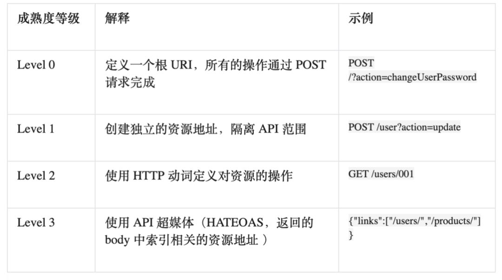

# REST(Representational State Transfer）

* 由 Roy Fielding 在他2000年的博士论文中提出。是HTTP协议（1.0版和1.1版）的主要设计者、Apache服务器软件的作者之一、Apache基金会的第一任主席
* REST 是一种软件架构风格，不是技术框架，有一系列规范，满足这些规范的 API 均可称为 RESTful API。有如下几个核心：
    - 一切实体都被抽象成资源，每个资源有一个唯一的标识 —— URI，所有的行为都应该是在资源上的 CRUD 操作
    - 状态转化（State Transfer）:使用标准的方法来更改资源的状态，常见的操作有：资源的增删改查操作
    - 无状态：每个 RESTful API 请求都包含了所有足够完成本次操作的信息，服务器端无须保持 Session,不会为任何客户端保持状态。一个请求不应该依赖过去的请求，服务对待每个请求都是独立的
* 服务的目的是提供一个窗口给客户端以便客户端能访问这些资源。服务架构师和开发人员想要这些服务变得易于实现、维护、扩展、伸缩。RESTful 服务应该有下面的属性和特征：
    - 表现层（Representations）:网络上的一个实体，或者说是网络上的一个具体信息。可以用一个URI（统一资源定位符）指向它，每种资源对应一个特定的URI。URI就成了每一个资源的地址或独一无二的识别符。URI只代表资源的实体，不代表它的形式的具体表现形式，应该在HTTP请求的头信息中用Accept和Content-Type字段指定，这两个字段才是对"表现层"的描述。
    - 消息（Messages）
    - URIs:只是表达被操作的资源位置，因此不应该使用动词，且注意单复数区分 动词在http协议中
    - 一致接口（Uniform interface） -（无状态）Stateless
    - 缓存（Caching）:客户端可以缓存
* 通过请求方法实现状态转化
* 一个 HTTP 请求完成一次完整操作
* HTTP动词：
    - GET（SELECT） /zoos：列出所有动物园 从服务器取出资源（一项或多项）
    - POST（CREATE） /zoos：新建一个动物园 在服务器新建一个资源
    - GET /zoos/ID：获取某个指定动物园的信息
    - PUT (replace）/zoos/ID：更新某个指定动物园的信息（提供该动物园的全部信息）在服务器更新资源（客户端提供改变后的完整资源）
    - PATCH （update）/zoos/ID：更新某个指定动物园的信息（提供该动物园的部分信息） 在服务器更新资源（客户端提供改变的属性）
    - DELETE（remove） /zoos/ID：删除某个动物园 从服务器删除资源
    - GET /zoos/ID/animals：列出某个指定动物园的所有动物
    - DELETE /zoos/ID/animals/ID：删除某个指定动物园的指定动物
    - HEAD：获取资源的元数据
    - OPTIONS：获取信息
    - 除了POST和DELETE之外，其他的操作需要幂等的，例如对数据多次更新应该返回同样的内容
* Headers
    - Accept：服务器需要返回什么样的content。如果客户端要求返回"application/xml"，服务器端只能返回"application/json"，那么最好返回status code 406 not acceptable（RFC2616），当然，返回application/json也并不违背RFC的定义。一个合格的REST API需要根据Accept头来灵活返回合适的数据。
    - If-Modified-Since/If-None-Match：如果客户端提供某个条件，那么当这条件满足时，才返回数据，否则返回304 not modified。比如客户端已经缓存了某个数据，它只是想看看有没有新的数据时，会用这两个header之一，服务器如果不理不睬，依旧做足全套功课，返回200 ok，那就既不专业，也不高效了。
    - If-Match：在对某个资源做PUT/PATCH/DELETE操作时，服务器应该要求客户端提供If-Match头，只有客户端提供的Etag与服务器对应资源的Etag一致，才进行操作，否则返回412 precondition failed
* 过滤信息：
    - ?limit=10：指定返回记录的数量
    - ?offset=10：指定返回记录的开始位置。
    - ?page=2&per_page=100：指定第几页，以及每页的记录数。
    - ?sortby=nameℴ=asc：指定返回结果按照哪个属性排序，以及排序顺序。
    - ?animal_type_id=1：指定筛选条件
* 鉴权:restful API是无状态的也就是说用户请求的鉴权和cookie以及session无关，每一次请求都应该包含鉴权证明。统一使用Token或者OAuth2.0认证
* 服务器返回的数据格式，应该尽量使用JSON，避免使用XML
* 状态码（Status Codes）
    - 200 OK - [GET]：服务器成功返回用户请求的数据，该操作是幂等的（Idempotent）,对应，GET,PUT,PATCH,DELETE.
    - 201 CREATED - [POST/PUT/PATCH]：用户新建或修改数据成功
    - 202 Accepted - [_]：表示一个请求已经进入后台排队（异步任务）
    - 204 NO CONTENT - [DELETE]：用户删除数据成功
    - 304 not modified   - HTTP缓存有效
    - 400 INVALID REQUEST - [POST/PUT/PATCH]：用户发出的请求有错误，服务器没有进行新建或修改数据的操作，该操作是幂等的
    - 401 Unauthorized - [_]：表示用户没有权限（令牌、用户名、密码错误）
    - 403 Forbidden - [_] 表示用户得到授权（与401错误相对），但是访问是被禁止的,鉴权成功，但是该用户没有权限
    - 404 NOT FOUND - [_]：用户发出的请求针对的是不存在的记录，服务器没有进行操作，该操作是幂等的
    - 405 method not allowed - 该http方法不被允许
    - 406 Not Acceptable - [GET]：用户请求的格式不可得（比如用户请求JSON格式，但是只有XML格式）
    - 415 unsupported media type - 请求类型错误
    - 422 unprocessable entity - 校验错误时用
    - 429 too many request - 请求过多。
    - 410 Gone -[GET]：用户请求的资源被永久删除，且不会再得到的
    - 422 Unprocesable entity - [POST/PUT/PATCH] 当创建一个对象时，发生一个验证错误
    - 500 INTERNAL SERVER ERROR - [*]：服务器发生错误，用户将无法判断发出的请求是否成功
* 错误处理（Error handling）
    - 如果状态码是4xx，就应该向用户返回出错信息。一般来说，返回的信息中将error作为键名，出错信息作为键值即可。
    - RESTful API最好做到Hypermedia，即返回结果中提供链接，连向其他API方法，使得用户不查文档，也知道下一步应该做什么。比如 api.example.com
    - rel表示这个API与当前网址的关系（collection关系，并给出该collection的网址），href表示API的路径，title表示API的标题，type表示返回类型。

```json
# error
{
  "link":
    {
      "rel": "collection <https://www.example.com/zoos>",
      "href": "<https://api.example.com/zoos>",
      "title": "List of zoos",
      "type": "application/vnd.yourformat+json"
    }
}
```

## 安全

* 请求数据验证
    - Request headers是否合法：如果出现了某些不该有的头，或者某些必须包含的头没有出现或者内容不合法，根据其错误类型一律返回4xx。比如说你的API需要某个特殊的私有头（e.g. X-Request-ID），那么凡是没有这个头的请求一律拒绝。这可以防止各类漫无目的的webot或crawler的请求，节省服务器的开销。
    - Request URI和Request body是否合法：如果请求带有了不该有的数据，或者某些必须包含的数据没有出现或内容不合法，一律返回4xx。比如说，API只允许querystring中含有query，那么"?sort=desc"这样的请求需要直接被拒绝。有不少攻击会在querystring和request body里做文章，最好的对应策略是，过滤所有含有不该出现的数据的请求。
* 数据完整性验证：保证要修改的数据和服务器里的数据是一致的 —— 这是通过Etag来完成。
    - Etag可以认为是某个资源的一个唯一的版本号。当客户端请求某个资源时，该资源的Etag一同被返回，而当客户端需要修改该资源时，需要通过"If-Match"头来提供这个Etag。服务器检查客户端提供的Etag是否和服务器同一资源的Etag相同，如果相同，才进行修改，否则返回412 precondition failed。
    - 使用Etag可以防止错误更新。比如A拿到了Resource X的Etag X1，B也拿到了Resource X的Etag X1。B对X做了修改，修改后系统生成的新的Etag是X2。这时A也想更新X，由于A持有旧的Etag，服务器拒绝更新，直至A重新获取了X后才能正常更新。
    - Etag类似一把锁，是数据完整性的最重要的一道保障。Etag能把绝大多数integrity的问题扼杀在摇篮中，当然，race condition还是存在的：如果B的修改还未进入数据库，而A的修改请求正好通过了Etag的验证时，依然存在一致性问题。这就需要在数据库写入时做一致性写入的前置检查。
* 访问控制：授权验证某个请求是由一个合法的请求者发起
    - Basic Auth会把用户的密码暴露在网络之中，并非最安全的解决方案
    - OAuth的核心部分与HMAC Auth差不多，只不过多了很多与token分发相关的内容
    - HMAC Auth保证一致性：请求的数据在传输过程中未被修改，因此可以安全地用于验证请求的合法性
        + 在请求头中使用两个字段：Authorization和Date（或X-Auth-Timestamp）
        + Authorization字段的内容由":"分隔成两部分，":"前是access-key，":"后是HTTP请求的HMAC值
        + 在API授权的时候一般会为调用者生成access-key和access-secret，前者可以暴露在网络中，后者必须安全保存。
        + 当客户端调用API时，用自己的access-secret按照要求对request的headers/body计算HMAC，然后把自己的access-key和HMAC填入Authorization头中。服务器拿到这个头，从数据库（或者缓存）中取出access-key对应的secret，按照相同的方式计算HMAC，如果其与Authorization header中的一致，则请求是合法的，且未被修改过的；否则不合法。
        + 做HMAC的时候，request headers中的request method，request URI，Date/X-Auth-Timestamp等header会被计算在HMAC中。将时间戳计算在HMAC中的好处是可以防止replay攻击。做HMAC的时候，request headers中的request method，request URI，Date/X-Auth-Timestamp等header会被计算在HMAC中。将时间戳计算在HMAC中的好处是可以防止replay攻击。
        + 使用HMAC可以很大程度上防止DOS攻击 —— 无效的请求在验证HMAC阶段就被丢弃，最大程度保护服务器的计算资源。

## 功能

* rate limiting：访问限制
* metrics：服务器应该收集每个请求的访问时间，到达时间，处理时间，latency，便于了解API的性能和客户端的访问分布，以便更好地优化性能和应对突发请求。
* docs：丰富的接口文档 - API的调用者需要详尽的文档来正确调用API，可以用swagger来实现。
* hooks/event propogation：其他系统能够比较方便地与该API集成。比如说添加了某资源后，通过kafka或者rabbitMQ向外界暴露某个消息，相应的subscribers可以进行必要的处理。不过要注意的是，hooks/event propogation可能会破坏REST API的幂等性，需要小心使用。

## 最佳实践

- 域名部署： <https://api.example.com/v1/> 或者 <https://example.org/api/v1/> 或者将版本号放在HTTP头信息中
- 路径endpoint：每个网址代表一种资源（resource），所以网址中不能有动词，只能有名词，而且所用的名词往往与数据库的表格名对应。一般来说，数据库中的表都是同种记录的"集合"（collection），所以API中的名词也应该使用复数
- 围绕「资源」展开，且这些资源通过 URL 进行标识，比如 /posts 用于表示所有文章，/posts/15 用于表示 ID 为 15 的文章，至于资源名称用单数还是复数，没有统一规定，但通常我们使用复数，另外 URL 要尽可能简单，不要拖泥带水；
- 与资源的交互通过 HTTP 请求方法来实现，而不是将操作动作包含到 URL 中，比如 GET /posts/15 用于获取 ID 为 15 的文章，DELETE /posts/15 用于删除 ID 为 15 的文章；
- 接口的设计需要遵循无状态原则，不同的接口请求之间不要有持久化的 Session 认证，每个接口请求都需要自己独自去认证；
- 返回的响应状态码尽可能精准描述服务器处理结果，比如成功用 2XX 状态码，重定向用 3XX 状态码，资源不存在用 404，没有权限用 403，需要认证用 401，服务器错误用 5XX 状态码，并且对异常情况尽可能在响应实体中予以说明；
- 约定在客户端与服务器交互过程中以 JSON 格式传递数据，即资源的外在表现形式是 JSON。

## RESTful 成熟度模型



## RESTful vs RPC

* RESTful API的优势是HTTP具备更好的易用性，让异构系统更容易集成，且开发执行效率比较高，面向资源要求也比较高
* RPC API可以使用更广泛的框架和方案，技术层面更底层也更为灵活，设计起来相对简单，掌握起来有一定门槛

        RESTful API RPC API
是否有统一规范 HTTP    无
面向资源    是   不确定
性能  中   高
通用性 高   弱
复杂度 中   高

## 实例

* <https://api.github.com/>
* https://developer.github.com/v3/
* [yahoo天气api](https://query.yahooapis.com/v1/public/yql?q=select%20*%20from%20weather.forecast%20where%20woeid%20%3D%202151330&format=json)

## 工具

* [thx/RAP](https://github.com/thx/RAP)Web API management, free and open sourced, mock data generator, auto test, made by Alibaba,
* [brookshi/Hitchhiker](https://github.com/brookshi/Hitchhiker):a Restful Api test tool http://www.hitchhiker-api.comw
* [typicode/jsonplaceholder](https://github.com/typicode/jsonplaceholder):A simple online fake REST API server https://jsonplaceholder.typicode.com
* Python: django-rest-framework（django），eve（flask）。各有千秋。可惜python没有好的类似webmachine的实现。
* Erlang/Elixir: webmachine/ewebmachine
* Ruby: webmachine-ruby
* Clojure：liberator
* REST Client:VS code 插件

## 参考

* [RESTful Web 服务：教程](https://zhuanlan.zhihu.com/p/21644769)
* [RESTful API 设计指南](http://www.ruanyifeng.com/blog/2014/05/restful_api)
* [Kerberos](http://danlebrero.com/2017/03/26/Kerberos-explained-in-pictures/)
* [restapitutorial](https://www.restapitutorial.com/)
* [StrongLoop](https://mac.aotu.io/docs/dev-rd/strongloop.html): StrongLoop API Platform构建于开源的LoopBack.io之上，LoopBack是一个高度可扩展的Node.js API框架。借助于LoopBack，可以快速创建可扩展的API和数据库映射。
    - [文档](https://docs.strongloop.com/pages/viewpage.action?pageId=10879061)
