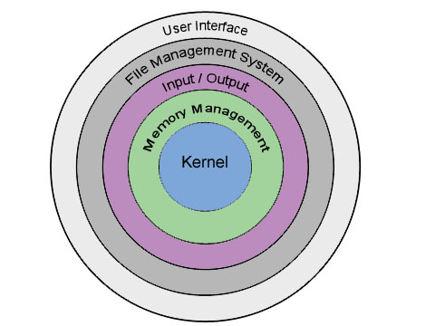
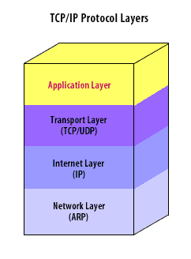

# Architect

所解决问题的复杂度决定了技术实力的高度。技术人不应仅仅满足于每天去实现业务逻辑细节，还要能从更高的层面去设计和构建企业的技术架构.思维习惯和思考能力的培养

## 能力

* 以工程思维全面理解业务
* 基于模型和基础模式抽象简
* 提出恰当可行的整体解决方
* 在限定资源范围完成明确目
* 满足业务需求且保证系统质
* 在可预见的周期内具备扩展
* 并在系统生命周期内持续演
* 逻辑思维能力很强，思路清晰，有洞察力，善于抓重点。
* 善于抽象，形成自己的结构化认知框架，有大局观。
* 解构，拆分业务、系统模块和代码。
* 发现问题，思考解决，设计取舍，重构迭代，协作传道，响应支持，持续学习，积累提高。

## 路径

* 技术和业务两边都要有一定的熟悉
    - 软件过程、系统分析与设计、架构设计、设计模式、Java 语言等内容，并研读了敏捷开发、领域驱动设计、工作流分析
    - 补基础知识，更重要的当然是实践，珍惜每一个设计任务，珍惜每一次与业务人员、技术人员的沟通机会，让他们来检验自己的理解和方法，逐渐形成自己的体系，把零散得来的知识最终融合成体系化的设计与表达。多写文章，提升思维逻辑性，让经验固化成为知识，当然，固化不要僵化，业务架构师应该是很善于应对变化的。
* 核心是架构，形成业务的架构。架构的定义是根据企业战略，对企业能力进行整体规划并将其传导到技术实现端的结构化分析方法。这其中有三个关键词，整体规划、结构化分析和传导。业务架构师的核心能力是将复杂的业务体系进行整体性的结构化设计，无论你对 IT 技术或者业务有多熟悉，没有这一项能力是做不好业务架构师的。此外，由于有“传导”这个职责，这种结构化设计需要跟 IT 设计有机结合，因此，学习系统分析与设计知识就变得很重要，熟悉技术的读者能够理解，这些知识虽然偏技术，却与语言能力无关，可以脱离语言去学习其设计思维。
* 要多了解软件过程。其实很多技术出身的读者对软件过程也只是了解个大概，日常工作中也不很注重软件过程管理，忽视了这一点，就无法了解、掌控整个开发过程。开发的目的是为了高质量的交付，而非仅是完成任务。如果不注重软件过程，连自己的专业领域都无法持续优化，那又如何跨出一步去做个好的业务架构师？对业务出身的读者来讲，学习软件过程知识就更为重要了，因为你必须了解你的下游是如何运作的，业务架构是桥梁，业务架构师的作用不是“铁路警察各管一段儿”，而是要将业务和技术衔接起来。
* 要学习流程优化等流程管理知识。业务架构通常不是为了现状进行设计，会涉及到整合、优化现有流程，需要掌握一定的流程优化知识，这样业务架构师才能更好地为业务提供有价值的建议。但是笔者认为，流程优化虽然很重要，却不是专业书籍可以提供多少帮助的，还是比较依赖实操。学习下经典理论，再学习下 BPMN 之类的工具知识就可以，多注意实战，这部分切记不要“迷信”书籍，因为流程优化是没有标准可言的，倒是多总结自己的心得更重要。
* 学习建模技术。业务架构的结构化设计通常是通过模型方式来展现的，因此，多学习不同的建模方法，流程的、数据的，甚至 DDD 的，互相取长补短，提升自己的模型表达能力，使设计结果能够更好地展现出来。
* 关于跨界的注意点。从业务出发想做业务架构师的读者至少应该学习一门主流的计算机语言，不需要达到很精深的程度，主要是理解技术落地的实现方式和技术人员的思维习惯，学习一门计算机语言，才能帮助你完成跨界转型，哪怕后边你又把它忘了（不经常写代码自然容易忘）；从技术出发想做业务架构师的读者至少要先深入地学习一个业务领域，再去跨领域搞企业级业务架构，就像所谓的“T”人才，先有垂直的一竖，再做拓展的一横。
* 日常多养成从整体出发看问题的习惯。说夸张点儿，前看十年、后看十年地去分析问题，包括看书也是，看历史书、军事书，乃至花鸟鱼虫，看什么书、学什么知识都养成全面分析的习惯，时刻注意整体和部分的关系，架构处理的就是结构和关系，日常生活、工作的方方面面都会用到架构分析能力，不是仅有系统设计会用，养成了这种习惯也会让你的设计由“实现”变成“涌现”。

## 代码

* 先理解程序的总体结构
* 高内聚低耦合的结构能减少软件复杂度
* 数据与代码的分离

## 原则

* 架构这东西真没那么神秘，大部分问题还是在时间、安全、稳定、性能等方面做权衡，同时注意控制复杂度。权衡需要宽阔的视野、良好的沟通能力、多样化的价值观，不能钻牛角尖，要能妥协而且懂得如何妥协；控制复杂度的很大一部分工作则是合理划分责任：事情还是那些事情，切成多少个部分，每个部分放在哪里，怎么实现，怎么组合。这工作有时候看起来像拼图一样简单，其实需要之前修炼的经验和眼光才能决策，而架构设计的水平高下，往往就存在于那些拼图方案之中。 
* 避免过度设计：最简单的方案最容易实现和维护，也可以避免浪费资源。但方案中需要包括扩展。
* 冗余设计：对服务、数据库的做结点冗余，保证服务的高可用。通过数据库主从模式、应用集群来实现。
* 多活数据中心：为了容灾，从根本上保障应用的高可用性。需要构建多活的数据中心，以防止一个数据中心由于不可控因素出现故障后，引起整个系统的不可用。
* 无状态设计：API、接口等的设计不能有前后依赖关系，一个资源不受其他资源改动的影响。无状态的系统才能更好地进行扩展。如果非得有状态，则要么客户端管理状态，要么服务端用分布式缓存管理状态。
* 可回滚：对于任何业务尤其是关键业务，都具有恢复机制。可以使用基于日志的WAL、基于事件的Event sourcing等来实现可回滚。
* 可禁用/自我保护：具有限流机制，当上游的流量超过自身的负载能力时，能够拒绝溢出的请求。可以通过手动开关或者自动开关（监测异常流量行为），在应用前端挡住流量。
* 问题可追踪：当系统出现问题时，能够定位请求的轨迹、每一步的请求信息等。分布式链路追踪系统即解决的此方面的问题。
* 可监控：可监控是保障系统能够稳定运行的关键。包括对业务逻辑的监控、应用进程的监控以及应用依赖的CPU、硬盘等系统资源的监控。每一个系统都需要做好这几个层面的监控。
* 故障隔离：将系统依赖的资源(线程、CPU)和服务隔离开来能够使得某个服务的故障不会影响其他服务的调用。通过线程池或者分散部署结点可以对故障进行隔离。
* 成熟可控的技术选型：使用市面上主流、成熟、文档、支持资源多的技术，选择合适的而非最火的技术实现系统。
* 梯级存储：内存->SSD硬盘->传统硬盘->磁带，可以根据数据的重要性和生命周期对数据进行分级存储。
* 缓存设计：隔离请求与后端逻辑、存储，是就近原则的一种机制。包括客户端缓存（预先下发资源）、Nginx缓存、本地缓存以及分布式缓存。
* 异步设计：对于调用方不关注结果或者允许结果延时返回的接口，采用队列进行异步响应能够很大程度提高系统性能；调用其他服务的时候不去等待服务方返回结果直接返回，同样能够提升系统响应性能。异步队列也是解决分布式事务的常用手段。
* 前瞻性设计：根据行业经验和预判，提前把可扩展性、后向兼容性设计好。
* 水平扩展：相比起垂直扩展，能够通过堆机器解决问题是最优先考虑的问题，系统的负载能力也才能接近无限扩展。此外，基于云计算技术根据系统的负载自动调整容量能够在节省成本的同时保证服务的可用性。
* 小步构建和发布：快速迭代项目，快速试错。不能有跨度时间过长的项目规划。
* 自动化：打包、测试的自动化称为持续集成，部署的自动化称为持续部署。自动化机制是快速迭代和试错的基础保证。
* 遵循单一职责原则
* 尽量减少共享状态:在一个对象中，相对于成员变量，你更应该优先选择静态的无状态变量
* 将“副作用(例如：打印到控制台、日志记录、更改全局状态、文件系统操作等)”局部化
* 优先使用不变的对象
* 多用接口少用类
* 对模块应用良好的原则
    - 尽可能减少依赖
    - 每个项目应该有一个明确的职责
    - 不要重复自身
* 避免继承
* 将测试作为设计和开发的一部分:开始编码时先编写测试代码会使得代码十分自然地遵循许多指导原则。
* 优先使用标准库而不是手写的
* 避免编写新的代码
* 架构关注点
    - 内聚与耦合、功能性、可变性、性能、容量
    - 生态系统、模块化、可构建性、产品化、安全性
    - 架构原则：分而治之
* 再了解为什么架构需要演进：
    - 项目需求扩张，旧的架构不适应新的需求
    - 开发团队人员增加，协作要求变高
    - 新技术引入
    - 更高的软件质量要求

## 思维

* 抽象能力，就是关注本质，忽略细节的能力。我经常做架构评审，我的团队做项目架构的时候，让我去做评审，一个项目的架构设计我就关注两样东西，一个是数据模型 (或称领域模型)，另外一个是接口模型。通过数据库表、表结构、API 接口模型，就能看出来抽象能力如何
* 递归能力。面试中一定会要求面试者写递归算法，有没有掌握递归，对解决问题的能力相差是很大的。比如编译器解析器、代码生成器、序列化算法都涉及到递归，没有递归思维的程序员，就搞不定这个层面的工作。
* 分治，也就是分而治之。也就是大问题先分解为小问题，依次解决小问题，再合并成解决大问题。这又是和数据结构算法相关的。

## 分层

* 特点
    - 方便后续代码进行维护扩展
    - 分层的效果需要让整个团队都接受
    - 各个层职责边界清晰
* MVC
    - controller， 此层只负责功能的调度，参数的控制，结果的输出
    - service，此层负责业务逻辑相关的开发BLL(业务逻辑层):类内聚，OOP的抽象
        + 属性
        + 业务逻辑
    - DAO(数据接入层)，此层负责与数据的交互,ORM接入数据对象
    - entity, 此层定义为数据表的一个映射
* CQRS（Command Query Responsibility Segration）: 把 CRUD 系统拆分为两部分：命令（Command）处理和查询（Query）处理,命令与查询两边可以用不同的架构实现，以实现CQ两端（即Command Side，简称C端；Query Side，简称Q端）的分别优化。
    - 实现方式
        + CQ 两端数据库共享，只是在上层代码上分离:这样做的好处是可以让代码读写分离，更容易维护，而且不存在 CQ 两端的数据一致性问题， 因为是共享一个数据库的。这种架构是非常实用的
        + CQ 两端不仅代码分离，数据库也分离，然后Q端数据由C端同步过来:
            * 如果需要 CQ 两端的强一致性，则需要用同步
            * 如果能接受 CQ 两端数据的最终一致性，则可以使用异步。
            * C端可以采用Event Sourcing（简称ES）模式，所有C端的最新数据全部用 Domain Event 表达即可
            * 查询显示用的数据，则从Q端的 ReadDB（关系型数据库）查询即可
    - 
* 阿里分层
    - 开放接口层：可直接封装 Service 方法暴露成 RPC 接口;通过 Web 封装成 http 接口;进行 网关安全控制、流量控制等。
    - 终端显示层：各个端的模板渲染并执行显示的层。当前主要是 velocity 渲染，JS 渲染， JSP 渲染，移动端展示等。
    - Web 层：主要是对访问控制进行转发，各类基本参数校验，或者不复用的业务简单处理等。
        + 轻业务逻辑，参数校验，异常兜底。通常这种接口可以轻易更换接口类型，所以业务逻辑必须要轻，甚至不做具体逻辑。
    - Service 层：相对具体的业务逻辑服务层。
        + 业务层，复用性较低，这里推荐每一个controller方法都得对应一个service,不要把业务编排放在controller中去做，为什么呢？如果我们把业务编排放在controller层去做的话，如果以后我们要接入thrift,我们这里又需要把业务编排在做一次，这样会导致我们每接入一个入口层这个代码都得重新复制一份如下图所示
    - Manager 层：通用业务处理层，可以是单个服务的，比如cache,mq等等，当然也可以是复合的，当你需要调用多个Mannager的时候，这个可以合为一个Mannager它有如下特征:
        + 对第三方平台封装的层，预处理返回结果及转化异常信息
        + 对Service层通用能力的下沉，如缓存方案、中间件通用处理
        + 与DAO层交互，对多个DAO的组合复用
    - DAO 层：数据访问层，与底层 MySQL、Oracle、Hbase 进行数据交互。
    - 原则
        + 允许Service/Manager可以操作数据领域模型，对于这个层级来说，本来自己做的工作也是做的是业务逻辑处理和数据组装。 
        + Controller/TService层的领域模型不允许传入DAO层，这样就不符合职责划分了。 
        + 同理，不允许DAO层的数据传入到Controller/TService。
* 领域模型的转换：每一个层基本都自己对应的领域模型
    - DO（Data Object）：与数据库表结构一一对应，通过DAO层向上传输数据源对象。 
    - DTO（Data Transfer Object）：数据传输对象，Service或Manager向外传输的对象。 
    - BO（Business Object）：业务对象。由Service层输出的封装业务逻辑的对象。 
    - AO（Application Object）：应用对象。在Web层与Service层之间抽象的复用对象模型，极为贴近展示层，复用度不高。 
    - VO（View Object）：显示层对象，通常是Web向模板渲染引擎层传输的对象。 
    - Query：数据查询对象，各层接收上层的查询请求。注意超过2个参数的查询封装，禁止使用Map类来传输。
    - 边界条件
    - 输入复杂性与不可预测

* 客户端层：典型调用方是浏览器browser或者手机应用APP
* 反向代理层：系统入口，反向代理
* 站点应用层：实现核心应用逻辑，返回html或者json
* 服务层：如果实现了服务化，就有这一层
* 数据-缓存层：缓存加速访问存储
* 数据-数据库层：数据库固化数据存储
* 方法
    - 垂直扩展(Scale Up)：提升单机处理能力。垂直扩展的方式又有两种：
        + 增强单机硬件性能，例如：增加CPU核数如32核，升级更好的网卡如万兆，升级更好的硬盘如SSD，扩充硬盘容量如2T，扩充系统内存如128G；如果预算不是问题，强烈建议使用“增强单机硬件性能”的方式提升系统并发能力，因为这个阶段，公司的战略往往是发展业务抢时间，而“增强单机硬件性能”往往是最快的方法。
        + 提升单机架构性能，例如：使用Cache来减少IO次数，使用异步来增加单服务吞吐量，使用无锁数据结构来减少响应时间；
        + 单机性能总是有极限的。所以互联网分布式架构设计高并发终极解决方案还是水平扩展。
    - 水平扩展（Scale Out）：只要增加服务器数量，就能线性扩充系统性能。水平扩展对系统架构设计是有要求的，如何在架构各层进行可水平扩展的设计，以及互联网公司架构各层常见的水平扩展实践。

## 思维

* 抽象：对某种事物进行简化表示或描述的过程，抽象让我们关注要素，隐藏额外细节。帮助我们从大处着眼（get our mind about big picture），隐藏细节（temporarily hide details）。抽象能力的强弱，直接决定我们所能解决问题的复杂性和规模大小。模块化分解
    - 整体的抽象：自顶向下的分治设计；子模块分解：自底向上的组合过程
    - 写代码会保持抽象层次的一致性，代码读起来像讲故事，比较清晰易于理解；而没有经验的程序员会有明显的抽象层次跳跃问题，代码读起来就比较累，这个是抽象能力不足造成。
* 分层：把整个系统划分成若干个层次，每一层专注解决某个领域的问题，并向上提供服务。有些层次是纵向的，它贯穿所有其它层次，称为共享层。比如下图操作系统与TCP/IP协议栈
* 分治(divide and combine或者split and merge)：对于一个无法一次解决的大问题，我们会先把大问题分解成若干个子问题，如果子问题还无法直接解决，则继续分解成子子问题，直到可以直接解决的程度，这个是分解(divide)的过程；然后将子子问题的解组合拼装成子问题的解，再将子问题的解组合拼装成原问题的解，这个是组合(combine)的过程。
    - 面试题：给你一台8G内存/500G磁盘空间的普通电脑，如何对一个100G的大文件进行排序？假定文件中都是字符串记录，一行约100个字符。
        + 100G的大文件肯定无法一次加载到内存直接排序，所以需要先切分成若干小问题来解决。
        + 那么8G内存的计算机一次大概能排多大的数据量，可以在有限的时间内排完呢？也就是100G的大文件要怎么切法，切成多少份比较合适？这个是考察候选人的时间空间复杂度估算能力，需要一定的计算机组织和算法功底，也需要一定实战经验和sense。实际上8G内存的话，操作系统要用掉一部分，如果用Java开发排序程序，大致JVM可用2~4G内存，基于一般的经验值，一次排1G左右的数据应该没有问题
        + 所以100G的文件需要先切分成100份，每份1G，这样每个子文件可以直接加载到内存进行排序。对于1G数据量的字符串排序，采用Java里头提供的快速排序算法是比较合适的。
        + 把已经解决的子问题组合起来，合并成我们需要的最终结果文件。这个时候该采用什么算法呢？这里考察候选人对外排序和归并排序算法的掌握程度，我们可以将100个排好序的文件进行两两归并排序，这样不断重复，我们就会得到50个排好序的文件，每个大小是2G。然后再两两归并，不断重复，直到最后两个文件归并成目标文件，这个文件就是100G并且是排好序的。因为是外排序+归并排序，每次只需要读取当前索引指向的文件记录到内存，进行比较，小的那个输出到目标文件，内存占用极少。另外，上面的算法是两路归并，也可以采用多路归并，甚至是采用堆排序进行优化，但是总体分治思路没有变化。
        + 考察候选人的分治思维之外，还考察对各种排序算法（快排，外排序，归并排序，堆排序）的理解，计算的时间空间复杂度估算，计算机的内外存特性和组织，文件操作等等
    - 递归也是一种特殊的分治技术。
* 演化:架构既是设计出来的，同时也是演化出来的，对于互联网系统，基本上可以说是三分设计，七分演化，而且是在设计中演化，在演化中设计，一个不断迭代的过程。
    - 除了要利用自身的架构设计能力
    - 也要学会借助用户反馈和进化的力量，推动架构的持续演进
    - 能够不断应对环境变化的系统，才是有生命力的系统，架构的好坏，很大部分取决于它应对变化的灵活性。所以具有演化式思维的架构师，能够在一开始设计时就考虑到后续架构的演化特性，并且将灵活应
    - 设计式思维和演化式思维的差异
        + 一开始就直奔微服务架构，其实背后体现的是设计式架构的思维，认为架构师可以完全设计整个系统和它的演化方向。马丁认为这种做法风险非常高，一个是成本高昂，另外一个是刚开始架构师对业务域理解不深，无法清晰划分领域边界，开发出来的系统很可能无法满足用户需求。
        + 从单块架构开始，随着架构师对业务域理解的不断深入，也随着业务和团队规模的不断扩大，渐进式地把单块架构拆分成微服务架构的思路，这就是演化式架构的思维。如果你观察现实世界中一些互联网公司（例如eBay，阿里，Netflix等等）的系统架构，大部分走得都是演化式架构的路线。

## 能力培养

* 良好的架构设计思维的培养，离不开工作中大量高质量项目的实战锻炼，然后是平时的学习、思考和提炼总结。
* 基本的架构设计思维，其实在我们大学计算机课程（比如数据结构和算法）中可以找到影子。所以大学教育其实非常重要，基本的架构设计思维在那个时候就已经埋下种子，后面工程实践中进一步消化和应用，随着经验的积累，我们能够解决的问题域复杂性和规模逐渐变大
* 架构师的成长高度和他大学期间的思维习惯的养成关系密切，推荐参考美国Berkeley大学的数据结构课程CS61B[附录8.1]进行学习，对建立抽象编程思维非常有帮助

### 实践

* 反向代理层的水平扩展，是通过“DNS轮询”实现的：dns-server对于一个域名配置了多个解析ip，每次DNS解析请求来访问dns-server，会轮询返回这些ip。当nginx成为瓶颈的时候，只要增加服务器数量，新增nginx服务的部署，增加一个外网ip，就能扩展反向代理层的性能，做到理论上的无限高并发。
* 站点层的水平扩展，是通过“nginx”实现的。通过修改nginx.conf，可以设置多个web后端。当web后端成为瓶颈的时候，只要增加服务器数量，新增web服务的部署，在nginx配置中配置上新的web后端，就能扩展站点层的性能，做到理论上的无限高并发。
* 服务层的水平扩展，是通过“服务连接池”实现的。站点层通过RPC-client调用下游的服务层RPC-server时，RPC-client中的连接池会建立与下游服务多个连接，当服务成为瓶颈的时候，只要增加服务器数量，新增服务部署，在RPC-client处建立新的下游服务连接，就能扩展服务层性能，做到理论上的无限高并发。如果需要优雅的进行服务层自动扩容，这里可能需要配置中心里服务自动发现功能的支持。
* 在数据量很大的情况下，数据层（缓存，数据库）涉及数据的水平扩展，将原本存储在一台服务器上的数据（缓存，数据库）水平拆分到不同服务器上去，以达到扩充系统性能的目的。
    - 按照范围水平拆分：每一个数据服务，存储一定范围的数据，user0库，存储uid范围1-1kw，user1库，存储uid范围1kw-2kw
        + 规则简单，service只需判断一下uid范围就能路由到对应的存储服务；
        + 数据均衡性较好；
        + 比较容易扩展，可以随时加一个uid[2kw,3kw]的数据服务；
        + 请求的负载不一定均衡，一般来说，新注册的用户会比老用户更活跃，大range的服务请求压力会更大；
    - 按照哈希水平拆分:每一个数据库，存储某个key值hash后的部分数据，user0库，存储偶数uid数据,user1库，存储奇数uid数据
        + 规则简单，service只需对uid进行hash能路由到对应的存储服务；
        + 数据均衡性较好；
        + 请求均匀性较好；
        + 不容易扩展，扩展一个数据服务，hash方法改变时候，可能需要进行数据迁移；
    - 水平拆分来扩充系统性能vs主从同步读写分离
        + 水平拆分扩展数据库性能：
            * 每个服务器上存储的数据量是总量的1/n，所以单机的性能也会有提升；
            * n个服务器上的数据没有交集，那个服务器上数据的并集是数据的全集；
            * 数据水平拆分到了n个服务器上，理论上读性能扩充了n倍，写性能也扩充了n倍（其实远不止n倍，因为单机的数据量变为了原来的1/n）；
        + 通过主从同步读写分离扩展数据库性能：
            * 每个服务器上存储的数据量是和总量相同；
            * n个服务器上的数据都一样，都是全集；
            * 理论上读性能扩充了n倍，写仍然是单点，写性能不变；

## 解决问题的模式

* 使用 DDD，将复杂问题转化为繁杂问题
    - 提炼问题域
    - 找到问题域中的第一个核心子域
    - 对第一个核心子域进行战略设计
    - 完善统一语言
    - 视情况重复 2 ~ 5
* 使用 TDD，将繁杂问题转化为简单问题
    - 拆解问题（Tasking）
    - 红-绿-重构代码
    - 重构模型以加深理解
* 在简单问题中，使用最佳实践

## 图书

* 《恰如其分的软件架构：风险驱动的设计方法》
* 《面向模式的软件架构（卷 1）：模式系统》
* 《程序员必读之软件架构》
* 《架构实战：软件架构设计的过程》
* 《架构之美》
* 《领域驱动设计模式、原理与实践》
* 《架构整洁之道》
* 《前端架构：从入门到微前端》
* 《系统架构:复杂系统的产品设计与开发》
* 《[大型网站技术架构：核心原理与案例分析](https://book.douban.com/subject/25723064/)》
* 架构设计方面
    - 《系统分析与设计》（Kenneth E.Kendall ，Julie E. Kendall 著）
    - 《设计原本》（Fredrick P.Brooks，Jr. 著）
    - 《软件系统架构 - 使用视点和视角与利益相关者合作》（Nick Rozanski，Eoin woods 著）
    - 《架构之美》（Diomidis Spenellis & Georgios Gousios 著）
    - 《领域驱动设计：软件核心复杂性应对之道》（Eric Evans 著）
    - 《实现领域驱动设计》（Vaughn Vemon 著）
    - 《微服务设计》（Sam Newman 著）
    - 《企业 IT 架构转型之道》（钟华 著）
* 软件过程方面
    - 《软件工程 - 实践者的研究方法》（Roger S.Pressman 著）
    - 《软件工程》（Ian Sommerville 著）
    - 《人月神话》（Fredrick P.Brooks，Jr. 著）
    - 《敏捷软件开发：原则
    - 模式与实践》（Robert C.Martin）
    - 《Scrum 敏捷软件开发》（Mike Cohn 著）。
* 流程优化。流程优化除了流程管理层面的技术知识外，更重要的可能来自于管理学，不妨多读读管理类书籍，拓宽思路，再考虑具体的流程优化
    - 《目标》（Eliyahu M.Goidratt 著）
    - 《凤凰项目 - 一个 IT 运维的传奇故事》（Gene Kim, Kevin Behr & George Spafford 著）
* 建模技术方面
    - 《UML- 面向对象建模与设计》（Michael Blaha，James Rumbaugh 著）
* 扩展阅读
    - 业务类书籍，建议多读些具有多年从业经验的人写的具有一定“感受”性特点的书籍，单纯的教材类书籍可能代入感稍微有些欠缺
    - 历史、军事、经济、哲学类书籍其实很有助于从更宏观、更本质的层面了解社会的运行，有助于从更开阔的视角理解业

## 参考

* [xingshaocheng/architect-awesome](https://github.com/xingshaocheng/architect-awesome)
* [toutiaoio/awesome-architecture](https://github.com/toutiaoio/awesome-architecture):架构师技术图谱
* [优秀架构师必须掌握的架构思维](http://www.infoq.com/cn/articles/architecture-thought)
* [《微服务架构实战 160 讲》](https://time.geekbang.org/course/intro/84)
* [donnemartin/system-design-primer](https://github.com/donnemartin/system-design-primer):Learn how to design large-scale systems. Prep for the system design interview. Includes Anki flashcards.
* [davideuler/architecture.of.internet-product](https://github.com/davideuler/architecture.of.internet-product):互联网公司技术架构，微信/淘宝/微博/腾讯/阿里/美团点评/百度/Google/Facebook/Amazon/eBay的架构
* [aosabook/500lines](https://github.com/aosabook/500lines):source for the book 500 Lines or Less
* [alexpate/awesome-design-systems](https://github.com/alexpate/awesome-design-systems):💅🏻 ⚒ A collection of awesome design systems
* [0voice/from_coder_to_expert](https://github.com/0voice/from_coder_to_expert):2019年最新总结，从程序员到CTO，从专业走向卓越，分享大牛企业内部pdf与PPT
* [Software Architecture is Overrated, Clear and Simple Design is Underrated](https://blog.pragmaticengineer.com/software-architecture-is-overrated/)
