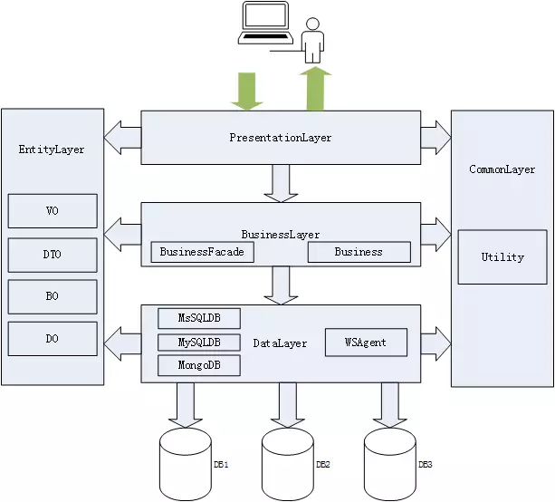

# 系统设计

## 分层

* 表现层 VO(View Object 视图对象)
* 业务逻辑层 BO(Business Object 业务对象)
* 数据层 DO(Data Object 数据对象)
* 公共层 DTO(Data Transfer Object 数据传输对象)

DO 是数据表对象，不是数据访问层对象，不是只能给数据访问层使用；
DTO 是网络传输对象，不是表现层对象，不是只能给表现层使用；
BO 是内存计算逻辑对象，不是业务逻辑层对象，不是只能给业务逻辑层使用 。
如果仅限定在本层访问，则导致单个应用内大量没有价值的对象转换。以用户为中心来设计实体类，可以减少无价值重复对象和无用转换。

### 注意

* 私人定制：减少通用帮助类的编写，如果每一个应用中有大量相同的帮助类，这在架构层面上是有问题。在我们的几百个线上应用中，尽管减少通用的代码，包括分页帮助类、数据库帮助类、缓存帮助类、MQ 帮助类、日志帮助类、AOP 帮助类、线程帮助类。业务应用的重点是为业务服务，每一个应用都是特别的，都需要私人定制，极少有通用的代码，如果有，那么应该由框架或组件专门解决；
* 少即是多：应用的场景多，参考人员多，每个人想法不同，牵涉的时间长，所以尽量只做大家都认同的规范、正确的事情，要自底向上、要减少有争议的代码范例，否则一个错误将会放大百倍、一个有争议的规范将会很难推行。
* 追求简单：代码编写可分为三个层次，简单、复杂、简单。第一简单是不知道的简单，第二个复杂是知道后的复杂，第三个简单是知道后有取舍的简单。范例代码要追求简单，既可轻松扩展支持复杂场景，又要简单到初级程序员也能操作。
* 内聚大于解耦：内聚是什么，内聚是部门内有共同的目标，然后大家紧密合作。解耦是什么，解耦是部门间各自职责明确，然后减少不必要的连接。一个应用如同一个部门，应有一个共同的目标和职责，然后大家紧密合作。

换句话说，应用内部应减少不必要契约接口（如同公司间才签约合同），减少不必要的依赖注入实现，减少不必要且代价过大的解耦。一切以简单实用为主，以应用价值输出、应用的目标（接口或界面）为导向。

* 文件夹分层法：应用分层采用文件夹方式的优点是可大可小、简单易用、统一规范，可以包括 5 个项目，也可以包括 50 个项目，以满足所有业务应用的多种不同场景；
* 调用规约：在开发过程中，需要遵循分层架构的约束，禁止跨层次的调用；
* 下层为上层服务：以用户为中心，以目标为导向。上层（业务逻辑层）需要什么，下层（数据访问层）提供什么，而不是下层（数据访问层）有什么，就向上层（业务逻辑层）提供什么；
* 实体层规约：DO 是数据表对象，不是数据访问层对象，不是只能给数据访问层使用；DTO 是网络传输对象，不是表现层对象，不是只能给表现层使用；BO 是内存计算逻辑对象，不是业务逻辑层对象，不是只能给业务逻辑层使用 。如果仅限定在本层访问，则导致单个应用内大量没有价值的对象转换。以用户为中心来设计实体类，可以减少无价值重复对象和无用转换；
* U 型访问：下行时表现层是 Input，业务逻辑层是 Process，数据访问层是 Output。上行时数据访问层是 Input，业务逻辑层是 Process,  表现层就 Output。

### 实践

* 项目命名规则：{产品线英文名全称}.{子系统英文名全称 + 应用名}.{项目职责英文名全称}，如：Trip.Seller.DTO。
* 数据操作项目规范：{产品线英文名全称}.{子系统英文名全称 + 应用名}.{使用什么数据库}DB，如上图的 Trip.Seller.MSSQLDB。
* DTO 项目命名规则：{产品线英文名全称}.{子系统英文名全称 + 应用名}.DTO，如上图的 Trip.Order.DTO。
* VO 项目命名规则：{产品线英文名全称}.{子系统英文名全称 + 应用名}.ViewModel，如上图的 Trip.Seller.ViewModel。
* BO 项目命名规则：{产品线英文名全称}.{子系统英文名全称 + 应用名}.BO，如上图的 Trip.Order.BO;
* DO 项目命名规则：{产品线英文名全称}.{子系统英文名全称 + 应用名}.Entity，如上图的 Trip.Seller.Entity；
* 数据库连接配置规范
  - 数据库连接的配置必须读写分离。
  - 数据库连接字符串建议加密处理。
  - 数据库连接配置名的命名规则：{以 DB 为结尾的数据库名称}_读写类型，如：TripOrderDB_SELECT、TripOrderDB_INSERT。
* 配置文件方面的规范
  - 所有配置文件（除 Web.config 文件外）都必须放到 Config 文件夹下。
  - 所有配置文件（除 Web.config 文件外）按不同环境区分开，具体命名规则是：{功能模块英文名}.{环境英文简称名}.config，其中本地环境的英文简称名是 Dev，测试环境的英文简称名是 Test，正式环境的英文简称名是 Prod，如上图的 AppSetting.Dev.config。
  - 保持 Web.config 配置文件的干净，只留环境设置节点。
* 静态资源文件方面的规范
  - 公共的静态资源文件（css、js、image 等）放在另外的静态站点中，统一由前端进行开发和维护。一般，css 文件放在 css 文件夹下，js 文件放在 js 文件夹下，image 图片文件放在 img 文件夹下。
  - 与某项业务有关的 js 文件可以放到各自业务项目的表现层 PresentationLayer 下，以方便开发人员调试，js 文件可放在项目的 js 文件夹下。
  - 静态资源文件必须使用版本号管理，以防更新后由于客户端浏览器缓存而导致站点使用的依然是旧版本的静态资源文件：``

## 响应性能提升

* 异步：队列缓冲、异步请求。
* 并发：利用多CPU多线程执行业务逻辑。
* 就近原则：缓存、梯度存储。
* 减少IO：合并细粒度接口为粗粒度接口、频繁的覆盖操作可以只做最后一次操作。这里一个需要特别注意的地方: 代码中尽量避免在循环中调用外部服务，更好的做法是使用粗粒度批量接口在循环外面只进行一次请求。
* 分区：频繁访问的数据集规模保持在合理的范围。

## 工具

* [nicolargo / glances](https://github.com/nicolargo/glances):Glances an Eye on your system. A top/htop alternative for GNU/Linux, BSD, Mac OS and Windows operating systems. <http://nicolargo.github.io/glances/>

## 参考

* [donnemartin/system-design-primer](https://github.com/donnemartin/system-design-primer)
