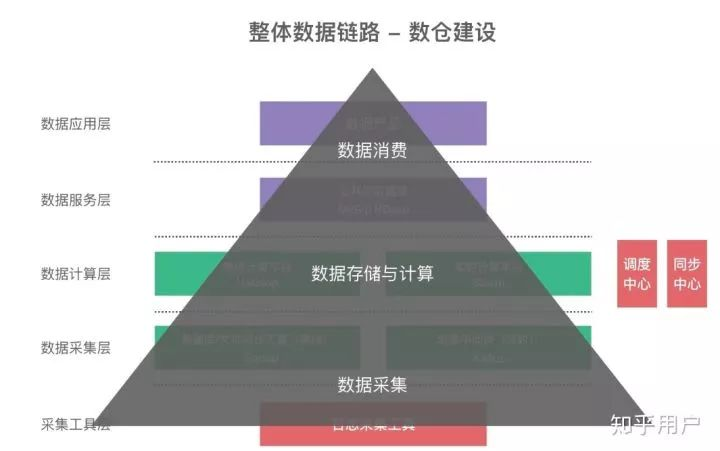

# 大数据

* 商业洞见
* 统计概率知识
* 计算机科学和软件编程技能
* 文字和视觉沟通能力
* 理顺逻辑—构建算法—代码实现—模拟实验

## 结构

## OLAP VS OLTP

### 联机分析处理(OLAP)

OLTP也称实时系统(Real Time System)，支持事务快速响应和大并发，这类系统典型的有ATM机(Automated Teller Machine)系统、自动售票系统等，但有些银行转账并不是实时到账的。OLTP反映企业当前的运行状态，完成企业管理所包含的日常任务的数据库应用，一般没有复杂的查询和分析处理。

### 联机事务处理(OLTP)

OLAP也称决策支持系统(Decision Support System，DSS)，是数据仓库系统的主要应用形式，使分析人员、管理人员或执行人员能够从多种角度对从原始数据中转化出来的、能够真正为用户所理解的、并真实反映企业维特性的信息进行快速、一致、交互地存取，从而获得对数据的更深入了解的一类软件技术。

* 数据仓库(Data Warehouse)：核心。是一个面向主题的（Subject Oriented）、集成的（Integrated）、相对稳定的（Non-Volatile）、反映历史变化（Time Variant）的海量数据集合(包括大量冗余数据)，用以支持经营管理中的决策制定过程，核心是海量数据存放和海量数据检索。相对于操纵型数据库来说其突出的特点是对海量数据的支持和快速的检索技术。为了实现决策支持型数据处理与事务型数据处理的分离，它按照一定的周期将事务型数据转换导入决策支持数据库中。数据仓库系统是一个信息提供平台，他从业务处理系统获得数据，主要以星型模型和雪花模型进行数据组织，为用户提供各种手段从中获取信息和知识。数据仓库按照数据的覆盖范围可以分为企业级数据仓库和部门级数据仓库（通常称为数据集市）。从功能结构划分，数据仓库系统至少应该包含数据获取（Data Acquisition）、数据存储（Data Storage）、数据访问（Data Access）三个关键部分。
* 联机分析处理
* 数据挖掘

目标是满足决策支持或多维环境特定的查询和报表需求，它的技术核心概念是维(观察数据的特定角度，如时间维)，因此OLAP也可以说是多维数据分析工具的集合。

按照数据存储格式

* Relational OLAP(ROLAP）：基本数据和聚合数据均存放在RDBMS之中
* Multidimensional OLAP(MOLAP）：存放于多维数据库中
* Hybrid OLAP(HOLAP）：本数据存放于RDBMS之中，聚合数据存放于多维数据库中。

E.F.Codd提出12条准则来描述OLAP系统：

* OLAP模型必须提供多维概念视图　　
* 透明性　
* 存取能力推测 　　
* 稳定的报表能力 　　
* 客户/服务器体系结构 　　
* 维的等同性　
* 动态的稀疏矩阵处理
* 多用户支持能力　
* 非受限的跨维操作 　　
* 直观的数据操纵 　　
* 灵活的报表生成 　　
* 不受限的维与聚集层次

ETL(Extraction-Transformation-Loading)：负责将分布的、异构数据源中的数据如关系数据、平面数据(去除了所有特定应用格式，可以迁移到其他应用上进行处理的一类数据，比如逗号分隔数据)文件等抽取到临时中间层后进行清洗、转换、集成，最后加载到数据仓库或数据集市中，成为联机分析处理、数据挖掘的基础，是BI(Business Intelligence)/DW的核心和灵魂，是数据仓库中的非常重要的一环。数据仓库是一个独立的数据环境，需要通过抽取过程将数据从联机事务处理环境、外部数据源或者脱机的数据存储介质导入到数据仓库中；在技术上，ETL主要涉及到关联、转换、增量、调度和监控等几个方面；数据仓库系统中数据不要求与联机事务处理系统中数据实时同步，所以ETL可以定时进行。在数据仓库建设中最难部分是用户需求分析和模型设计，而ETL规则设计和实施则是工作量最大的，约占整个项目的60%～80%。

## 课程

* 《数据科学导论》：数据科学的先导课和认知类课程。用形象生动的教学模式为学生普及数据挖掘、大数据相关的基础知识、核心概念和思维模式，从工程技术、法律规范、应用实践等不同角度描绘数据科学的美好蓝图。
* 《数据挖掘：理论与算法》：本课程完整覆盖数据挖掘领域的各项核心技术，包括数据预处理、分类、聚类、回归、关联、推荐、集成学习、进化计算等。
* 《高级大数据系统》：主要讲解高级大数据系统的实现、优化和应用，包括分布式文件系统、MapReduce/Spark、Storm/Spark streaming、Mahout等系统的原理、实现、策略优化。
* 《大数据机器学习》：主要包括统计学习基本理论，机器学习基本方法，深度学习理论和方法。牢固掌握大数据机器学习方法，并能够解决实际问题等综合能力。
* 《数据可视化》：主要包括可视化的基本概念、历史沿革、视觉认知理论、各类可视化技术（软件工具及程序开发）等。

## 图书

* 《机器学习》（俗称西瓜书） 周志华著，清华大学出版社；
* 《分布式系统：概念与设计（原书第五版）》，机械工业出版社；
* 《Spark大数据处理：技术、应用》，机械工业出版社。

## 工具

* [pachyderm/pachyderm](https://github.com/pachyderm/pachyderm):Reproducible Data Science at Scale! http://pachyderm.io
* [metabase/metabase](https://github.com/metabase/metabase):The simplest, fastest way to get business intelligence and analytics to everyone in your company 😋 https://metabase.com
* [OpenRefine/OpenRefine](https://github.com/OpenRefine/OpenRefine):OpenRefine is a free, open source power tool for working with messy data and improving it http://openrefine.org/
* [airbnb/knowledge-repo](https://github.com/airbnb/knowledge-repo):A next-generation curated knowledge sharing platform for data scientists and other technical professions.

## 视图

* Excel
* Google Chart API
* D3（Data Driven Documents）是支持SVG渲染的另一种JavaScript库
* R：用于统计分析、绘图的语言和操作环境
* Visual.ly
* Processing
* Leaflet
* Openlayers：所有地图库中可靠性最高的一个
* PolyMaps：地图库，主要面向数据可视化用户
* Charting Fonts是将符号字体与字体整合
* Gephi是进行社会图谱数据可视化分析的工具，不但能处理大规模数据集并且Gephi是一个可视化的网络探索平台，用于构建动态的、分层的数据图表。
* CartoDB很轻易就把表格数据和地图关联起来，这方面CartoDB是最优秀的选择。
* Weka是一个能根据属性分类和集群大量数据的优秀工具，Weka不但是数据分析的强大工具，还能生成一些简单的图表。
* NodeBox是OS X上创建二维图形和可视化的应用程序，你需要了解Python程序
* Kartograph不需要任何地图提供者像Google Maps，用来建立互动式地图，由两个libraries组成，从空间数据开放格式，利用向量投影的Python library以及post GIS，并将两者结合到SVG和JavaScript library，并把这些SVG资料转变成互动性地图
* Modest Maps是一个很小的地图库，在一些扩展库的配合下，例如Wax、Modest Maps立刻会变成一个强大的地图工具。
* Tangle是一个用来探索，Play和可以立即查看文档更新的交互工具。
* Crossfilter既是图表，又是互动图形用户界面的小程序，当你调整一个图表中的输入范围时，其他关联图表的数据也会随之改变
* Raphael是创建图表和图形的JavaScript库，与其他库最大的不同是输出格式仅限SVG和VML. http://raphaeljs.com/
* jsDraw2DX是一个标准的JavaScript库，用来创建任意类型的SVG交互式图形，可生成包括线、矩形、多边形、椭圆、弧线等图形
* Pizza Pie Charts是个响应式饼图图表，基于Adobe Snap SVG框架，通过HTML标记和CSS来替代JavaScript对象，更容易集成各种先进的技术。
* Fusion Charts Suit XT是一款跨平台、跨浏览器的JavaScript图表组件，为你提供令人愉悦的JavaScript图表体验。
* iCharts提供可一个用于创建并呈现引人注目图表的托管解决方案。
* Modest Maps是一个轻量级、可扩展的、可定制的和免费的地图显示类库，这个类库能帮助开发人员在他们自己的项目里能够与地图进行交互。
* Raw局域非常流行的D3.js库开发，支持很多图表类型，例如泡泡图、映射图、环图等
* Springy设计清凉并且简答。它提供了一个抽象的图形处理和计算的布局
* Bonsai使用SVG作为输出方式来生成图形和动画效果，拥有非常完整的图形处理API，可以使得你更加方便的处理图形效果
* Cube是一个开源的系统，用来可视化时间系列数据。它是基于MongoDB、NodeJS和D3.js开发。用户可以使用它为内部仪表板构建实时可视化的仪表板指标。
* Gantti是一个开源的PHP类，帮助用户即时生成Gantti图表。使用Gantti创建图表无需使用JavaScript，纯HTML-CSS3实现。
* Smoothie Charts是一个十分小的动态流数据图表路。通过推送一个webSocket来显示实时数据流。
* Flot是一个优秀的线框图表库，支持所有支持canvas的浏览器
* Tableau Public是一款桌面可视化工具，用户可以创建自己的数据可视化，并将交互性数据可视化发布到网页上。
* Many Eyes是一个Web应用程序，用来创建、分享和讨论用户上传图形数据。
* Anychart是一个灵活的基于Flash/JavaScript(HTML5)的图表解决方案
* Dundas Chart处于行业领先地位的NET图表处理控件，于2009年被微软收购，并将图表产品的一部分功能集成到Visual Studio中。
* TimeFlow Analytical Timeline是为了暂时性资料的视觉化工具，现在有alpha版本因此有机会可以发现差错，提供以下不同的呈现方式：时间轴、日历、柱状图、表格等。
* Protovis是一个可视化JavaScript图表生成工具。
* Choosel是可扩展的模块化Google网络工具框架，可用来创建基于网络的整合了数据工作台和信息图表的可视化平台。
* Zoho Reports支持丰富的功能帮助不同的用户解决各种个性化需求，支持SQL查询、类四暗自表格界面等。
* Quantum GIS(QDIS)是一个用户界面友好、开源代码的GIS客户端程序，支持数据的可视化、管理、编辑与分析和印刷地图的制作。
* NodeXLDE 主要功能是社交网络可视化。
* OpenStreetMap是一个世界地图，由像您一样的人们所构筑，可依据开放协议自由使用。
* OpenHeatMap简单易用，用户可以用它上传数据、创建地图、交流信息。它可以把数据（如Google Spreadsheet的表单）转化为交互式的地图应用，并在网上分享。
* Circos最初主要用于基因组序列相关数据的可视化
* Impure是一个可视化编程语言，旨在收集、处理可视化信息。
* Polymaps是一个基于矢量和tile创建动态、交互式的动态地图。
* Rickshaw是一个基于D3.JS来创建序交互式的时间序列图表库。
* Sigma.js是一个开源的轻量级库，用来显示交互式的静态和动态图表。
* Timeline即时间轴，用户通过这个工具可以一目了然的知道自己在何时做了什么。
* BirdEye是Decearative Visual Analytics，它属于一个群体专案，为了要提升设计和广泛的开源资料视觉化发展，并且为了Adobe Flex建视觉分析图库，这个动作以叙述性的资料库为主，让使用者能够建立多元资料视觉化界面来分析以及呈现资讯。
* Arbor.Js提供有效率、以力导向的版面配置演算法，抽象画图表组织以及筛选更新的处理。
* Highchart.js是单纯由JavaScript所写的图表资料库，提供简单的方法来增加互动性图表来表达你的网站或网站应用程式。目前它能支援线图、样条函数图。
* Paper.js是一个开源向量图表叙述架构，能够在HTML5 Canvas 运作
* Visualize Free是一个建立在高阶商业后台集游InetScoft开发的视觉化软体免费的视觉分析工具，可从多元变量资料筛选并看其趋势，或是利用简单地点及方法来切割资料或是小范围的资料。
* GeoCommons可以使用户构建富交互可视化应用来解决问题，即使他们没有任何传统地图使用经验

## 工具

* 传统分析/商业统计
    - Excel 作为电子表格软件，适合简单统计（分组/求和等）需求，由于其方便好用，功能也能满足很多场景需要，所以实际成为研究人员最常用的软件工具
    - SPSS（SPSS Statistics)和SAS作为商业统计软件，提供研究常用的经典统计分析（如回归、方差、因子、多变量分析等）处理。
        + SPSS 轻量、易于使用，但功能相对较少，适合常规基本统计分析
        + SAS 功能丰富而强大（包括绘图能力），且支持编程扩展其分析能力，适合复杂与高要求的统计性分析。
* 数据挖掘
    - SPSS Modeler：提供面向商业挖掘的机器学习算法（决策树、神经元网络、分类、聚类和预测等）的实现
* 可视化分析
    - TableAU
* 关系分析
    - Gephi
* 时空数据分析
    -  NanoCubes（http://www.nanocubes.net/）
* 文本/非结构化分析
* 编程语言
* R语言——最适合统计研究背景的人员学习，具有丰富的统计分析功能库以及可视化绘图函数可以直接调用。通过Hadoop-R更可支持处理百亿级别的数据。 相比SAS，其计算能力更强，可解决更复杂更大数据规模的问题。
* Python语言——最大的优势是在文本处理以及大数据量处理场景，且易于开发。在相关分析领域，Python代替R的势头越来越明显。
* Java语言——通用性编程语言，能力最全面，拥有最多的开源大数据处理资源（统计、机器学习、NLP等等）直接使用。也得到所有分布式计算框架（Hadoop/Spark）的支持。
