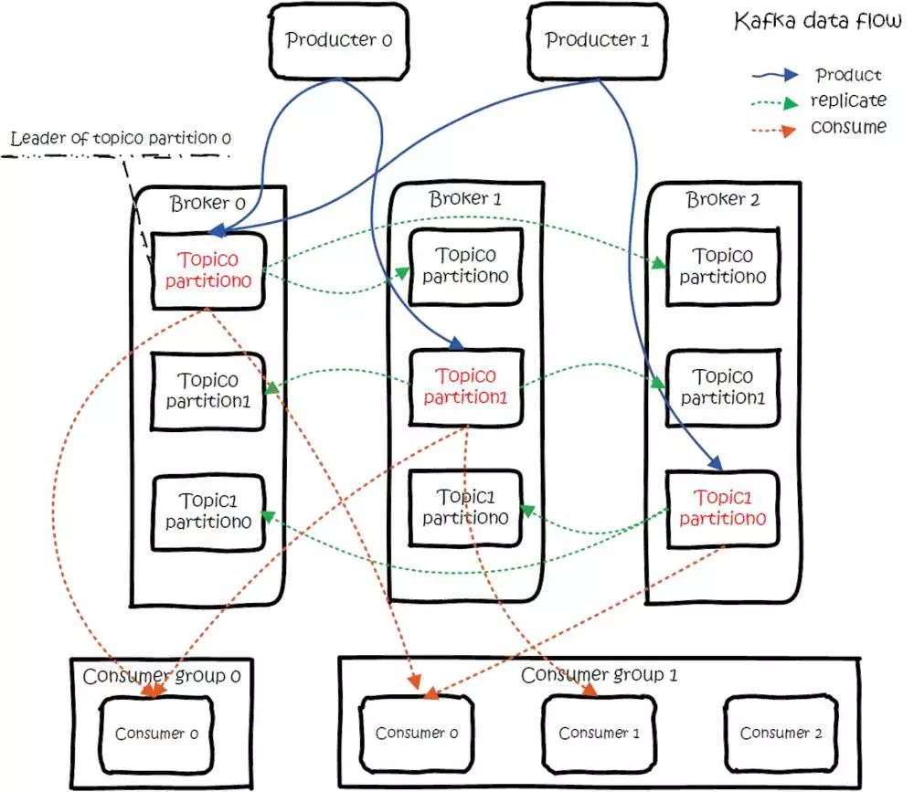

# [apache/kafka](https://github.com/apache/kafka)

* 分布式消息队列，流式处理平台
* 最初由 LinkedIn 采用 Scala 语言开发，用作 LinkedIn 的活动流追踪和运营系统数据处理管道的基础
* 其高性能、持久化、多副本备份、横向扩展、高吞吐、自动容灾、出入队有序等特性
* 用于发布和订阅、存储及实时地处理大规模流数据
* Kafka维护着“主数据库”， 每个消费者程序都是“从数据库”， 只要记住编号，消息都可以从“主数据库”复制到“从数据库”。 

## 生产

* 对外使用 Topic 的概念，生产者往 Topic 里写消息，消费者从中读消息
    - 为了做到水平扩展，一个 Topic 实际是由多个 Partition 组成的，遇到瓶颈时，可以通过增加 Partition 的数量来进行横向扩容。单个 Parition 内是保证消息有序
    - 创建一条记录，记录中一个要指定对应的 Topic 和 Value，Key 和 Partition 可选,如果 Partition 没填
        + Key 有填。按照 Key 进行哈希，相同 Key 去一个 Partition。（如果扩展了 Partition 的数量那么就不能保证了）
        + Key 没填。Round-Robin 来选 Partition。
    - 先序列化，然后按照 Topic 和 Partition，放进对应的发送队列中
    - Kafka Produce 都是批量请求，会积攒一批，然后一起发送，不是调 send() 就立刻进行网络发包。
    - 同一个 Partition 的请求按照配置，攒一波，然后由一个单独的线程一次性发过去
* Partition:存在多副本的情况下，会尽量把多个副本，分配到不同的 Broker 上
    - Kafka 会为 Partition 选出一个 Leader，之后所有该 Partition 的请求，实际操作的都是 Leader，然后再同步到其他的 Follower
    - 一个 Broker 歇菜后，所有 Leader 在该 Broker 上的 Partition 都会重新选举，选出一个 Leader
    - Controller：Partition 的分配，还有 Leader 的选举，使用 ZK 在 Broker 中选出一个 Controller
        + Partition 的分配：
            * 将所有 Broker（假设共 n 个 Broker）和待分配的 Partition 排序。
            * 将第 i 个 Partition 分配到第（i mod n）个 Broker 上 （这个就是 Leader）。
            * 将第 i 个 Partition 的第 j 个 Replica 分配到第（(i + j) mode n）个 Broker 上。
        + Leader 容灾
            * Controller 会在 ZK 的 /brokers/ids 节点上注册 Watch，一旦有 Broker 宕机，它就能知道。
            * 当 Broker 宕机后，Controller 就会给受到影响的 Partition 选出新 Leader。
            * Controller 从 ZK 的 /brokers / topics / [topic] / partitions / [partition] / state 中，读取对应 Partition 的 ISR（in-sync replica 已同步的副本）列表，选一个出来做 Leader。
            * 选出 Leader 后，更新 ZK，然后发送 LeaderAndISRRequest 给受影响的 Broker，让它们知道改变这事。
    - 多副本同步：Follower 从 Leader 批量拉取数据来同步，具体的可靠性，是由生产者来决定的
        + 生产者生产消息的时候，通过 request.required.acks 参数来设置数据的可靠性
            * Acks=-1 的时候，如果 ISR 少于 min.insync.replicas 指定的数目，那么就会返回不可用
            * Acks=1 写leader成功后返回，异步写
            * Acks=0 发过去就行，不关心broker是否处理成功
        + ISR 列表中的机器是会变化的，根据配置 replica.lag.time.max.ms，多久没同步，就会从 ISR 列表中剔除
        + 高水位：对于 Partition 和 Leader，就是所有 ISR 中都有的最新一条记录。消费者最多只能读到高水位。
        + 从 ISA 中选出 Leader 后，Follower 会把自己日志中上一个高水位后面的记录去掉，然后去和 Leader 拿新的数据。因为新的 Leader 选出来后，Follower 上面的数据，可能比新 Leader 多，所以要截取。
* Broker、Topics、Partitions 的一些元信息用 ZK 来存，监控和路由啥的也都会用到 ZK
* 流程
    - Producers 往 Brokers 里面的指定 Topic 中写消息
    - Consumers 从 Brokers 里面拉取指定 Topic 的消息



## 消费

* 订阅 Topic 是以一个消费组来订阅的，一个消费组里面可以有多个消费者。同一个消费组中的两个消费者，不会同时消费一个 Partition
* API：订阅 Topic 时，可以用正则表达式，如果有新 Topic 匹配上，那能自动订阅上
* Offset 的保存
    - 一个消费组消费 Partition，需要保存 Offset 记录消费到哪，以前保存在 ZK 中，由于 ZK 的写性能不好，以前的解决方法都是 Consumer 每隔一分钟上报一次
    -  ZK 的性能严重影响了消费的速度，而且很容易出现重复消费。在 0.10 版本后，Kafka 把这个 Offset 的保存，从 ZK 总剥离，保存在一个名叫 consumeroffsets topic 的 Topic 中
    -  写进消息的 Key 由 Groupid、Topic、Partition 组成，Value 是偏移量 Offset。Topic 配置的清理策略是 Compact。总是保留最新的 Key，其余删掉。
    -  一般情况下，每个 Key 的 Offset 都是缓存在内存中，查询的时候不用遍历 Partition，如果没有缓存，第一次就会遍历 Partition 建立缓存，然后查询返回。
*  分配 Partition—Reblance
    -  消费也要从 Broker 中选一个 Coordinator，用于分配 Partition。选 Coordinator：看 Offset 保存在那个 Partition；该 Partition Leader 所在的 Broker 就是被选定的 Coordinator。
    -  交互流程：把 Coordinator 选出来之后，就是要分配了。整个流程是这样的：
        +  Consumer 启动、或者 Coordinator 宕机了，Consumer 会任意请求一个 Broker，发送 ConsumerMetadataRequest 请求。
        +  Broker 会按照上面说的方法，选出这个 Consumer 对应 Coordinator 的地址。
        +  Consumer 发送 Heartbeat 请求给 Coordinator，返回 IllegalGeneration 的话，就说明 Consumer 的信息是旧的了，需要重新加入进来，进行 Reblance。
    -  Reblance 流程
        +  Consumer 给 Coordinator 发送 JoinGroupRequest 请求。
        +  这时其他 Consumer 发 Heartbeat 请求过来时，Coordinator 会告诉他们，要 Reblance 了。
        +  其他 Consumer 发送 JoinGroupRequest 请求。
        +  所有记录在册的 Consumer 都发了 JoinGroupRequest 请求之后，Coordinator 就会在这里 Consumer 中随便选一个 Leader。 然后回 JoinGroupRespone，这会告诉 Consumer 你是 Follower 还是 Leader，对于 Leader，还会把 Follower 的信息带给它，让它根据这些信息去分配 Partition。
        +  Consumer 向 Coordinator 发送 SyncGroupRequest，其中 Leader 的 SyncGroupRequest 会包含分配的情况。
        +  Coordinator 回包，把分配的情况告诉 Consumer，包括 Leader
        +  会 Reblance 的情况
            *  增加 Partition
            *  增加消费者
            *  消费者主动关闭
            *  消费者宕机了
            *  Coordinator 自己也宕机了

## 消息投递语义

* 3 种消息投递语义
    - At most once：最多一次，消息可能会丢失，但不会重复。先获取数据，再进行业务处理，业务处理成功后 Commit Offset
        + 生产者生产消息异常，消息是否成功写入不确定，重做，可能写入重复的消息。
        + 消费者处理消息，业务处理成功后，更新 Offset 失败，消费者重启的话，会重复消费
    - At least once：最少一次，消息不会丢失，可能会重复。先获取数据，再 Commit Offset，最后进行业务处理
        + 生产者生产消息异常，不管，生产下一个消息，消息就丢了。
        + 消费者处理消息，先更新 Offset，再做业务处理，做业务处理失败，消费者重启，消息就丢了。
    - Exactly once：只且一次，消息不丢失不重复，只且消费一次.首先要保证消息不丢，再去保证不重复
        + 生产者重复:生产保证幂等性
            * 为每个 Producer 分配一个 Pid，作为该 Producer 的唯一标识
            * Producer 会为每一个维护一个单调递增的 Seq,eq_seq == broker_seq+1 时，Broker 才会接受该消息，因为：
                - 消息的 Seq 比 Broker 的 Seq 大超过时，说明中间有数据还没写入，即乱序了。
                - 消息的 Seq 不比 Broker 的 Seq 小，那么说明该消息已被保存。
        + 重复消费
            * 下游系统保证幂等性，重复消费也不会导致多条记录。
            * 把 Commit Offset 和业务处理绑定成一个事务。
* 事务性/原子性广播:
    - 先从多个源 Topic 中获取数据。
    - 做业务处理，写到下游的多个目的 Topic。
    - 更新多个源 Topic 的 Offset。
    - 思路
        + 引入 Tid（transaction id），和 Pid 不同，这个 ID 是应用程序提供的，用于标识事务，和 Producer 是谁并没关系。 就是任何 Producer 都可以使用这个 Tid 去做事务，这样进行到一半就死掉的事务，可以由另一个 Producer 去恢复。
        + 同时为了记录事务的状态，类似对 Offset 的处理，引入 Transaction Coordinator 用于记录 Transaction Log。
        + 在集群中会有多个 Transaction Coordinator，每个 Tid 对应唯一一个 Transaction Coordinator。
    - 做法
        + 做事务时，先标记开启事务，写入数据，全部成功就在 Transaction Log 中记录为 Prepare Commit 状态，否则写入 Prepare Abort 的状态。
        + 之后再去给每个相关的 Partition 写入一条 Marker（Commit 或者 Abort）消息，标记这个事务的 Message 可以被读取或已经废弃。
        + 成功后在 Transaction Log记录下 Commit/Abort 状态，至此事务结束
    - 数据流：
        + 首先使用 Tid 请求任意一个 Broker（代码中写的是负载最小的 Broker），找到对应的 Transaction Coordinator。
        + 请求 Transaction Coordinator 获取到对应的 Pid，和 Pid 对应的 Epoch，这个 Epoch 用于防止僵死进程复活导致消息错乱。当消息的 Epoch 比当前维护的 Epoch 小时，拒绝掉。Tid 和 Pid 有一一对应的关系，这样对于同一个 Tid 会返回相同的 Pid。
        + Client 先请求 Transaction Coordinator 记录的事务状态，初始状态是 Begin，如果是该事务中第一个到达的，同时会对事务进行计时。Client 输出数据到相关的 Partition 中；Client 再请求 Transaction Coordinator 记录 Offset 的事务状态；Client 发送 Offset Commit 到对应 Offset Partition。
        + Client 发送 Commit 请求，Transaction Coordinator 记录 Prepare Commit/Abort，然后发送 Marker 给相关的 Partition。全部成功后，记录 Commit/Abort 的状态，最后这个记录不需要等待其他 Replica 的 ACK，因为 Prepare 不丢就能保证最终的正确性了。

## 文件形式

* 以文件的形式存储在文件系统的。Topic 下有 Partition，Partition 下有 Segment，Segment 是实际的一个个文件，Topic 和 Partition 都是抽象概念
* 目录 /partitionid}/ 下，存储着实际的 Log 文件（即 Segment），还有对应的索引文件
* 每个 Segment 文件大小相等，文件名以这个 Segment 中最小的 Offset 命名，文件扩展名是 .log。Segment 对应的索引的文件名字一样，扩展名是 .index。
* 有两个 Index 文件：
    - 一个是 Offset Index 用于按 Offset 去查 Message。
    - 一个是 Time Index 用于按照时间去查，其实这里可以优化合到一起，下面只说 Offset Index。
* 减少索引文件的大小，降低空间使用，方便直接加载进内存中，这里的索引使用稀疏矩阵，不会每一个 Message 都记录下具体位置，而是每隔一定的字节数，再建立一条索引。 索引包含两部分：
    - BaseOffset：意思是这条索引对应 Segment 文件中的第几条 Message。这样做方便使用数值压缩算法来节省空间。例如 Kafka 使用的是 Varint。
    - Position：在 Segment 中的绝对位置。
* 查找 Offset 对应的记录时，会先用二分法，找出对应的 Offset 在哪个 Segment 中，然后使用索引，在定位出 Offset 在 Segment 中的大概位置，再遍历查找 Message

## 安装

```sh
# Mac 会自动安装依赖zookeeper
brew install kafka
brew services start kafka

# 启动 zookeeper
zookeeper-server-start /usr/local/etc/kafka/zookeeper.properties
# 启动kafka服务
kafka-server-start /usr/local/etc/kafka/server.properties

# 创建topic
kafka-topics --create --zookeeper localhost:2181 --replication-factor 1 --partitions 1 --topic test
# 查看创建的topic
kafka-topics --list --zookeeper localhost:2181
# 生产者生产数据
kafka-console-producer --broker-list localhost:9092 --topic test
# 消费者
kafka-console-consumer --bootstrap-server localhost:9092 --topic test --from-beginning
```

## 配置

```
broker

topic
```

## 图书

* 《Kafka源码解析与实战》 王亮

## 项目

* [weiboad/kafka-php](https://github.com/weiboad/kafka-php):kafka php client
* [dpkp/kafka-python](https://github.com/dpkp/kafka-python):Python client for Apache Kafka http://kafka-python.readthedocs.io/
* [Shopify/sarama](https://github.com/Shopify/sarama):Sarama is a Go library for Apache Kafka 0.8, and up. https://shopify.github.io/sarama

## 工具

* [yahoo/kafka-manager](https://github.com/yahoo/kafka-manager):A tool for managing Apache Kafka.

## 参考

* [Documentation](http://kafka.apache.org/documentation.html)
* [apachecn/kafka-doc-zh](https://github.com/apachecn/kafka-doc-zh):Kafka 中文文档 http://kafka.apachecn.org

- [重磅开源KSQL：用于Apache Kafka的流数据SQL引擎](http://www.infoq.com/cn/news/2017/08/KSQL-open-source-apache-kafka):一个基于流的SQL。推出KSQL是为了降低流式处理的门槛，为处理Kafka数据提供简单而完整的可交互式SQL接口。
- [Cruise Control](http://www.infoq.com/cn/news/2017/09/LinkedIn-open-Cruise-Control-Kaf):一个Kafka集群自动化运维新利器
* <https://www.confluent.io/blog/publishing-apache-kafka-new-york-times/>
* [在生产环境使用Kafka构建和部署大规模机器学习](https://juejin.im/entry/5a02660b6fb9a0452a3bbe53)
