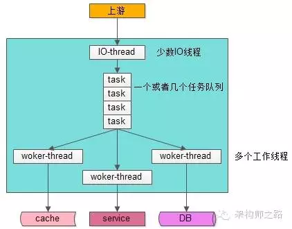

# 并发vs并行（concurrent vs parallel）

高并发（High Concurrency）是互联网分布式系统架构设计中必须考虑的因素之一，它通常是指，通过设计保证系统能够同时并行处理很多请求。

高并发相关常用的一些指标有响应时间（Response Time），吞吐量（Throughput），每秒查询率QPS（Query Per Second），并发用户数等。

* 响应时间：系统对请求做出响应的时间。例如系统处理一个HTTP请求需要200ms，这个200ms就是系统的响应时间。
* 吞吐量：单位时间内处理的请求数量。
* QPS：每秒响应请求数。在互联网领域，这个指标和吞吐量区分的没有这么明显。
* 并发用户数：同时承载正常使用系统功能的用户数量。例如一个即时通讯系统，同时在线量一定程度上代表了系统的并发用户数。

## 概念

用多线程只有一个目的，那就是更好的利用cpu的资源，因为所有的多线程代码都可以用单线程来实现。说这个话其实只有一半对，因为反应“多角色”的程序代码，最起码每个角色要给他一个线程吧，否则连实际场景都无法模拟，当然也没法说能用单线程来实现：比如最常见的“生产者，消费者模型”。

比如学习并发编程时，首先学习JDK源码，然后学进去之后，开始看JVM源码，最后看CPU架构，在技术点逐渐深度研究的过程中，广度也得到了完善。

* 线程(thead)：指的是这个程序（一个进程）运行时产生了不止一个线程
* 并行与并发：
    - 并行：多个cpu实例或者多台机器同时执行一段处理逻辑，是真正的同时。
    - 并发：通过cpu调度算法，让用户看上去同时执行，实际上从cpu操作层面不是真正的同时。并发往往在场景中有公用的资源，那么针对这个公用的资源往往产生瓶颈，我们会用TPS或者QPS来反应这个系统的处理能力。
* 线程安全：经常用来描绘一段代码。指在并发的情况之下，该代码经过多线程使用，线程的调度顺序不影响任何结果。这个时候使用多线程，我们只需要关注系统的内存，cpu是不是够用即可。反过来，线程不安全就意味着线程的调度顺序会影响最终结果
* 同步：Java中的同步指的是通过人为的控制和调度，保证共享资源的多线程访问成为线程安全，来保证结果的准确。如上面的代码简单加入@synchronized关键字。在保证结果准确的同时，提高性能，才是优秀的程序。线程安全的优先级高于性能。

* 线程在Running的过程中可能会遇到阻塞(Blocked)情况:对Running状态的线程加同步锁(Synchronized)使其进入(lock blocked pool ),同步锁被释放进入可运行状态(Runnable)。从jdk源码注释来看，blocked指的是对monitor的等待（可以参考下文的图）即该线程位于等待区。
* 线程在Running的过程中可能会遇到等待（Waiting）情况:线程可以主动调用object.wait或者sleep，或者join（join内部调用的是sleep，所以可看成sleep的一种）进入。从jdk源码注释来看，waiting是等待另一个线程完成某一个操作，如join等待另一个完成执行，object.wait()等待object.notify()方法执行。

### 互联网分层架构

* 客户端层：典型调用方是浏览器browser或者手机应用APP
* 反向代理层：系统入口，反向代理
* 站点应用层：实现核心应用逻辑，返回html或者json
* 服务层：如果实现了服务化，就有这一层
* 数据-缓存层：缓存加速访问存储
* 数据-数据库层：数据库固化数据存储

## 方法

方法论上主要有两种：垂直扩展（Scale Up）与水平扩展（Scale Out）。

垂直扩展：提升单机处理能力。垂直扩展的方式又有两种：

* 增强单机硬件性能，例如：增加CPU核数如32核，升级更好的网卡如万兆，升级更好的硬盘如SSD，扩充硬盘容量如2T，扩充系统内存如128G；如果预算不是问题，强烈建议使用“增强单机硬件性能”的方式提升系统并发能力，因为这个阶段，公司的战略往往是发展业务抢时间，而“增强单机硬件性能”往往是最快的方法。
* 提升单机架构性能，例如：使用Cache来减少IO次数，使用异步来增加单服务吞吐量，使用无锁数据结构来减少响应时间；
* 单机性能总是有极限的。所以互联网分布式架构设计高并发终极解决方案还是水平扩展。
* 水平扩展：只要增加服务器数量，就能线性扩充系统性能。水平扩展对系统架构设计是有要求的，如何在架构各层进行可水平扩展的设计，以及互联网公司架构各层常见的水平扩展实践。

### 实践

* 反向代理层的水平扩展，是通过“DNS轮询”实现的：dns-server对于一个域名配置了多个解析ip，每次DNS解析请求来访问dns-server，会轮询返回这些ip。当nginx成为瓶颈的时候，只要增加服务器数量，新增nginx服务的部署，增加一个外网ip，就能扩展反向代理层的性能，做到理论上的无限高并发。
* 站点层的水平扩展，是通过“nginx”实现的。通过修改nginx.conf，可以设置多个web后端。当web后端成为瓶颈的时候，只要增加服务器数量，新增web服务的部署，在nginx配置中配置上新的web后端，就能扩展站点层的性能，做到理论上的无限高并发。
* 服务层的水平扩展，是通过“服务连接池”实现的。站点层通过RPC-client调用下游的服务层RPC-server时，RPC-client中的连接池会建立与下游服务多个连接，当服务成为瓶颈的时候，只要增加服务器数量，新增服务部署，在RPC-client处建立新的下游服务连接，就能扩展服务层性能，做到理论上的无限高并发。如果需要优雅的进行服务层自动扩容，这里可能需要配置中心里服务自动发现功能的支持。
* 在数据量很大的情况下，数据层（缓存，数据库）涉及数据的水平扩展，将原本存储在一台服务器上的数据（缓存，数据库）水平拆分到不同服务器上去，以达到扩充系统性能的目的。
    - 按照范围水平拆分：每一个数据服务，存储一定范围的数据，user0库，存储uid范围1-1kw，user1库，存储uid范围1kw-2kw
        + 规则简单，service只需判断一下uid范围就能路由到对应的存储服务；
        + 数据均衡性较好；
        + 比较容易扩展，可以随时加一个uid[2kw,3kw]的数据服务；
        + 请求的负载不一定均衡，一般来说，新注册的用户会比老用户更活跃，大range的服务请求压力会更大；
    - 按照哈希水平拆分:每一个数据库，存储某个key值hash后的部分数据，user0库，存储偶数uid数据,user1库，存储奇数uid数据
        + 规则简单，service只需对uid进行hash能路由到对应的存储服务；
        + 数据均衡性较好；
        + 请求均匀性较好；
        + 不容易扩展，扩展一个数据服务，hash方法改变时候，可能需要进行数据迁移；
    - 水平拆分来扩充系统性能vs主从同步读写分离
        + 水平拆分扩展数据库性能：
            * 每个服务器上存储的数据量是总量的1/n，所以单机的性能也会有提升；
            * n个服务器上的数据没有交集，那个服务器上数据的并集是数据的全集；
            * 数据水平拆分到了n个服务器上，理论上读性能扩充了n倍，写性能也扩充了n倍（其实远不止n倍，因为单机的数据量变为了原来的1/n）；
        + 通过主从同步读写分离扩展数据库性能：
            * 每个服务器上存储的数据量是和总量相同；
            * n个服务器上的数据都一样，都是全集；
            * 理论上读性能扩充了n倍，写仍然是单点，写性能不变；

## 线程数设计

* 服务器CPU核数有限，能够同时并发的线程数有限，单核CPU设置10000个工作线程没有意义(工作线程数是不是设置的越大越好)
* 线程切换是有开销的，如果线程切换过于频繁，反而会使性能降低
* 调用sleep()函数的时候，线程不占用一直占用CPU，等待时会把CPU让出来，给其他需要CPU资源的线程使用。
    - 阻塞accept()，等待客户端连接都不占用CPU资源
    - 阻塞recv()，等待下游回包都不占用CPU资源
* 即使是单核，使用多线程也是有意义的，大多数情况也能提高并发
    - 多线程编码可以让代码更加清晰，还能提高吞吐量。例如：IO线程收发包，Worker线程进行任务处理，Timeout线程进行超时检测
    - 如果有一个任务一直占用CPU资源在进行计算，此时增加线程并不能增加并发，例如以下代码会一直占用CPU，并使得CPU占用率达到100%：`while(1){ i++; }`
    - 通常来说，Worker线程一般不会一直占用CPU进行计算，此时即使CPU是单核，增加Worker线程也能够提高并发，因为这个线程在休息的时候，其他的线程可以继续工作

### 现场模型

IO线程与工作现场通过任务队列解耦

大部分Web-Server与服务框架都是使用这样的一种“IO线程与Worker线程通过队列解耦”类线程模型.这个线程模型的特点是，工作线程内部是同步阻塞执行任务的,因此可以通过增加Worker线程数来增加并发能力.:

* 有少数几个IO线程监听上游发过来的请求，并进行收发包（生产者）
* 有一个或者多个任务队列，作为IO线程与Worker线程异步解耦的数据传输通道（临界资源）
* 有多个工作线程执行正真的任务（消费者）

纯异步线程模型
没有阻塞，这种线程模型只需要设置很少的线程数就能够做到很高的吞吐量，该模型的缺点是：
* 如果使用单线程模式，难以利用多CPU多核的优势
* 程序员更习惯写同步代码，callback的方式对代码的可读性有冲击，对程序员的要求也更高
* 框架更复杂，往往需要server端收发组件，server端队列，client端收发组件，client端队列，上下文管理组件，有限状态机组件，超时管理组件的支持

### 工作线程

* 从工作队列里拿出任务，进行一些本地初始化计算，例如http协议分析、参数解析、参数校验等
* 访问cache拿一些数据
* 拿到cache里的数据后，再进行一些本地计算，这些计算和业务逻辑相关
* 通过RPC调用下游service再拿一些数据，或者让下游service去处理一些相关的任务
* RPC调用结束后，再进行一些本地计算，怎么计算和业务逻辑相关
* 访问DB进行一些数据操作
* 操作完数据库之后做一些收尾工作，同样这些收尾工作也是本地计算，和业务逻辑相关

详细流程

* 请求在网络上传输到下游的cache、service、DB
* 下游cache、service、DB进行任务处理
* cache、service、DB将报文在网络上传回工作线程

### 线程数

Worker线程在执行的过程中，有一部计算时间需要占用CPU，另一部分等待时间不需要占用CPU，通过量化分析，例如打日志进行统计，可以统计出整个Worker线程执行过程中这两部分时间的比例，例如：
执行计算，占用CPU的时间（粉色时间轴）是100ms
等待时间，不占用CPU的时间（橙色时间轴）也是100ms

得到的结果是，这个线程计算和等待的时间是1：1，即有50%的时间在计算（占用CPU），50%的时间在等待（不占用CPU）：
假设此时是单核，则设置为2个工作线程就可以把CPU充分利用起来，让CPU跑到100%
假设此时是N核，则设置为2N个工作现场就可以把CPU充分利用起来，让CPU跑到N*100%
 
结论：
N核服务器，通过执行业务的单线程分析出本地计算时间为x，等待时间为y，则工作线程数（线程池线程数）设置为 N*(x+y)/x，能让CPU的利用率最大化。
 
经验：
一般来说，非CPU密集型的业务（加解密、压缩解压缩、搜索排序等业务是CPU密集型的业务），瓶颈都在后端数据库访问或者RPC调用，本地CPU计算的时间很少，所以设置几十或者几百个工作线程是能够提升吞吐量的。

## 概念

并发:当有多个线程在操作时,如果系统只有一个CPU,则它根本不可能真正同时进行一个以上的线程，它只能把CPU运行时间划分成若干个时间段,再将时间 段分配给各个线程执行，在一个时间段的线程代码运行时，其它线程处于挂起状。.这种方式我们称之为并发(Concurrent)。
并行：当系统有一个以上CPU时,则线程的操作有可能非并发。当一个CPU执行一个线程时，另一个CPU可以执行另一个线程，两个线程互不抢占CPU资源，可以同时进行，这种方式我们称之为并行(Parallel)。
区别：并发和并行是即相似又有区别的两个概念，并行是指两个或者多个事件在同一时刻发生；而并发是指两个或多个事件在同一时间间隔内发生。在多道程序环境下，并发性是指在一段时间内宏观上有多个程序在同时运行，但在单处理机系统中，每一时刻却仅能有一道程序执行，故微观上这些程序只能是分时地交替执行。倘若在计算机系统中有多个处理机，则这些可以并发执行的程序便可被分配到多个处理机上，实现并行执行，即利用每个处理机来处理一个可并发执行的程序，这样，多个程序便可以同时执行。

* 高性能的服务器
* 高性能的数据库:业务和应用或者功能模块将数据库进行分离，不同的模块对应不同的数据库或者表，再按照一定的策略对某个页面或者功能进行更小的数据库散列
* 高效率的编程语言
* 高性能的Web容器
* HTML静态化
* 图片服务器分离:降低提供页面访问请求的服务器系统压力，并且可以保证系统不会因为图片问题而崩溃
* 镜像：镜像是大型网站常采用的提高性能和数据安全性的方式，镜像的技术可以解决不同网络接入商和地域带来的用户访问速度差异。
* 负载均衡
    - 软件四层交换我们可以使用Linux上常用的LVS来解决，LVS就是Linux Virtual Server，他提供了基于心跳线heartbeat的实时灾难应对解决方案，提高系统的鲁棒性，同时可供了灵活的虚拟VIP配置和管理功能，可以同时满足多种应用需求，这对于分布式的系统来说必不可少。一个典型的使用负载均衡的策略就是，在软件或者硬件四层交换的基础上搭建squid集群，这种思路在很多大型网站包括搜索引擎上被采用，这样的架构低成本、高性能还有很强的扩张性，随时往架构里面增减节点都非常容易。
    - 硬件四层交换：第四层交换使用第三层和第四层信息包的报头信息，根据应用区间识别业务流，将整个区间段的业务流分配到合适的应用服务器进行处理。　第四层交换功能就象是虚IP，指向物理服务器。它传输的业务服从的协议多种多样，有HTTP、FTP、NFS、Telnet或其他协议。这些业务在物理服务器基础上，需要复杂的载量平衡算法。在IP世界，业务类型由终端TCP或UDP端口地址来决定，在第四层交换中的应用区间则由源端和终端IP地址、TCP和UDP端口共同决定。在硬件四层交换产品领域，有一些知名的产品可以选择，比如Alteon、F5等

### 原理

现代操作系统以及硬件基本都支持并发程序，而在并发程序设计中，各个进程或者线程需要对公共变量的访问加以制约，此外，不同的进程或者线程需要协同工作以完成特征的任务，这就需要一套完善的同步机制，在Linux内核中有相应的技术实现，包括原子操作，信号量，互斥锁，自旋锁，读写锁等。InnoDB考虑到效率和监控两方面的原因，实现了一套独有的同步机制

### 基础知识

* 内存模型 :主要分为语言级别的内存模型和硬件级别的内存模型。语言级别的内存模型，C/C++属于weak memory model，简单的说就是编译器在进行编译优化的时候，可以对指令进行重排，只需要保证在单线程的环境下，优化前和优化后执行结果一致即可，执行中间过程不保证跟代码的语义顺序一致。所以在多线程的环境下，如果依赖代码中间过程的执行顺序，程序就会出现问题。硬件级别的内存模型，我们常用的cpu，也属于弱内存模型，即cpu在执行指令的时候，为了提升执行效率，也会对某些执行进行乱序执行（按照wiki提供的资料，在x86 64环境下，只会发生读写乱序，即读操作可能会被乱序到写操作之前），如果在编程的时候不做一些措施，同样容易造成错误。
* 内存屏障 :为了解决弱内存模型造成的问题，需要一种能控制指令重排或者乱序执行程序的手段，这种技术就叫做内存屏障，程序员只需要在代码中插入特定的函数，就能控制弱内存模型带来的负面影响，当然，由于影响了乱序和重排这类的优化，对代码的执行效率有一定的影响。具体实现上，内存屏障技术分三种，一种是full memory barrier，即barrier之前的操作不能乱序或重排到barrier之后，同时barrier之后的操作不能乱序或重排到barrier之前，当然这种full barrier对性能影响最大，为了提高效率才有了另外两种：acquire barrier和release barrier，前者只保证barrier后面的操作不能移到之前，后者只保证barrier前面的操作不移到之后。
* 互斥锁 :互斥锁有两层语义，除了大家都知道的排他性（即只允许一个线程同时访问）外，还有一层内存屏障（full memory barrier）的语义，即保证临界区的操作不会被乱序到临界区外。Pthread库里面常用的mutex，conditional variable等操作都自带内存屏障这层语义。此外，使用pthread库，每次调用都需要应用程序从用户态陷入到内核态中查看当前环境，在锁冲突不是很严重的情况下，效率相对比较低。
* 自旋锁 :传统的互斥锁，只要一检测到锁被其他线程所占用了，就立刻放弃cpu时间片，把cpu留给其他线程，这就会产生一次上下文切换。当系统压力大的时候，频繁的上下文切换会导致sys值过高。自旋锁，在检测到锁不可用的时候，首先cpu忙等一小会儿，如果还是发现不可用，再放弃cpu，进行切换。互斥锁消耗cpu sys值，自旋锁消耗cpu usr值。
* 递归锁 :如果在同一个线程中，对同一个互斥锁连续加锁两次，即第一次加锁后，没有释放，继续进行对这个锁进行加锁，那么如果这个互斥锁不是递归锁，将导致死锁。可以把递归锁理解为一种特殊的互斥锁。
* 死锁 :构成死锁有四大条件，其中有一个就是加锁顺序不一致，如果能保证不同类型的锁按照某个特定的顺序加锁，就能大大降低死锁发生的概率，之所以不能完全消除，是因为同一种类型的锁依然可能发生死锁。另外，对同一个锁连续加锁两次，如果是非递归锁，也将导致死锁。

现代的cpu提供了对单一变量简单操作的原子指令，即这个变量的这些简单操作只需要一条cpu指令即可完成，这样就不用对这个操作加互斥锁了，在锁冲突不激烈的情况下，减少了用户态和内核态的切换，化悲观锁为乐观锁，从而提高了效率。此外，现在外面很火的所谓无锁编程（类似CAS操作），底层就是用了这些原子操作。gcc为了方便程序员使用这些cpu原子操作，提供了一系列__sync开头的函数，这些函数如果包含内存屏障语义，则同时禁止编译器指令重排和cpu乱序执行。

## 参考

* [究竟啥才是互联网架构“高并发”](https://mp.weixin.qq.com/s?__biz=MjM5ODYxMDA5OQ==&mid=2651959830&idx=1&sn=ce1c5a58caed227d7dfdbc16d6e1cea4&chksm=bd2d07ca8a5a8edc45cc45c4787cc72cf4c8b96fb43d2840c7ccd44978036a7d39a03dd578b5)
* [工作线程数究竟要设置为多少](https://mp.weixin.qq.com/s?__biz=MjM5ODYxMDA5OQ==&mid=2651960260&idx=1&sn=051fd566d43d7fd35724bdf55484ee5f&chksm=bd2d06188a5a8f0e64467381c7b3df5bdcb7f81ba055d5d21ec2f8b888492be15527d23070b0)
并发：<https://www.zhihu.com/question/19683490>

分布式系统：<https://www.zhihu.com/question/37051661>

http://ifeve.com/talk-concurrency/

http://www.jianshu.com/p/40d4c7aebd66
