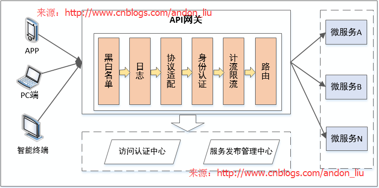

# Microservices

* 把应用拆分成不同的模块（component）。于是取而代之的是多个不同的service被彼此独立的部署，彼此独立的伸缩。客户的订单和发票，这些模块将会被分别部署在他们自己的server上。
* 这些service之间的通信机制可以是多种格式的，通常是HTTP 或者 RPC（以及事件发布订阅的方式）。有时候你也可为每个模块分配不同的数据存储schema。这样的话，我们就把每个模块的能力都隔离开了，而且你还让它独立于其他模块而工作。
* 需要通过事件源机制来搞定一些事件触发。客户端创建一个新的订单。你就可以不用让客户端创建订单并且生成发票，取而代之的是，你可以创建一个新的订单，然后Orders这个模块push一个生成发票事件，然后其他的模块可以监听这个事件，然后来异步生成发票。

* 它适合大型应用。如果您有大型应用程序，则可以将此大型应用程序拆分成不同的模块，开发人员将能够独立地迭代，维护和构建这些模块。
* 微服务的每个模块（component）只做一件事情，有且仅有一件事情可以做，你可以轻松基于此迭代并且尽情的完善和创新该模块，而且还不会影响到其他的模块。每个模块之间，彼此通过接口进行通信（大多数时候），比如HTTP RESTful接口。你可以改变和实验性的搞一些实现，只要接口不改变，应用就会保持正常的运转。
* 需要scale组织或团队，你可以为你的团队成员分配一些更小的，应用程序中的一些小碎片，更小的开发任务。这对于开发人员来说，有助于他们更快的理解自己要做什么，代码是如何运作的。而且迭代起来也更快。如果他们要用到其他的模块，他们可以使用接口去消费（consume）其他的模块，而不需要深入到其他模块的代码中去。
* 如果出现一个问题，这个问题是被隔离在一个特定的模块中或者是某个service中。意味着整个应用程序只有那一个service处于停止状态，而其他的模块则可以照常运转。就是说我们现在有Orders和Invoices两个模块。如果由于一些原因，开发人员在周五晚上push了一个bug到Invoices模块上，然后导致了发票模块不能工作。我们依然可以保存了这个发票事件。一旦Invoices模块恢复了，我们就可以继续生成发票了
* 让这种事件驱动的风格更加的发扬光大，
* 你现有有一堆不再“固定”的零部件。现在不再是单体那样一个app在一个地方做了所有事情。现在你有多个模块和（或）service。这些模块要在同一时刻共同配合才能最终呈现给用户。
* 要有更强大的基础设施能力。现在你需要有一种魔法，要能简单地部署、伸缩、以及监控和管理这些不同的模块，这些独立的模块。这也是这些年来实时的在线监控和分析技术变得如此火爆的原因之一吧。因为一旦你是面向微服务的架构，你就必须去监控每一个碎片（零部件）并且要在一个集中的地方可以看到你的模块们的运行状态。
* 可用性的问题：service们也许会go down 不可用。或者还会有一致性问题：也许你需要把这些微服务scale到多个数据中心。所以你在创建一个应用时，就要把这些问题都要考虑进去。
* 要测试一个多重依赖的那种的话可能就比较复杂了。通常的话，如果你想要测试一个构建于微服务架构之上的应用的话，前提条件就是你必须要同时启动所有的这些模块，这样可以确保彼此都可以相互通信，并且要成功地实现了集成测试。

## 场景

* 微服务提供的API粒度通常与客户端的需求不同，微服务一般提供细粒度的API，也就是说客户端需要与多个服务进行交互。
* 不同的客户端需要不同的数据，不同类型客户端的网络性能不同。
* 服务的划分可能会随时间而变化，因此需要对客户端隐藏细节。

## Monolithic Architecture

把所有的东西都放到一块。而且通常也只有一个数据存储。通过在多个服务器上重复部署相同的巨大代码块，可以横向扩展单体应用程序。所以每次我们调整应用程序时，我们其实相当于是在改动这些被放在一起的所有的模块，因为他们是一体的。

* 可以比较容易地构建，而且是以更小的代码库来开始。我们可以在同一个代码库中构建和开发所有内容，这意味着我们不用担心模块化以及如何把不同的组件放在一起来共同工作这些事情。
* 测试起来也简单。通常当我们测试一个单体应用时，我们一开始就只面对一个应用，然后测试我们集成的单元测试。Eclipse围绕着单体应用就提供了很多成熟的测试工具，包括idea
* 随着时间的推移，越来越多的功能需要构建进去，代码越来越多，在一个地方跟踪代码将变得更加的困难。更换数据库存储方案，或者想要使用一种新的技术。在单体应用中，这样的改动通常是非常痛苦的。

## 网关(API Gateways)

出现在系统边界上的一个面向API的、串行集中式的强管控服务，这里的边界是企业IT系统的边界。

API网关可以以某种方式来协调我们的架构如何处理请求。要把API 网关放到你的微服务们的最前端，并且要让API 网关变成由应用所发起的每个请求的入口。这样就可以明显的简化客户端实现和微服务应用程序之间的沟通方式。通过使用API网关来抽象此客户端实现的复杂性。然后，API网关可以公开一个特定的端点，在这个端点上将产生请求，然后在[网关]消费了微服务之后返回给客户端一个唯一的响应（response）。
API网关统一规范平台对外的服务，同时充当了平台的PaaS层。如上图所示，API网关功能结构基于管道模型和支持可插拔式的设计开发，提供统一基于http协议的WebAPI访问接口，内部每个模块各自实现功能，包括：黑白名单、日志、协议适配、身份认证、计流限流及路由。并且依赖“访问认证中心、服务发布管理中心”分别实现API网关访问权限控制和定位目标微服务。各模块功能说明如下：

* 黑白名单：实现通过IP地址控制禁止访问网关功能，此功能是应用层面控制实现，再往前也可以通过网络传输方面进行控制访问。
* 日志：实现访问日志的记录，可用于分析访问、处理性能指标，同时将分析结果支持其他模块功能应用。
* 协议适配：实现通信协议校验、适配转换的功能。
* 身份认证：负责网关访问身份认证验证，此模块与“访问认证中心”通信，实际认证业务逻辑交移“访问认证中心”处理。
* 计流限流：实现微服务访问流量计算，基于流量计算分析进行限流，可以定义多种限流规则。
* 路由：路由是API网关很核心的模块功能，此模块实现根据请求，锁定目标微服务并将请求进行转发。此模块需要与“服务发布管理中心”通信。“服务发布管理中心”实现微服务发布注册管理功能，与其通信获得目标微服务信息。
* 保证数据的交换之外，还需要实现对接入客户端的身份认证、防报文重放与防数据篡改、功能调用的业务鉴权、响应数据的脱敏、流量与并发控制，甚至基于API调用的计量或者计费。

中心化中间件

* Authentication
* Security
* Traffic control
* Ops
* logging
* Transformation
* Etc

API GW本身

NIO接入，异步接出
流控与屏蔽
秘钥交换
客户端认证与报文加解密
业务路由框架
报文转换
HTTP DNS/ Direct IP
API GW 客户端 SDK / Library

基本通信
秘钥交换与Cache
身份认证与报文加解密
配套的在线自助服务平台

代码生成
文档生成
沙盒调测

* 客户端不用再需要知道和关心模块的地址（address）了。网关负责来搞这些事情，只需要知道网关就好了。你可以去改变实现而且还可以改变API接口。不过通常来说，你改变接口后，会增加客户端出问题的风险。可以在单独的层上有效地抽象，这样你就可以更改实现和接口，同时保持现有客户端的公共接口相同。

构建API通常是构建微服务器所需的工作量的50％。
监控分析 - 这是非常重要的。你需要持续地监视和跟踪模块和文档的状态。

API GW所承担的一个重要角色就是报文转换，并且是跨语言、跨运行平台的报文转换。报文就是数据，在跨平台、跨语言的条件下，对于数据的描述——元数据——也就是类定义，对于API GW的系统性挑战是巨大的：传输时，报文内不能传输类定义，跨语言的类定义转换、生成与加载。

### 分类

* 面向Web App：这类场景，在物理形态上类似前后端分离，此时的Web App已经不是全功能的Web App，而是根据场景定制、场景化的App。
* 面向Mobile App：这类场景，移动App是后端Service的使用者，此时的API GW还需要承担一部分MDM（此处是指移动设备管理，不是主数据管理）的职能。
* 面向Partner OpenAPI：这类场景，主要为了满足业务形态对外开放，与企业外部合作伙伴建立生态圈，此时的API GW需要增加配额、流控、令牌等一系列安全管控功能。
* 面向Partner ExternalAPI：这类场景，业界提的比较少，很多时候系统的建设，都是为了满足企业自身业务的需要，实现对企业自有业务的映射。当互联网形态逐渐影响传统企业时，很多系统都会为了导入流量或者内容，依赖外部合作伙伴的能力，一些典型的例子就是使用「合作方账号登录」、「使用第三方支付平台支付」等等，这些对于企业内部来说，都是一些外部能力。此时的API GW就需要在边界上，为企业内部Service 统一调用外部的API做统一的认证、（多租户形式的）授权、以及访问控制。
* 面向IoT SmartDevice：这类场景，业界就提的更少了，但在传统企业，尤其是工业企业，传感器、物理设备从工业控制协议向IP转换，导致具备信息处理能力的「智能产品」在被客户激活使用直至报废过程中，信息的传输不能再基于VPN或者企业内部专线，导致物理链路上会存在一部分公网链路。此时的API GW所需要满足的，就是不是前三种单向的由外而内的数据流，也不是第四种由内而外的数据流，「内外兼修」的双向数据流，对于企业的系统来说终端设备很多情况下都不是直连网关，而是进过一个「客户侧」的集中网关在和企业的接入网关进行通信。

### 框架

* 基于nginx平台实现的网关有：KONG、API Umbrella
* 自研发的网关有：apigee
* Netflix 的API GW，主要是指Zuul：自己的三大场景： Website Service, API Service, Streaming Service
    - Filter的PRE ROUTING POST ERROR（PRPE 模型）：典型的「前正后反模型」的实现，为集成的标准化做好了框架层面的铺垫。
    - 采用Groovy脚本的Filter实现机制
    - 采用Cassandra作为filter repository的机制。

## Faas（function as a service）

* Ops: Blue/Green Deployments:版本切换
* Ops:金丝雀发布（Canary Releases）:允许你直接只导入指定量的流量到新的版本，API网关就可以帮你来做这件事情。
* Ops:负载均衡（ Load Balancing）：API网关就可以利用诸如Consul或etcd这些服务发现工具来负载均衡请求（request）。每次你去请求一个DNS地址，服务发现（service‑discovery）工具就会给你一个新的IP地址。一般会在DNS这一层中做一些类似round-robin等策略的负载均衡。
* Ops: 断路器（Circuit Breakers）：超过了指定的阈值，API网关就会停止发送数据到那些失败的模块。

服务发现 注册

降级:主逻辑失败采用备用逻辑的过程
熔断:常用手机因短期内多次失败，而被暂时性的忽略，不再尝试使用

## 特征

API GW需要包含以下功能：

面向运行期

对客户端实现身份认证
通信会话的秘钥协商，报文的加密与解密
日常流控与应急屏蔽
内部响应报文的场景化裁剪
支持「前正后反模型」的集成框架
报文格式的转换
业务路由的支撑
客户端优先的超时机制
全局流水号的生成与应用
面向客户端支持HTTP DNS / Direct IP
面向开发期

自助的沙盒测试环境
面向客户端友好的 SDK / Library以及示例
能够根据后端代码直接生成客户端业务代码框架
完善的报文描述能力（元数据），支撑配置型的报文裁剪
面向运维与运营

支持面向接入方的独立部署与快速水平扩展
面向业务场景或合作伙伴的自助API开通
对外接口性能与线上环境故障定位自助平台

## 问题

后端API粒度：能和原子业务能力找到映射最好，一定要避免「万能接口」的出现。

业务路由的实现和含报文转换的API不停机发布：尽可能的在报文头里面存放业务路由所需要的信息，避免对报文体进行解析。API GW上线后，面临的很大问题都是后端服务如何自助发布到外部，同时不能重启网关服务，以保障业务的连续。在此过程中，如果涉及到报文格式的转换，那对API网关实现的技术要求比较高。如果让网关完成报文转换，第一种方案，网关需要知道报文的具体格式（也就是报文的元数据，或者是类定义），这部分要支持热更新。第二种方案，需要客户端在报文内另外附加元数据，网关通过运行期加载元数据对报文进行解析在进行报文的转换，这种方案性能不会很好。第三种方案，就是在运行期首次报文转换的时候，根据元数据生成报文转换代码并加载，这种方案对技术实现要求比较高，对网关外围平台支撑力度要求也不低。

客户端的秘钥管理：很多人都会把安全问题简单的用加密算法来解决，这是一个严重的误区，很多时候都存在对秘钥进行系统性管理的短板。打个比方，加密算法就好比家里的保险箱，而秘钥是保险箱的钥匙，而缺乏秘钥管理的安全方案，就好比把钥匙放在自家的客厅茶几上。更何况，安全方案里加解密也只是其中的一部分。

## 资源

* [amio/awesome-micro](https://github.com/amio/awesome-micro) :A collection of awesome things regarding zeit's micro.
* [微服务与API网关（上）: 为什么需要API网关？](http://blog.didispace.com/hzf-ms-apigateway-1/)
* [罗辑思维Go语言微服务改造实践](http://www.techug.com/post/luo-ji-si-wei-go-service-upgrade.html)
