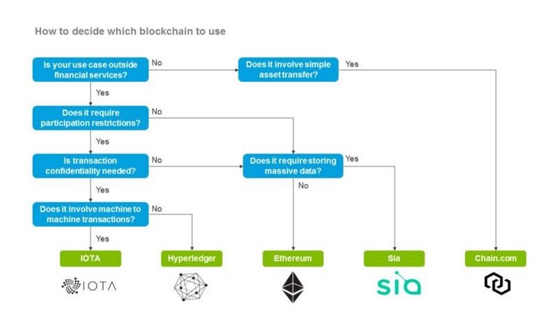

# 区块链（blockchain）

A distributed database that is used to maintain a continuously growing list of records, called blocks.所有的记账能迅速同步到所有账本 设计者署名为中本聪的人创造一种不受政府或其他任何人控制的货币！

* 本质上是一个去中心化的分布式数据库。就是用一串与密码学产生的数据块构成。在加密的前提下，包含了一定时间内的系统全部信息交流数据，每个区块之间的链接关系，整体就构成了区块链。但是现在市面上真正被人所熟知的区块链的技术，更多是像比特币，以太币这样的数字货币。但是，从互联网技术发展来看，真正引爆区块链技术的很有可能还是社交和资讯等领域。
* 解决了是他们的身份的真实和唯一性，而不是机器人或者水军。身份唯一性，是社交的前提。但是在现有的社交网络中，虚假身份和僵尸层出不穷。你可以是匿名，但是你的身份是真实的，可溯源的。ONO创始人徐可的期望就是通过区块链改变现有社交产品和环境，“让社交变得更自由、更放松、更随心所欲”。
* 比特币发明者中本聪，在2010 年 12 月，自己的笔记本上写到：只要对网络有好处，我们就必须要去做。这也许是对所有新技术最好的解释。
* 特征
    - 不可变性
    - 溯源
    - 分布式共识
* 数据库
* 每个节点平等，保存整个数据库
* 最终一致
* 无政府主义去中心化
* 单点无法修改数据，单点操作（按时间戳）同步到整个区块
* 技术理想主义（严格限定的区块生成与新币发行机制）

## 区块

区块链由一个个区块（block）组成。区块很像数据库的记录，每次写入数据，就是创建一个区块。每个区块的 Hash 都是不一样的，可以通过 Hash 标识区块。如果区块的内容变了，它的 Hash 一定会改变。（区块内容与hash唯一对应关系）

* 区块头（Head）：记录当前区块的元信息，Hash = SHA256(区块头)
* 区块体（Body）：实际数据
    - 生成时间
    - 实际数据（即区块体）的 Hash（计算机可以对任意内容，计算出一个长度相同的特征值。区块链的 Hash 长度是256位）
    - 上一个区块的 Hash
* 如果当前区块的内容变了，或者上一个区块的 Hash 变了，一定会引起当前区块的 Hash 改变。如果有人修改了一个区块，该人必须同时修改后面所有的区块，否则被改掉的区块就脱离区块链了。保证了自身的可靠性，数据一旦写入，就无法被篡改。这就像历史一样，发生了就是发生了，从此再无法改变。
* 只要你有服务器，就能加入这个网络，成为一个节点。每个节点都包含了整个区块链（目前大概 100多 GB），并且节点之间时刻不停地在同步信息。
* 当你发生了一笔支付，你所在的节点就会把这笔交易告诉另一个节点，直至传遍整个网络。矿工从网上收集各种新发生的交易，将它们打包写入区块链。一旦写入成功， 矿工所在节点的区块链，就成为最新版本，其他节点都会来复制新增的区块，保证全网的区块链都是一致的。

## 采矿

由于必须保证节点之间的同步，所以新区块的添加速度不能太快。发明者中本聪的设计规则是平均每10分钟，全网才能生成一个新区块，一小时也就六个。通过故意设置了海量的计算。只有通过极其大量的计算，才能得到当前区块的有效 Hash，从而把新区块添加到区块链。这个计算过程就叫做采矿（mining）。

* 只有满足条件的 Hash 才会被区块链接受。这个条件特别苛刻，使得绝大部分 Hash 都不满足要求，必须重算。
* 区块头包含一个难度系数（difficulty），这个值决定了计算 Hash 的难度。使用一个常量除以难度系数，可以得到目标值（target）。只有小于目标值的 Hash 才是有效的，否则 Hash 无效，必须重算。由于目标值非常小，Hash 小于该值的机会极其渺茫，可能计算10亿次，才算中一次。
* 有一个 Nonce 值，记录了 Hash 重算的次数。第 100000 个区块的 Nonce 值是274148111，即计算了 2.74 亿次，才得到了一个有效的 Hash，该区块才能加入区块链。
* 难度系数的动态调节机制。他规定，难度系数每两周（2016个区块）调整一次。如果这两周里面，区块的平均生成速度是9分钟，就意味着比法定速度快了10%，因此难度系数就要调高10%；如果平均生成速度是11分钟，就意味着比法定速度慢了10%，因此难度系数就要调低10%。难度系数越调越高（目标值越来越小），导致了采矿越来越难。

## 问题

* 效率，数据写入区块链，最少要等待十分钟，所有节点都同步数据，则需要更多的时间；
* 能耗，区块的生成需要矿工进行无数无意义的计算，这是非常耗费能源的。

### 分叉

同时有两个区块加入，因为它们都连着前一个区块，就形成了分叉。这时应该采纳哪一个区块呢？

规则：新节点总是采用最长的那条区块链。如果区块链有分叉，将看哪个分支在分叉点后面，先达到6个新区块（称为"六次确认"）。按照10分钟一个区块计算，一小时就可以确认。拥有大多数计算能力的那条分支，就是正宗的比特链。

## ICO

Initial Coin Offering的简称，是一种以出售新的初始数字加密货币来换取资金的筹资方式。ICO与区块链的关系，和上市与现代公司的关系类似。并不是所有公司都需要通过上市来筹得资金，正常的公司上市也绝不只是为了"骗钱"。 进行ICO的区块链项目大多是产品本身需要公众参与的产品，比如分布式的网盘、电网、二手电商、交友App等等。参与ICO的投资者，通过将其他货币(包含现实世界中的法币或比特币、以太坊等数字加密货币)在指定期限内交给ICO的组织者，以换取一定数量的新代币。在这一过程中，新的代币被赋予了来自其它货币的价值，成为新的有价货币(相当于某一公司的股票)。

比特币作为最早的初始数字加密货币(以下简称代币)，在该领域有着美元一样的结算地位。几乎所有的新代币在ICO的过程中，都支持以比特币来换取新的代币。由于比特币具有匿名性，使得参与者很难追踪到ICO组织者的真实身份，许多诈骗者在完全没有区块链项目的情况下进行ICO。

另一边，由于参与ICO无需像购买股票那样进行合格投资人审查。许多ICO参与者并不了解ICO的实质含义(类似于购买股票)，而只当其购买的代币是某种会自动升值的投资品。而诸如以太坊ETH这样的项目成功，早期投资者动辄获得数以百倍的回报，更是刺激了投机者们参与ICO暴富的狂热。

这两方面的因素，才导致了如今ICO的乱象。而相比比特币，ICO对大众更具迷惑性，更容易产生诈骗问题，也更为难以监管。

而斩断ICO乱象最高效的方法，就是切断ICO的匿名性和不合格(大众)投资者的入金渠道----切断比特币交易。

### 场景

* 不存在所有成员都信任的管理当局
* 写入的数据不要求实时使用
* 挖矿的收益能够弥补本身的成本
* 商业逻辑的重构
    - 供应链-票据融资
    - 供应链-应收款融资
    - 供应链-授信融资
    - 资产数字化
    - 商品生命周期跟踪
    - 区块链合同存证

### 比特币

非对称加密：非对称加密保证了支付的可靠性。由于支付的钱必须通过私钥取出，所以你是谁并不重要，重要的是谁拥有私钥。只有拥有了私钥，才能取出支付给你的钱。
钱不是支付给个人的，而是支付给某一把私钥。这就是交易匿名性的根本原因，因为没有人知道，那些私钥背后的主人是谁。

* 根据协议，公钥的长度是512位。这个长度不太方便传播，因此协议又规定，要为公钥生成一个160位的指纹。所谓指纹，就是一个比较短的、易于传播的哈希值。160位是二进制，写成十六进制，大约是26到35个字符，比如 1BvBMSEYstWetqTFn5Au4m4GFg7xJaNVN2。这个字符串就叫做钱包的地址，它是唯一的，即每个钱包的地址肯定都是不一样的。
* 是否拥有某个钱包地址，是由私钥证明的（具体的证明方法稍后介绍），所以一定要保护好私钥。

#### 交易

* 一笔交易就是一个地址的比特币，转移到另一个地址。由于比特币的交易记录全部都是公开的，哪个地址拥有多少比特币，都是可以查到的。因此，支付方是否拥有足够的比特币，完成这笔交易，这是可以轻易验证的。
* 申报交易的时候，除了交易金额，转出比特币的一方还必须提供以下数据。
    - 上一笔交易的 Hash（你从哪里得到这些比特币）
    - 本次交易双方的地址
    - 支付方的公钥
    - 支付方的私钥生成的数字签名
* 交易数据必须写入数据库，才算成立，对方才能真正收到钱。
    - 所有的交易数据都会传送到矿工那里。矿工负责把这些交易写入区块链。
    - 根据比特币协议，一个区块的大小最大是 1MB，而一笔交易大概是500字节左右，因此一个区块最多可以包含2000多笔交易。矿工负责把这2000多笔交易打包在一起，组成一个区块，然后计算这个区块的 Hash。
    - 一笔交易一旦写入了区块链，就无法反悔了。这里需要建立一个观念：比特币不存放在钱包或其他别的地方，而是只存在于区块链上面。区块链记载了你参与的每一笔交易，你得到过多少比特币，你又支付了多少比特币，因此可以算出来你拥有多少资产。
    - 挖到新区块的矿工将获得奖励，一开始（2008年）是50个比特币，然后每4年减半，目前（2018年）是12.5个比特币。这也是比特币的供给增加机制，流通中新增的比特币都是这样诞生的。每4年奖励减半，那么到了2140年，矿工将得不到任何奖励，比特币的数量也将停止增加。
    - 所谓交易手续费，就是矿工可以从每笔交易抽成，具体的金额由支付方自愿决定。你完全可以一毛不拔，一分钱也不给矿工，但是那样的话，你的交易就会没人处理，迟迟无法写入区块链，得到确认。矿工们总是优先处理手续费最高的交易。目前由于交易数量猛增，手续费已经水涨船高，一个区块2000多笔交易的手续费总额可以达到3～10个比特币。如果你的手续费给低了，很可能过了一个星期，交易还没确认。一个区块的奖励金12.5个比特币，再加上手续费，收益是相当可观的。按照目前的价格，可以达到100万～200万人民币。
    - 比特币网络每10分钟，最多只能处理2000多笔交易（一个区块。区块的大小只有 1MB，最多只能包含2000多笔交易），换算一下，就是处理速度为3～5笔/秒。
* 2017年8月有了一点眉目，当时区块链发生了一次分叉，诞生了一个新协议，称为 Bitcoin Cash（简称 BCH）。这种新货币其他方面都与比特币一致，就是每个区块的大小从 1MB 增加到了 8MB，因此处理速度提升了8倍，手续费也低得多。该协议是对原有区块链的分叉，因此当时持有比特币的人，等于一人获赠了一份同样数量的 BCH。

#### 实例

区块链就是一个数据库，记载了所有的交易，用作中央记账系统。

* 张三向李四转移了 1 个比特币"：张三为它加上了数字签名。任何人都可以用张三的公钥，证明这确实是张三本人的行为。另一方面，其他人无法伪造张三的数字签名，所以不可能伪造这笔交易。
* 矿工们收到这句话，首先验证数字签名的可信性，然后验证张三确实拥有这些比特币（每一笔交易都有上一笔交易的编号，用来查询比特币的来源）。验证通过以后，就着手把这句话写入区块链了。一旦写入区块链，所有人就都可以查询到，因此这笔比特币就被认为，从张三转移到了李四。

## 加密货币

钱的本质，或者说货币的本质，就是它的可信性。它必须使人们相信，它是有价值的，然后才能成为钱，才能被收藏和支付。至于它是不是真的有价值，根本不重要。

比特币要解决的核心问题，就是创造一种可信的数字凭证。比特币的技术基础是加密学，因为只有加密学才能保证它的可信性。一旦加密被破解，它就没法当作货币了。这也是这一类数字凭证被称为"加密货币"的原因。

* 首先，它不会被（轻易）偷走。或者反过来说，它使得你无法去偷别人，你只能花你自己的钱。因为必须要有别人的私钥，才能取出他的钱。正常情况下，你拿不到别人的私钥。
* 其次，它无法伪造。每一个比特币都能追溯来源，而所有比特币都来源于矿工获得的奖励。矿工只有新建区块，才能获得奖励，这是很难的事情，所以无法伪造比特币。
* 最后，它无法大批生成。原因跟上一条一样，比特币的发行速度是稳定的，现在每 10 分钟新增 12.5 个，然后每四年减半，最终停止增长。因此不会像纸币那样，政府滥发导致通货膨胀。

货币是什么？其实就是完成了一次支付。

## 交易

* 交易过程
* 虚拟货币

* [localbitcoins](https://localbitcoins.com/)
* [比特币中国](https://www.btcchina.com/)
* [OKCoin](https://www.okcoin.com/)
* [火币网](https://www.huobi.com/)

## 扩展

* [seanseany/blockchain-cli](https://github.com/seanseany/blockchain-cli)
* [lhartikk/naivechain](https://github.com/lhartikk/naivechain)

```sh
npm install blockchain-cli -g

termianl1:blockchain
termianl2:blockchain
blockchain
mine hello!
termianl1:open 5000
terminal2:connect localhost 5000
termianl1:bl + tab
```

## 知识

* 常用开发语言外(C++，Java，Go)
* 密码学、共识算法、超级账本、智能合约

## 框架

* [Hyperledger](https://www.hyperledger.org/)
    - Hyperledger Burrow（之前称为eris-db）是一种智能合约机，其中有一部分是根据以太坊虚拟机（EVM）规范构建的。
    - Hyperledger Fabric是区块链技术的一种实现，旨在作为开发区块链应用程序或解决方案的基础。
    - Hyperledger Iroha是一个分布式分类帐项目，旨在简化并易于整合到需要分布式分类帐技术的基础设施项目中。
    - Hyperledger Sawtooth是一种模块化区块链套件，旨在实现多功能性和可扩展性。
* [以太坊](https://www.ethereum.org/):一个运行智能合约的去中心化平台：完全按照设定程序运行的应用程序，不涉及任何停机、审查、欺诈或第三方干扰。
* [Chain](https://chain.com/):Core的基础设施使企业能够在许可网络上发布和转移金融资产，仅允许授权和识别的实体成为区块链网络的一部分。其业务模式处于中心化和去中心化频谱的中间地带，这意味着链上资产的创建、控制和转移是去中心化的，但网络由“联合”实体运营，允许所有资产转移是保密、安全的，且兼容KYC-AML。他们的基础设施还集成了金融服务应用程序和数据仓库解决方案。
* [IOTA](https://www.iotatoken.com/)的分类帐非常适合需要小额支付和连接设备的场景。自治设备可以在区块链上注册，租用时无需人工参与，并使用IOTA的本地货币接收付款。现在，设备可以使用钱包来存储数字货币，从而实现自主权。这种模式适用于租户，因为他们按使用量付费，在安全和可信的情况下自动与设备进行交易而无需支付额外的交易费用。
* Sia提供了基于区块链技术的去中心化私有云解决方案，这种解决方案冗余、私密且价格更低。Sia的云存储并不是由可以完全控制硬件的单个组织提供的。Sia在去中心化的网络中拆分、加密和分发文件。由于他们的客户持有密钥，他们拥有他们的数据。与传统的云存储提供商不同，外部公司无法访问或控制他们的文件。



## database

* [bigchaindb/bigchaindb](https://github.com/bigchaindb/bigchaindb):Meet BigchainDB. The blockchain database. https://www.bigchaindb.com/

## 图书

* [yeasy/blockchain_guide](https://github.com/yeasy/blockchain_guide):Introduce blockchain related technologies, from theory to practice with bitcoin, ethereum and hyperledger. https://www.gitbook.com/book/yeasy/blockchain_guide

## 教程

* [itheima1/BlockChain](https://github.com/itheima1/BlockChain):黑马程序员 120天全栈区块链开发 开源教程

## 工具

* [MetaMask/metamask-extension](https://github.com/MetaMask/metamask-extension):🌐 🔌 The MetaMask browser extension, enables browsing Ethereum blockchain enabled websites. https://metamask.io/
* [iov-one/weave](https://github.com/iov-one/weave):Easy-to-use framework to build Tendermint ABCI applications
* [embark-framework/embark](https://github.com/embark-framework/embark):Framework for serverless Decentralized Applications using Ethereum, IPFS and other platforms https://embark.status.im/

## 参考

* [chaozh/awesome-blockchain-cn](https://github.com/chaozh/awesome-blockchain-cn):收集所有区块链(BlockChain)技术开发相关资料，包括Fabric和Ethereum开发资料
* [yukimotopress/programming-blockchains-step-by-step](https://github.com/yukimotopress/programming-blockchains-step-by-step):Programming Blockchains Step-by-Step book / guide. Let's build blockchains from scratch (zero) step by step. Let's start with crypto hashes... (Book Edition) by Gerald Bauer, et al
* [tyrchen/unchained](https://github.com/tyrchen/unchained):My personal study of blockchain related technology.
* [bitcoinbook/bitcoinbook](https://github.com/bitcoinbook/bitcoinbook):Mastering Bitcoin 2nd Edition - Programming the Open Blockchain https://bitcoinbook.info/
* [Jeiwan/blockchain_go](https://github.com/Jeiwan/blockchain_go):A simplified blockchain implementation in Golang
* [liuchengxu/blockchain-tutorial](https://github.com/liuchengxu/blockchain-tutorial):🌾 A step-by-step blockchain tutorial in simplified Chinese https://liuchengxu.gitbook.io/blockchain
* [chaozh/awesome-blockchain-cn](https://github.com/chaozh/awesome-blockchain-cn):收集所有区块链(BlockChain)技术开发相关资料，包括Fabric和Ethereum开发资料
* [myeoskit](https://www.myeoskit.com)
* [区块链背后的密码学](https://learning.nervos.org/crypto-block)

<https://medium.freecodecamp.org/how-does-blockchain-really-work-i-built-an-app-to-show-you-6b70cd4caf7d>
<https://www.zhihu.com/question/27687960/answer/84583016>
