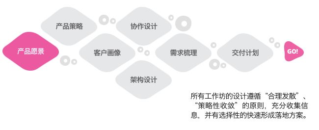

# 产品

## 职位

* BA（业务分析师）。BA 与产品经理的作用是类似的，即将想法整理出需要列表，它可以是 Excel 的形式，也可以是高大上的看板
* UX（用户体验设计师）。设计符合用户交互行为的草图，并细致化出线框图
* 想法的落地过程，称为 Inception。 Inception 是通过业务和技术部门的互动协作、结合产品策略、体验设计、技术架构、交付计划的敏捷软件交付项目启动实践。

## 功能

* 创造价值
* 娱乐

## 用户

* 用户的忍耐度与需求度，迭代很快

## 板块

* 内容
* 社交
* 网购
* 游戏

## 工具

反人性

## 抖音(tiktok)

刷抖音上瘾，其实是因为它用一些大大小小的交互细节，可以让你大脑中的多巴胺激增，出现“行为上瘾”。行为上瘾跟物质上瘾（比如药物及毒品上瘾等）的生理机制是相似的，他们都是刺激大脑中的同一个区域出现的结果。

关于行为上瘾的著作《欲罢不能：刷屏时代如何摆脱行为上瘾》一书中，他列举了六项行为上瘾的构成要素，分别是：

* 诱人的目标,给予逐渐升级的挑战
* 无法抵挡且无法预知的积极反馈
* 让人毫不费力就感觉到进步
* 未完成的紧张感，是源自于人类大脑连线需要“闭合”的渴望，这种渴望在心理学里叫“蔡格尼克效应”。这个效应的要点是，当一个人着手一件事情的时候，会产生出一套倾向于实现的紧张系统，完成任务就意味着解决紧张系统，而如果任务没有完成，紧张状态将持续保持。
* 渐进改善的感觉
* 越来越困难的任务
* 需要解决却暂未解决的紧张感
* 强大的社会联系，社交
* 节目只会给你  你想要的

## IP

* 奢侈品
    - 因为这类产品制造出来，本身是没有任何技术含量的，它的价格是由铺天盖地的广告、一年几度的秀场……是由深入人心的“IP”决定。
    - 一个长期在大城市生活的女孩子，对动辄上万LV包包的价格，是认可的
    - 而对于一个乡下女孩，LV包无非是漂亮一点罢了，上万的价格是远远不值的。 因为，她没有经受过城市里“品牌”的熏陶，她对美的理解，也没有被任何时尚观念影响过，引导过，驯化过。
    - “IP”的价值，是依靠在人们心底的投影，用流行的词来讲，就是“卖情怀”。

## 需求

* 向少年卖希望，向女人卖青春，向男人卖壮阳，向老人卖健康，以及向中产阶级兜售焦虑

## 职能

* 让每个人把重点放在结果而不是产出上
    * 确定需要满足的要求；
    * 通过基于结果的目标来定义成功；
    * 建立和维护路线图，用以指导当下以及未来需要满足哪些方面的需求。
* 建立和维护共通的理解
    - 有必要在客户、利益相关者和交付团队之间进行澄清；
    - 通过积压项目、验收标准、示例、模型和讨论来描述解决方案。
* 确保要做出决定
    - 优先考虑满足哪些需求（从全局角度来看）
    - 优先考虑哪些解决方案（从局部角度来看）

## 现实

* 我们的悲欢不相通，我们的趣味也不再相通：注意力已经成为一种稀缺商业资源的当下，精心设计的内容分发算法似乎赋予了我们巨大的「自由选择权」：从找到感兴趣的领域，到屏蔽异己的声音，都变得轻而易举。
* 即便大家都在使用抖音这款产品，但是所接收到的内容却大相径庭。在用户无意识浏览的行为之下，每个人都只能触及到这款应用的一部分、甚至一小部分内容。这背后，其实潜在的就是一种千人千面的内容推荐系统。
* 内容推荐
    - Facebook、Twitter和微博也同样存在推荐机制。但是，它们的推荐机制更多基于粉丝与粉丝之间的人际圈，即通过“我关注的人的兴趣就是我的兴趣”不断扩大关注网络。
    - 抖音的内容分发模式是「去中心化」：算法根据用户行为，愈加精准地推荐用户会感兴趣的内容。每个刚关注抖音的人，会被投放到一个资源池中，随着用户行为（点赞、关注等）偏好的产生，继而被算法继续投放进一个更大的资源池。
    - 所有你看到的内容，基本都是由你过去发生的行为所决定的。
    - 这套去中心化的内容分发模式，能够让内容推荐越来越精准。但同时，内容的广度却难以保证，从而导致你看到的内容面越来越窄——你永远只能看到自己已有兴趣圈层中的内容，并且越陷越深。
* 在「我的互联网」上，我看到的观点，皆是自己观点的回声，并认为整个世界就是这样。将导致：一方面，信息来源愈发闭塞；另一方面，则是鄙视链的出现。
* 群体之间又会在无意识中出现「极化效应」。兴趣部落会自发形成一定的审美共识，这套共识在群体的作用下不断偏激化，使黑白界限分明。比如，粉丝团之间的不定期骂战；豆瓣上的恶意打分；弹幕上的毒舌嘴炮。可问题是，站在鄙视链两端的人，可能并不完全了解对方的领域。
* 审美层面的固化，即人们会对兴趣范畴之外的作品、话题表现得冷漠且无知。 但深层次而言，这种现象也正使资讯的严肃性被消解，公共话语空间被侵蚀。
* 个性化的信息推荐机制，却在减少这种共同经验——人们难以听到不同的声音，更开始逐渐对重要的公共议题失敏。
* 主社会的健康发展应当具备两个条件。
    * 第一，人们对信息的接触是不期而遇的。也就是说，人们能够有机会阅读一些计划之外的内容，而不是只看到他们想看的。
    * 第二，大部分公民应当拥有一定程度的共同经验，对有普遍价值的公共话题有所了解。
+ 在大众化媒体的娱乐属性下，人们本能偏爱那些能赋予感官刺激的内容。但是，利用无意识行为揣测用户需求，对用户来说，是不公平的。

## 设计

* 动机
    - APP水平
    - 屏幕水平
* 能力
    - 时间
    - 金钱
    - 认知要求（精神付出）
    - 物理要求（物理付出）
    - 社会偏差
    - 非常规
* 触发
    - 内在触发：从一个APP中不断获得好的体验
    - 外在触发
        + 邮件
        + 推送
        + 短信
        + 指示/提醒
* 奖励
    - 金钱激励
    - 有形物质激励
    - 积分制度激励
    - 社交激励

## 参考

* [Next](http://next.36kr.com/posts)
