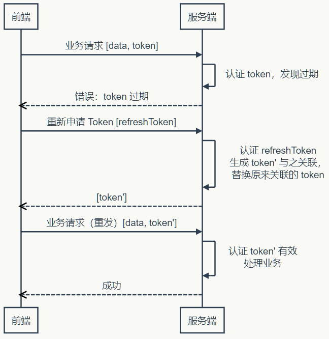

# 客户端

移动端的ios/安卓早就式微了，但是并不代表死了。只是所有公司都意识到，没必要上原生开发了。知道养安卓/ios/web三个团队多浪费钱嘛，就那么点的用户量和难度，创业期直接all in小程序就行了；等做大了再上安卓/ios，而且也不用全上，30%的native+70%hybrid用户根本看不出差异，而且成本和效率不知道强了多少。

## TOKEN

网站应用一般使用Session进行登录用户信息的存储及验证，而在移动端使用Token则更加普遍.Token比较像是一个更加精简的自定义的Session。Session的主要功能是保持会话信息，而Token则只用于登录用户的身份鉴权

* Token 完全由应用管理，所以它可以避开同源策略
* Token 可以避免 CSRF 攻击
* Token 可以是无状态的，可以在多个服务间共享
* 从安全的角度考虑，还是从吊销的角度考虑，Token 都需要设有效期（坚持一周就好）：解决在操作过程不能让用户感到 Token 失效这个问题
    - 在服务器端保存 Token 状态，用户每次操作都会自动刷新（推迟） Token 的过期时间——Session 就是采用这种策略来保持用户登录状态的.每秒种可能发起很多次请求，每次都去刷新过期时间会产生非常大的代价。Token 的过期时保存在缓存或者内存中
    - 使用 Refresh Token，它可以避免频繁的读写操作.一旦 Token 过期，就反馈给前端，前端使用 Refresh Token 申请一个全新 Token 继续使用

### 流程

* 客户端通过登录请求提交用户名和密码，服务端验证通过后生成一个Token与该用户进行关联，并将Token返回给客户端（Token 在服务端持久化比如存入数据库，那它就是一个永久的身份令牌）
* 客户端在接下来的请求中都会携带Token，服务端通过解析Token检查登录状态
* 服务器端采用filter过滤器校验。校验成功则返回请求数据，校验失败则返回错误码
* 当用户退出登录、其他终端登录同一账号（被顶号）、长时间未进行操作时Token会失效，这时用户需要重新登录




Redis是一个Key-Value结构的内存数据库，用它维护User Id和Token的映射表会比传统数据库速度更快

```
code
```

## Vue.js vs Angular vs React

* Vue.js只会在 Web前端中占据主导地位
* React则可以在所有的前端领域中盛行。
    - GraphQL在未来将有很大可能替代 REST

## 参考

- [Tencent/VasSonic](https://github.com/Tencent/VasSonic)a lightweight and high-performance Hybrid framework developed by tencent VAS team, which is intended to speed up the first screen of websites working on Android and iOS platform.
- [Bilibili/ijkplayer](https://github.com/Bilibili/ijkplayer)Android/iOS video player based on FFmpeg n3.3, with MediaCodec, VideoToolbox support.
- [airbnb/lottie-android](https://github.com/airbnb/lottie-android):Render After Effects animations natively on Android and iOS, Web, and React Native http://airbnb.io/lottie/
- [airbnb/lottie-ios](https://github.com/airbnb/lottie-ios):An iOS library to natively render After Effects vector animations http://airbnb.io/lottie/

## css

* [imochen/hotcss](https://github.com/imochen/hotcss):移动端布局终极解决方案 --- 让移动端布局开发更加容易 http://imochen.github.io/hotcss/

## 测试

* [wix/detox](https://github.com/wix/detox):Gray Box End-to-End Testing and Automation Framework for Mobile Apps

# 博客

* [zwwill/blog](https://github.com/zwwill/blog):✏️ stay hungry stay foolish


## 工具

* [fastlane/fastlane](https://github.com/fastlane/fastlane):🚀 The easiest way to automate building and releasing your iOS and Android apps https://fastlane.tools
* [NervJS/taro](https://github.com/NervJS/taro):多端统一开发框架，支持用 React 的开发方式编写一次代码，生成能运行在微信小程序、H5、React Native 等的应用。 https://taro.aotu.io
* [expo/expo](https://github.com/expo/expo):Expo iOS/Android Client https://docs.expo.io/
* [jiahaog/nativefier](https://github.com/jiahaog/nativefier):Make any web page a desktop application
* [appium/appium](https://github.com/appium/appium):📱 Automation for iOS, Android, and Windows Apps. http://appium.io/
* [visionmedia/page.js](https://github.com/visionmedia/page.js):Micro client-side router inspired by the Express router http://visionmedia.github.com/page.js
* [boxwarehq/cli](https://github.com/boxwarehq/cli):Try and use desktop software in your browser without downloading/installing anything. https://boxware.io
