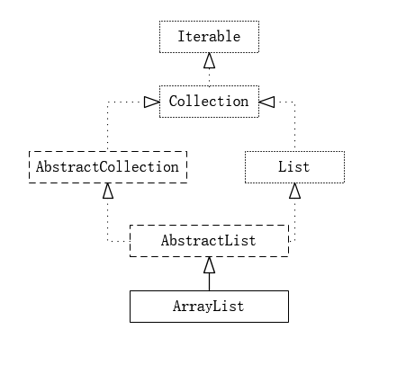

# 面向对象程序设计语言(OOP)

* 最重要的思想:代码重用
* 所有的对象都是通过类来描绘
* 越抽象、越顶层、越脱离具体某一实现的设计，越能提高代码的灵活性，越能应对未来的需求变化。好的代码设计，不仅能应对当下的需求，而且在将来需求发生变化的时候，仍然能够在不破坏原有代码设计的情况下灵活应对。
* 目的：提高代码的可读性、可扩展性、复用性、可维护性
* 时刻具备扩展意识、抽象意识、封装意识

### 封装（Encapsulation）

* 目的:将信息隐藏,包括隐藏数据、实现细节，设计细节以及对象的类型等
* 分类
    - 结构封装：数据 类型
    - 业务封装 实现 多态
* 实现
    - 使得对象内部的变化对其他对象而言是不可见的，对象对其自己的行为负责，使得对象之间的耦合变得松散
    - 对象之间只通过暴露API接口来通信，修改一个对象时，可以随意地修改它的内部实现，只要对外的接口没有变化，就不会影响到程序的其它功能
* 把系统中稳定不变的部分和容易变化的部分隔离开来，在系统的演变过程中，只需要替换那些容易变化的部分

### 继承（Inheritance）

* 功能
    - 表示 is-a 关系
    - 支持多态特性
    - 代码复用（组合也可以实现）
* 缺点
    - 过度使用继承，继承层次过深过复杂，就会导致代码可读性、可维护性变差

## 抽象（Abstraction）

* 构造出一个固定的一组行为的抽象描述，这组行为却能够有任意个可能的具体实现方式
    - 用来表征对问题领域进行分析、设计中得出的抽象概念，是对一系列看上去不同，但是本质上相同的具体概念的抽象
    - 领域没有对应的具体概念，所以用以表征抽象概念的抽象类是不能够实例化
* 作用
    - 类型隐藏
* 实现
    - 借助接口类或者抽象类语法机制
    - 作为一种只关注功能点不关注实现的设计思路，在定义类的方法的时候，要有抽象思维，不要在方法定义中，暴露太多的实现细节，以保证在某个时间点需要改变方法的实现逻辑的时候，不用去修改其定义

### 多态（Polymorphism）

* polymorphism (from Greek πολύς, polys, "many, much" and μορφή, morphē, "form, shape") is the provision of a single interface to entities of different types. A polymorphic type is one whose operations can also be applied to values of some other type, or types.
* 对一个操作（接口）使用多种数据类型
* 条件
    - 支持父类对象可以引用子类对象
        + 实现与声明绑定
        + 实例化实现类
    - 支持继承
    - 子类可以重写父类中的方法
* 思想: 将"做什么"和"谁去做以及怎么去做"分离开来，也就是将"不变的事"和"可变的事物"分离开来
* 实现：
    - 通过接口类实现
    - duck-typing：只要定义了相同的方法
* 作用
    - 消除类型之间的耦合关系
    - 提高代码的可扩展性和复用性

## OOA vs OOP

* 面向过程风格的代码被组织成了一组方法集合及其数据结构（struct User），方法和数据结构的定义是分开的
    - 开发的微小程序，或者是一个数据处理相关的代码，以算法为主，数据为辅，那脚本式的面向过程的编程风格就更适合一些
* 面向对象风格的代码被组织成一组类，方法和数据结构被绑定一起，定义在类中
    - 先去思考如何给业务建模，如何将需求翻译为类，如何给类之间建立交互关系，而完成这些工作完全不需要考虑错综复杂的处理流程
    - 有了类的设计之后，然后再像搭积木一样，按照处理流程，将类组装起来形成整个程序
    - 提供了一种更加清晰的、更加模块化的代码组织方式
* 面向过程编程是面向对象编程的基础，面向对象编程离不开基础的面向过程编程
* 最终的目的还是写出易维护、易读、易复用、易扩展的高质量代码

## 分层

* 通过规定好的接口进行交互，每一层其实对它的上层或下层都是一个黑盒，不关心它内部的实现，只关心它们之间进行交互的接口，接口是规定的信息，要给到什么都是规定好的。
* 优点
    - 可以对任何一层进行独立升级、优化，只要保持接口不变那么这个模型整体就不会有问题，比如说物理层从以太网线到光纤，网络速度大大提高，但是整个技术革新的时候，其他层是没有做更多工作的，工作只在物理层完成
* MVC：M 表示 Model，V 表示 View，C 表示 Controller
* 前后端
    - UserEntity 和 UserRepository 组成了数据访问层 负责数据读写
    - UserBo（Business Object）和 UserService 组成了业务逻辑层 负责核心业务逻辑
        + Service 类主要职责
            * 负责与 Repository 交流：不用BO 与 Repository 打交道，因为想保持领域模型的独立性，不与任何其他层的代码（Repository 层的代码）或开发框架（比如 Spring、MyBatis）耦合在一起，将流程性的代码逻辑（比如从 DB 中取数据、映射数据）与领域模型的业务逻辑解耦，让领域模型更加可复用。
            * 负责跨领域模型的业务聚合功能
            * 负责一些非功能性及与三方系统交互的工作。比如幂等、事务、发邮件、发消息、记录日志、调用其他系统的 RPC 接口等
    - UserVo（View Object） 和 UserController 属于接口层 负责暴露接口给前端调用
        + VO 是一种 DTO（Data Transfer Object，数据传输对象）。它主要是作为接口的数据传输承载体，将数据发送给其他系统。从功能上来讲，它理应不包含业务逻辑、只包含数据
    - VO、BO、Entity 中只会定义数据，不会定义方法，所有操作这些数据的业务逻辑都定义在对应的 Controller 类、Service 类、Repository 类中
* 贫血模型（Anemic Domain Model）:像 UserBo 这样，只包含数据，不包含业务逻辑的类
* 充血模型（Rich Domain Model）:数据和对应的业务逻辑被封装到同一个类中
* DDD 领域驱动设计:指导如何解耦业务系统，划分业务模块，定义业务领域模型及其交互
    - Service 层包含 Service 类和 Domain 类两部分。Domain 就相当于贫血模型中的 BO。不过，Domain 与 BO 的区别在于它是基于充血模型开发的，既包含数据，也包含业务逻辑。而 Service 类变得非常单薄。
    - 基于贫血模型的传统的开发模式，重 Service 轻 BO；基于充血模型的 DDD 开发模式，轻 Service 重 Domain
    - 充血在哪个层次
    - Bo:可以在更小颗粒度层面上进行封装与添加复杂逻辑
    - Controller 层主要负责接口的暴露，Repository 层主要负责与数据库打交道，这两层包含的业务逻辑并不多,不需要做充血模型
* 平时的开发，大部分都是 SQL 驱动（SQL-Driven）的开发模式.业务逻辑包裹在一个大的 SQL 语句中，而 Service 层可以做的事情很少

```java

////////// Controller+VO(View Object) //////////
public class UserController {
  private UserService userService; //通过构造函数或者IOC框架注入

  public UserVo getUserById(Long userId) {
    UserBo userBo = userService.getUserById(userId);
    UserVo userVo = [...convert userBo to userVo...];
    return userVo;
  }
}

public class UserVo {//省略其他属性、get/set/construct方法
  private Long id;
  private String name;
  private String cellphone;
}

////////// Service+BO(Business Object) //////////
public class UserService {
  private UserRepository userRepository; //通过构造函数或者IOC框架注入

  public UserBo getUserById(Long userId) {
    UserEntity userEntity = userRepository.getUserById(userId);
    UserBo userBo = [...convert userEntity to userBo...];
    return userBo;
  }
}

public class UserBo {//省略其他属性、get/set/construct方法
  private Long id;
  private String name;
  private String cellphone;
}

////////// Repository+Entity //////////
public class UserRepository {
  public UserEntity getUserById(Long userId) { //... }
}

public class UserEntity {//省略其他属性、get/set/construct方法
  private Long id;
  private String name;
  private String cellphone;
}
```

### 抽象类 vs 接口

* 抽象类
    - 特点
        + 不允许被实例化，只能被继承。
        + 继承抽象类，必须实现抽象类中的所有抽象方法
        + 抽象类可以包含属性和方法。方法既可以包含代码实现，也可以不包含代码实现，不包含代码实现的方法叫作抽象方法
    - 用处
        + 也可代码复用，相比父类继承用空方法代替抽象方法
            * 影响代码的可读性
            * 忘记实现，编译器报错
            * 空方法被误用
        + 一种自下而上的设计思路，先有子类的代码重复，然后再抽象成上层的父类
* 接口
    - 特点
        + 接口不能包含属性（也就是成员变量）
        + 接口只能声明方法，方法不能包含代码实现
        + 类实现接口的时候，必须实现接口中声明的所有方法
        + 实现多个interface
    - 用处
        + 解耦：对行为的一种抽象，相当于一组协议或者契约。调用者只需要关注抽象的接口，不需要了解具体的实现，具体的实现代码对调用者透明。接口实现了约定和实现相分离，可以降低代码间的耦合性，提高代码的可扩展性。
        + 一种自上而下的设计思路。在编程的时候，一般都是先设计接口，再去考虑具体的实现
    - 定义中，方法不能拥有默认行为，为了绕过这个限制，必须使用委托，但是这会增加一些复杂性，有时会造成很大的麻烦
    - interface中不能定义默认行为还存在另一个比较严重的问题，那就是可能会造成维护上的麻烦。因为如果后来想修改类的界面（一般通过abstract class或者interface来表示）以适应新的情况（比如，添加新的方法或者给已用的方法中添加新的参数）时，就会非常的麻烦，可能要花费很多的时间（对于派生类很多的情况，尤为如此）。但是如果界面是通过abstract class来实现的，那么可能就只需要修改定义在abstract class中的默认行为就可以了。
    - 如果不能在抽象类中定义默认行为，就会导致同样的方法实现出现在该抽象类的每一个派生类中，违反了"one rule，one place"原则，造成代码重复，同样不利于以后的维护
* 场景
    - 抽象类：表示一种 is-a 的关系，并且是为了解决代码复用的问题
    - 接口：表示一种 has-a 关系，表示具有某一组行为特性 并且是为了解决抽象（抽象类型的共性）而非代码复用的问题
    - 在使用抽象类的场合，不要忽视通过接口定义行为模型的原则

* 抽象类和接口都不能直接实例化，如果要实例化，抽象类变量必须指向实现所有抽象方法的子类对象，接口变量必须指向实现所有接口方法的类对象。
* 接口里定义的变量只能是公共的静态的常量，抽象类中的变量是普通变量。
* 抽象类里的抽象方法必须全部被子类所实现，如果子类不能全部实现父类抽象方法，那么该子类只能是抽象类。同样，一个实现接口的时候，如不能全部实现接口方法，那么该类也只能为抽象类
* 抽象方法要被实现，所以不能是静态的，也不能是私有的

功能          | 抽象类                                                   | 接口
----------- | ----------------------------------------------------- | -----------------------------------------
默认的方法实现     | 可以有默认的方法实现                                            | 接口完全是抽象的。它根本不存在方法的实现
实现          | 子类使用extends关键字来继承抽象类。如果子类不是抽象类的话，它需要提供抽象类中所有声明的方法的实现。 | 子类使用关键字implements来实现接口。它需要提供接口中所有声明的方法的实现
构造器         | 抽象类可以有构造器                                             | 接口不能有构造器
与正常Java类的区别 | 除了你不能实例化抽象类之外，它和普通Java类没有任何区别                         | 接口是完全不同的类型
访问修饰符       | 抽象方法可以有public、protected和default这些修饰符                  | 接口方法默认修饰符是public。你不可以使用其它修饰符。
main方法      | 抽象方法可以有main方法并且我们可以运行它                                | 接口没有main方法，因此我们不能运行它。
多继承         | 抽象方法可以继承一个类和实现多个接口                                    | 接口只可以继承一个或多个其它接口
速度          | 它比接口速度要快                                              | 接口是稍微有点慢的，因为它需要时间去寻找在类中实现的方法。
添加新方法       | 如果你往抽象类中添加新的方法，你可以给它提供默认的实现。因此你不需要改变你现在的代码。           | 如果你往接口中添加方法，那么你必须改变实现该接口的类。

实例： 

```java
abstract class Door {
    abstract void open();
    abstract void close()；
}

interface Alarm {
    void alarm();
}

class AlarmDoor extends Door implements Alarm {
    void open() { … }
    void close() { … }
    void alarm() { … }
}
```

## 基于接口而非实现编程

* 另一个表述方式、是“基于抽象而非实现编程”
* “接口”在不同的应用场景下会有不同的解读，比如服务端与客户端之间的“接口”，类库提供的“接口”，甚至是一组通信的协议都可以叫作“接口”。
* 实现
    - 函数的命名不能暴露任何实现细节
    - 封装具体的实现细节
    - 为实现类定义抽象的接口
* 只要搞清楚了每条原则是为了解决什么样的问题而产生的
* 接口继承要远重要于类继承
    - 一种控制反转:通过抽象出一系列接口，并在这些接口上进行操作，使得控制逻辑不依赖于具体的实现
    - 具体的实现可以并不关心控制逻辑如何使用自己，它们会在需要的时候被调用。由此，使用对象的逻辑和对象本身充分解耦，由接口这座桥梁将二者联系起来。这样，代码得到了最大程度的被重用。
    - Liskov substitution principle（里氏变换原则）:if S is a subtype of T, then objects of type T may be replaced with objects of type S

## 组合优于继承

* 继承为实现不同功能，通过不断继承的方法赵成继承层次过深、继承关系过于复杂，会影响到代码的可读性和可维护性
    - 依赖于抽象类来定义行为，导致过于复杂的继承关系，而通过接口定义行为能够有效地分离行为与实现
* 通过组合、接口、委托三个技术手段可以替换掉继承,代码复用可以通过组合和委托来实现
* 组合可以通过注入实现
* 判断
    - 继承改写成组合意味着要做更细粒度的类的拆分
    - 如果类之间的继承结构稳定（不会轻易改变），继承层次比较浅（比如，最多有两层继承关系），继承关系不复杂，就可以大胆地使用继承
    - 系统越不稳定，继承层次很深，继承关系复杂，就尽量使用组合来替代继承。

```java
public interface Flyable {
    void fly()；
}
public class FlyAbility implements Flyable {
    @Override public void fly() {
        //...
    }
}

public class Ostrich implements Tweetable, EggLayable {//鸵鸟
    private TweetAbility tweetAbility = new TweetAbility(); //组合

    @Override
    public void tweet() {
        tweetAbility.tweet(); // 委托
    }
```

## 面向对象分析（OOA）

* 要有组件化意识、框架意识、抽象意识，开发出来的东西要足够通用，不能局限于单一的某个业务需求，但这并不代表我们就可以脱离具体的应用场景，闷头拍脑袋做需求分析
* 添加鉴权功能
    - 通过用户名加密码来做认证
    - 借助 OAuth 的验证思路来解决：调用方将请求接口的 URL 跟 AppID、密码拼接在一起，然后进行加密，生成一个 token。调用方在进行接口请求的的时候，将这个 token 及 AppID，随 URL 一块传递给微服务端。微服务端接收到这些数据之后，根据 AppID 从数据库中取出对应的密码，并通过同样的 token 生成算法，生成另外一个 token。用这个新生成的 token 跟调用方传递过来的 token 对比
    - 进一步优化 token 生成算法，引入一个随机变量，让每次接口请求生成的 token 都不一样。将 URL、AppID、密码、时间戳四者进行加密来生成 token。验证当前时间戳跟传递过来的时间戳，是否在一定的时间窗口内（比如一分钟）
    - 像鉴权这样的非业务功能，最好不要与具体的第三方系统有过度的耦合：针对 AppID 和密码的存储，我们最好能灵活地支持各种不同的存储方式，比如 ZooKeeper、本地配置文件、自研配置中心、MySQL、Redis 等

## 面向对象设计（OOD）

* 用接口抽象出类的特性
* 用抽象类来复用代码

* 划分职责进而识别出有哪些类
    - 把需求描述中的名词罗列出来，作为可能的候选类，然后再进行筛选
    - 根据需求描述，把其中涉及的功能点，一个一个罗列出来，然后再去看哪些功能点职责相近，操作同样的属性，可否应该归为同一个类
* 定义类及其属性和方法
* 定义类与类之间的交互关系
    - UML 统一建模语言中定义了六种类之间的关系
        + 泛化（Generalization）:继承关系
        + 实现（Realization）指接口和实现类之间的关系
        + 关联（Association）是一种非常弱的关系，包含聚合、组合两种关系。具体到代码层面，如果 B 类对象是 A 类的成员变量，那 B 类和 A 类就是关联关系。
        + 聚合（Aggregation）是一种包含关系，A 类对象包含 B 类对象，B 类对象的生命周期可以不依赖 A 类对象的生命周期，也就是说可以单独销毁 A 类对象而不影响 B 对象。比如课程与学生之间的关系
        + 组合（Composition）也是一种包含关系。A 类对象包含 B 类对象，B 类对象的生命周期跟依赖 A 类对象的生命周期，B 类对象不可单独存在，比如鸟与翅膀之间的关系
        + 依赖（Dependency）是一种比关联关系更加弱的关系，包含关联关系。不管是 B 类对象是 A 类对象的成员变量，还是 A 类的方法使用 B 类对象作为参数或者返回值、局部变量，只要 B 类对象和 A 类对象有任何使用关系
* 将类组装起来并提供执行入口。

## 单一职责原则 SRP Single Responsibility Principle

* 概念：A class or module should have a single reponsibility
* 不要设计大而全的类，要设计粒度小、功能单一的类
* 不同的应用场景、不同阶段的需求背景下，对同一个类的职责是否单一的判定，可能都是不一样的。
* 持续重构：可以先写一个粗粒度的类，满足业务需求。随着业务的发展，如果粗粒度的类越来越庞大，代码越来越多，这个时候，就可以将这个粗粒度的类，拆分成几个更细粒度的类
* 判断原则
    - 类中的代码行数、函数或属性过多，会影响代码的可读性和可维护性，就需要考虑对类进行拆分。行数最好不能超过 200 行，函数个数及属性个数都最好不要超过 10 个
    - 类依赖的其他类过多，或者依赖类的其他类过多，不符合高内聚、低耦合的设计思想，就需要考虑对类进行拆分；
    - 私有方法过多，就要考虑能否将私有方法独立到新的类中，设置为 public 方法，供更多的类使用，从而提高代码的复用性；
    - 比较难给类起一个合适名字，很难用一个业务名词概括，或者只能用一些笼统的 Manager、Context 之类的词语来命名，这就说明类的职责定义得可能不够清晰；
    - 类中大量的方法都是集中操作类中的某几个属性，比如，在 UserInfo 例子中，如果一半的方法都是在操作 address 信息，那就可以考虑将这几个属性和对应的方法拆分出来。

## 开闭原则 OCP Open Closed Principle

* software entities (modules, classes, functions, etc.) should be open for extension , but closed for modification。
* 只要它没有破坏原有的代码的正常运行，没有破坏原有的单元测试
* 代码的扩展性问题，是判断一段代码是否易扩展的“金标准”
    - 一些比较确定的、短期内可能就会扩展，或者需求改动对代码结构影响比较大的情况，或者实现成本不高的扩展点，在编写代码的时候之后，就可以事先做些扩展性设计
    - 可变部分封装起来，隔离变化，提供抽象化的不可变接口，给上层系统使用
* 需要在扩展性和可读性之间做权衡

## 里式替换原则 LSP Liskov Substitution Principle

* If S is a subtype of T, then objects of type T may be replaced with objects of type S, without breaking the program。
* 子类对象（object of subtype/derived class）能够替换程序（program）中父类对象（object of base/parent class）出现的任何地方，并且保证原来程序的逻辑行为（behavior）不变及正确性不被破坏。
* 多态和里式替换有点类似，但它们关注的角度是不一样的
    - 多态是面向对象编程的一大特性，也是面向对象编程语言的一种语法。它是一种代码实现的思路。
    - 里式替换是一种设计原则，是用来指导继承关系中子类该如何设计的，子类的设计要保证在替换父类的时候，不改变原有程序的逻辑以及不破坏原有程序的正确性。
* Design By Contract：按照协议来设计
    - 父类定义了函数的行为约定，那子类可以改变函数的内部实现逻辑，但不能改变函数原有的行为约定。这里的行为约定包括
        + 函数声明要实现的功能
        + 对输入、输出、异常的约定
        + 甚至包括注释中所罗列的任何特殊说明

## 接口隔离原则 ISP Interface Segregation Principle

* Clients should not be forced to depend upon interfaces that they do not use。
* 接口概念
    - 一组 API 接口集合:如果部分接口只被部分调用者使用，那就需要将这部分接口隔离出来，单独给对应的调用者使用，而不是强迫其他调用者也依赖这部分不会被用到的接口
    - 单个 API 接口或函数:函数的设计要功能单一，不要将多个不同的功能逻辑在一个函数中实现
    - OOP 中的接口概念:接口的设计要尽量单一，不要让接口的实现类和调用者，依赖不需要的接口函数
        + 职责单一就意味了通用、复用性好 更加灵活
* 接口隔离原则与单一职责原则的区别
    - 单一职责原则针对的是模块、类、接口的设计
    - 接口隔离原则相对于单一职责原则
        + 一方面更侧重于接口的设计
        + 另一方面它的思考角度也是不同的。接口隔离原则提供了一种判断接口的职责是否单一的标准：通过调用者如何使用接口来间接地判定。如果调用者只使用部分接口或接口的部分功能，那接口的设计就不够职责单一。

## 参考
