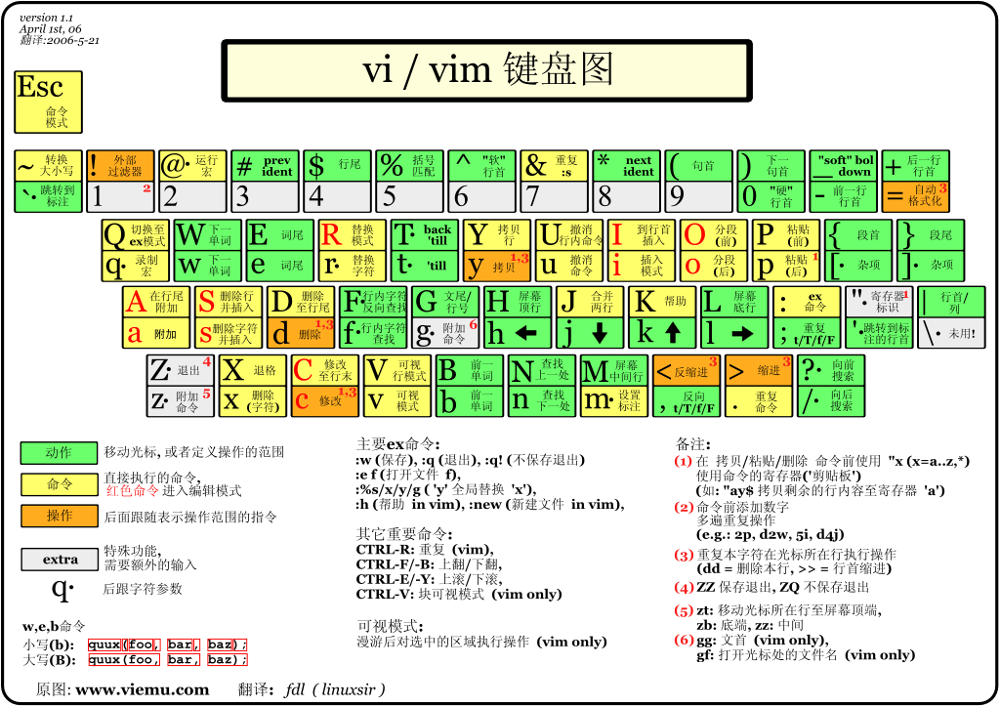
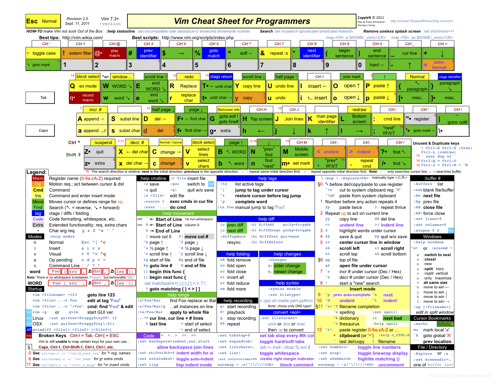
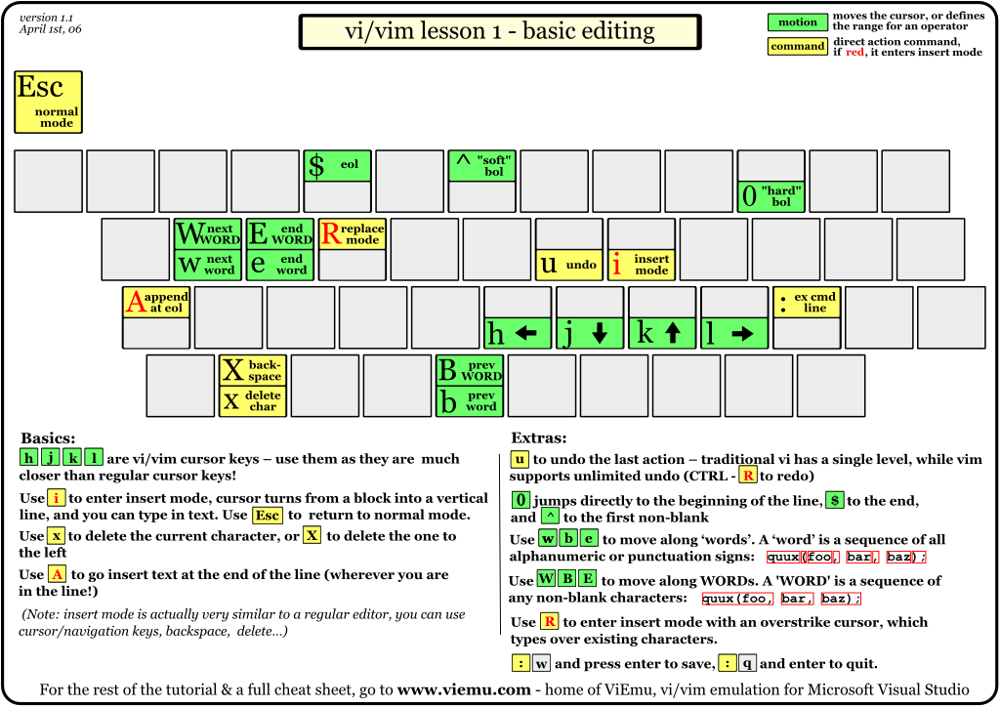
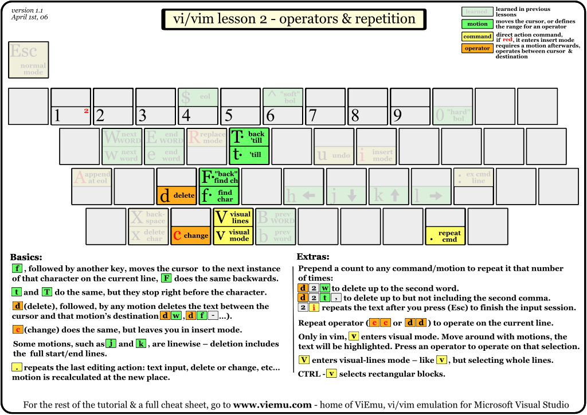
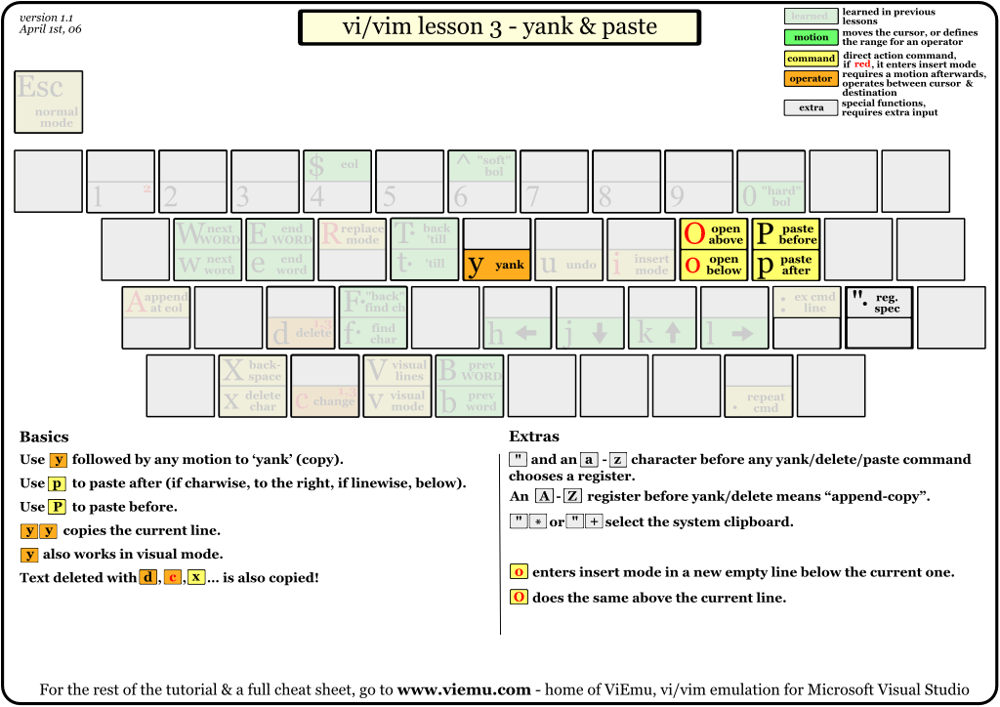
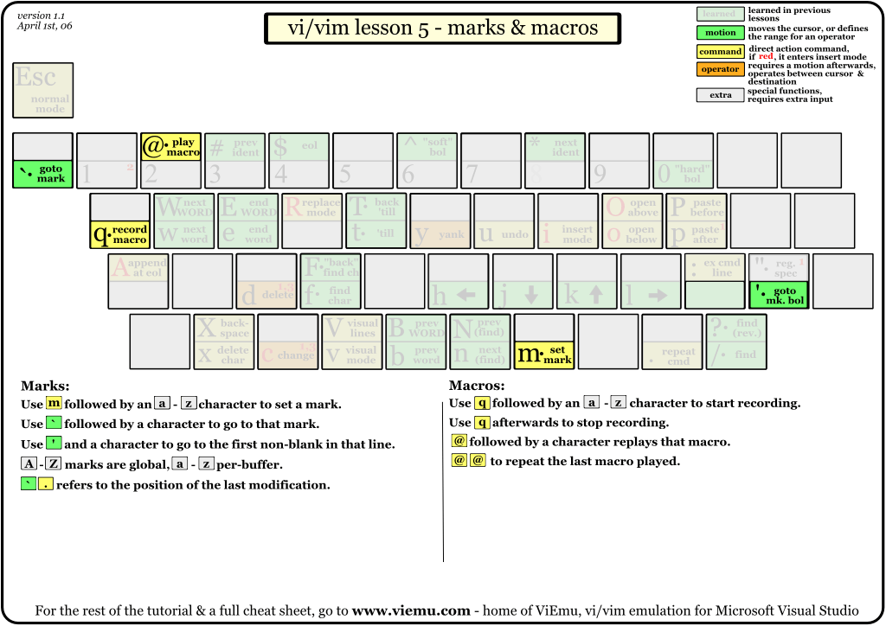
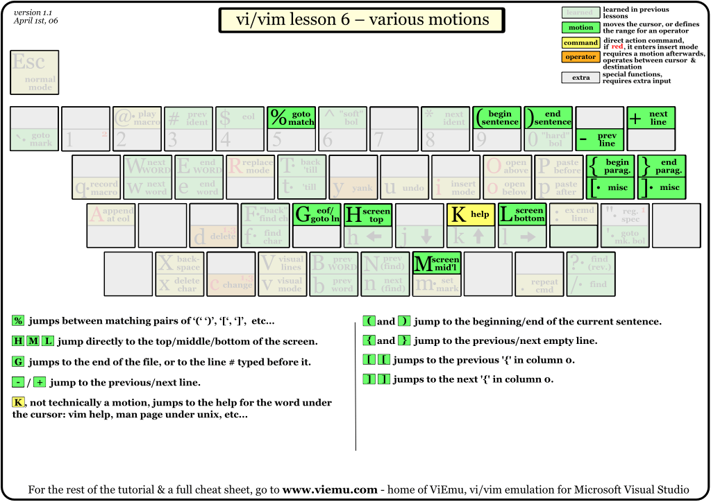
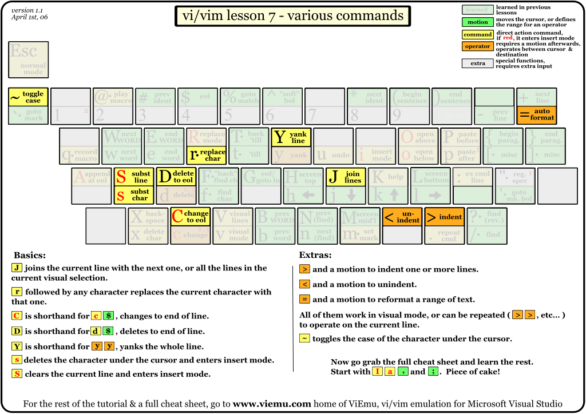

# [vim](https://github.com/vim/vim)

The official Vim repository http://www.vim.org

* 内置于任何类Unix系统上，直接编辑文件
* 与大多数文本编辑器和IDE相比，轻量级，即使在性能较弱硬件上运行速度快且高效
* 完全由键盘驱动，更有效率

## 安装

```sh
brew install vim
```

## 配置

* 全局配置：`/etc/vim/vimrc` `/etc/vimrc`
* 用户配置：`~/.vimrc`
* 选项
    - all 列出所有选项设置情况
    - term 设置终端类型
    - :set number|nu|nonumber|nonu
    - :set number? 查询某个配置项是打开还是关闭 number|nonumber
    - :set ignorecase|noignorecase　　[不]忽略大小写的查找
    - :set [no]hlsearch 高亮搜索结果，所有结果都高亮显示，而不是只显示一个匹配 关闭高亮搜索显示
    - :set incsearch 逐步搜索模式，对当前键入的字符进行搜索而不必等待键入完成
    - :set wrapscan 重新搜索，在搜索到文件头或尾时，返回继续搜索，默认开启
    - :scriptnames　　查看vim脚本文件的位置，比如.vimrc文件，语法文件及plugin等
    - :set relativenumber 显示相对行号
    - :set list 显示非打印字符，如tab，空格，行尾等。如果tab无法显示，请确定用set lcs=tab:>-命令设置了.vimrc文件，并确保你的文件中的确有tab，如果开启了expendtab，那么tab将被扩展为空格
    - report 显示由面向行的命令修改过的数目
    - terse 显示简短的警告信息
    - warn 在转到别的文件时若没保存当前文件则显示NO write信息
    - nomagic 允许在搜索模式中，使用前面不带“/”的特殊字符
    - nowrapscan 禁止vi在搜索到达文件两端时，又从另一端开始
    - mesg 允许vi显示其他用户用write写到自己终端上的信息
* [SpaceVim/SpaceVim](https://github.com/SpaceVim/SpaceVim):A community-driven modular vim distribution - The ultimate vim configuration https://spacevim.org
* [qvacua/vimr](https://github.com/qvacua/vimr):VimR — Neovim GUI for macOS http://vimr.org
* [amix/vimrc](https://github.com/amix/vimrc):The ultimate Vim configuration: vimrc
* [Valloric/YouCompleteMe](https://github.com/Valloric/YouCompleteMe):A code-completion engine for Vim http://valloric.github.io/YouCompleteMe/
* [philc/vimium](https://github.com/philc/vimium):The hacker's browser.
* [tpope/vim-pathogen](https://github.com/tpope/vim-pathogen):pathogen.vim: manage your runtimepath
* [square/maximum-awesome](https://github.com/square/maximum-awesome):Config files for vim and tmux.
* [macvim-dev/macvim](https://github.com/macvim-dev/macvim)
* [b4winckler/macvim](https://github.com/b4winckler/macvim) Vim - the text editor - for Mac OS X
* [ericzhang-cn/maximum-awesome-linux](https://github.com/ericzhang-cn/maximum-awesome-linux):Config files for vim and tmux.
    - ,d brings up NERDTree, a sidebar buffer for navigating and manipulating files
    - ,t brings up ctrlp.vim, a project file filter for easily opening specific files
* [avelino/vim-bootstrap](https://github.com/avelino/vim-bootstrap):Vim Bootstrap is generator provides a simple method of generating a .vimrc configuration for vim https://vim-bootstrap.com/
* [lexVim](https://github.com/lexkong/lexVim): `./start_vim.sh`
    - gd 或者ctrl + ] 跳转到对应的函数定义处
    - ctrl + t 标签退栈
    - ctrl + o 跳转到前一个位置
    - <F4> 最近文件列表
    - <F5> 在 Vim 的上面打开文件查找窗口
    - <F9> 生成供函数跳转的 tag
    - <F2> 打开目录窗口，再按会关闭目录窗口
    - <F6> 添加函数注释
* [VundleVim/Vundle.vim](https://github.com/VundleVim/Vundle.vim):Vundle, the plug-in manager for Vim http://github.com/VundleVim/Vundle.Vim

```sh
curl -sLf https://spacevim.org/install.sh | bash

# Not an editor command: ^M
:set fileformat=unix :w
```

## 操作

* Ctrl-λ 写成 <C-λ>
* `:` 开始命令需要输入 <enter> 回车
* `N<command>` 重复某个命令N次,命令都可以配合数字使用.Esc是必须的，否则命令不生效
* `.` 重复前一次命令
* `;` 重复上一次f查找操作
* `.` 重复上一次修改操作，跟;经常用来实现一些简单重复操作
* `;.,` 重复操作
* History  以:和/开头命令都有历史纪录，可以首先键入:或/然后按上下箭头来选择某个历史命令
* 命令类型
    - action
    - position
    - object





## Insert

* 左下角显示`--INSERT--`,按 Esc 或 Ctrl+[ 进入, 左下角显示文件名或为空, 可以移动光标、删除字符等
* 普通模式下，输入 : 即可进入
* Ctrl+u：删除输入方式下所输入文本

* :E Opens explorer for locating files and directories 浏览目录
    - `–` 到上级目录
    - `D` 删除文件（大写）
    - `R` 改文件名（大写）
    - `s` 对文件排序（小写）
    - `x` 执行文件
    - :cd <dir>  改变当前目录
    - :pwd 查看当前目录
    - :ls 查看缓冲区, 用 :E 浏览打开的文件都没有被关闭，这些文件都在缓冲区中
        + %a 表示当前文件
        + – （非活动的缓冲区）
        + a （当前被激活缓冲区）
        + h （隐藏的缓冲区）
        + % （当前的缓冲区）
        + # （交换缓冲区）
        + = （只读缓冲区）
        + + （已经更改的缓冲区）
    - :buffer 4|:buffer src/http/ngx_http.c 切换
    - :bnext|bn
    - :bprevious|bp
    - :blast|bl
    - :bfirst|bf
* 打开文件
    - `:e ftp://192.168.10.76/abc.txt`
    - `:e \\qadrive\test\1.txt`
    - `:e <path/to/file>`
* :vi|open|o filename 打开或新建文件，并将光标置于第一行首
* vim file1 file2 file3 ... 同时打开多个文件
* :vi +n filename 打开文件，并将光标置于第n行首
* :vi + filename 打开文件，并将光标置于最后一行首
* :vi +/pattern filename 打开文件，并将光标置于第一个与pattern匹配的串处
* :vi -r filename 在上次正用vi编辑时发生系统崩溃，恢复filename
* :vi -o|O filename1 filename2 …  打开多个文件，依次进行编辑

* :close  close current window
* :w 保存文件
* :w vpser.net 保存至文件
* n1,n2 w [filename] 将 n1 到 n2 的内容储存成 filename 这个档案
* `:saveas <path/to/file>` 另存为 `<path/to/file>`
* :q 退出
* :x|wq  保存并退出 (:x 表示仅在需要时保存)
    - :close 最后一个窗口不能使用此命令，可以防止意外退出vim
    - ZZ 保存并退出。关闭所有窗口，只保留当前窗口
* :q! 退出不保存
* :wqa 保存所有文件并退出
* :qa! 强行退出所有正在编辑文件，就算文件有更改
* :e! 放弃所有修改，并打开原来文件
* :r [filename] 读入另一个档案的数据。即将 『filename』 这个档案内容加到游标所在行后面

* A 当前非blank字符行尾并进入insert模式
* I 当前非blank字符行首并进入insert模式
* i 光标前插入
* a 光标后插入 3a！+ ESC:在当前位置后插入3个！
* o 新起一个空白行
* O 当前行之前插入一行
* r 只会取代光标所在的那一个字符一次
* R会一直取代光标所在的文字，直到按下 ESC 为止

* :args 查看当前正在编辑的文件,用[]括起来
* 替换
    - % 匹配括号移动，包括 (, {, [.
    - 用“<”来指定匹配单词开头
    - :s/old/new 用new替换行中首次出现的old
    - :s/old/new/g  用new替换行中所有的old
        + :3,5s/^#//g 解除3-5行的注释
        + :1,$s/^/#/g 注释整个文档
    - :%s/old/new/g 用new替换当前文件里所有的old
    - :n,m?s/old/new/g  用new替换从n到m行里所有的old
    - :n1,n2s/p1/p2/g：将第n1至n2行中所有p1均用p2替代
    - :g/p1/s//p2/g：将文件中所有p1均用p2替换
    - :%s/<four>/4/gc 只想替换注释中的 “four”，而保留代码中
    - :1,$s/word1/word2/g 或 :%s/word1/word2/g 从第一行到最后一行寻找 word1 字符串，并将该字符串取代为 word2
        + :%s/$/sth/ 在行尾追加sth
        + :%s/\^M//g 替换掉dos换行符，\^M使用ctrl+v  + Enter即可输入
        + :%s/#.*//g 删除#之后的字符
    - :%s/^/#/g 注释整个文档
    - :g/\^\s*$/d 删除空行以及只有空格的行
* 查找字符串
    - /text 查找text
    - ?text 向光标之上寻找text
    - n 查找下一个匹配
    - N 查找上一个匹配
    - 2n 查找下面第二个匹配
    - 特殊字符在查找时需要转义　`.*[]^%/?~$`
    - * 和 # 匹配光标当前所在单词，移动光标到下一个（或上一个）匹配单词（*是下一个，#是上一个）
* 执行 shell
    - :!ls 列出当前目录下文件
    - :!perl -c script.pl 检查perl脚本语法，不用退出vim
    - :suspend或Ctrl - Z 挂起回到shell，fg可以返回
    - ：n1,n2 w!command 将文件中n1行至n2行内容作为command输入并执行，若不指定n1，n2，则表示将整个文件内容作为command的输入
    - ：r!command  命令command输出结果放到当前行
* 编辑
    - :n1,n2 m n3 将n1行到n2行之间的内容移至到第n3行下
    - :1,10 co 20 将1-10行插入到第20行之后
    - :1,$ co $ 将整个文件复制一份并添加到文件尾部
    - :n1,n2 d 将n1行到n2行之间的内容删除
* 关键字补全
    - Ctrl +N 搜索目录下的代码，搜索完成了就会出现一个下拉列表
    - Ctrl + P 回到原点，然后可以按上下光标键来选择相应的Word
    - Ctrl + X 和 Ctrl + D 宏定义补齐
    - Ctrl + X 和 Ctrl + ] Tag 补齐
    - Ctrl + X 和 Ctrl + F 文件名 补齐
    - Ctrl + X 和 Ctrl + I 也是关键词补齐，但是关键后会有个文件名，告诉你这个关键词在哪个文件中
    - Ctrl + X 和 Ctrl +V 表达式补齐
    - Ctrl + X 和 Ctrl +L 整个行补齐

## Command mode(默认) 命令模式

* rg 替换当前字符为g
* S 或 cc 删除当前行内容并进入插入模式
* C 删除从当前位置到行尾内容

* 自动提示:输入一个词的开头，然后按 <C-p>或是<C-n>
* ggVG 全选
* u 撤销上一步操作
* U 撤销对当前行所有操作
* Ctrl + r 重做（Redo），即撤销的撤销
* J 合并下一行
* 窗口分屏浏览
    - :He 全称:Hexplore 在下边分屏浏览目录
    - :He! 在上分屏浏览目录
    - :Ve 全称:Vexplore 在左边分屏间浏览目录，要在右边则是 :Ve!
    - 分屏中的文件同步移动: 两个屏中都输入 :set scb( set scrollbind)
    - 需要解开 :set scb!
* :Te 全称:Texplorer Tab页浏览目录
    - :tabs 查看打开窗口和Tab情况
    - gt 到下一个页
    - gT 到前一个页
    - {i} gt i是数字，到指定页
    - :tabclose [i] 如果后面指定了数字，那就关闭指定页，如果没有就关闭当前页
* gU(u) 变大(小)写，需要接一个范围
    - gUl 大写当前字符
    - guu 当前单词后面行全部变小写
    - gUw 当前位置到改单词末尾变为大写
    - ggguG 整篇文章大写转化为小写
* 跳转到下一个匹配,如在<div>上按%，则跳转到相应的</div>
* 100idesu [ESC] 重复 100 `idesu `
* c "," 修改空格为 ","
* 会话:保存配置
    - :mksession ~/.mysession.vim
    - :mksession! ~/.mysession.vim  文件重复，vim默认会报错，想强行写入
    - 加载配置 vim -S ~/.mysession.vim
* 复制 y
    - (n)yy 复制行
    - yw 复制光标开始的一个单词
    - y1G复制游标所在行到第一行的所有数据
    - yG 复制游标所在行到最后一行的所有数据
    - y^ 复制从光标到行首的内容
    - y$  复制从光标到行尾的内容
    - ye 当前位置拷贝到本单词的最后一个字符
    - yfB 复制光标到第一个大写B中间内容
        + y2fB 复制光标到第二个大写B中间的内容
    - yi"：yank inside "
    - ya"：yank around " 复制整个字符串，包括双引号
    - yw、yaw
* 粘贴
    - p 光标后粘贴
    - P 粘贴剪切板里内容在光标前
        + 3p 将复制或剪切的内容粘贴三次
* 剪切
    - ndw或ndW 删除光标处开始及其后的n-1个字
    - D|d$ 删除当前字符至行尾

    - x|dl 剪切一个字符，如果是在行尾，则为向前剪切
        + 3x 剪切三个字符
    - X|dh 剪切光标前一个字符
    - xp 非行尾与后一个字符交换，如从bs变成sb
* d
    - dj|k 删除上|下一行
    - dgg 删除光标所在到第一行的所有数据
    - dG 删除光标所在到最后一行的所有数据
    - d$    删除游标所在处，到该行的最后一个字符
    - df” 删除到出现的第一个双引号
    - d0 删至行首
    - ddp交换当前行和其下一行
    - 5dd 剪切当前行之后5行
    - :1,10d 将1-10行剪切
    - :11,$d 删除11行及以后所有的行
* 缩进
    - >> 向右给它进当前行 【<<】向左缩进当前行
    - = 缩进当前行 （和上面不一样的是，它会对齐缩进）
    - =% 把光标位置移到语句块的括号上，然后按=%，缩进整个语句块（%是括号匹配）
    - G=gg|G 缩进整个文件
* 删除数据 c
    - 10cj 向下删除 10 行
    - cw 光标所在字符删除至单词结尾(删除单词)，同时会进入编辑模式,常用于修改一个变量
    - caw change a word 可以删除当前光标所在位置单词
    - c^ 从当前位置删除到行首，并进入插入模式
    - c$ 从当前位置删除到行尾，并进入插入模式
    - ci" change inside " 修改当前位置附近，在相同配对的"中的内容。比如对于const char *str="hello world";。当在双引号中间的任意位置键入ci"可以直接清空字符串，并继续输入新的希望的字符串，ci(、ci[
    - cit：可以直接编辑匹配的 xml 标签中的内容！经常编写 html 的童鞋可以熟悉一下
* 窗口
    - 创建 `:[v]split|sp|new file`
    - 切换
        + C-w
        + <C-w> hjkl
        + <C-w> + ←↓↑→
    - 最大化
        + 垂直 <C-w> _
        + 水平 <C-w> |
        + 恢复 <C-w> =
    - 修改尺寸:<C-w> +|-
* 移动
    - h|Backspace 光标左移一个字符
    - l|space 光标右移一个字符
    - k|Ctrl+p|+ 光标上移一行
        + Ctrl + y 向上滚动一行(滚动条移动，保持位置不变)
    - j|Ctrl+n|-|Enter 光标下移一行
        + Ctrl + e 向下滚动一行(滚动条移动，保持位置不变)
    - w|W 下一个单词词首，如果已到行尾，则转至下一行行首
    - e|E 下一个单词至词尾
        + ge 光标向前移动一个单词至词尾
    - b|B 光标前移一个单词至词首
    - n<Enter>  n 为数字。光标向下移动 n 行
    - Ctrl + O 向后回退的光标移动
    - Ctrl + I 向前追赶的光标移动
    - gg|1G|[[:到文件头
        + 100G 光标移至第100行首
    - G|]]: 文档尾行行首
    - } 至段落开头
    - { 至段落结尾
    - ) 至句尾
    - ( 至句首
    - 0(数字零)|<HOME> 到行首
    - ^|_ 到本行第一个非blank字符(空格，tab，换行，回车等)
    - $ 至行尾
        + 5$ 下面5行行尾
    - g_ 到本行最后一个不是blank字符的位置
    - :10 到第10行,绝对行
    - 5+|- 光标下|上移5行，相对行
    - % 移动到与当前括号匹配的括号处，包括(， [， {
    - `f` 查找字符,f {char}会定位到第一个{char}出现的光标位置
        + fa 光标后第一个为a的字符
        + 3fa 在当前行查找第三个出现的a
    - `F` 查找字符,与f类似，不过是向后查找
    - t, 到逗号前的第一个字符， t|F 下一个， T 前一个
        + dt" 删除所有的内容，直到遇到双引号
    - `;` 重复上次搜索
    - `, ` 如果重复上次搜索按多了，则可以通过`,`回退
* 翻页
    - H 当前屏幕顶行
    - M 当前屏幕中间行
    - L 当前屏幕最后行
    - Ctrl+u 文件首翻半屏
    - Ctrl+d 向文件尾翻半屏
    - Ctrl+f|Page Down 向文件尾翻一屏
    - Ctrl+b|Page Up 向文件首翻一屏
* 模式 <start position><command><end position>
    - 0y$
    - ye，当前位置拷贝到本单词的最后一个字符
    - y2/foo 来拷贝2个 “foo” 之间的字符串
    - d (删除 ) v (可视化的选择) gU (变大写) gu (变小写) 也会被拷贝
* Quickfix
    - :make 出错，:cw 把出错显到分屏
    - :cp 跳到上一个错误
    - :cn 跳到下一个错误
    - :cl 列出所有错误
    - :cc 显示错误详细信息

Cursor control and position                             | Editing
------------------------------------------------------- | ------------------------------------------------------
h Left                                                  | A Append to end of current line
j Down                                                  | i Insert before cursor
k Up                                                    | I Insert at beginning of line
l (or spacebar) Right                                   | o Open line above cursor
w Forward one word                                      | O Open line below cursor
b Back one word                                         | ESC End of insert mode
e End of word                                           | Ctrl-I Insert a tab
( Beginning of current sentence                         | Ctrl-T Move to next tab position
) Beginning of next sentence                            | Backspace Move back one character
{ Beginning of current paragraph                        | Ctrl-U Delete current line
} Beginning of next paragraph                           | Ctrl-V Quote next character
[[ Beginning of current section                         | Ctrl-W Move back one word
]] Beginning of next section                            | cw Change word
0 Start of current line                                 | cc Change line
$ End of current line                                   | C Change from current position to end of line
^ First non-white character of current line             | dd Delete current line
\+ or RETURN First character of next line                | ndd Delete n lines
– First character of previous line                      | D Delete remainer of line
n character n of current line                           | dw Delete word
H Top line of current screen                            | d} Delete rest of paragraph
M Middle line of current screen                         | d^ Delete back to start of line
L Last line of current screen                           | c/pat Delete up to first occurance of pattern
nH n lines after top line of current screen             | dn Delete up to next occurance of pattern
nL n lines before last line of current screen           | dfa Delete up to and including a on current line
Ctrl-F Forward one screen                               | dta Delete up to, but not including, a on current line
Ctrl-B Back one screen                                  | dL Delete up to last line on screen
Ctrl-D Down half a screen                               | dG Delete to end of file
Ctrl-U Up half a screen                                 | J Join two lines
Ctrl-E Display another line at bottom of screen         | p Insert buffer after cursor
Ctrl-Y Display another line at top of screen            | P Insert buffer before cursor
z RETURN Redraw screen with cursor at top               | rx Replace character with x
z . Redraw screen with cursor in middle                 | Rtext Replace text beginning at cursor
z – Redraw screen with cursor at bottom                 | s Substitute character
Ctrl-L Redraw screen without re-positioning             | ns Substitute n characters
Ctrl-R Redraw screen without re-positioning             | S Substitute entire line
/text Search for text (forwards)                        | u Undo last change
/ Repeat forward search                                 | U Restore current line
?text Search for text (backwards)                       | x Delete current cursor position
? Repeat previous search backwards                      | X Delete back one character
n Repeat previous search                                | nX Delete previous n characters
N Repeat previous search, but it opposite direction     | . Repeat last change
/text/+n Go to line n after text                        | ~ Reverse case
?text?-n Go to line n before text                       | y Copy current line to new buffer
% Find match of current parenthesis, brace, or bracket. | yy Copy current line
Ctrl-G Display line number of cursor                    | "xyy Copy current line into buffer x
nG Move cursor to line number n                         | "Xd Delete and append into buffer x
:n Move cursor to line number n                         | "xp Put contents of buffer x
G Move to last line in file                             | y]] Copy up to next section heading
ye Copy to end of word |
:w Write file | :w! Write file (ignoring warnings)
:w! file Overwrite file (ignoring warnings) | :wq Write file and quit
:q Quit | :q! Quit (even if changes not saved)
:w file Write file as file, leaving original untouched | ZZ Quit, only writing file if changed
😡 Quit, only writing file if changed | :n1,n2w file Write lines n1 to n2 to file
:n1,n2w >> file Append lines n1 to n2 to file | :e file2 Edit file2 (current file becomes alternate file)
:e! Reload file from disk (revert to previous saved version) | :e# Edit alternate file
% Display current filename |
:n Edit next file | :n! Edit next file (ignoring warnings)
:n files Specify new list of files | :r file Insert file after cursor
:r !command Run command, and insert output after current line |

## Visual

* 左下角显示 `--VISUAL--` 可以对选定文本运行命令操作
* 进入 普通模式下按 v（逐字）或 V（逐行）
    - J 把所有的行连接起来（变成一行）
    - < 或 > 左右缩进
    - = 自动缩进
* Block Visual 区域选择：<action>a<object>  <action>i<object>
    - action
        + d (删除)
        + v (可视化的选择)
        + gU (变大写)
        + gu (变小写)
    - object ： w 一个单词， W 一个以空格为分隔的单词， s 一个句字， p 一个段落。也可以是一个特别的字符："、 '、 )、 }、 ]
* 块操作  <C-v>
    - 当前位置-》<C-v>-》截至位置-》编辑-》esc
    - ^ <C-v> <C-d> I-- [ESC]
        + ^ 到行头
        + <C-v> 开始块操作 # windows下是 <C-q>
        + <C-d> 向下移动 (也可以使用hjkl来移动光标，或是使用%，或是别的)
        + I-- [ESC] I是插入，插入“--”，按ESC键来为每一行生效
    - 被选择行后加上点东西
        + <C-v>
        + 选中相关的行 (可使用 j 或 <C-d> 或是 /pattern 或是 % 等……)
        + $ 到行最后
        + A, 输入字符串，按 ESC

```
# 区域选择 <action>a<object>  <action>i<object>
(map (+) ("foo")) # 光标键在第一个 o

vi" → 会选择 foo
va" → 会选择 "foo"
vi) → 会选择 "foo"
va) → 会选择("foo")
v2i) → 会选择 map (+) ("foo")
v2a) → 会选择 (map (+) ("foo")):

# 块操作 将文件中的每一行添加到ArrayList中
# 行尾追加,在命令模式下
%s/$/");/g
# 回到行首
ESC gg
ctrl+v G
I list.add("
ESC

one
two
three
four
Ctrl+v，3j，$，A，,，Esc，V，3j，J

one, two, three, four,
```

## 宏录制

* qa 把操作记录在寄存器 a
* q 结束录制
* @a replay被录制的宏
* @@ replay最新录制的宏快捷键
* 6@@ replay 6次

```
# 一个只有一行且这行只有“1”的文本中
qaYp<C-a>q→
qa
Yp 复制行
<C-a> 增加1
q 停止录制
100@@ 创建新100行，并把数据增加到 103

# 文件中每行添加到ArrayList中
gg # 不是每次都需要操作的,放在宏外面
qa # 进行宏录制，a是起的一个标记名称
I list.add("
ESC $
j ^
q
100@a
```

## 寄存器(缓存区)

```
“?nyy：将当前行及其下n行的内容保存到寄存器？中，其中?为一个字母，n为一个数字
“?nyw：将当前行及其下n个字保存到寄存器？中，其中?为一个字母，n为一个数字
“?nyl：将当前行及其下n个字符保存到寄存器？中，其中?为一个字母，n为一个数字
“?p：取出寄存器？中的内容并将其放到光标位置处。？可以是一个字母，也可以是一个数字
ndd：将当前行及其下共n行文本删除，并将所删内容放到1号删除寄存器中。

r 对单词字符进行替换
```

## 插件

* [cknadler/vim-anywhere](https://github.com/cknadler/vim-anywhere):Use Vim everywhere you've always wanted to
* [rupa/z](https://github.com/rupa/z):z - jump around
* [rupa/v](https://github.com/rupa/v):z for vim
* [nerdtree](https://github.com/scrooloose/nerdtree):A tree explorer plugin for vim. Vim中的文件管理器，方便编辑文件，创建目录，删除和修改文件等等……
* [fatih/vim-go](https://github.com/fatih/vim-go):Go development plugin for Vim
* powerline](https://github.com/powerline/powerline):Powerline is a statusline plugin for vim, and provides statuslines and prompts for several other applications, including zsh, bash, tmux, IPython, Awesome and Qtile. https://powerline.readthedocs.io/en/latest/
* taglist：可以通过ctags生成的tag文件索引定位代码中的常量、函数、类等结构，阅读代码和写代码必备
* vim-colors-solarized：vim的solarized配色插件
* [NERD Commenter](https://github.com/preservim/nerdcommenter):Vim plugin for intensely nerdy commenting powers
* [vim-gitgutter](https://github.com/airblade/vim-gitgutter):A Vim plugin which shows a git diff in the sign column and stages/previews/undoes hunks and partial hunks.
* VIM Fugitive
* [vim-plug](https://github.com/junegunn/vim-plug):hibiscus Minimalist Vim Plugin Manager Vim的插件管理器，支持并发安装和更新
* Ack 全文搜索插件，可以在当前打开的项目中进行源码的全文搜索，并可以在搜索结果中方便的切换和打开源码文件，十分方便
* NERDTreeCommenter 方便的用来注释代码的插件
* TagBar 查看当前代码文件中的变量和函数列表的插件，可以切换和跳转到代码中对应的变量和函数的位置
* CtrlP 不可缺少的快速跳转插件，它可以快速的帮助我们找到项目中的文件。在normal模式下，按下ctrl+p，然后输入你要寻找的文件就行了
* AutoPairs 自动补全括号的插件，包括小括号，中括号，以及花括号，可以提升编码效率
* [vim-airline](https://github.com/vim-airline/vim-airline):lean & mean status/tabline for vim that's light as air Vim状态栏插件，包括显示行号，列号，文件类型，文件名，以及Git状态
* EasyMotion 在当前文件中快速移动光标到指定查找位置的插件，十分方便和高效
* deoplete 自动补全插件，写代码必备，有了这个插件，就有了IDE的感觉
* Vim-Startify Vim启动首屏自定义插件，让你的Vim启动后显示别具一格的首屏样式
* Vim-Indent-Guides 显示代码对齐的引导条
* Accelerated-Smooth-Scroll 顾名思义，让Ctrl+F,Ctrl+B的滚屏来得更顺滑一些……
* YouDao-Translater Vim中的有道翻译插件
* Matrix-ScreenSaver Vim中的黑客帝国屏幕保护插件，很酷很炫
* [vim-surround](https://github.com/tpope/vim-surround):surround.vim: quoting/parenthesizing made simple 快速给词加环绕符号,例如单引号/双引号/括号/成对标签等的插件
    - d s <existing char>   删除两边的指定字符
    - c s <existing char> <desired char>  修改两边的指定字符
    - y s <motion> <desired char> 修改两边字符
    - S <desired char>    visual modes 选中指定字符中间的内容

## Bundle

* NERD_tree 一个文件管理插件，一些常用命令
    - 打开一个目录树( :NERDTree <启动目录> | <bookmark>  )
    - 关闭目录树栏(:NERDTreeClose)
    - 切换目录树栏（:NERDTreeToggle）
    - 定义标签（:Bookmark <name>）
    - 定义Root标签（:BookmarkToRoot <bookmark>)
    - 更多命令和用法见 :help NERD_tree
* word_complete 代码自动补全
* SuperTab 省去Ctrl-n或Ctrl-p快捷键，通过按tab键快速显示补全代码
* xptemplate: 快速自动完成一些if、switch、for、while结构模板代码，支持c、c++、Lua、Ruby、PHP、html、css、JavaScript等多种语言
    - 一般是输入结构体的关键字后，再按Ctrl-\组合键即可完成代码补全，然后按Tab键跳转到不同的位置替换模板内容。比如:输入for后按Ctrl-\组合键即可快速完成for结构的模板代码
* ctags 一个扫描记录代码的语法元素，并记录为tag，方便代码定位跳转等操作，MacVim自带，但是据说有点问题，笔者用Vundle安装的貌似也有问题
    - 推荐用MacPorts安装 ~/.gvimrc配置中加入:  let Tlist_Ctags_Cmd="/opt/local/bin/ctags"
    - 用法:在终端 cd 进入到你的项目根目录，输入语句即可将项目所有代码文件打上tag: `ctags -R --c++-kinds=+px --fields=+iaS --extra=+q .`
* taglist  可以用Vundle安装
    - :TlistToggle 在右边就会出现当前类的函数或变量列表
    - :tag <函数名或变量、类> 如果只有一个文件定义了该函数或变量、类，vim打开该文件并将光标定位到对应的位置；如果多个文件有这个函数名或变量、类的tag，将给提示，
    - :tselect” 显示可选的文件
    - 快捷键跳转Ctrl+],Ctrl-o
* Cscope :功能跟ctags差不多，不过更加强大，MacVim默认已经支持，输入“:version”命令查看
* OmniCppComplete  功能跟taglist差不多
* a.vim :在.cpp文件和.h头文件间快速切换的插件
* grep.vim  工程中查找词汇的插件
* minibufexplorerpp  操作缓存buffer窗口
* quickfix  MacVim内置安装好了，不需要重新安装。显示一些命令查询结果以及编译错误等信息
* Command-t :用Commad-t命令快速查找切换文件。如果是用Vundle安装的话，还不能使用，在MacVim中输入“:CommandT”命令会报错。用Vundle安装好打开终端，输入如下命令，等待编译完毕后就可以使用
* NERD_commenter.vim 注释插件
* DoxygenToolkit.vim 用于快速生成注释，并由注释生成文档
* winmanager 可以用Vundle安装，管理窗口的插件，可以跟NERD_tree、Taglist插件结合，打造一个类似IDE的界面。只需要在NERD_tree.vim中加入代码

## 学习计划

* 运行vimtutor直到熟悉了那些基本命令，至少持续一个星期。重点是花大量的时间练习，直到基本的导航和编辑命令成为第二本能
    - 文档:help usr_02.txt
* 尽可能少地进行其他配置，不使用插件
    - 不要添加太多插件试图使Vim成为一个完整的IDE——Vim作为Vim就很好，作为IDE则很糟糕
    - 添加一个配色方案（vim-code-dark）
    - 打开语法高亮
    - 设置空格和制表符
    - 设置自动缩进
    - 打开行号
    - 用tab在子文件夹中查找文件
    - 配置为按ESC快速退出插入模式
    - 配置结构： .vim>color/+plugin/+vimrc
* 尽可能少地使用插件
    - 不要安装插件管理器（较新版本的Vim原生的插件管理就已足够）
    - 不要安装树浏览器或模糊文件查找器插件（使用:find与子文件夹搜索效果就很好）
    - 不要为可视化标签安装插件（试着习惯原生Vim缓存，:b <TAB>很有用）
    - 不要安装自动完成的插件（原生Vim已经可以使用<CTRL n>来补全）
    - 不要为多行注释安装插件（尝试使用可视化模式）
    - 不要为多游标安装插件（使用带n的/搜索，需要时重复.）
    - 插件：增强Vim语言性
        + auto-pairs.vim（成对插入或删除括号，花括号，引号）
        + endwise.vim（Ruby中，在if,do,def等之后自动添加end）
        + ragtag.vim（HTML，erb等中的标签助手）
        + surround.vim（添加一个新的修饰符来更改包围的引号，括号等）
        + commentary.vim（添加一个新的动词到注释行）
        + repeat.vim（为特定插件添加.repeat支持）
* 动词和名词组合Vim命令,Chris Toomey的“掌握Vim语言”演讲很值得一看
    * 知道一些动词和名词：
        + 动词 d（删除），c（修改），y（复制），>（缩进）
        + 名词（动作性的） w（单词），b（前移一个单词），2j（下移两行）
        + 名词（文本对象）  iw（内部单词），it（内部标签），i""（内部引用）
    - 组合动词和名词来创建任意数量的命令
        + dw：删除到单词末尾
        + diw：删除光标所在单词
        + y4j：复制四行
        + cit：修改HTML标签内的内容

## 问题

> .git/rebase-merge/git-rebase-todo" E509: Cannot create backup file (add ! to override)

## [neovim/neovim](https://github.com/neovim/neovim)

Vim-fork focused on extensibility and usability https://neovim.io/

* [Doc](https://neovim.io/doc/)

```sh
brew install neovim
sudo apt-get install neovim

nvim # 启动
:checkhealth
```

## [Macvim](https://github.com/macvim-dev/macvim)

Vim - the text editor - for macOS Vim - the text editor - for macOS https://macvim-dev.github.io/macvimss

```sh
brew install macvim --env-std --with-override-system-vim
mvim # 启动

# 插件管理
git clone https://github.com/VundleVim/Vundle.vim.git ~/.vim/bundle/Vundle.vim

Launch vim and run :PluginInstall # 修改配置文件~/.vimrc，安装插件
To install from command line: vim +PluginInstall +qall

:versions
```

## 教程

* [vimtutor](./vim_tutor)
* [Vim 互动式教程](https://www.openvim.com/)
* [VIM Tutor](http://www2.geog.ucl.ac.uk/~plewis/teaching/unix/vimtutor)
* [A vim Tutorial and Primer](https://danielmiessler.com/study/vim/)
* [reddit 的 Vim 频道](https://www.reddit.com/r/vim/)
* [vim-adventures](https://vim-adventures.com/)









## 图书

* Vim实用技巧 Pratical Vim
* [Learn Vimscript the Hard Way](https://learnvimscriptthehardway.stevelosh.com/)
* [Learn-Vim](https://github.com/iggredible/Learn-Vim):A book for learning the Vim editor the smart way.

## 工具

* [coolwanglu/vim.js](https://github.com/coolwanglu/vim.js):JavaScript port of Vim http://coolwanglu.github.io/vim.js/emterpreter/vim.html
* [tpope/vim-vinegar](https://github.com/tpope/vim-vinegar):vinegar.vim: Combine with netrw to create a delicious salad dressing https://www.vim.org/scripts/script.php?script_id=5671
* [neoclide/coc.nvim](https://github.com/neoclide/coc.nvim):Intellisense engine for vim8 & neovim, full language server protocol support as VSCode https://salt.bountysource.com/teams/coc-nvim

## 参考

* [Vim教程](https://vimjc.com/)
* [简明 VIM 练级攻略](https://coolshell.cn/articles/5426.html)
* [无插件VIM编程技巧](https://coolshell.cn/articles/11312.html)
* [vimwiki / vimwiki](https://github.com/vimwiki/vimwiki):Personal Wiki for Vim http://vimwiki.github.io/
* [](https://github.com/dofy/learn-vim)
