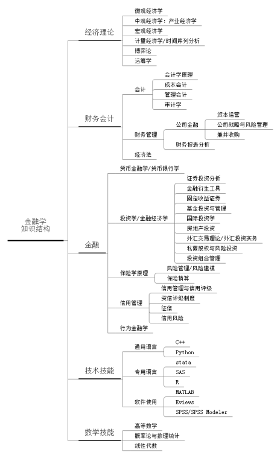

# 金融学

* 经济理论
* 财务会计
* 金融

## 知识结构

## 货币

* 金银本位
    - 交易的双重偶然性：我又你想要的，你有我想要的。决定了需要货币
    - 特点：易分割、稀缺性（普遍）、有价值
    - 金银具备了属性，成为硬通货
    - 货币本位：什么东西，都能用金银定价

## 资源

* 经济理论
    - 微观经济学
        + 曼昆《经济学原理》
        + 范里安《微观经济学：现代观点》
        + [可汗学院公开课：微观经济学](http://open.163.com/special/Khan/microeconomics.html)
        + [加利福尼亚大学伯克利分校公开课：中级微观经济学](http://open.163.com/special/opencourse/microeconomic.html)
    - 宏观经济学
        + 布莱恩斯诺登《现代宏观经济学，起源、发展和现状》
        + 罗默《高级宏观经济学》
        + [可汗学院公开课：宏观经济学](http://open.163.com/special/Khan/macroeconomics.html)
    - 计量经济学/时间序列分析
        + 古扎拉蒂《计量经济学基础》》
        + 伍德里奇《计量经济学导论：现代观点》
        + 恩德斯《应用计量经济学：时间序列分析》
        + [清华大学_计量经济学（45讲）_李子奈](http://list.youku.com/albumlist/show/id_19324246.html)
    - 博弈论
        + Gibbson《博弈论基础》
        + [耶鲁大学公开课：博弈论](http://open.163.com/special/gametheory/)
    - 运筹学
        + Frederick S. Hillier 、 Gerald J. Lieberman 《Introduction to Operations Research》
        + 清华大学出版社《运筹学》
        + [中国石油大学（北京）公开课：事理求精运筹学](http://open.163.com/special/cuvocw/yunchouxue.html)
* 财务会计
    - 罗斯《公司理财》
    - 迈尔斯、布雷利《公司财务原理》
    - 中央财经大学公开课：会计与价值创造
    - 中山大学精品课程：基础会计学
* 金融会计
    - 货币银行学/金融学
    - 米什金《货币银行学》
    - 博迪《金融学》
    - 可汗学院公开课：金融学
* 证券投资分析
    - 博迪《证券投资学》
    - 吴晓求《证券投资学》
    - 格雷厄姆《证券分析》
    - 上海财经大学公开课：证券投资管理
    - 美国西南大学公开课：投资学入门
* 金融衍生工具
    - 约翰赫尔《期权、期货及其他衍生产品》
* 固定收益证券
    - 塔克曼《固定收益证券》
* 基金投资与管理
    - 基金从业资格考试教材
* 国际投资学
    - 任淮秀《国际投资学》
* 房地产投资
    - 刘秋雁《房地产投资分析》
    - 哥伦比亚大学公开课：房地产金融学
* 外汇交易理论/外汇投资实务
    - 魏强斌《外汇交易圣经》
    - 私募股权与风险投资
    - 可汗学院公开课：风险投资与金融市场
* 投资组合管理
    - 理查德C.格林诺德《主动投资组合管理：创造高收益并控制风险的量化投资方法》
    - 路德维希B.钦塞瑞尼《证券组合定量管理：构建与管理证券组合的积极策略》
* 风险管理/风险建模
    - FRM考试教材
    - 保险精算
    - 保险精算师考试教材
* 信用管理
    - 信用管理师考试教材
* 行为金融学
    - Thaler,《 Advances in Behavioral Finance I &II 》
    - 行为金融学：心理的作用
* 量化投资
    * 量化投资：以MATLAB为工具

## 概念

* 泡沫，就是现金流的估值，或者说贴现率。在实物商品货币时代，格雷欣法则是“劣币驱除良币”；在信用货币时代，则是“高泡沫驱除低泡沫”。美国的资本市场泡沫全世界最大，它可以在债券、股票市场上给同样的现金流以更高的估值。这是美国经济可以独步全球的根本原因。
* 收支预算表
* 季度营收、净利润双双负增长，却“享受”46倍市盈率

## 理财

* 市场下行的时候，一是尽可能选择核心区域，抗跌能力比较强。比如老市中心的次新房、已经成熟的新区。这是人流核心聚集区，价格支撑也比较强。
* 如果资金实力不够，那么远郊的新房、市区的老破小，是两类最容易下跌的品种。购买的时候，一定要货比三家，价格严重超过周边同等品质的楼盘，尽量不要买。有些远郊新房，因为是品牌开发商开发，价格比市区的二手次新还要贵，这个时候就不建议入了。
* 一定要规避新房价格大于同品质二手20%以上的区域。新房比二手贵的地方，短期可能会站岗。而新房价格比二手便宜的地方，新房会有溢价，要选择新房。
* 不要一味图价格优惠。开发商给出的折扣让利，有些是因为房源确实差，比如偏远没有地铁、产权不明、周边配套差。在实地考察中，多去竞品楼盘打听其他家楼盘的不足。销售对自己家楼盘大多有吹嘘成分，但对别人家楼盘一定会客观的说出很多缺点。

## 世界格局

* 货币金融体系(布雷顿森林体系)
    - 建立之初，为了确立美元的霸权，美国人曾经对全世界做出承诺，就是要各国的货币锁定美元，而美元锁定黄金。每35美元兑换1盎司黄金。有了美元对全世界的这个承诺，美国人就不可能为所欲为。美国人不能随便地滥印美元，你多印35美元，你的金库里就要多储备1盎司黄金。因为它当时手中掌握了全球80%左右的黄金储备。
    - 二战之后连续愚蠢地卷入了朝鲜战争和越南战争。这两场战争使美国耗费巨大，尤其是越南战争。 越南战争期间美国差不多打掉了八千亿美元的军费。随着战争花费越来越大，美国有点吃不住劲了。每35美元的流失就意味着1盎司黄金的流失。
    - 法国总统戴高乐，他不相信美元，他找来法国财政部长和央行行长，要他们看一下法国有多少美元储备，得到的答案是大概有22亿—23亿美元。 戴高乐说，一分都不剩全部提出来交给美国人，换成黄金拿回来。其他一些外汇盈余的国家纷纷向美国人表示，我们也不要美元，我们要黄金。这样就逼得美国人无路可走。
    - 在1971年8月15日，时任美国总统尼克松宣布关闭黄金窗口，美元与黄金脱钩。 这就是布雷顿森林体系瓦解的开始，也是美国人对世界的一次背信弃义。
    - 可以不使用美元，但在国际间结算时用什么对商品的价值进行衡量？因为货币是价值尺度，所以如果不使用美元，难道还能信任别的货币？美国人就利用世人的惯性和无奈，在1973年10月迫使石油输出国组织（欧佩克）接受了美国人的条件：全球的石油交易必须用美元结算。美国人在使美元与黄金贵金属脱钩之后又与大宗商品石油挂钩
    - 从这一天之后，我们进入到一个真正的纸币时代，在美元的背后不再有贵金属，它完全以政府的信用做支撑并从全世界获利。美国人可以用印刷一张绿纸的方式从全世界获得实物财富。
    - 因为美元与黄金脱钩，黄金不再拖美元的后腿，美国可以随意印刷美元，这时如果大量美元留在美国国内，将造成美国的通胀；如果美元输出去，那就意味着全世界替美国消化通胀，这就是美元通胀率不高的主要原因。美国向全球输出美元，也就稀释了它的通胀。
    - 美元向全球输出之后，美国人手里就没有钱了，这个时候如果美国人继续印刷货币，美元就不断贬值，这对美国没有好处。美联储并不像有些人所想象得那样，是一个滥印货币的中央银行.从1913年美联储成立到目前105年，美联储一共发行了14.5万亿美元
        + 节制后手中没有美元,发行国债，通过发行国债又让输出去的美元重新回到美国.玩起一手印钱，一手借债的游戏，印钞能赚钱，借债也能赚钱，以钱生钱，金融经济比实体经济赚钱来得痛快多了，谁还愿意出大力流大汗去干附加值低的制造业、加工业实体经济？
        + 1971年8月15日之后，美国人逐渐放弃了实体经济而转向虚拟经济，渐渐变成一个半空心化的国家。 今天美国的GDP已经达到18万亿美元，实体经济为其GDP的贡献不超5万亿，剩下的大部分全都是虚拟经济带来的。
        + 通过发行国债，让大量在海外流通的美元重新回到美国，进入美国的三大市——期货市场、国债市场和证券市场。通过这个方式钱生钱，然后再向海外输出，这样循环往复地生利，美国由此变成一个金融帝国。把全世界纳入它的金融体系之中
        + 开始用美元进行隐性的“殖民扩张”，通过美元隐蔽地控制各国经济，从而把世界各个国家变成它的金融殖民地。
        + 很多主权独立的国家包括中国在内，你尽可以有主权、有宪法、有政府，但是你脱离不开美元，你的一切最后都会通过各种方式用美元来表达，并最终让你的实物财富通过与美元的兑换源源不断地进入美国
        + 1971年特别是1973年石油危机之后美元指数就一直在走低:去了拉丁美洲，给拉丁美洲带去了投资拉动，也带来了繁荣，这就是70年代拉美的经济繁荣
            * 直到1979年，美国人决定关掉泄洪闸,美元指数开始走强，意味着向其他地方输送美元减少
            * 马岛海战爆发:阿根廷的人均GDP一度已经迈进了发达国家的行列。但拉美经济危机一出现，阿根廷却率先进入衰退。通过政变上台的军政府，总统是加尔铁里希望通过战争来脱困。目光瞄向了离阿根廷600公里远的马尔维纳斯群岛，英国人把它叫做福克兰群岛。
                - 加尔铁里让人给美国总统里根带话，看看美国的态度.里根明明知道加尔铁里打这一仗，会导致一场和英国的更大规模战争，但他却轻描淡写地表态说，这是你们与英国之间的事情，与美国无关，我们不持立场，我们保持中立。
                - 发动了马岛战争，轻松收回了马岛。阿根廷上下一片欢呼，热烈的像过狂欢节。英国首相撒切尔夫人宣称绝不接受这个结局，还逼着美国总统必须表态。这时的里根立刻撕下中立的面具，发表声明强烈谴责阿根廷的侵略行径，坚决站在英国一边。随后，英国派出一支航母特混舰队，劳师远征8000海里，一举又将马岛夺了回来。
                - 与此同时，美元走势开始走强，国际资本按照美国的意愿回到美国。 因为当马岛战争打响后，全球的投资人立刻判断，拉美的地区性危机出现了，拉美的投资环境恶化了，于是纷纷从拉美撤资。 美联储看到时机已到，立刻宣布美元加息，加息后的美元加快了资本撤出拉美的步伐。拉美的经济一片狼藉。
                - 撤出的资本几乎全到了美国，去追捧美国的三大市（债市、期市、股市），给美国带来了美元与黄金脱钩后的第一个大牛市，让美国人赚得钵满盆满。 当时美元指数从弱势时的60多点一口气蹿升到120多点，上升了100%。
                - 美国人在自己的三大市牛市后并不收手，又趁势拿着赚到的钱，重新回到拉美去购买那些此时价格已跌成地板价的优质资产，狠狠剪了一次拉美经济的羊毛，这是美元指数第一次走强后的情况。
                - **如果这种事情只发生一次，那它就是小概率事件；如果它反复出现，那它就一定是规律**
        + 美元指数从1986年又开始一路下跌:经历了日本金融危机、欧洲货币危机，美元指数仍然在走低，大约走了10年，10年之后的1997年美元指数再一次走强。
        + 美元指数差不多呈现出这样一个规律性： 10年的走弱、6年的走强，再一个10年的走弱、接下来又一个6年的走强。
        + 1986年美元指数第二次开始走弱之后，长达10年的时间内，美元又像洪水一样向世界倾泄。这次主要的泄洪区是亚洲
            * 亚洲的繁荣是由亚洲人的辛勤劳动、亚洲人的聪敏智慧带来的，实际上很大原因是因为亚洲国家获得了充足的美元、获得了充足的投资。当亚洲的经济欣欣向荣到差不多的时候，美国人觉得又应该到剪羊毛的时候了。
            * 1997年，也就是美元指数整整走低10年之后，美国人通过减少对亚洲的货币供应，使美元指数反转走强，亚洲大多数国家的企业和行业遭遇流通性不足，有的甚至干脆资金链条断裂，亚洲出现了经济危机和金融危机的征兆。
            * 差地区性危机出现的条件触发：既然制造地区性危机就是为了撵出资本。
            * 索罗斯的金融投机家，带着他的量子基金和全世界上百家的对冲基金，开始群狼般攻击亚洲经济最弱的国家——泰国，攻击泰国的货币——泰铢。
            * 一个星期左右，然后由此开始的泰铢危机，立刻产生传导效应，一路向南，陆续传导到马来西亚、新加坡、印尼、菲律宾，然后北上传导中国台湾、香港，日本，韩国，一直传导到俄罗斯，东亚金融危机全面爆发。
            * 全球的投资人判断亚洲的投资环境恶化，便纷纷从亚洲撤出自己的资本。 而美联储则又一次不失时机地吹响了加息的号角，跟着号音从亚洲撤出的资本又一次到美国去追捧美国的三大市，给美国带来了第二个大牛市。
            * 美国人挣够了钱以后，仍像在拉丁美洲那样，拿着他们从亚洲金融危机赚到的大把的钱又回到了亚洲，去购买亚洲跌到地板价上的优质资产。 此时亚洲经济已经被这次金融危机冲得稀里哗啦，毫无招架之功，更无还手之力，这次唯一的幸运者是中国。
        + 美元指数经过6年的走强，到2002年，再一次开始走弱，然后，又是10年时间，到2012年，美国人又开始为美元指数即将由弱转强做准备
            * 先后看到，在中国周边陆续出现钓鱼岛争端，黄岩岛争端。几乎全在这一时期密集出现。很不巧，美国在2008年自己玩火玩大了，自己先遭遇了金融危机，结果使美元指数走强的时间被迫向后推延，这次到了2015年。
            * 可以断定，这次轮到中国了
                - 因为眼下中国已经成了从全球吸引和获得投资最多的国家，大量国际资本由于看好中国经济进入中国。从经济规律上讲，不能仅仅把中国看成是一个国家。
                - 一个中国的经济规模就相当于整个拉美，甚至比拉美的经济总量还要大；和东亚经济比，也可以说中国经济相当于整个东亚。
                - 过去十年里，大量资本进入中国，使中国的经济总量，以令人垂涎的速度增长到全球第二，如此一来，美国把第三次剪羊毛的目标瞄准中国，一点不奇怪。
            * 香港占中事件：2014年5月“占中”行动正在酝酿中，可能在5月底就会发生。但是5月底没有发生，6月底没有发生，7月还是没有发生，到了8月仍然没有发生。在等什么？
                - 美联储退出QE时间表。之前，美国就说要退出QE（量化宽松），4月、5月、6月、7月、8月，一直没有退出。 只要不退出QE，就意味着美元还在超量发行，美元指数就不能走强，香港的“占中”也就一直没有出现，二者在时间表上完全重合。
                - 2014年9月底，美联储终于宣布美国退出QE，美元指数开始掉头走强后，10月初，香港“占中”爆发。
            * 中日钓鱼岛、中菲黄岩岛、981钻井平台、香港“占中”，这四个点都是炸点，任何一个点引爆成功，都会引发地区性金融危机，也就意味着中国周边投资环境恶化。
            * 我们在流出了上万亿美元之后，通过各种手段，已经基本止住。在推动香港占中的同时，美国多管齐下，在其他地区同时下手
            * 乌克兰危机
                - 俄罗斯强人普京趁势借机收回了克里米亚，此举虽不在美国人计划之内，但却正好让美国人更有理由向欧盟还有日本施压，迫使他们与美国一起制裁俄罗斯，给俄罗斯更给欧洲经济带来巨大的压力。
                - 乌克兰出现危机之后，欧美与俄罗斯的关系迅速恶化，但整个西方世界一起制裁俄罗斯的结果，却直接使欧洲的投资环境恶化，导致资本从这里撤出。 据有关数据显示，大约有上万亿的资本离开了欧洲。美国人的两手设计得逞了。
                - 从欧洲撤出的资本，并没有去美国，另有数据显示，它们大部分来到了香港。意味着全球投资人仍然不看好美国经济的复苏。而宁愿看好虽已处在经济下行线上，但仍保持着全球第一增长率的中国
                - 美国人需要制造一次针对中国的地区性危机，让滞留香港的资本撤出中国，去追捧美国经济。 这也是美元加息周期已经加无可加，美国还在挑起中东动乱，以贸易摩擦，企业制裁不断给我们施压的原因。
                -
        + 从而满足“美元指数走强时，其他地区必须相应出现地区性危机，使该地区投资环境恶化，迫使投资人大量撤出资本”，这一美元获利模式的基本条件。
    - 央行从1954年发行新货币——新人民币到现在，已经发行了188万亿M2。如果按汇率6.8跟美元折算的话，大概发行了27万亿美元。中国在改革开放以后挣到了大量美元，同时这期间还有大量的美元做为境外投资进入中国。由于外汇管制，美元不能在中国流通，所以央行就必须发行与进入中国的美元及其他外币相应的人民币，然后以人民币在国内流通。以外汇为基础货币印发的人民币是多少呢？占我们总量的70%。
    - 可是国外的投资在中国挣到了钱以后，可能就撤走了。 与此同时，我们还会拿出大量外汇，从境外够买资源、能源、产品和技术，如此一来，大量的美元走了，人民币留了下来，你又不可能将相应数额的人民币销毁，只能让人民币留在中国继续流通，所以我国人民币的存量必然大于美元。
    - 巨量的超发最后全都留在了中国，这就牵扯到我后面将要谈到的问题——人民币为什么要国际化。
    - 从1971年8月15日美元与黄金脱钩之后，美国经济逐渐放弃实物生产，脱离开实体经济。 美国人把实体经济的低端制造业、低附加值产业叫做垃圾产业或者叫做夕阳产业，逐渐向发展中国家转移，尤其是向中国转移。 而美国除了留下所谓高端的产业，微软等企业外，70%左右的就业人口都陆续转向了金融和金融服务业。已经变成了一个产业半空心化国家，它除了高新技术企业外，已经没有多少实体经济可以为全球投资人带来丰厚的利润。
    - 打开另一扇门，就是虚拟经济的大门。 虚拟经济就是它的三大市，它只能通过让国际资本进入三大市的金融池子中，为自己钱生钱，然后再拿挣到的钱去剪全世界的羊毛，美国人现在只有这么一个活法了。称之为美国的国家生存方式，这个方式就是： 美国需要大量的资本回流来支撑美国人的日常生活和美国经济，在这种情况下谁阻挡了资本回流美国，谁就是美国的敌人。
    - 美军打仗虽然也烧钱，但却能一边烧钱，一边为美国挣钱
        + 伊拉克战争：在产油国打仗的一个直接后果就是油价飙升，油价一飙升就意味着美元的需求量也提高了。为什么一定要打伊拉克：1999年欧元正式启动，萨达姆以为抓住了在美元和欧元，美国和欧盟之间玩火的机会，于是他迫不及待地宣布伊拉克的石油交易将用欧元结算。 这一下惹火了美国人，尤其是它产生一连串的示范效应，俄罗斯总统普京，伊朗总统内贾德，委内瑞拉总统查韦斯，纷纷宣布自己国家的石油出口结算也用欧元结算。临时政府发布的第一道法令，就是宣布伊拉克的石油出口，从欧元结算改回用美元结算。
        + 科索沃战争：1999年1月1日，欧元正式诞生。三个月之后科索沃战争爆发。欧元启动之初，欧洲人信心满满。他们给欧元的定价是与美元比值1：1.07。科索沃战争爆发后，欧洲人参与北约行动，全力以赴支持美国攻打科索沃，72天的狂轰乱炸，米洛舍维奇政权垮台，南联盟屈服。 可接下来一盘点，欧洲人发现不对头了，欧元，就在这70天里，居然被这场战争打残了。 战争结束时，欧元直线下跌30%，0.82美元兑换一欧元。
            * 欧元的出现切走了美元三分之一的货币结算量，到现在世界上23%的贸易结算已使用的是欧元而不是美元。
        + 瓦解亚太一体化
            * 2012年年初，中日带头发起的中日韩关于东北亚自贸区的谈判接近成功；4月，中日货币互换和中日之间互相持有对方国债也初步达成协议，一切可谓进展神速。 然而，2012年9月10日，极力推动《中日货币互换协议》的日本金融大臣松下忠洋，突然在家中上吊自杀。 6天后，与松下忠洋一起推动中日协议的日本新任驻华大使西宫伸一，在自己家附近突然倒地昏迷，不治身亡，死亡原因不明。
            * 中日钓鱼岛争端爆发，两国之间剑拔弩张，《中日货币互换协议》被迫在2013年作废。 几年后，我们才勉强完成了中韩两国的双边自贸区的谈判，这已经意义不大了，因为它和中日韩东北亚自贸区的意义完全不可同日而语，为什么这么说？因为中日韩自贸区谈判一旦成功，一定是包括中、日、韩、港、澳、台的整个东北亚自贸区。东北亚自贸区一经形成就意味着世界规模大约20多万亿美元的第三大经济体出现！ 但是，东北亚自贸区一旦出现就不会止步，它会迅速南下与东南亚自贸区整合，形成东亚自贸区，东亚自贸区的产生意味着30多万亿美元规模的世界第一大经济体出现，将超越欧盟和北美。
            * 目标就是一个，平衡掉中国今天大国崛起的势头

## 指数

* 富时罗素
* msci

## 报告

* 凌鹏
    - 183页的宽体策论、128页的行业比较和287页的策略思考

## 纪要

* 2019年3月22日傍晚，上交所披露9家科创板受理企业，分别为晶晨半导体、睿创微纳、天奈科技、江苏北人、利元亨、宁波容百、和舰芯片、安瀚科技，武汉科前生物。21财经APP为你全方位解读。

## 资源

* [施索恩](https://www.777kuu.com/)
* [量化投资学院](http://q.peixun.net/)

## 读书

* 凯文·凯利
    * 新经济新规则
+ 国富论
* 道德情操论

## 工具

* [QUANTAXIS/QUANTAXIS](https://github.com/QUANTAXIS/QUANTAXIS):QUANTAXIS 兼容股票和期货的 数据爬取-清洗/存储-分析/回测-可视化/交易/复盘的本地一站式解决方案 http://book.yutiansut.com
* [vnpy/vnpy](https://github.com/vnpy/vnpy)：基于Python的开源量化交易平台开发框架 http://www.vnpy.com
* [firefly-iii/firefly-iii](https://github.com/firefly-iii/):Firefly III: a personal finances manager https://firefly-iii.org/
