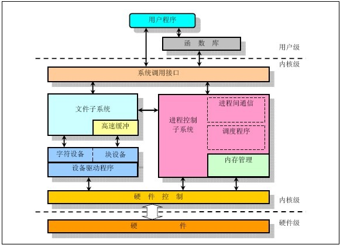
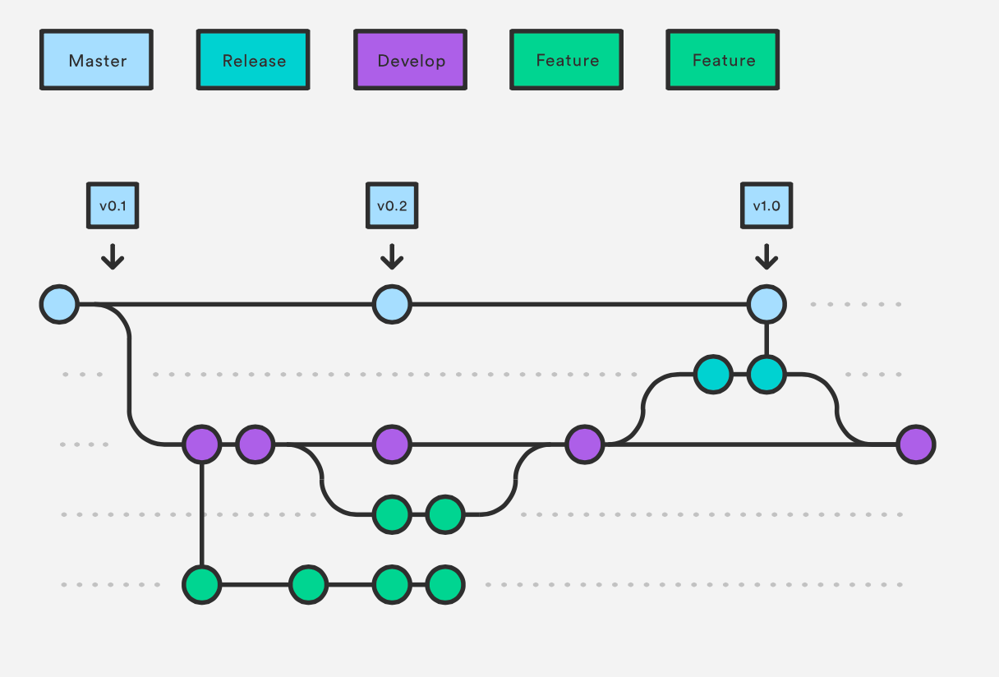
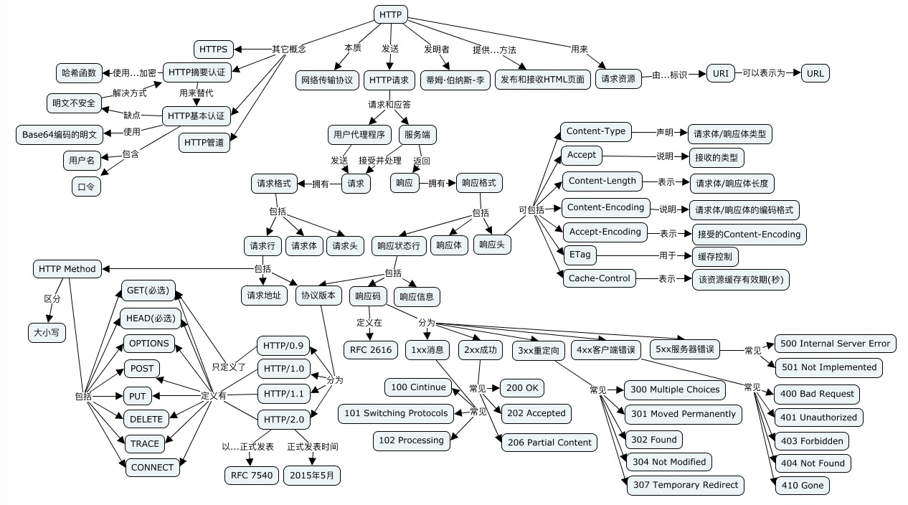
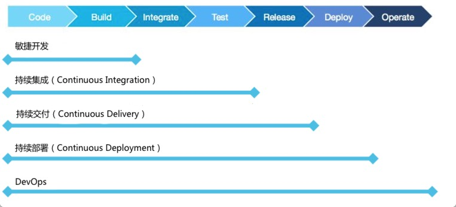
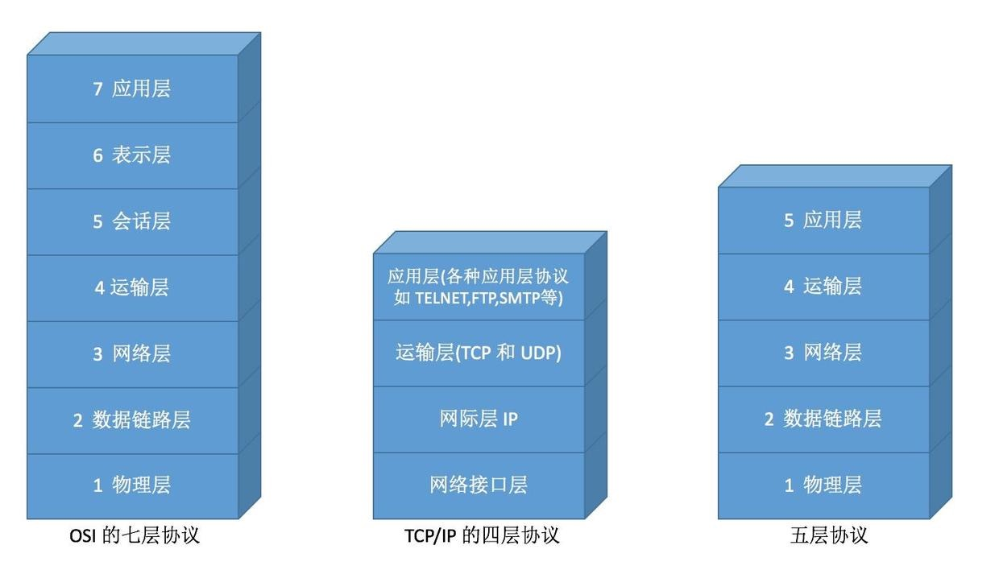
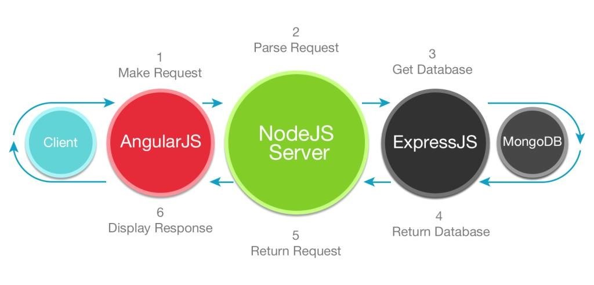

# 前端工程师技能清单

涉及交互，有产品的感念

后端不提供页面，只是纯粹的通过 Web API 来提供数据和业务交互能力之后，Web 前端就成了纯粹的客户端角色，与 WinForm、移动终端应用属于同样的角色，可以把它们合在一起，统称为前端

## HTML

用来描述元素应该如何在网站上布局，并向浏览器提供网站所需的其他所有文件列表

* 语义元素： 语义元素明确地对浏览器和开发者描述其含义；元素包括文章和部分， 而不是到处使用 div
* 块级元素： 块级元素占据了父元素的整个空间
* 内嵌元素： 内嵌元素仅占据由内嵌元素定义标记界定的空间
* 表格：表格表示文档部分， 其中包含向网络服务器提交信息的交互式控件
* 输入类型： 输入元素用于为网络表格创建交互式控件， 以便接受用户输入的数据

## CSS

层叠样式表（简称 CSS）负责控制网站的外观。颜色、字体，甚至一些动画

* 显示值类型：显示属性使你能够控制图表或容器元素的渲染效果
* 盒模型：盒模型负责定义矩形框（表示文档中的元素）的尺寸
* 基本定位：定位属性会为定位元素选择替代规则
  - 静态定位：静态定位使元素能够使用常规行为
  - 绝对定位：不会为元素留空间，而是位于相对于祖先或容器块的特定位置
  - 固定：不会为元素留空间，而是位于相对于屏幕视口的特定位置
  - 弹性盒： 一种布局模式， 可以组织网页上的元素， 使元素行为能够符合预期， 这样网页布局就能够满足不同的屏幕大小和设备显示器的要求
  - 悬浮型：指定元素应该遵守常规版型，并放置在容器的左侧或右侧
* 字体样式和网络字体：字体样式使我们能够更改文本的外观；网络字体使我们能够加载只有部分客户端能使用的网络字体文件
* 背景：背景使我们能够定义用作容器背景的颜色或图片
* 伪选择器器：伪选择器使我们能够选择出现在HTML中定义的元素周围的假定元素
* 动画和过渡：动画和过渡使我们能够对元素设定动画效果或在元素的两个状态之间定义过渡

### CSS框架

框架使我们能够轻松地设计网站结构和构 建网站。 它们会提供自定义 CSS 类， 简化了内容布局操作， 确保无论是何种设备， 你的内容都能看起来很美观。 框架可以帮助你遵循行业最佳做法和现代设计原则

- Bootstrap
- Foundation

## JavaScript

负责控制网站的交互操作。

* 基础语法
    - 数据类型：该语言支持的不同变量类型（例如字符串和整型）。
    - 有string,number,boolean,null,undefined,object等。其中，string,number和boolean是基础类型,null和undefined是JS中的两个特殊类型,object是引用类型
    - 通过typeof来判断基础数据类型，但不能够准确判断引用类型, 因此需要用到另外一个方法，那就是Object的toString
    - JS常用的内置对象有Date、Array、JSON,RegExp等。 一般来讲，Date和Array用的最频繁，JSON可以对对象和数组进行序列化和反序列化，还有一个作用就是实现对象的深拷贝。
    - 语法：定义如何组织语言的一般规则
* 函数：用来执行特定任务的代码块
* 字面值可以简化代码
* 对象字面值： JavaScript 中的所有内容都是对象， 但是自己编写对象
* 面向对象的编程： 在 JavaScript 中， 你可以采用多种方式来实现面向对象 的编程， 包括
* 函数方式、原型方式和伪类方式
* 设计模式：设计模式是可以重复利用的常见问题解决方案
* AJAX： AJAX 使我们能够异步地从网络服务器上请求数据，不需要重新加载网页
* jQuery： jQuery 是一种非常热门的库，使我们能够更轻松地进行跨浏览器 DOM 遍历和操作、处理事件和执行AJAX 操作

## JavaScript框架

会强制要求各种最佳做法，并且通常会强制要求我们在处理各种文件时遵守组织性格式，使我们能够轻松地编写网络应用

* AngularJS： 支持双向数据绑定，使你能够扩展 HTML 词汇以创建前端网络应用
* EmberJS： 通过使用严格的文件和对象命名规范，不用再使用样板代码
* KnockoutJS： 通过声明性绑定系统，使我们能更轻松地创建由数据驱动的应用

## 响应式网站设计

打开网站并缩小浏览器窗口大小，如何使网站能够缩放，并进行自我调整，从而在所有设备上都能提供超棒的体验

* @媒体查询：媒体查询使内容能够根据具体的输出设备的范围调整呈现方式，不用更改内容本身
* 相对大小单位： CSS 还提供了除像素 (px) 之外的很多其他衡量单位，例如 em、 rem、 vw、 vh 和 vmin

## 版本控制

### Git：

Git 是一种分布式版本控制系统

### GitHub

一种 Git 资源库网络托管服务，提供各种其他功能，使开发者能够相互协作

### 网站性能

理解几种简单的浏览器渲染原则， 你将能够确保向用户呈现快速、高效的网站

* 关键呈现路径： 关键呈现路径是浏览器用来将 HTML、 CSS 和 JavaScript转换成实际像素并发送到用户屏幕的流程
* 图片优化： 图片优化是针对图片内容使用正确的图片类型和从图片文件中移除多余的元数据的流程
* JavaScript 压缩： JavaScript 压缩是指从 JavaScript 文件中删除不必要的字符以减小文件大小的流程

## 浏览器开发者工具

提供了所有的详细信息，可以帮助你揭开代码的神秘面纱，是测试、衡量和迭代改进代码的重要平台

* 元素检测： 元素面板使你能够查看一个 DOM 树中的所有内容，并检查和在运行中修改 DOM 元素
* 网络： 网络面板可以录制关于应用中每项网络操作的信息
* 时间轴： 时间轴面板使你能够录制和分析应用在运行期间的所有活动
* 应用调试： 调试面板使你能够观察应用在运行期间消耗的内存
* 资源： 资源面板使你能够检测应用加载的资源

## 构建和自动化工具

需要运行测试套件、优化图片、遵守你所在单位的代码格式指南，甚至准备将代码部署到成品服务器上。还需要完成大 量的重复性甚至枯燥的工作。 Grunt 和 Gulp 等构建和自动化工具可以在后台帮你处理所有这些任务，使你能够专注于构建强大的网络应用。

* npm： npm 是 Node.js 的默认程序包管理器，后者是大多数构建和自动化工具编写代码时用到的框架
* Grunt： Grunt 是基于任务的命令行构建工具，可以与硬盘上的文件交互
* Gulp： Gulp 是基于程序的命令行构建工具，负责阅读硬盘上的文件，然后以流的形式与这些文件交互
* Bower： Bower 是 HTML、 CSS 和 JavaScript 库的程序包管理器，使你能够定义和检索依赖项并确定其版本

## 测试

当你的应用变得越来越复杂时，就很容易出现 bug，或者完全破坏现有的功能。单元、集成和行为测试是很棒的测试方法，可以确保你在添加新功能时不会破坏代码

* Mocha： Mocha 是一个 JavaScript 测试框架，在 Node.js 和浏览器中运行，使异步测试变得简单起来
* Jasmine： Jasmine 是一个开源、行为驱动的 JavaScript 测试框架

## 软技能

培养自己的沟通交流能力、指导和激励他人的能力，并能够从宏观层面看待工作，将使你成为潜在雇主青睐的候选人士。

* 善于沟通： 能够向庞大的团队（包括管理层、同事和客户）传达目标、进度和问题
* 灵活地处理问题： 了解问题背后的问题，并将问题分解成更小、更易解决的小问题
* 积极上进： 及时掌握这一领域的发展动态，并了解最新的技术发展状况
* 自我激励： 愿意实验和探索；勇于冒险，但是在面临挫折时能够坚持不懈

# 个人技能系统性进步与视野@杨文坚：

* 个人通用能力
* 技能知识点
* 工程业务经验
* 架构思想
* 先进方法与流程

## Javascript

### 自动化测试：单元测试 集成测试 浏览器测试

* mocha + should + node
* karma
* 链表，通过CI集成测试

### 知识点

* 奇怪的this
* 时间模型
* 生命提升
* 继承
* 跨域
* AJAX模型

### 异步流程控制

* Callback
* Genrator
* async function
* RxJS
* observable

### 模块化

* CommonJS
* AMD & CMD
* 加载器
* ES mould
* node模块转化CommonJS转化*MD

### 模板引擎

* Template & DOM Template
* 模板引擎优化
* 字符串模板输出React Comonent、VueComonent

## Webpack

* 用Webpack搭建一个项目
* 浏览器兼容性
* 搭建构建系统，通过测试用例

## 性能测试对比

* jsben.ch
* beachmark.js

## 基于缓存的前端性能优化

* HTTP 缓存
* LocalStorage
* App Cache
* Hybrid App 缓存
* Service Worker

## 加载优化

* lazyload
* 小图 -> 大图
* 预加载
* 异步加载
* MTU

## 优化案例

* 对象池优化
* 移动性能优化

## 前端上报技术

* 打点上报
* 错误上报
* 性能上报
* 跟踪用户操作
* 利用数据

## 安全

* CSRF
* CSRF防范技术
* XSS
* 富文本XSS防范

## 浏览器

* IE6/7/8/9/10/11 (Trident)
* Firefox (Gecko)
* Chrome/Chromium (Blink)
* Safari (WebKit)
* Opera (Blink)

## 编程语言

* JavaScript/Node.js
* CoffeeScript
* TypeScript

## 切页面

* HTML/HTML5
* CSS/CSS3
* Sass/LESS/Stylus
* PhotoShop/Paint.net/Fireworks/GIMP/Sketch

## 开发工具

### 编辑器和IDE

* VIM/Sublime Text2
* Notepad++/EditPlus
* WebStorm
* Emacs EmacsWiki
* Brackets
* Atom
* Lime Text
* Light Table
* Codebox
* TextMate
* Neovim
* Komodo IDE / Edit
* Eclipse
* Visual Studio/Visual Studio Code
* NetBeans
* Cloud9 IDE
* HBuilder
* Nuclide

### 调试工具

* Firebug/Firecookie
* YSlow
* IEDeveloperToolbar/IETester
* Fiddler/Charles
* Chrome Dev Tools
* Dragonfly
* DebugBar
* Venkman

### 版本管理

* Git/SVN/Mercurial
* Github/GitLab/Bitbucket/Gitorious/GNU Savannah/Launchpad/SourceForge/TeamForge

## 代码质量

### Coding style

* Eslint/JSLint/JSHint/jscs
* CSSLint
* Markup Validation Service
* HTML Validators

### 单元测试

* QUnit/Jasmine
* Mocha/Should/Chai/Expect
* Unit JS

### 自动化测试

* WebDriver/Protractor/Karma Runner/Sahi
* phantomjs
* SourceLabs/BrowserStack

## 前端库/框架

* jQuery/Underscore/Mootools/Prototype.js
* YUI3/Dojo/ExtJS/KISSY
* Backbone/KnockoutJS/Emberjs
* AngularJS
* Batarang
* Bootstrap
* Semantic UI
* Juice UI
* Web Atoms
* Polymer
* Dhtmlx
* qooxdoo
* React
* Brick
* Vue.js

## 前端标准/规范

* HTTP/1.1: RFCs 7230-7235
* HTTP/2
* ECMAScript 5/6/7
* W3C: DOM/BOM/XHTML/XML/JSON/JSONP/...
* CommonJS Modules/AMD
* HTML5/CSS3
* Semantic Web
    - MicroData
    - RDFa
* Web Accessibility
    - WCAG
    - Role Attribute
    - WAI-ARIA

## 性能

* JSPerf
* YSlow 35 rules
* PageSpeed
* HTTPWatch
* DynaTrace's Ajax
* 高性能JavaScript

## SEO

## 编程知识储备

* 数据结构
* OOP/AOP
* 原型链/作用域链
* 闭包
* 编程范型
* 设计模式
* Javascript Tips

## 部署流程

### 压缩合并

* YUI Compressor
* Google Clousure Complier
* UglifyJS
* CleanCSS

### 文档输出

* JSDoc
* Dox/Doxmate/Grunt-Doxmate

### 项目构建工具

* make/Ant
* GYP
* Grunt
* Gulp
* Yeoman
* FIS
* Mod
* Webpack

## 代码组织

### 类库模块化

* CommonJS/AMD/ES6 Module
* YUI3模块

### 业务逻辑模块化

* bower/component

### 文件加载

* LABjs
* SeaJS/Require.js/Webpack

### 模块化预处理器

- Browserify

## 安全

* CSRF/XSS
* CSP
* Same-origin policy
* ADsafe/Caja/Sandbox

## 移动Web

* HTML5/CSS3
* 响应式网页设计
* Zeptojs/iScroll
* V5/Sencha Touch
* PhoneGap (Cordova)
* Ionic
* jQuery Mobile
* W3C Mobile Web Initiative
* W3C mobileOK Checker
* Open Mobile Alliance
* React Native/Weex

## 前沿技术社区/会议

* D2/WebRebuild
* NodeParty/W3CTech/HTML5梦工厂
* JSConf/沪JS(JSConf.cn)
* QCon/Velocity/SDCC
* JSConf/NodeConf
* CSSConf
* YDN/YUIConf
* HybridApp
* WHATWG
* MDN
* codepen
* w3cplus
* CNode

## 计算机知识储备

* 编译原理
* 计算机网络
* 操作系统
* 算法原理
* 软件工程/软件测试原理
* Unicode

## 软技能

* 知识管理/总结分享
* 沟通技巧/团队协作
* 需求管理/PM
* 交互设计/可用性/可访问性知识

## 可视化

* SVG/Canvas/VML
* SVG: D3/Raphaël/Snap.svg/DataV
* Canvas: CreateJS/KineticJS
* WebGL/Three.JS

所有客户端都是前端

## 前端工程化

### 开发需求

* 代码规范：ESLint是一个用来识别 ECMAScript 并且按照规则给出报告的代码检测工具，使用它可以避免低级错误和统一代码的风格。我们可以方便的在配置文件中配置自己想要的风格规范，通常推荐使用Airbnb JavaScript或者google的规范。
* CSS预处理：可以使用less或sass来优化css的开发过程，而如果考虑到浏览器兼容性的hack问题，我们可以用postcss作为预处理工具帮我们自动解决这些 hack。
* 热更新：hmr能够在感知你的代码有变动的情况下自动调用编译工具编译源码，然后通过 livereload 自动刷新浏览器，这样做的话能节省你的调试时间。
* Mock：由于采用了前后端分离的开发模式，在真实开发中，为了让前端开发不受后端进度的影响，我们需要对数据进行mock。前后端先约定API 接口定义，然后前端根据定义mock 接口。一般大公司会有自己的mock平台，小公司如果没有的话也可以使用开源的mock工具。

### 共享需求

对于公司而言，快速高效地实现业务是终极目标，这对前后端来说都是挑战。在前端团队中，能够形成基础组件库和业务组件库是一种必然需求。
所以在设计前端项目架构的时候，一定要考虑业务的组件化和可共享性。有人说开发通用组件是造轮子，其实造出符合自己的轮子何尝不是一种领悟。共享需求主要有四种：基础代码共享、通用工具方法共享、基础交互组件共享以及业务组件共享。
在组件方面，React提供了天然的组件结构，我们只需要在开发过程中，隐藏组件的内部实现，每个组件更独立，很容易形成可重用组件。

### 性能需求

构建过程中使用Grunt/Gulp、webpack等构建工具实现。

* JS/CSS 代码压缩
* JS/CSS 代码合并
* 图片压缩
* CSS 图片精灵或雪碧图

### 部署需求

会用代码管理工具来管理源码，然后将开发流程和部署流程与git结合起来。多人分支协作流程：用git flow来管理代码分支。

## 技术基本功

* 打字速度:练出一个打字坐姿良好、打字速度标准的习惯,可以选用更高效的 DVORAK 布局 [强化打字速度](http://www.jianshu.com/p/8aac186868ce)
* 熟练掌握至少一种主流代码编辑器或 IDE（web工程师:VIM、Sublime、WebStorm、IDEA、VSCode 以及一些在线 IDE ）
    - 专注源代码的开发，常常会根据具体编程语言有语法高亮、代码折叠等功能，支持大多数编程语言的开发。通过一定的定制化，我们可以给简易的编辑器加入风格迥异的插件，组成一整套得心应手的开发流程。
    - 当做一种编辑器的全家桶，主要针对特定的编程语言而量身打造。IDE 在内部除了可以直接写源代码文本，还常常默认拥有打包并编译为可用程序的功能，有些 IDE 还可以设计图形界面。IDE 通常包括代码编辑器、自动构建工具、调试器和版本控制系统。一个典型的例子如 WebStorm，其支持图片预览，拥有内置命令行和版本控制系统，对于错误的前端 JavaScript 代码还有相应的智能提醒和改正能力。WebStorm 良好的集成了编辑、文件、管理、编译、调试、运行等功能，大大的提高了开发者生产力。
* 拥有良好的代码规范、代码质量、代码注释能力
    - 代码规范是一种持续的行为 ，良好的代码规范可以依靠代码规范文档或成熟的规范工具进行统一------前者不应复杂，但应具有一些强制性；后者例如在前端开发的环境下，可以使用 ESLint 来进行可定制化的代码风格检查，或使用持续集成(CI)理念并通过相匹配的 CI 服务器进行软件交付，以确保高水平的代码质量。git+slack+lambci
    - 统一编码规范、统一语言版本、统一编辑器配置（tab和空格之类）、统一文件编码，统一数据库等等行为，都是提高代码质量、尽力避免因为环境不同而导致 Bug 众多的种种步骤。前端可以使用 JSDoc 来规范注释代码(根据 JavaScript 文件中注释信息，生成 JavaScript 应用程序或库、模块 API 文档的工具。你可以使用他记录如：命名空间，类，方法，方法参数等。类似 JavaDoc 和 PHPDoc。)
* 理解主流编程范式及其思想,非命令式的编程都可归为声明式编程，命令式、函数式和逻辑式是最核心的三种范式。纵然声明式编程有诸多便捷之处，但其在着重交互和业务逻辑的前端开发下就不那么得心应手。声明式编程更擅长于数理逻辑的应用。因此我们能从编程范式角度理解前端开发将会大大提高我们的编程水平。
    - 命令式编程:行动导向（ Action-Oriented ）的，因而算法是显性而目标是隐性的 C++
    - 声明式编程:目标驱动（ Goal-Driven ）的，因而目标是显性而算法是隐性的  函数式 Lisp
    - 逻辑式：Prolog
* 拥有撰写良好软件工程文档的能力:拥有概要设计说明书、需求规格说明书和测试设计说明书
    - 概要设计说明书包括程序系统的基本处理流程、程序系统的组织结构、模块划分、功能分配、接口设计、运行设计、安全设计、数据结构设计和出错处理设计等，为程序的详细设计提供基础。
    - 软件需求说明是软件系统需求的规格化说明，是对将要开发系统的行为的说明。它包括功能性需求及非功能性需求，非功能性需求对设计和实现提出了限制，比如性能要求，质量标准，或者设计限制。
    - 测试说明书包括测试目标、测试范围、性能要求、测试资源、测试环境、测试策略。
* 熟知常见的数据结构、算法思想、设计模式:数据结构的良好选择可以提高算法效率。从数据结构角度来说，需要我们熟知数组、堆栈、队列、链表、树、图、堆和散列表的相关知识点，并能够根据具体问题通过高级编程语言具体实现；从算法角度来说，还需要我们熟知时间复杂度、空间复杂度、深度优先、广度优先、图论和动态规划等算法思想。前端开发因为 JavaScript 语言封装了很多操作数据的具体过程且更编程目标是开发应用逻辑，在算法层面要求并不是很高，但熟知算法思想可以提升每个前端开发者的计算机科学素养。在看重基础的开发者面试中也能提高自己的竞争力。算法用来解决计算上的问题，设计模式用来解决"设计层次"的问题。在软件工程中，设计模式是对软件设计中普遍存在（反复出现）的各种问题，所提出的解决方案。JavaScript 就有很多的设计模式值得学习并掌握，如下所例，这里就不一一介绍。通过使用设计模式，可以使我们的代码更加的可复用，可扩展以及可测试。单例模式、简单工厂模式、观察者模式、适配器模式、代理模式、桥接模式、外观模式、访问者模式、策略模式、模板方法模式、中介者模式、迭代器模式、组合模式、备忘录模式、职责链模式、享元模式、状态模式
* Windows、Linux 和 Mac 三大操作系统所各自形成的生态链。我们至少需要能够在其中一个操作系统下进行高效开发，并了解该环境下的应用软件使用技巧和常用配置管理。熟练使用三大操作系统之一及其开发者环境:无论哪种，都应该多理解 Linux 操作系统及其使用方式。前端使用的 Bower 管理器、Node 环境以及自动化测试、版本控制等都离不开 Linux 命令行的设计思想。深入操作系统的内核，我们可以了解计算机如何进行进程管理、内存管理、文件管理以及网络管理，从而在开发中遇到电脑卡顿、网络不通畅等情景时能及时找到问题所在，对症下药。
* 拥有良好的代码审查、代码重构能力:适当的和团队成员举办一场 Code Review(代码审查)，有助于保证软件质量、促进团队成长和避免团队成员因缺席而导致软件进度的"单点故障"。尤其在团队没有测试开发人员的情况下，我们很难达到令人满意的测试覆盖率。来一场"说走就走"的代码审查将对软件质量做出巨大贡献。五个层次完成代码审查与重构：
    - "业务架构"的代码审查与代码重构。
    - "代码架构"的代码审查与代码重构。
    - "设计模式"的代码审查与代码重构。
    - "最优算法"的代码审查与代码重构。
    - "语言与代码规范"的代码审查与代码重构。
* 拥有良好的版本控制、项目管理意识:需要拥有良好的版本控制意识，使项目代码、配置文件的改动历史随时可被人工追踪、被自动化追踪，以便进行 Bug 追溯、代码审查、自动化测试。
    - Github 正如其名，采用的是分布式版本控制系统------Git。
    - 软件工程诞生的重要因素就是为了解决日益复杂的软件开发活动而产生的"软件危机"，拥有良好的项目管理意识可以方便我们对日趋庞大的软件项目进行效率化管理，以应对未来需求的变更。Trello、Teambition 都是不错的选择，我们可以通过任务版的用户故事将附件、文档、工作进度有机的组合起来，让用户和开发者团队合作更加密切。
* 掌握软件测试相关能力:白盒测试、黑盒测试、单元测试、集成测试、测试驱动开发.单元测试框架 Jasmine
    - 黑箱测试测试应用程序的功能，而不是其内部结构或运作，适合集成测试以及系统测试等
    - 白箱测试测试应用程序的内部结构或运作，而不是应用程序的功能，可应用于单元测试、集成测试中
    - 单元测试的目的是检验基本组成单位（函数）的正确性。
    - 熟练绘制概念图、思维导图、流程图、网络拓扑图、UML 图:概念图与思维导图这两大概念绘制工具。概念图的广泛应用发扬了其发明者约瑟夫-D-诺瓦克(Novak)的那句总结------"有意义的学习涉及到新概念和命题纳入现有的认知结构的同化"。
* 掌握持续集成、持续交付、持续部署相关编程能力:持续交付可以看作持续集成的下一步，指的是频繁地将软件的新版本，交付给质量团队或者用户，以供评审；持续部署是持续交付的下一步，指的是代码通过评审以后，自动部署到生产环境。如下图所示，最终通过 DevOps 将软件工程、技术运营和质量保障（QA）三者做交集，使整个软件项目在开发过程中的变更范围更少，发布协调更强，自动化过程更稳健。同时相比服务端开发，前端开发因需求的变更其改动量更大，因此在前端开发的过程中使用"精益思想"完成对持续集成、持续交付、持续部署的实战工作意义非凡。

```js
/**
 * Book类，代表一个书本.
 * @constructor
 * @param {string} title - 书本的标题.
 * @param {string} author - 书本的作者.
 */
function Book(title, author) {
    this.title=title;
    this.author=author;
}

int factorial(int n)  {
    int f = 1;
    for (; n > 0; --n) f *= n;
    return f;
}

(defun factorial(n)
    (if (= n 0)
        1    //  若n等于0，则n!等于1
        (* n (factorial(- n 1)))
    )
)    //  否则n!等于n* (n-1)

// 0! 等于1
factorial(0,1).
// 若M等于N-1且 M!等于Fm且F等于N*Fm，则N! 等于F
factorial(N,F) :-   M is N-1, factorial(M,Fm), F is N * Fm.
```

## 前端设计能力

前端分为前端设计和前端开发。要求拥有一定的制图、切图能力。纵然现在 JavaScript 在 Web 领域已从前端拓展到后端 Node.js，一个合格的大前端工程师还是应该多多注重拓展前端设计方面的知识点，

* 掌握一定的用户界面设计、人机交互知识：无论是懂前端的设计还是懂设计的前端在任何互联网公司都是很受欢迎的。良好的用户界面及其交互氛围能让用户产生舒适的体验，在一些功能性较弱的软件项目中，当因用户界面及其氛围不足导致用户体验的下降常会对软件产生致命一击的效果。交互设计要求我们能够进行用户调研、概念设计以及创建用户模型、界面流程并能开发项目原型。
* 熟练至少一个主流平面设计工具：选择一个主流平面设计工具来强化我们的设计能力。常见的平面设计软件有 PS、CDR、AI、InDesign 等。前端开发中的一些绘图技术也常与平面设计工具设计出的图片有共性。举例来说：HTML 5 中的 Canvas 是像素级别的，可以对应 PS 处理出的图片； SVG 又是矢量级的，无论如何放大也不会看到像素块，可以对应 AI 处理出的图片。熟练一个主流平面设计工具将是前端开发者和设计工程师之间重要的沟通桥梁。
* 熟练至少一个主流原型设计工具：主流原型设计工具常常可以分别制作 Web 端、PC 端和 APP 端的原型，也有很多原型设计工具专为一个平台打造。原型设计工具往往不像平面设计工具一样面面俱到，但能清晰的展现出各页面内的主体组件和各页面间的逻辑关系。在开发中小型前端项目时往往不需要专业的原型设计师(常被产品经理一职所包揽)，熟练使用至少一个主流原型设计工具能使我们在正式编写前端代码前快速开发出一个直观的原型参考系。

## 前端开发能力

* 熟练使用 HTML、CSS 和 JavaScript 三大前端语言
    - HTML 是标签语言，可以构建前端页面的骨架；
    - CSS 是层叠样式控制表，可以构建前端页面的外貌；偏向 HTML 和 CSS 的开发，我们可以走出一条会设计的前端工程师的道路；
    - JavaScript 是前端编程语言，可以规范前端页面的事件行为。偏向 CSS 和 JavaScript 的开发，我们可以走出一条会服务端编程的前端工程师的道路。
* 理解前端语言新标准 HTML5、CSS3、ES6 及其特性
    - HTML 5 里新增了许多特性：语义化和新的音频、视频支持等；
    - CSS 3 被划分为模块，解决了 CSS2 为等待各个标准统一而耗费大量时间才能推进的不足之处，同时也提供了 2D、3D、动画效果等新特性；
    - ECMAScript6 等于 JavaScript - DOM - BOM，是 JavaScript 在 2015 年的最新标准，因为 ES6 对标准改动较大，前端开发者常常将一个前端项目是否支持 ES6 作为推进前端新技术的重要桥梁之一。ES6 将箭头函数、let 变量声明命令、Promise 编程、模块化编程等新特性纳入其标准中，得到了各大浏览器最新版本的支持。
* 熟练组件化开发、异步编程、虚拟 DOM相关编程能力：
    - 借鉴其他编程领域如 Java GUI 的编程思想，前端组件化开发大大提高了开发效率并降低了维护成本。通过组件化开发，我们可以对前端页面中重复的模块进行"模块化编程"，给每个模块赋予一个"类"的概念。最终根据具体页面组装其对应的前端 UI 组件。每个组件间可以通过数据流来交换数据，这也大大方便了单页面应用的开发，相得益彰。
    - Ajax (异步的 JavaScript 与XML技术) 的出现让用户不用再经历"提交表单等待服务器的漫长响应并通过刷新页面来告诉自己哪里输入错误"的烦躁经历，这样做也节约了许多宽带。为了更好的掌握异步编程，我们需要掌握 JavaScript 的"同步模式"和"异步模式"，并学会使用相应的回调函数来发布、订阅、处理事件。
    - Web 页面的性能鲜由 JavaScript 引起，常常是因过多的 DOM 操作引起。虚拟 DOM 随着前端主流框架的更迭孕育而生。通过直接操作虚拟 DOM，间接操作真实 DOM，可以优化很多性能。对虚拟 DOM 的深入了解是见证一步步加入抽象层的前端开发的关键。
* 掌握至少一门主流前端框架及其生态链、框架设计能力。React、Vue 适合单页面应用，拥有很多先进的前端开发思想；BootStrap、Ant Design 偏向 UI 开发，更多的提供 CSS 相关类库。JQuery 经久不衰，极大的方便我们操作真实 DOM 及其 CSS 属性；D3.js、EChart 等框架使我们可以快速进行前端数据可视化的编程；RequireJS 在不支持 ES6 标准的 JS 开发环境下给我们提供了一个良好的模块化编程条件。数不胜数的前端框架都有各自的应用场景，我们的前端项目可以选择其中一至多个框架进行快速开发。同时，合格的前端工程师不能只会用成型的框架，还应该拥有一定自制框架的能力。我们可以先通过阅读成型前端框架的源码来学习框架设计的思想，有朝一日我们便会根据自己的独特需求造出独一无二的框架轮子。
    - 了解各大前端框架的应用场景。
    - 进行前端开发框架的选型。
    - 掌握所选前端框架的思想。
    - 刻意练习所选前端框架的使用方法。
    - 时刻关注所选前端框架的生态链。
* 掌握浏览器兼容、响应式布局相关解决方案
    - 纵然现在的前端开发者已经不需要考虑太多的浏览器兼容问题，对其概念的了解有利于了解前端历史包袱或在未来足以应对一些面向特殊群体(早期 IE 浏览器使用者)的前端项目。
    - 响应式布局和单页面应用是当代前端开发者的必备技能。从 Web Pages 到 Web App 时代，我们开发的前端项目有越来越多的可能需要同时在电脑端和手机端进行访问，一个有良好响应式布局的前端项目可以一个代码运行在多种不同分辨率的平台之上。
* 熟练 Node.js 环境、谷歌开发者工具使用方法：
    - Node.js 从诞生之初就是 JavaScript 的运行环境，基于 Chrome 的 V8 引擎打造，使用高效、轻量级的事件驱动、非阻塞 I/O 模型。将如下的代码运行在 NodeJS 上，便可通过纯 JavaScript 代码开启服务器进程、连接非关系数据库，很多服务端开发能做的事情，通过 Node.js 便能做到。并且在"技术基本功"里提到的持续集成、持续交付、持续部署、敏捷开发等理念，通过 Node.js 社区都能找到相应的解决方案。
    - 通过谷歌开发者工具，我们可以快速定位页面问题、断点调试 JavaScript 代码和进行前端页面的 UI 效果预览，最新的 Chrome 同时支持 ECMAScript6 的模块化开发，一个微型 IDE 就藏在我们的浏览器工具栏里。
* 掌握单页面、移动 Web 、混合应用开发相关技术点：从门户网站成群的 Web 1.0 到以用户为中心的平台/社交网站 Web 2.0，再到能进行个性化智能化推荐的 Web 3.0，每次 Web 时代的更迭背后都是 Web 技术发展上的一大飞跃。有了对 Web 1.0 到 3.0 发展史的宏观了解，对掌握单页面应用、移动 Web 开发和混合应用开发、离线 Web 等相关技术点将会有一个质的飞跃。
    - 在单页面 (SPA) 应用中，整个前端项目架构在一个网页上，通过动态拉取服务端数据来提供一个和桌面应用程序相似的用户体验。同时，在单页面应用的开发中，我们需要着重注意组件、路由和跨域请求这几个核心知识点。单页面应用具体的优缺点如下：
        + 优点 1. ：无刷新体验
        + 优点 2. ：完全的前端组件化
        + 优点 3. ：API 共享
        + 优点 4. ：组件共享
        + 缺点 1. ：首次加载大量资源
        + 缺点 2. ：较高的前端开发门槛
        + 缺点 3. ：不利于 SEO(搜索引擎优化（英语：search engine optimization，缩写为SEO），是一种通过了解搜索引擎的运作规则来调整网站，以及提高目的网站在有关搜索引擎内排名的方式。)
    - 熟悉了响应式布局的开发，我们就可以尝试步入移动 Web 领域。顾名思义，移动 Web 就是运行在移动端上，而移动端的设备配置不尽相同，这常常需要我们去了解移动端的知识，如 pixel 像素基础、Viewport 视图、和 Tap 触摸事件等，移动 Web 常用的 meta 标签如下
    - 到了混合应用开发，其常以 App 的形式出现在移动端上，相比原生移动端应用，混合 Web 应用可移植性强、开发成本低，还可以通过一定的接口来直接使用手机硬件能力。当然，由于混合应用对硬件的使用效率相比原生应用还有不足之处，再加上有些手机平台不鼓励使用过多的混合应用开发技术(可以搜索"苹果 热更新")。前端开发者可以视具体业务来进行技术选型。
* 熟练前端包管理、构建工具、SEO、Web 性能优化：使用到的前端库越来越多，需要一个前端包管理器来统一管理：Bower 便能做到这一点，通过给项目中引入 Bower 包管理器，我们仅仅需要修改配置文件就能进行高效化的前端库管理。熟练使用成型的包管理器，我们也可以很方便的解决前端依赖等问题。前端构建工具可以减少我们很多的编程"机械运动"。通过使用成型的前端构建工具，简单的几行命令就能编译并转换 JavaScript 的不同版本、自动化压缩代码、自动化执行测试文件。构建工具可以自动化压缩代码文件，就涉及到了 Web 性能优化的一个环节。辅之以浏览器开发者工具的熟练使用，我们可以实地测试用户加载首页、加载各个图片时的等待时间，来通过优化 Web 性能增进用户体验。
    + Bower 做 JavaScript 的包依赖管理
    + JQuery 封装 DOM 操作并进行跨域请求
    + NPM 做 Node.js 的包依赖管理
    + ESLint 做代码风格规范检测
    + Grunt 启动 Karma 统一项目管理
    + [gotwarlost/istanbul](https://github.com/gotwarlost/istanbul): 检查单元测试代码覆盖率 Yet another JS code coverage tool that computes statement, line, function and branch coverage with module loader hooks to transparently add coverage when running tests. Supports all JS coverage use cases including unit tests, server side functional tests and browser tests. Built for scale.
    + Jasmine 做单元测试
    + JSDoc 规范代码注释风格
    + Karma 自动化完成单元测试
    + Webpack 最终打包整个项目文件
    + Yeoman 最后封装成一个项目原型模板
* 掌握至少一个静态模板引擎、CSS 预处理、JS 超集：
    - 当页面结构趋于一致性后，数据的动态填充就是我们经常需要处理的事情。掌握一个前端模板引擎能动态的生成我们所需的页面，一个应用实例就是详情页和 Ajax 的组合。所谓静态模板引擎，指的是在 Web 应用中，不通过与服务端进行交互，用来动态生成 HTML 的工具，常见的有 Jeklly、Hexo 等，这些知识点会在搭建自己的静态站点时接触到。
    - 常见的 CSS 预处理有 SASS、LESS、Stylus 等，通过一门新的编程语言来动态化开发静态的 CSS 代码，并将 CSS 作为目标生成文件；可以让我们的 CSS 更加简洁、适应性更强、可读性更佳，更易于代码的维护等诸多好处。
    - 由于 JavaScript 是一种弱类型（或称动态类型）语言，即 JS 程序在生成变量时不需要指定其数据类型，相应的解决办法就有使用例如 TypeScript 等强类型的、拓展于 JavaScript 的 JS 超集，最终将其编译、转化成合法的 JavaScript 代码。这样我们可以避免很多潜在的程序 BUG。
* 拥有浏览器插件、微信小程序、前端数据可视化编程能力：浏览器插件的开发/使用能力、微信小程序的开发能力以及和前端数据可视化的实战能力身为第三方平台的代表，在不同的学习方向下有不同的侧重点，我们不可能全部都掌握。但作为选修，我们可以了解到大部分浏览器插件其实就是用前端语言实现的；微信小程序也可看做从在微信提供的前端框架下开发而来；前端数据可视化更多的使用一些主流可视化库实现，能够快速入手未来的新项目。

## 计算机网络知识

* 熟知常用计算机网络协议
    - TCP/IP 协议即传输控制协议/因特网互联协议，是计算机网络中使用最广泛的体系结构之一。TCP/IP 的四层结构从上到下分别为：应用层、传输层、网络层、链接层。
    - 应用层直接与用户打交道，负责传送各种最终形态的数据，常见的有 SMTP (简单邮件传输协议)、NNTP (网络新闻传输协议)和 HTTP (超文本传输协议)。
    - 传输层负责传送文本数据，主要协议是 TCP 协议 ------ 一个面向连接的、保证可靠传输的数据流服务的协议。
    - 网络层负责分配地址和传送二进制数据，主要协议是 IP 协议，通过 IP 来找到网络中的位移主机。
    - 连接层负责建立电路连接，是整个网络的物理基础，典型的协议包括以太网、ASDL等。
    - WebSocket，一种在单个 TCP 连接上进行全双工通讯的协议。WebSocket 允许服务端主动向客户端推送数据，在 WebSocket API 中，浏览器和服务器只需要完成一次握手，两者之间就直接可以创建持久性的连接，并进行双向数据传输。WebSocket 避免了 Ajax 无意义的轮询，在很多应用级 Web 项目中经常有所涉及。
* 了解网络体系结构、网络拓扑模型
* TCP/IP 协议的四层与 OSI 概念模型(开放式系统互联通信参考模型)的七层有一定的对应关系，后者并没有提供一个可以实现的方法，而是描述了一些概念，用来协调进程间通信标准的制定，是概念性框架。我们需要从宏观角度来了解整个网络体系结构。计算机网络的拓扑结构可分为星型网、网型网、环型网、树型网、总线网和混合拓扑，描述的是网络中的各节点设备的连接情况。深入其中会更多的引出硬件、网络工程等知识点，这里作为选修了解即可。

## 服务端应用开发能力

* 至少掌握一门服务端开发语言及其常用框架
    - PHP 语言：Laravel、Yii、CodeIgniter、ThinkPHP 框架等
    - Python 语言：Flask、Django 框架等
    - JavaScript 语言：Node.js 平台
    - Ruby 语言：Ruby on rails 框架等
    - Java 语言：Spring、Struts、Hibernate 框架等
* 熟练掌握 Web 服务器的搭建与部署:服务端应用开发的入门步骤的前两步常常是选择服务端语言及其框架、搭建相应的开发环境。传统的 LAMP (Linux + Apache + MySQL + PHP) 架构和 全栈 MEAN (MongoDB + Express.js + Angular.js + Node.js ) 架构的 Web 流程图分别如下所示。尽管每种语言的侧重点不同，但其均对基础的 Web 服务端环境提供支持，根据自己的发展方向或项目所需来进行技术选型。
    - LAMP (Linux + Apache + MySQL + PHP)
    - MEAN (MongoDB + Express.js + Angular.js + Node.js ) 
    - 搭建与服务；Linux操作
* 拥有撰写规范的数据字典、接口文档能力：服务端开发人员的一条成长之路便是成为架构师，在有足够的能力进行架构设计前，先要了解 Rustful API，并会写规范的数据字典和接口文档。
    - 数据字典
    ```
    |字段|类型|空|键值|注释|
    |----|----|----|----|----|
    |sId|int(10)|否|主键|唯一标识|
    |sBarcode|varchar(20)|否|    |学生账号(学号)|
    |sPassword|varchar(20)|否|    |学生密码|
    |sName|varchar(15)|是|    |学生姓名|
    |cId|varchar(15)|否|外键|班级号|
    |sRegTime|date|否|    |学生注册时间|
    ```
    - 接口如下
    ```
    ### 单个学生登录
    ---
    **简要描述：**
    - 学生登录接口，账号由教师一键生成，默认密码 123456。
    **请求URL：**
    - `https://`
    **请求方式：**
    - POST
    **参数：**
    |参数名|必选|类型|说明|
    |:----    |:---|:----- |-----   |
    |barcode |是  |string | 身份证号码    |
    |password   |是  |string | 密码    |
    **返回示例**
    ``
    {
        'res': 1
    }
    ``
    **返回参数说明**
    |参数名|类型|说明|
    |:-----|:-----|-----|
    |res |int   |1 为成功 0为失败  |
    **备注**
    此接口同时会返回 Cookie
    ```

* 掌握 Linux 网络编程、多线程应用开发、爬虫能力:服务端开发对于 C 语言或 C++ 语言的掌握也十分重要。在 Linux 网络编程上，首先需要了解网络协议，再仿照示例来尝试使用 C/C++ 进行网络 Socket 编程，能将抽象的网络知识生动化、形象化。
* 目对搜索引擎的优化便是为了方便搜索引擎的爬虫来有效识别该网站信息，同时由于很多互联网数据没有开放的接口供我们使用，我们也需要通过爬虫技术来定制化我们对网络信息筛选后的服务，爬虫也需要我们掌握。
* 了解网络安全、反向代理、HTTP 缓存优化
* 了解网站监测、运维、集群、负载均衡:为了及时跟踪服务器运行状态，我们可以选择性的掌握网站监测的一些手段------或使用命令行或使用相关服务平台。同时通过一定的运维能力，我们能及时将不正常的服务器运行状态拉入正规之中------DevOps 是运维开发的一种大趋势。当系统面临大量用户访问，负载过高的时候，通常会使用增加服务器数量来进行横向扩展，使用集群和负载均衡提高整个系统的处理能力。初学者的项目一般并不是很大，我们将集群和负载均衡列入选修。

## 数据库与搜索引擎开发能力

* 熟知数据库分类、数据库范式等数据库基本概念:将服务端应用开发与数据库/搜索引擎应用开发分离开，也是考虑到单机负载问题。通常意义上初学者所学的服务端开发环境都是搭建在一台机子上，也不太会出现负载过高的情况。现在将数据库与应用分开，我们只是在应用的配置中把数据库的地址从本机改到了另外一台机器上而已，对开发、测试、部署都没有什么影响，却能够缓解当前的系统压力，不过随着时间的推移，访问量继续增大，该类系统还是需要继续演进的。在数据库的学习过程中，我们需要了解实体－联系模型、关系型数据库(如 MySQL)、非关系型数据库(如 MongDB)、关系模型、视图、触发器、数据库范式等知识点，从而便于我们真正理解 Web 应用到底是如何访问数据库中的数据并展现到前台界面中的。关系型数据库的三层模式，两级映像，对数据的起到很好的独立性作用。
* 拥有良好的数据库设计、操作和管理能力:使用数据库设计工具.数据库的管理就需要我们掌握数据库管理系统的使用。数据库只是数据的集合，数据库管理系统给我们提供了数据定义功能、数据操纵功能、数据库的运行管理和数据库的建立与维护等功能，提高了整个数据库系统的安全性与数据独立性、数据完整性。
* 掌握至少一个开源搜索引擎:数据库与搜索引擎都服务于数据，前者核心是数据存储和事务能力，后者关注信息采集和关联的能力，各有千秋。依然以我这段时间所做的小项目为例，我们三人团队是这样分工的：Web 前端一人、PHP 微信开发一人、Java 搜索引擎一人；同时搜索引擎的接口供 PHP 微信端使用，PHP 微信端接口供 Web 前端使用。
* 了解分布式数据库、大数据、机器学习:
    - 分布式数据库是用计算机网络将物理上分散的多个数据库单元连接起来组成的一个逻辑上统一的数据库。每个被连接起来的数据库单元称为站点或节点。分布式数据库有一个统一的数据库管理系统来进行管理，称为分布式数据库管理系统"。
    - 大数据在总数据量相同的情况下，与个别分析独立的小型数据集（Data set）相比，将各个小型数据集合并后进行分析可得出许多额外的信息和数据关系性，可用来察觉商业趋势、判定研究质量、避免疾病扩散、打击犯罪或测定即时交通路况等；这样的用途正是大型数据集盛行的原因。
    - 机器学习算法是一类从数据中自动分析获得规律，并利用规律对未知数据进行预测的算法。因为学习算法中涉及了大量的统计学理论，机器学习与推断统计学联系尤为密切，也被称为统计学习理论。算法设计方面，机器学习理论关注可以实现的，行之有效的学习算法。

## 编程软技能

* 学会刻意练习、持续改进能力:刻意练习≠传统的学习方法，需要我们带上学"一万小时"的心态来刻意的强化我们的能力。没有人天生会编程，很多互联网上厉害的技术人员要么从小开始接触到编程要么接触之后大部分时间都在编程。只要我们利用好时间，刻意练习编程能力、刻意练习打字速度都能在一定的阶段后有较大的长进。希望这不是简单的方法论，结合我们自己的性格特点来强化学习即可。持续改进要求我们在刻意练习的基础上能随时看到自己的成长。可以通过写总结、完成计划任务来讲自己在编程领域的成长可视化；也可以通过和他人相约督促、结对面层、代码重审等环节实现。
* 拥有一定的抗压能力:纵然我们不应该提倡加班文化，客观存在的加班现象让我们时常得回归到开发状态。我们可以通过培养良好的健身习惯、良好的饮食习惯、良好的作息习惯使自己的精神能随时集中起来。高薪也是有代价的。
* 拥有良好的中英文阅读能力、写作能力:基于互联网的技术常常需要通过互联网来追踪最新改动。在线技术文档的阅读能力、各种技术框架书籍的阅读能力的提高都是我们快速学习到新知识的重要一步。英文阅读能力，也必不可少。就像，中文程序开发者中厉害的那些人，往往都翻译过英文技术书籍。写作是一种凝聚、再创作、分享的动态过程。在本文的写作过程中整理了自己大学两年对 Web 开发的广度认知，也通过 GitChat 知识付费分享给每一个感兴趣的人，使文章能取之社区还之社区，双向成长。
* 拥有一定的人际交往能力、演讲能力、影响力

## 前后端分离

* 前后端代码分离，提高代码复用
* 前端结构(HTML)、样式(CSS)、行为(JS)分离
* 请求响应,客户端发送请求，服务端响应请求
* 一套 Service 可以支持多个客户端的业务体系
* 局部性能提升:通过前端路由的配置，我们可以实现页面的按需加载，无需一开始加载首页便加载网站的所有的资源，服务器也不再需要解析前端页面，在页面交互及用户体验上有所提升。
* 降低维护成本:通过目前主流的前端MVC框架，我们可以非常快速的定位及发现问题的所在，客户端的问题不再需要后台人员参与及调试，代码重构及可维护性增强。
* 后台只需提供API接口，前端调用AJAX实现数据呈现。
* 大多数后台应用我们都可以做成SPA应用（单页应用），而单页应用最主要的特点就是局部刷新，这通过前端控制路由调用AJAX，后台提供接口便可以实现，而且这样的方式用户体验更加友好，网页加载更加快速，开发和维护成本也降低了不少，效率明显提升。

## 面试

- [DDFE/DDFE-blog](https://github.com/DDFE/DDFE-blog)
- [h5bp/Front-end-Developer-Interview-Questions](https://github.com/h5bp/Front-end-Developer-Interview-Questions):A professional front-end template for building fast, robust, and adaptable web apps or sites. https://html5boilerplate.com/

## 参考

- [从软件工程角度看大前端技术栈](http://blog.csdn.net/gitchat/article/details/77199990)
- [Web前端开发知识体系精简](www.cnblogs.com/onepixel/archive/2017/06/16/7021506.html)
- [前端工程师技能图谱](https://github.com/TeamStuQ/skill-map/blob/master/data/map-FrontEndEngineer.md)
- [dwqs/blog](https://github.com/dwqs/blog)
- [Web前端知识体系精简](http://www.cnblogs.com/onepixel/archive/2017/06/16/7021506.html)
- [前端跨域整理](https://juejin.im/post/5815f4abbf22ec006893b431)
- [front-end-style-guide](http://zhibimo.com/read/Ashu/front-end-style-guide/html/general.html)
- [KieSun/Front-end-knowledge](https://github.com/KieSun/Front-end-knowledge):前端知识集锦

## 工具

* [ElemeFE/cooking](https://github.com/ElemeFE/cooking):更易上手的前端构建工具 http://elemefe.github.io/cooking/
* [ImageOptim/ImageOptim](https://github.com/ImageOptim/ImageOptim):GUI image optimizer for Mac https://imageoptim.com/mac
* [chinchang/web-maker](https://github.com/chinchang/web-maker):A blazing fast & offline frontend playground https://webmakerapp.com/
* [Staticfile CDN](https://www.staticfile.org/):收录优秀的开源库，并免费为之提供 CDN 加速服务，使之有更好的访问速度和稳定的环境

## 框架

* [twbs/ratchet](https://github.com/twbs/ratchet):Build mobile apps with simple HTML, CSS, and JavaScript components. http://goratchet.com
* [zurb/foundation-sites](https://github.com/zurb/foundation-sites):The most advanced responsive front-end framework in the world. Quickly create prototypes and production code for sites that work on any kind of device. http://foundation.zurb.com

## 资源

* [atisawd/boxicons](https://github.com/atisawd/boxicons):High Quality web friendly icons https://boxicons.com

## 扩展

* http://geek.csdn.net/news/detail/237049
* [dypsilon/frontend-dev-bookmarks](https://github.com/dypsilon/frontend-dev-bookmarks)
* [AlloyTeam/Mars](https://github.com/AlloyTeam/Mars)腾讯移动Web前端知识库
* [fex-team/webuploader](https://github.com/fex-team/webuploader)It's a new file uploader solution!
* [ECharts](https://github.com/ecomfe/echarts)ECharts is a free, powerful charting and visualization library offering an easy way of adding intuitive, interactive, and highly customizable charts to your commercial products.
* [thedaviddias/Front-End-Checklist](https://github.com/thedaviddias/Front-End-Checklist):🗂 The perfect Front-End Checklist for modern websites and meticulous developers https://frontendchecklist.io
