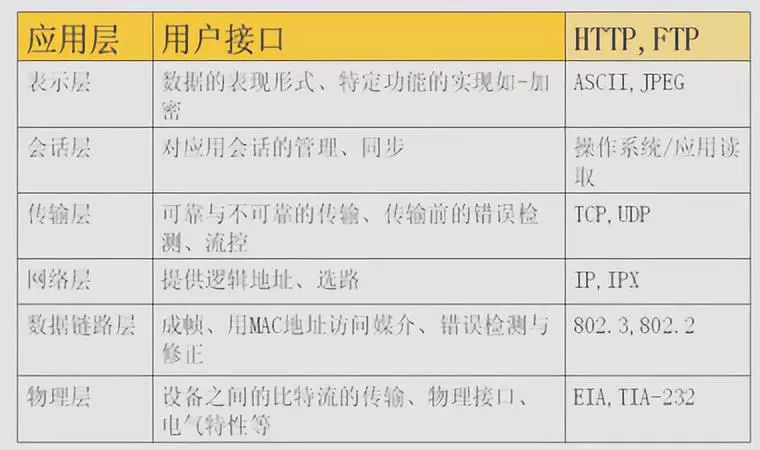

# NetWork

* 硬件网卡，网线，交换机这些，用来处理数据的。
* 协议数据在网络中通信如何组织？如何识别？如何保证数据的正确性
* 操作系统这就是如何把计算机网络和操作系统结合起来的问题了
    - 对于操作系统来说，网卡也是一种硬件资源。但是网络不单只是一种硬件，而是一种媒体入口。比如操作系统管理硬盘，当然不是简单的记一下硬盘有多大，然后一切操作都交给硬盘芯片去做，更多的需要组织硬盘的扇区，分区，记录文件和扇区/偏移的关系等等。
    - 操作系统对于网络来说也是如此，要记录自身在网络的标识（ip），可被他人访问的入口（port），以及对方的信息（remote ip/port）。连接，断开，数据确认等操作也是由协议控制。传递自身消息给对方，类似访问硬盘一样把内存中的数据传递给网卡缓存，再发消息给网卡让网卡去传数据，而是否发送成功这些保证不再由硬件中断信号反馈，而是通过网络协议完成。接收对方消息，也是接收到网卡中断，再把数据从网卡缓存移动到内存中，再通过协议给予对方反馈。

## 网络

* 集线器（Hub）：一个将网线集结起来的作用，实现最初级的网络互通。集线器是通过网线直接传送数据的，工作在物理层
* 交换机：给这台设备加入一个指令，可以根据网口名称自动寻址传输数据。实现了任意两台电脑间的互联。工作在数据链路层。
    - 保存的是每个计算机的网卡MAC地址与你所在的计算机的接口：通过学习，可以把MAC地址，端口号完善
    - 既可以连接PC机，又可以连接路由器
    - 根据Mac地址表转发数据
    - mac地址表含有Mac地址和接口
* 路由器：先在各自的操作系统上加上一套相同的协议。不同村落通信时，信息经协议加工成统一形式，再经由一个特殊的设备传送出去。这个设备就叫做路由器。每个机器都被赋予了一个IP地址。协议便是TCP/IP协议簇。
    - 是用来互联不同网段的设备。根据路由表转发数据
    - 理由表中含有网段和接口（！！！注意：绝对不能把路由器接在两个相同的网段上。）
* ARP协议：它是一种广播，通过ip地址得到MAC地址的广播协议。
    - 代理ARP工作原理：路由器可以分割网段和广播，比如广播后只能在同一个网段接收到，而在其他的网段不会听见广播。

```
arp -a
```

## OSI（Open Systems Interconnection Model）

* 从上往下的，越底层越接近硬件，越往上越接近软件，是一个标准
* 计算机与网络传输：每层进行层层解包和附加自己所要传递的信息，术语叫做报头。
* OSI（Open Systems Interconnection Model）
    - 应用层：HTTP,解决如何包装数据。各种应用软件，包括 Web 应用。利用TCP在两台电脑(通常是Web服务器和客户端)之间传输信息的协议。
    - 表示层：数据格式标识，基本压缩加密功能。上传的数据是以什么样的编码来编码，编码状态和回话方式，不是以人来自定义来完成的，而是由人在应用层操作来完成的
    - 会话层：控制应用程序之间会话能力；如不同软件数据分发给不同软件。_软件_
    - 传输层：端到端传输数据的基本功能；内嵌在IP数据包的"数据"部分 如 TCP、UDP。在原有的上层的数据外围标记两个标签：第一源端口，第二目的端口，从这个端口出去，访问另一个端口  数据被称作段（Segments）
        + TCP（Transmission Control Protocol）传输控制协议：没有长度限制，理论上可以无限长，但是为了保证网络的效率，通常TCP数据包的长度不会超过IP数据包的长度，以确保单个TCP数据包不必再分割
            * 能够确保数据不会遗失
            * 缺点是过程复杂、实现困难、消耗较多的资源。
        + UDP协议：格式几乎就只是在数据前加上发送端口和接收端口
            * 优点是比较简单，容易实现
            * 缺点是可靠性较差，一旦数据包发出，无法知道对方是否收到。
    - 网络层：定义IP编址，定义路由功能；如不同设备的数据转发。 数据被称做包（Packages）地址层 在数据外围加一个原ip地址和目的ip地址
        + IP（Internet Protocol）互联网协议
            * 解决三个问题：寻址、路由、封装
            * 分为两部分：网络地址+设备地址，处于同一个子网络的电脑IP地址的网络部分必定是相同的
            * 子网掩码：TCP/IP协议使用子网掩码确定主机是在本地子网中还是在远程网络中。将Ip地址和子网掩码(subnet mask)排在一起比较，就可以分清楚改地址的网络部分和主机部分
                - A类IP地址: 0.0.0.0~127.0.0.0
                - B类IP地址:128.0.0.1~191.255.0.0
                - C类IP地址:192.168.0.0~239.255.255.0
                - 子网掩码：就是表示子网络特征的一个参数。它在形式上类似IP地址，也是一个32位二进制数字，它的网络部分全部为1，主机部分全部为0
                - 将两个IP地址与子网掩码分别进行 AND 运算，然后比较结果是否相同，如果是的话，就表明它们在同一个子网络中，否则就不是
            * IP协议头
                - 八位的TTL字段:规定该数据包在穿过多少个路由之后才会被抛弃。某个IP数据包每穿过一个路由器，该数据包的TTL数值就会减少1，当该数据包的TTL成为零，它就会被自动抛弃。
        + ARP及RARP协议:根据IP地址获取MAC地址的一种协议
            * 一种解析协议，本来主机是完全不知道这个IP对应的是哪个主机的哪个接口，当主机要发送一个IP包的时候，会首先查一下自己的ARP高速缓存（就是一个IP-MAC地址对应表缓存）
            * 如果查询的IP－MAC值对不存在，那么主机就向网络发送一个ARP协议广播包，这个广播包里面就有待查询的IP地址，而直接收到这份广播的包的所有主机都会查询自己的IP地址，如果收到广播包的某一个主机发现自己符合条件，那么就准备好一个包含自己的MAC地址的ARP包传送给发送ARP广播的主机。
            * 广播主机拿到ARP包后会更新自己的ARP缓存（就是存放IP-MAC对应表的地方）。发送广播的主机就会用新的ARP缓存数据准备好数据链路层的的数据包发送工作
    - 数据链路层：确定了 每个网络设备的 MAC 地址.定义数据的基本格式，如何传输，如何标识。将0、1序列划分为数据帧从一个节点传输到临近的另一个节点,这些节点是通过MAC来唯一标识的。数据被称为帧（Frames） _操作系统_
        + MAC：介质访问控制（Media Access Control）一个主机会有一个MAC地址，不能改变，在电脑出厂时已经刷在了网卡上了，Mac地址犹如身份证的ID是唯一的
        + 完成加封（盖个戳，加个标记）与解封、数据量层
            * 加封：盖个戳，加个标记， 数据链路层重点是在数据包外部加一个原MAC地址，目标Mac地址的标记
            * mac地址：网卡的物理地址，也是网卡的实际地址。 加原Mac地址+目的mac地址
        + 多少字节为一个包之类
        + Ethenet 和 Wifi 基本就是属于这个层次。所以 wifi 协议其实就是解决的一个链路和物理层的问题
        + 封装成帧: 把网络层数据报加头和尾，封装成帧,帧头中包括源MAC地址和目的MAC地址。
        + 透明传输:零比特填充、转义字符
        + 可靠传输: 在出错率很低的链路上很少用，但是无线链路WLAN会保证可靠传输
        + 差错检测(CRC):接收者检测错误,如果发现差错，丢弃该帧
    - 物理层：数据被称为比特流（Bits）负责0、1比特流与物理设备电压高低、光的闪灭之间的互换。通信线缆（光缆、无线），线缆的标准统统属于物理层  _物理设备_
* TCP/IP协议模型（Transmission Control Protocol/Internet Protocol）层对应关系
    - 应用层：HTTP 应用层 表示层 会话层 curl
        + 在传输数据时，可以只使用（传输层）TCP/IP协议，但是那样的话，如果没有应用层，便无法识别数据内容，如果想要使传输的数据有意义，则必须使用到应用层协议，应用层协议有很多，比如HTTP、FTP、TELNET等，也可以自己定义应用层协议。WEB使用HTTP协议作应用层协议，以封装HTTP文本信息，然后使用TCP/IP做传输层协议将它发到网络上。
    - 传输层  TCP UDP telent
    - 网络层 IP ping traceroute
    - 数据链路层 物理层
* 子网掩码决定了一个子网的计算机数目，简单的算法就是2的M次方。M表示二进制的子网掩码后面0的数目




```
10.10.27.115 # ip
255.255.255.0 # 子网掩码
10.10.27.0 # 网络
0.0.0.115 # 主机地址为
```

## 网络命令

* ping:确定网络是否正确连接，以及网络连接的状况.是ICMP的最著名的应用，是TCP/IP协议的一部分。利用"ping"命令可以检查网络是否连通，可以很好地帮助我们分析和判定网络故障。原理是用类型码为0的ICMP发请 求，受到请求的主机则用类型码为8的ICMP回应。
* ipconfig:用于显示当前的TCP/IP配置的设置值
* Traceroute:是用来侦测主机到目的主机之间所经路由情况的重要工具。它收到到目的主机的IP后，首先给目的主机发送一个TTL=1的UDP数据包，而经过的第一个路由器收到这个数据包以后，就自动把TTL减1，而TTL变为0以后，路由器就把这个包给抛弃了，并同时产生 一个主机不可达的ICMP数据报给主机。主机收到这个数据报以后再发一个TTL=2的UDP数据报给目的主机，然后刺激第二个路由器给主机发ICMP数据 报。如此往复直到到达目的主机。这样，traceroute就拿到了所有的路由器IP。 -

```sh
ping  主机名
ping  域名
ping  IP地址

ping 127.0.0.1 # 如果测试成功，表明网卡、TCP/IP协议的安装、IP地址、子网掩码的设置正常。如果测试不成功，就表示TCP/IP的安装或设置存在有问题。
ping 本机IP地址 # 如果测试不成功，则表示本地配置或安装存在问题，应当对网络设备和通讯介质进行测试、检查并排除。
ping 局域网内其他IP #如果测试成功，表明本地网络中的网卡和载体运行正确。但如果收到0个回送应答，那么表示子网掩码不正确或网卡配置错误或电缆系统有问题。
ping 网关IP # 这个命令如果应答正确，表示局域网中的网关路由器正在运行并能够做出应答。
ping 远程IP # 如果收到正确应答，表示成功的使用了缺省网关。对于拨号上网用户则表示能够成功的访问Internet（但不排除ISP的DNS会有问题）。
ping localhost # local host是系统的网络保留名，它是127.0.0.1的别名，每台计算机都应该能够将该名字转换成该地址。否则，则表示主机文件（/Windows/host）中存在问题。
ping www.yahoo.com # 对此域名执行Ping命令，计算机必须先将域名转换成IP地址，通常是通过DNS服务器。如果这里出现故障，则表示本机DNS服务器的IP地址配置不正确，或它所访问的DNS服务器有故障如果上面所列出的所有ping命令都能正常运行，那么计算机进行本地和远程通信基本上就没有问题了。但是，这些命令的成功并不表示你所有的网络配置都没有问题，例如，某些子网掩码错误就可能无法用这些方法检测到。

ping IP -t # 连续对IP地址执行ping命令，直到被用户以Ctrl+C中断。
ping IP -l 2000 # 指定ping命令中的特定数据长度（此处为2000字节），而不是缺省的32字节。
ping IP -n 20 # 执行特定次数（此处是20）的ping命令。

ipconfig # 显示每个已经配置了的接口的IP地址、子网掩码和缺省网关值
ipconfig /all # 为DNS和WINS服务器显示它已配置且所有使用的附加信息，并且能够显示内置于本地网卡中的物理地址（MAC）
```

## 同步与异步

关注的是消息通信机制 (synchronous communication/ asynchronous communication)

* 同步:在发出一个 *调用* 时，在没有得到结果之前，该 *调用* 就不返回。但是一旦调用返回，就得到返回值了
* 异步:*调用*在发出之后，调用就直接返回了，所以没有返回结果。换句话说，当一个异步过程调用发出后，调用者不会立刻得到结果。而是在*调用*发出后，*被调用者*通过状态、通知来通知调用者，或通过回调函数处理这个调用。

## 阻塞与非阻塞

程序在等待调用结果（消息，返回值）时当前线程状态

* 阻塞调用：指调用结果返回之前，当前线程会被挂起。调用线程只有在得到结果之后才会返回
* 非阻塞调用：在不能立刻得到结果之前，该调用不会阻塞当前线程

* 子网
    - 子网划分只是一种逻辑上的划分方式，子网与广播域之间并不存在一一对应的关系。
    - 一个VLAN上也可以运行多个子网，只是通常情况下我们在实施时将子网与VLAN一一对应了。
    - VLAN通过帧的tag为标记帧是属于哪个VLAN的，广播帧不会在VLAN之间传播，泛洪也只会传播到自己所属的VLAN中。
    - 子网划分之后，所有子网对外依然是一个逻辑上的单一网络，也即外界通过一次路由便可以找到。
* 以太网
    - 以太网中一台机器发送的数据所有机器都能接收到，然后基于目的地MAC判断是否接收该数据。
    - 当以太网中计算机发现有CRC检查出错时，直接丢弃该包。数据的可靠性传输交给了TCP这样的高层协议。以太网保证最大努力交付，即不可靠交付。
    - 以太网通过CSMA/CD保证同一时刻只有一台计算机在发送数据，并且是半双工，如果发现有碰撞，则推迟一个随机时间再次发送。
    - 以太网采用曼彻斯特编码。
    - 10BASE-T双绞线以太网的出现，是局域网发展史的重要里程碑，从此以太网拓扑有总线型变为星型，而以太网在局域网中占据了统治地位。
    - 使用了集线器的以太网在逻辑上依然是个总线网，依然采用CSMA/CD协议。
    - 以太网一开始是总线型的，是因为那时的以太网交换机太昂贵了，而无源的总线结构要廉价得多。
    - 以太网各帧之间的发送有一定间隙，因此帧不需要结束定界符。
    - 虽然以太网交换机不适用CSMA/CD，但是其数据帧依然使用以太网帧，因此依然叫以太网。
* 路由器
    - 路由器隔离广播帧，路由器将丢弃广播帧。
    - 家用路由器的所有LAN网口相当于其内部通过一个交换机相连接，交换机在连接到路由器的LAN端网卡上。
    - 路由器每一个接口都有不同的网络号，因此一个路由器的接口就连接的一个网络。家用路由器虽然有多个接口，但是所有的LAN口其实背后是一个交换机，该交换机再连接路由器的LAN网卡接口。
    - 通常来说，路由器中也有默认路由记录，当路由表中找不到目的IP的路由记录时，则使用默认路由。
* MAC地址一共6个字节，前三个字节由IEEE统一分配，由商家购买，后三个字节有商家自行分配。
* 网卡在收到数据帧时通过硬件判断该帧的目的MAC地址是否发往本站，如果不是则丢弃。以下三种情况下表示帧是发往本站的：
* 单播，即帧目的MAC地址=本机MAC地址
* 多播，发送给该局域网上一部分机器
* 广播，发送给局域网上所有的机器，MAC地址全是F
* 网卡可以设置为混杂模式，即不是发往本机的帧也可以接下来，比如有些抓包软件便是以这种方式工作的。
* 同一个冲突域下的所有主机，同一时刻都只允许一台机器发送数据。
* 网桥有两个端口，通过对比目的地MAC与网桥内部的地址表来判断帧是否送往另一个端口。
* 二层交换机其实就是一个多接口的网桥，每个接口连接一台计算机或者另一个交换机，每一个接口对应一个冲突域，数据可以全双工传输。
* 二层交换机在没有查到地址表记录时，则向所有端口广播（泛洪）该帧，请注意这里的广播并不是是广播帧的一是，而只是一种动作。
* 如果交换机某端口接收到了广播帧，则不会查MAC地址表，而是直接将该帧发给所有的其他端口。
* 网络层不提供服务质量的承诺，只保证最大努力传输，不会对数据包进行编号，这样网络层设计比较简单。
* 网络层中与IP协议配套的还有：ARP协议，ICMP协议，IGMP协议，其中IP使用ARP，而ICMP和IGMP使用IP。
* IP
    - 各种异构的网络在网络层看来好像是一个统一的网络，这种网络也称为IP网，主机之间通信无需看到异构的细节，因此有了IP网之后，网络的物理异构性对通信来讲是透明的。在这种覆盖全球的IP网上再使用TCP协议，那么就成了现在的互联网。
    - 分类IP是很原始的IP划分方式，其实在1993年提出的无分类编址之后，虽然在教科书中依然可以看到分类IP，但是事实上基本不用了。
    - 一个网络表示所有IP网络号相同的主机的集合。
    - 实际上IP地址是标识一台主机（或路由器）和一条链路的接口。当一台主机同时连接两个网络是，那么这台主机就必须同时拥有两个IP，比如路由器就是典型的例子。
    - 主机为全部为0的IP地址表示本网络。
    - IP协议规定，在互联网中所有主机和路由器，必须能够接收长度不超过576字节的IP数据报，除非知道对方能够接受更大的数据量（比如通过TCP约定），即上层交来的512字节+最大60字节IP首部+4字节富余量。
    - IP包理论上可以有64K字节这么大，但是以太网数据链路的MTU为1500字节，因此对于大于1500字节的IP包都需要进行分片发送。
    - 对于IP，如果某个分片被弄丢了， 那么在最终目的地是没办法正确重组的。 整个IP包就是一个垃圾IP包， IP层也不会有重传机制。 如果上次是TCP, 那么TCP会负责重传。可以看到， 分片会带来一些问题， 所以TCP尽量避免分片， 而采用提前分段的方式。
    - ARP协议只解决* IP包中有个"总长度"的字段，为16位，表示整个IP数据包的总长度（字节），从这个16为可以算出理论上IP包的长度最大为2^16=64k字节，但是现实中极少有这种包出现。
    - IP包中的“片偏移”以8个字节为偏移单位，也就是说IP包中的数据量必须为8个字节的整数倍。
    - IP包中的“协议”字段表示该IP包中所包含数据所使用的上层协议，比如TCP、UDP等。在同一个局域网中主机和路由器的IP地址和MAC地址之间的映射问题。
    - Linux在重组IP包时，现将所有的分片放到重组队列中，如果30秒中重组队列中的包没有到齐，则重组过程失败（意味着上层，比如TCP，将无法收到该IP包），重组队列被释放，同时向发送方以ICMP协议通知失败信息
    - 一个数据包在传输过程中，目的IP和源IP是永远不变的(使用了NAT协议除外)，一直是主机和服务器的IP，而目的mac和源mac却是一直变化的，这也是arp协议存在的一个理由
    - 三层(IP)广播即IP地址中的主机号全是1的IP包，IP广播将导致二层链路层广播（MAC目的地址全是F）。另外，IP地址为255.255.255.255的也是广播，这种情况用于主机还不知道自己IP地址的时候(比如向DHCP服务器索要地址时、PPPOE拨号时等)，由于路由器不会转发广播帧，因此这种广播也不会逃出本地网络
* MTU = MSS + TCP首部长度 + IP首部长度，故在以太网中(网络层以IPv4为例)：MSS = 以太网MTU - TCP首部长度 - IPv4首部长度 = 1500 - 20 - 20 = 1460字节。未指定MSS时默认值为536字节，这是因为在Internet中标准的MTU值为576字节，576字节MTU = TCP首部长度20字节 + IPv4首部长度20字节 + 536字节MSS
* TCP
    - MSS是TCP里的一个概念（首部的选项字段中）。MSS是TCP数据包每次能够传输的最大数据分段，TCP报文段的长度大于MSS时，要进行分段传输。TCP协议在建立连接的时候通常要协商双方的MSS值，每一方都有用于通告它期望接收的MSS选项（MSS选项只出现在SYN报文段中，即TCP三次握手的前两次）。MSS的值一般为MTU值减去两个首部大小（需要减去IP数据包包头的大小20Bytes和TCP数据段的包头20Bytes）所以如果用链路层以太网，MSS的值往往为1460。而Internet上标准的MTU（最小的MTU，链路层网络为x2.5时）为576，那么如果不设置，则MSS的默认值就为536个字节。很多时候，MSS的值最好取512的倍数。TCP报文段的分段与重组是在运输层完成的。到了这里有一个问题自然就明了了，TCP分段的原因是MSS，IP分片的原因是MTU，由于一直有MSS<=MTU，很明显，分段后的每一段TCP报文段再加上IP首部后的长度不可能超过MTU，因此也就不需要在网络层进行IP分片了。因此TCP报文段很少会发生IP分片的情况。
    - TCP在通信双方之间建立起了一条基于字节流的全双工通道。
    - TCP包中的序号字段表示该包中第一个字节的序号，序号位有4个字节，也即4G大小。
    - TCP的确认号表示希望对象下一次报文段的第一个字节的序号。
    - TCP连接建立之后，所有的报文的ACK值都必须为1。
    - TCP的PSH（push）值为1时，表示发送方需要立即发送该报文而不缓存，接收方需要立即将将该该报文交付给应用程序。
    - TCP的SYN=1并ACK=0，表示发起连接请求，SYN=1并ACK=1表示接受连接请求，因此SYNC=1的包表示连接的请求或接收报文。
    - TCP的窗口字段为2字节，窗口值告诉对方：从该报文确认号算起，接收方允许对方发送的字节数。之所以有这个窗口值，是因为接收方的缓存是有限的，因此需要进行流量控制。
    - TCP的窗口值告诉对方：发送方的发送窗口不能超过接收方的接收窗口，TCP的窗口单位是字节，不是报文段。当接收方回复的窗口值为0时，发送方应立即停止发送，直到接收方重新发出一个新的窗口值为止。
    - TCP的滑动窗口以字节为单位。
    - 应用程序将数据发送到TCP发送缓存后，TCP是如何分段的事情就交给TCP了。
    - TCP延迟确认算法：通过延迟一定时间(默认40ms)，将多个ACK确认包合并在一起发送，这样减少了ACK确认包在网络中的数量，提高了网络性能。
    - TCP_CORK禁止发送小包，可以认为是Nagle算法的增强，因此TCP_CORK和TCP_NODELAY恰恰相反。
    - 默认TCP的keepalive时间为2小时。
    - Socket设置TCP_QUICKACK可以禁用延迟确认。
    - TCP_NOPUSH会设置CORK算法，表示数据包不会马上传送出去，等到数据包最大时，一次性的传输出去，这样有助于解决网络堵塞。
    - web服务器,下载服务器(ftp的发送文件服务器)，需要带宽量比较大的服务器，用TCP_CORK。涉及到交互的服务器，比如ftp的接收命令的服务器，必须使用TCP_NODELAY
* Nagle算法
    - Nagle算法用于减少TCP中小包的发送。
    - Nagle算法：如果应用程序逐个字节的将数据发送到TCP缓存(比如Telnet)，那么TCP就先把第一个字节发出去，把后面到达的自己都缓存起来，当收到第一个字节的确认后，再将缓存中的所有数据组装成一个报文发送出去。这样做可以减少TCP所用的网络带宽。
    - Nagle原本就是为诸如Telnet或rlogin这样的应用程序而创建的。
    - Nagle算法还规定：当缓存的数据已经到达发送窗口的一半或者报文段的MSS时，则立即发送。
    - 默认情况下Nagle和延迟ACK都是开启的，此时延迟确认和Nagle同时使用会大大降低网络性能，因为发送方在等待接收方的ACK，但是接收方却延迟了ACK。因此Socket提供提供了TCP_NODELAY选项来禁用Nagle算法
* Linux的sendfile系调用可以实现将服务器中的本地文件直接拷贝（通过DMA）到Socket缓存，进而发送到网络中，避免了文件数据的多次拷贝
* Nginx
    - Nginx中，当使用sendfile函数时，TCP_NOPUSH才起作用，因为在sendfile时，Nginx会要求发送某些信息来预先解释数据，这些信息其实就是报头内容，典型情况下报头很小，而且套接字上设置了TCP_NODELAY。有报头的包将被立即传输，在某些情况下（取决于内部的包计数器），因为这个包成功地被对方收到后需要请求对方确认。这样，大量数据的传输就会被推迟而且产生了不必要的网络流量交换。而通过设置TCP_NOPUSH=on，表示将所有HTTP的header一次性发出去
    - Nginx的TCP_NODELAY只有在配置长连接时才起作用，因为长连接可能引起小包的阻塞，配置TCP_NODELAY可以避免该阻塞
    - 在 nginx 中，tcp_nopush 配置和 tcp_nodelay “互斥”。
    - 默认nginx访问后端都是用的短连接(HTTP1.0)，一个请求来了，Nginx 新开一个端口和后端建立连接，后端执行完毕后主动关闭该链接）。
    - 默认情况下，nginx已经自动开启了对client连接的keep alive支持（同时client发送的HTTP请求要求keep alive）。
* Use the tcp_nopush directive together with the sendfile on;directive. This enables NGINX to send HTTP response headers in one packet right after the chunk of data has been obtained by sendfile().
* 默认路由：A default route is the route that takes effect when no other route is available for an IP destination address.If a packet is received on a routing device, the device first checks to see if the IP destination address is on one of the device’s local subnets. If the destination address is not local, the device checks its routing table. If the remote destination subnet is not listed in the routing table, the packet is forwarded to the next hop toward the destination using the default route. The default route generally has a next-hop address of another routing device, which performs the same process. The process repeats until a packet is delivered to the destination.

## Overlay 网络

* 组成：
    - 边缘设备：是指与虚拟机直接相连的设备
    - 控制平面：主要负责虚拟隧道的建立维护以及主机可达性信息的通告
    - 转发平面：承载 Overlay 报文的物理网络
* 采用TRILL、VxLan、GRE、NVGRE等隧道技术
    - TRILL（Transparent InterconnecTIon of Lots of Links）技术是电信设备厂商主推的新型环网技术
    - NVGRE（Network VirtualizaTIon using Generic RouTIng EncapsulaTIon）STT（Stateless Transport Tunneling Protocol）是IT厂商主推的Overlay技术；
    - 非常熟悉的VXLAN（Virtual eXtensible LAN）等基于隧道的封装技术

## 网络测速

```sh
# Speedtest
sudo apt install speedtest-cli
sudo pip3 install speedtest-cli
speedtest

# fast
npm install --global fast-cli
fast -u

# iPerf
sudo apt install iperf
ip addr show | grep inet.*brd # Obtain the IP address of the server machine
iperf -s # incoming connections from clients
iperf -c 192.168.1.2 # substituting the IP address of your server machine for the sample one
```

## 图书

* 《TCP/IP 协议详解》
* 《TCP/IP高效编程：改善网络程序的44个技巧》
* 《Unix环境高级编程》Unix Network Programming
* 《Unix网络编程：卷一》

## 工具

* [localtunnel/localtunnel](https://github.com/localtunnel/localtunnel):expose yourself https://localtunnel.me
* [cisco/joy](https://github.com/cisco/joy):A package for capturing and analyzing network flow data and intraflow data, for network research, forensics, and security monitoring.
* [SolarWinds](http://www.solarwinds.com):管理大小企业网络上的网络流量。网络设备监控器可监控你网络上的任何一个设备，查找各种提示或错误
* [maxmcd/webtty](https://github.com/maxmcd/webtty):Share a terminal session over WebRTC https://maxmcd.github.io/webtty/
* [fatedier/frp](https://github.com/fatedier/frp):A fast reverse proxy to help you expose a local server behind a NAT or firewall to the internet.
* [v2ray/v2ray-core](https://github.com/v2ray/v2ray-core):A platform for building proxies to bypass network restrictions. https://www.v2ray.com/
* [librenms/librenms](https://github.com/librenms/librenms):Community-based GPL-licensed network monitoring system http://www.librenms.org/
* [Zenmap](https://nmap.org/zenmap/):Nmap网络扫描器的官方前端程序
* [IPv6 连接测试](https://test-ipv6.com/)

## 参考

* [SystemsApproach/book](https://github.com/SystemsApproach/book):Meta-data and Makefile needed to build the book. Main starting point.
* [TCP/IP 视频讲解 计算机网络](https://www.bilibili.com/video/av10610680)
