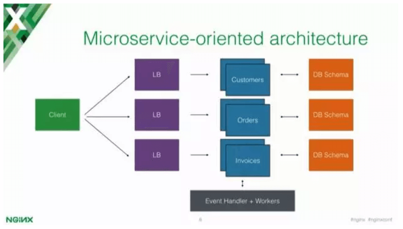

# [microservices](https://www.microservices.com/)

* 业务系统需要彻底的组件化和服务化，原有的单个业务系统会拆分为多个可以独立开发，设计，运行和运维的小应用
* 这些小应用之间通过服务完成交互和集成。每个小应用从前端web ui，到控制层，逻辑层，数据库访问，数据库都完全是独立的一套
* 在这里我们不用组件而用小应用这个词更加合适，每个小应用除了完成自身本身的业务功能外，重点就是还需要消费外部其它应用暴露的服务，同时自身也将自身的能力朝外部发布为服务。 如果一句话来谈SOA和微服务的区别，即微服务不再强调传统SOA架构里面比较重的ESB企业服务总线，同时SOA的思想进入到单个业务系统内部实现真正的组件化。 把这个核心搞清楚后，再来看下网上找到的对微服务架构的一些定义和阐述：
微服务可以在“自己的程序”中运行，并通过“轻量级设备与HTTP型API进行沟通”。关键在于该服务可以在自己的程序中运行。通过这一点我们就可以将服务公开与微服务架构（在现有系统中分布一个API）区分开来。在服务公开中，许多服务都可以被内部独立进程所限制。如果其中任何一个服务需要增加某种功能，那么就必须缩小进程范围。在微服务架构中，只需要在特定的某种服务中增加所需功能，而不影响整体进程。 微服务不需要像普通服务那样成为一种独立的功能或者独立的资源。定义中称，微服务是需要与业务能力相匹配，这种说法完全正确。不幸的是，仍然意味着，如果能力模型粒度的设计是错误的，那么，我们就必须付出很多代价。如果你阅读了Fowler的整篇文章，你会发现，其中的指导建议是非常实用的。在决定将所有组件组合到一起时，开发人员需要非常确信这些组件都会有所改变，并且规模也会发生变化。服务粒度越粗，就越难以符合规定原则。服务粒度越细，就越能够灵活地降低变化和负载所带来的影响。然而，利弊之间的权衡过程是非常复杂的，我们要在配置和资金模型的基础上考虑到基础设施的成本问题。
再强调下即： 首先对于应用本身暴露出来的服务，是和应用一起部署的，即服务本身并不单独部署，服务本身就是业务组件已有的接口能力发布和暴露出来的。了解到这点我们就看到一个关键，即我们在进行单个应用组件设计的时候，本身在组件内部就会有很大接口的设计和定义，那么这些接口我们可以根据和外部其它组件协同的需要将其发布为微服务，而如果不需要对外协同我们完全可以走内部API接口访问模式提高效率。 其次，微服务架构本身来源于互联网的思路，因此组件对外发布的服务强调了采用HTTP Rest API的方式来进行。这个也可以看到在互联网开放能力服务平台基本都采用了Http API的方式进行服务的发布和管理。从这个角度来说，组件超外部暴露的能力才需要发布为微服务，其本身也是一种封装后的粗粒度服务。而不是将组件内部的所有业务规则和逻辑，组件本身的底层数据库CRUD操作全部朝外部发布。否则将极大的增加服务的梳理而难以进行整体服务管控和治理。 微服务的基本思想在于考虑围绕着业务领域组件来创建应用，这些就应用可独立地进行开发、管理和加速。在分散的组件中使用微服务云架构和平台使部署、管理和服务功能交付变得更加简单。 对于互联网谈到微服务架构一定会谈到Devops即开发测试和部署运维的一体化。当我们的单体应用以及拆分为多个小应用后，虽然整体架构可以松耦合和可扩展，但是如果拆分的组件越多，这些组件之间本身的集成和部署运维就越复杂。即任何一个组件，当他依赖的外部其它应用组件越多的时候，整个集成，部署和联调测试的过程就越复杂。这些如果完全靠我们手工去完成一是增加工作量，一是增加出错概率。 原来谈组件化开发谈的最多的是单个组件的持续集成，包括配置环境集成，自动打包部署，自动化的冒烟测试等。对于微服务架构下首先仍然是要做好单个组件本身的持续集成，其次在这个基础上增加了多个组件的打包部署和组件间的集成。里面的核心思想就是Devops的思路，希望能够实现开发设计到部署运维的一体化。 由于微服务架构里面强调了单个组件本身是可以在独立的进程里面运行，各个组件之间在部署的时候就能够做到进程级别的隔离。那么一台服务器我们可能需要初始化几十个甚至更多的进程来进行应用组件的部署。为了保持进程的隔离性，我们可以用虚拟机，但是当几十个进程都完全用独立的虚拟机就不现实的，而这个问题的解决刚好就是利用PaaS平台里面的轻量Docker容器来做这个事情，每个Docker是独立的容器刚好又完全做到进程级别的隔离，资源占用率又最小，这些特点刚好满足微服务架构的开发测试和自动化部署。 前面这些问题思考清楚后就是考虑所有暴露的微服务是否需要一个统一的服务管控和治理平台，按照当前微服务架构的整体思路，虽然单个服务的实现和发布仍然是在组件内部完成的，但是这些组件暴露的服务本身的调用情况，服务本身的安全，日志和流量控制等仍然需要一个统一的SOA服务管理平台来完成。 由于微服务尽量都是通过HTTP API的方式暴露出去的，因此这种服务管理平台不需要像传统企业内部的ESB服务总线这么重。但是最基本的服务注册，服务代理，服务发布，服务简单的路由，安全访问和授权，服务调用消息和日志记录这些功能还是需要具备。类似淘宝的Dubbo架构，即可以做为微服务架构下的服务管控平台。 对于这种服务管控平台，核心需要讨论的就是服务每次调用本身的消息传递，输入和输出日志是否需要记录，当前就有两种做法，一种是不记录，管理平台只负责服务注册和目录发布，安全授权，实际的服务访问仍然是两个组件之间的点对点连接完成，这种方式下整个架构下获取更高的性能，同时服务管理平台也不容易成为大并发服务访问下的单点瓶颈；另外一种方式就是完全记录，在这种方式下就需要考虑服务管理平台本身的集群化不是，高并发下的性能问题。而个人建议最好的方式还是SOA服务管理平台应该提供两种管理能力，同时仅仅对核心的需要Log日志的服务进行日志记录，而其它服务只提供服务目录和访问控制即可。 

* 单体应用本身带来的问题
    - 系统复杂：内部多个模块紧耦合，关联依赖复杂，牵一发而动全身
    - 运维困难：变更或升级的影响分析困难，任何一个小修改都可能导致单体应用整体运行出现故障
    - 无法扩展：无法拆分部署，出现性能瓶颈后往往只能够增加服务器或增加集群节点，但是DB问题难解决

正是由于这些原因需要考虑引入微服务架构（实质仍然是单个应用本身的组件化和服务化），对于微服务文章里面有一个详细说明如下：一个微服务一般完成某个特定的功能，比如订单管理、客户管理等。每个微服务都是一个微型应用，有着自己六边形架构，包括商业逻辑和各种接口。有的微服务通过暴露 API 被别的微服务或者应用客户端所用；有的微服务则通过网页 UI 实现。在运行时，每个实例通常是一个云虚拟机或者 Docker 容器。 从这个定义和说明仍然需要做一些关键理解，即在我前面谈微服务的文章里面谈到过的，即核心的几点包括了，其一足够构成一个独立小应用（从DB到UI），其二微服务应用之间只能通过Service API进行交互，其三一般运行在云虚拟机或更轻的Docker容器上。 API Gateway，这实际上微服务架构里面的很重要的内容，其作用类似于传统企业内部的ESB服务总线，只是更加轻量和高性能来解决微服务的管控和治理问题。而对于负载均衡，缓存，路由，访问控制，服务代理，监控，日志等都属于基本的服务管控内容，也是API Gateway需要考虑的核心能力。 Scale Cube的3D模型，描述的相当好，即通过微服务架构实施后扩展性的变化。 1. Y轴：本质是应用的分解，即将传统的单体应用分解为多个微服务应用。
2. X轴：水平弹性扩展能力，即通过负载均衡来实现水平弹性扩展，但是DB问题无法解决，引入3
3. Z轴：当单个微服务应用引入了DB弹性扩展能力要解决的时候，我们引入了对数据库进行拆分和DaaS 对于微服务架构的好处前面在讲单体应用的问题的时候已经谈到了，微服务架构正好是解决这些问题。而对于微服务架构的不足，简单总结如下： 1. CAP原则：由于服务无状态和引入了分布式，较难解决事务一致性问题。
2. 集成复杂：任何彻底的分解都将带来集成的复杂度，即模块在集成时候需要外部微服务模块更多的配合。
3. 部署问题：稍大项目都涉及到上100个服务节点部署，还涉及到部署后的配置，扩展和监控问题。 第二篇 使用API网关构建微服务 首先说下这篇文章的引入场景，以一个亚马逊购物网站的手机APP订单查看界面来举例，如果是一个单体应用，那么所有的界面需要获取信息都通过单体应用统一一个地址提供的多个Service API获取。但是转变为微服务架构后可以看到对于会员管理，商品管理，订单管理，财务结算管理等都已经拆分为了不同的微服务模块，需要从不同的服务提供地址调用不同的微服务模块提供的Service API来返回数据。 在原文里面我们看到对于客户端和微服务模块间点对点直接通讯提了三个问题，如下： 1. 问题一：客户端需求和每个微服务暴露的细粒度 API 不匹配
2. 问题二：部分服务使用的协议对 web 并不友好，如二进制RPC或AMQP消息等。
3. 问题三：会使得微服务难以重构，如服务拆分或服务组合的场景。 那么我们从传统的ESB能力来对上面三个问题进行一个说明，第一个问题即可能涉及到细粒度的API组合，类似组合服务无法做；其二是可能存在协议转换的问 题要解决；其三即服务透明的问题，即需要对客户端提供一个统一的服务目录以使底层服务透明。由于以上问题，引入了API服务网关的概念，再次强调，对于API服务网关即使微服务架构里面的轻量服务总线，解决服务管控和治理相关问题。文中对API Gateway给出如下说明： API 网关是一个服务器，也可以说是进入系统的唯一节点。这与面向对象设计模式中的 Facade 模式很像。API 网关封装内部系统的架构，并且提供 API 给各个客户端。它还可能还具备授权、监控、负载均衡、缓存、请求分片和管理、静态响应处理等功能。 API 网关负责服务请求路由、组合及协议转换。客户端的所有请求都首先经过 API 网关，然后由它将请求路由到合适的微服务。API 网关经常会通过调用多个微服务并合并结果来处理一个请求。它可以在 web 协议（如 HTTP 与 WebSocket）与内部使用的非 web 友好协议之间转换。 API 网关还能为每个客户端提供一个定制的 API。通常，它会向移动客户端暴露一个粗粒度的 API。以产品详情的场景为例，API 网关可以提供一个端点（/productdetails?productid=xxx），使移动客户端可以通过一个请求获取所有的产品详情。API 网关通过调用各个服务（产品信息、推荐、评论等等）并合并结果来处理请求。 API网关的优点和缺点 对于API网关的优点，其实是类似传统ESB企业服务总线的优点，即实现服务透明，同时对于服务运行过程中的日志，安全，路由，缓存等问题进行统一配置和处理，而不需要每个微服务API实现时都去考虑。如开源的Dubbo服务总线即可以看作是一个API网关的实现。 API网关和ESB的一些重要区别点在于API网关更加轻量和高性能，它不需要去考虑太多遗留系统和诸多协议的适配，其次也不需要考虑服务集成过程中的大 量数据转换和映射。同时为了提升服务网关的性能，一般API网关在实现过程中不会去记录详细的数据传输日志，或者类似Dubbo架构数据传输根本就不会通 过API网关。

Thrift 也能够让你选择传输协议，包括原始 TCP 和 HTTP。原始 TCP 比 HTTP 更高效，然而 HTTP 对于防火墙、浏览器和使用者来说更友好。文中对于两种实现方式已经描述的相当详细，可以看到当前互联网OpenAPI平台和微服务架构实现中仍然是大量以采用Rest API接口为主。 而对于消息格式的选择，可以看到在使用RestAPI接口的时候，更多的是采用了Json消息格式而非XML，对于SOAP WebService则更多采用了XML消息格式。如果采用Thrift则还可以采用二进制消息格式以提升性能。 第四篇 服务发现的可行方案以及实践案例

* 服务注册和服务目录库管理
    - 在结合了云端PaaS和Docker容器部署后，对于微服务模块部署完成后提供出来的IP地址是动态在变化的，包括模块在进行动态集群扩展的时候也需要动态接入新的服务提供IP地址。
    - 服务发现模式
        + 客户端发现模式
        + 服务端发现模式
服务客户端发现模式 使用客户端发现模式时，客户端决定相应服务实例的网络位置，并且对请求实现负载均衡
* 客户端查询服务注册表
    - 一个可用服务实例的数据库；然后使用负载均衡算法从中选择一个实例，并发出请求。客户端从服务注册服务中查询，其中是所有可用服务实例的库。客户端使用负载均衡算法从多个服务实例中选择出一 个，然后发出请求。 注：这是类似Dubbo实现机制一样的两阶段模式，即任何一个服务的消费都需要分两个步骤进行，第一步首先是访问服务注册库（更多是API GateWay提供的一个能力）返回一个已经动态均衡后的服务可用地址，第二步即客户端和该地址直接建立连接进行服务消费和访问。 在这种模式的实现中有两个重点，其一是动态负载均衡算法，其二是服务网关需要能够对原始服务提供点进行实时的心跳检测以确定服务提供的可用性。 Netflix OSS 是客户端发现模式的绝佳范例。Netflix Eureka 是一个服务注册表，为服务实例注册管理和查询可用实例提供了 REST API 接口。Netflix Ribbon 是 IPC 客户端，与 Eureka 一起实现对请求的负载均衡。 缺点：底层的IP虽然动态提供出去了，但是最终仍然暴露给了服务消费方，再需要进一步做安全和防火墙隔离的场景下显然是不能满足要求的。 服务端发现模式 客户端通过负载均衡器向某个服务提出请求，负载均衡器查询服务注册表，并将请求转发到可用的服务实例。如同客户端发现，服务实例在服务注册表中注册或注销。在原文中有图示，基本看图就清楚了，即在服务注册库前新增加了一个Load Balancer节点。注：这两个节点感觉是可以合并到API GateWay的能力中去的。 服务端发现模式兼具优缺点。它最大的优点是客户端无需关注发现的细节，只需要简单地向负载均衡器发送请求，这减少了编程语言框架需要完成的发现逻辑。并且 如上文所述，某些部署环境免费提供这一功能。这种模式也有缺点。除非负载均衡器由部署环境提供，否则会成为一个需要配置和管理的高可用系统组件。

服务注册表
需要高可用而且随时更新。客户端能够缓存从服务注册表中获取的网络地址，然而，这些信息最终会过时，客户端也就无法发现服务实例。因此，服务注册表会包含若干服务端，使用复制协议保持一致性
首先可以看到服务注册表本身不能是单点，否则存在单点故障，当服务注册表有多台服务器的时候同时需要考虑服务注册库信息在多台机器上的实时同步和一致。我们操作和配置服务注册信息的时候往往只会在一个统一的服务管控端完成
其次如果服务注册服务器宕机是否一定影响到服务本身的消费和调用，如果考虑更高的整体架构可用性，还可以设计对于服务注册库信息在客户端本地进行缓存，当服务注册表无法访问的时候可以临时读取本地缓存的服务注册库信息并发起服务访问请求
对于服务注册表，提供了三种选择，感觉最常用的实现仍然是基于ZooKeeper进行的
 Etcd – 高可用、分布式、一致性的键值存储，用于共享配置和服务发现。
Consul – 发现和配置的服务，提供 API 实现客户端注册和发现服务。
Apache ZooKeeper – 被分布式应用广泛使用的高性能协调服务。

服务实例必须在注册表中注册和注销。注册和注销有两种不同的方法
方法一是服务实例自己注册，也叫自注册模式（self-registration pattern）
另一种是采用管理服务实例注册的其它系统组件，即第三方注册模式
虽然方法一把服务实例和服务注册表耦合，必须在每个编程语言和框架内实现注册代码。但是在自己实现完整微服务架构中，考虑到PaaS平台下微服务模块的动
态部署和扩展，采用方法1相当来说更加容易实现。但是方法1仍然不能代替服务注册库本身应该具备的服务节点的心跳检测能力。

分布式与集群

* 把应用拆分成不同的模块（component）。于是取而代之的是多个不同的service被彼此独立的部署，彼此独立的伸缩。客户的订单和发票，这些模块将会被分别部署在他们自己的server上。
* 这些service之间的通信机制可以是多种格式的，通常是HTTP 或者 RPC（以及事件发布订阅的方式）。有时候你也可为每个模块分配不同的数据存储schema。这样的话，我们就把每个模块的能力都隔离开了，而且你还让它独立于其他模块而工作。
* 需要通过事件源机制来搞定一些事件触发。客户端创建一个新的订单。你就可以不用让客户端创建订单并且生成发票，取而代之的是，你可以创建一个新的订单，然后Orders这个模块push一个生成发票事件，然后其他的模块可以监听这个事件，然后来异步生成发票。

* 它适合大型应用。如果您有大型应用程序，则可以将此大型应用程序拆分成不同的模块，开发人员将能够独立地迭代，维护和构建这些模块。
* 微服务的每个模块（component）只做一件事情，有且仅有一件事情可以做，你可以轻松基于此迭代并且尽情的完善和创新该模块，而且还不会影响到其他的模块。每个模块之间，彼此通过接口进行通信（大多数时候），比如HTTP RESTful接口。你可以改变和实验性的搞一些实现，只要接口不改变，应用就会保持正常的运转。
* 需要scale组织或团队，你可以为你的团队成员分配一些更小的，应用程序中的一些小碎片，更小的开发任务。这对于开发人员来说，有助于他们更快的理解自己要做什么，代码是如何运作的。而且迭代起来也更快。如果他们要用到其他的模块，他们可以使用接口去消费（consume）其他的模块，而不需要深入到其他模块的代码中去。
* 如果出现一个问题，这个问题是被隔离在一个特定的模块中或者是某个service中。意味着整个应用程序只有那一个service处于停止状态，而其他的模块则可以照常运转。就是说我们现在有Orders和Invoices两个模块。如果由于一些原因，开发人员在周五晚上push了一个bug到Invoices模块上，然后导致了发票模块不能工作。我们依然可以保存了这个发票事件。一旦Invoices模块恢复了，我们就可以继续生成发票了
* 让这种事件驱动的风格更加的发扬光大，
* 你现有有一堆不再“固定”的零部件。现在不再是单体那样一个app在一个地方做了所有事情。现在你有多个模块和（或）service。这些模块要在同一时刻共同配合才能最终呈现给用户。
* 要有更强大的基础设施能力。现在你需要有一种魔法，要能简单地部署、伸缩、以及监控和管理这些不同的模块，这些独立的模块。这也是这些年来实时的在线监控和分析技术变得如此火爆的原因之一吧。因为一旦你是面向微服务的架构，你就必须去监控每一个碎片（零部件）并且要在一个集中的地方可以看到你的模块们的运行状态。
* 可用性的问题：service们也许会go down 不可用。或者还会有一致性问题：也许你需要把这些微服务scale到多个数据中心。所以你在创建一个应用时，就要把这些问题都要考虑进去。
* 要测试一个多重依赖的那种的话可能就比较复杂了。通常的话，如果你想要测试一个构建于微服务架构之上的应用的话，前提条件就是你必须要同时启动所有的这些模块，这样可以确保彼此都可以相互通信，并且要成功地实现了集成测试。

## 场景

* 微服务提供的API粒度通常与客户端的需求不同，微服务一般提供细粒度的API，也就是说客户端需要与多个服务进行交互。
* 不同的客户端需要不同的数据，不同类型客户端的网络性能不同。
* 服务的划分可能会随时间而变化，因此需要对客户端隐藏细节。

## Monolithic Architecture

* 把所有的东西都放到一块。而且通常也只有一个数据存储。通过在多个服务器上重复部署相同的巨大代码块，可以横向扩展单体应用程序
* 每次调整应用程序时，相当于是在改动这些被放在一起的所有的模块，因为他们是一体的。
* 可以比较容易地构建，而且是以更小的代码库来开始。我们可以在同一个代码库中构建和开发所有内容，这意味着我们不用担心模块化以及如何把不同的组件放在一起来共同工作这些事情。
* 测试起来也简单。通常当我们测试一个单体应用时，我们一开始就只面对一个应用，然后测试我们集成的单元测试。Eclipse围绕着单体应用就提供了很多成熟的测试工具，包括idea
* 随着时间的推移，越来越多的功能需要构建进去，代码越来越多，在一个地方跟踪代码将变得更加的困难。更换数据库存储方案，或者想要使用一种新的技术。在单体应用中，这样的改动通常是非常痛苦的。

## 网关(API Gateways)

* 出现在系统边界上的一个面向API的、串行集中式的强管控服务
* 可以以某种方式来协调我们的架构如何处理请求。要把API 网关放到你的微服务们的最前端，并且要让API 网关变成由应用所发起的每个请求的入口。这样就可以明显的简化客户端实现和微服务应用程序之间的沟通方式。
* 通过使用API网关来抽象此客户端实现的复杂性。然后，API网关可以公开一个特定的端点，在这个端点上将产生请求，然后在[网关]消费了微服务之后返回给客户端一个唯一的响应（response）。
* 统一规范平台对外的服务，同时充当了平台的PaaS层
* API网关功能结构基于管道模型和支持可插拔式的设计开发，提供统一基于http协议的WebAPI访问接口，内部每个模块各自实现功能.并且依赖“访问认证中心、服务发布管理中心”分别实现API网关访问权限控制和定位目标微服务。各模块功能说明如下：
    - 黑白名单：实现通过IP地址控制禁止访问网关功能，此功能是应用层面控制实现，再往前也可以通过网络传输方面进行控制访问。
    - 日志：实现访问日志的记录，可用于分析访问、处理性能指标，同时将分析结果支持其他模块功能应用。
    - 协议适配：实现通信协议校验、适配转换的功能。
    - 身份认证：负责网关访问身份认证验证，此模块与“访问认证中心”通信，实际认证业务逻辑交移“访问认证中心”处理。
    - 计流限流：实现微服务访问流量计算，基于流量计算分析进行限流，可以定义多种限流规则。
    - 路由：路由是API网关很核心的模块功能，此模块实现根据请求，锁定目标微服务并将请求进行转发。此模块需要与“服务发布管理中心”通信。“服务发布管理中心”实现微服务发布注册管理功能，与其通信获得目标微服务信息。
    - 保证数据的交换之外，还需要实现对接入客户端的身份认证、防报文重放与防数据篡改、功能调用的业务鉴权、响应数据的脱敏、流量与并发控制，甚至基于API调用的计量或者计费。
    - 缓存 监控 熔断等，然后服务层就纯粹的做业务，也能够很好的保证业务代码的干净，不用关心安全，压力等方面的问题。
    - 幂等
    - 防刷限流，可以根据不同维度比如用户、IP地址、设备ID来限制其每秒钟内对某个API的最多访问次数
* 服务之间的调用，需要统一的请求标准。
* 需要监控，限流，熔断，等等。
* 需要统一的鉴权。
* 接口问题定位 A/B test等等

* 优点
    - 封装了应用程序的内部结构。客户端只需要同网关交互，而不必调用特定的服务
* 不足
    * 开发、部署和维护的高可用组件。还有一个风险是，API 网关变成了开发瓶颈。 简单来说，在我们期望的去中心化和全分布式架构中，网关又成了一个中心点或瓶颈点，正是由于这个原因我们在网关设计的时候必须考虑即使API Gateway宕机也不要影响到服务的调用和运行。 API网关的设计和实现 对于大多数应用程序而言，API 网关的性能和可扩展性都非常重要。因此，将 API 网关构建在一个支持异步、I/O 非阻塞的平台上是合理的。有多种不同的技术可以实现一个可扩展的 API 网关。在 JVM 上，可以使用一种基于 NIO 的框架，比如 Netty、Vertx、Spring Reactor 或 JBoss Undertow 中的一种。一个非常流行的非 JVM 选项是 Node.js，它是一个基于 Chrome JavaScript 引擎构建的平台。 另一个方法是使用 NGINX Plus。NGINX Plus 提供了一个成熟的、可扩展的、高性能 web 服务器和一个易于部署的、可配置可编程的反向代理。NGINX Plus 可以管理身份验证、访问控制、负载均衡请求、缓存响应，并提供应用程序可感知的健康检查和监控。 对于API网关需要实现底层多个细粒度的API组合的场景，文章推荐采用响应式编程模型进行而不是传统的异步回调方法组合代码。其原因除了采用回调方式导致的代码混乱外，还有就是对于API组合本身可能存在并行或先后调用，对于采用回调方式往往很难控制。 基于微服务的应用程序是一个分布式系统，必须使用一种进程间通信机制。有两种类型的进程间通信机制可供选择。一种是使用异步的、基于消息传递的机制。有些实现使用诸如 JMS 或 AMQP 那样的消息代理，而其它的实现（如 Zeromq）则没有代理，服务间直接通信。另一种进程间通信类型是诸如 HTTP 或 Thrift 那样的同步机制。通常，一个系统会同时使用异步和同步两种类型。它甚至还可能使用同一类型的多种实现。总之，API 网关需要支持多种通信机制。 注：如果服务是同步调用可以看到微服务模块之间本身是没有彻底解耦的，即如果A依赖B提供的API，如果B提供的服务不可用将直接影响到A不可用。除非同步服务调用在API网关层或客户端做了相应的缓存。因此为了彻底解耦，在微服务调用上更建议选择异步方式进行。 对于大多数基于微服务的应用程序而言，实现 API 网关，将其作为系统的唯一入口很有必要。API 网关负责服务请求路由、组合及协议转换。它为每个应用程序客户端提供一个定制的 API。API 网关还可以通过返回缓存数据或默认数据屏蔽后端服务失败。 第三篇 微服务架构中的进程间通信 基于微服务的分布式应用是运行在多台机器上的；一般来说，每个服务实例都是一个进程。因此，如下图所示，服务之间的交互必须通过进程间通信（IPC）来实现。 对于微服务架构的交互模式，文章从两个维度进行了描述，即 一对一：每个客户端请求有一个服务实例来响应。
一对多：每个客户端请求有多个服务实例来响应
同步模式：客户端请求需要服务端即时响应，甚至可能由于等待而阻塞。
异步模式：客户端请求不会阻塞进程，服务端的响应可以是非即时的。 对于分为这两个维度进行描述意义不太大，对于同步模式往往只能是1对1，而且还需要同步等待容易引起阻塞，而对于异步模块往往采用消息机制来实现，同时配合消息中间件可以进一步实现消息的发布订阅。而对于EDA事件驱动架构要看到其本质也是伊布消息中间件和消息的发布订阅。 异步消息机制可以做到最大化的解耦，对于数据CUD的场景可以看到是比较容易通过异步消息机制实现的，但是会进一步引入事务一致性问题，即在采用异步消息 机制后往往通过BASE事务最终一致性来解决事务层面的问题。而对于查询功能可以看到是比较难通过异步消息API实现的，在引入这个之前可以看到需要考虑 两方面的问题并解决。 其一是服务网关需要有数据缓存能力，以解决无法从源端获取数据的场景。其二是前端开发框架本身需要支持异步调用和数据装载模式，特别是对于数据查询功能对于用户来讲，在前端的感受仍然需要时同步的。即通过异步方式返回了查询数据后可以动态刷新前端展示界面。 服务版本的问题：这是不可避免要遇到的问题，特别是对于RestAPI调用，由于Json格式本身无Schema返回更加容易忽视了对服务 版本的管理和控制。要知道对于Json数据格式变化仍然会导致RestAPI调用后处理失败。因此服务版本仍然采用大小版本管理机制比较好，对于小版本变 更则直接对原有服务进行覆盖同时对所有受影响的服务消费端进行升级；而对于大版本升级则本质是新增加了一个新服务，而对于旧版本服务逐步迁移和替代。 处理局部失败：文中提到了Netfilix的服务解决方案，对于失败问题的解决要注意常用的仍然是服务超时设置，断路器机制，流量控制，缓存数据或默认值返回等。不论采用哪种失败处理策略，都需要考虑应该尽量减少服务调用失败或超时对最终用户造成的影响。 基于请求/响应的同步 IPC 使用同步的、基于请求/响应的 IPC 机制的时候，客户端向服务端发送请求，服务端处理请求并返回响应。一些客户端会由于等待服务端响应而被阻塞，而另外一些客户端可能使用异步的、基于事件驱动的客户端代码，这些代码可能通过 Future 或者 Rx Observable 封装。然而，与使用消息机制不同，客户端需要响应及时返回。这个模式中有很多可选的协议，但最常见的两个协议是 REST 和 Thrift

中心化中间件

* Authentication
* Security
* Traffic control
* Ops
* logging
* Transformation
* Etc

API GW本身

NIO接入，异步接出
流控与屏蔽
秘钥交换
客户端认证与报文加解密
业务路由框架
报文转换
HTTP DNS/ Direct IP
API GW 客户端 SDK / Library

基本通信
秘钥交换与Cache
身份认证与报文加解密
配套的在线自助服务平台

代码生成
文档生成
沙盒调测

* 客户端不用再需要知道和关心模块的地址（address）了。网关负责来搞这些事情，只需要知道网关就好了。
* 可以去改变实现而且还可以改变API接口。不过通常来说，改变接口后，会增加客户端出问题的风险。可以在单独的层上有效地抽象，这样你就可以更改实现和接口，同时保持现有客户端的公共接口相同。

构建API通常是构建微服务器所需的工作量的50％。
监控分析 - 这是非常重要的。你需要持续地监视和跟踪模块和文档的状态。

### 分类

* 面向Web App：这类场景，在物理形态上类似前后端分离，此时的Web App已经不是全功能的Web App，而是根据场景定制、场景化的App。
* 面向Mobile App：这类场景，移动App是后端Service的使用者，此时的API GW还需要承担一部分MDM（此处是指移动设备管理，不是主数据管理）的职能。
* 面向Partner OpenAPI：这类场景，主要为了满足业务形态对外开放，与企业外部合作伙伴建立生态圈，此时的API GW需要增加配额、流控、令牌等一系列安全管控功能。
* 面向Partner ExternalAPI：这类场景，业界提的比较少，很多时候系统的建设，都是为了满足企业自身业务的需要，实现对企业自有业务的映射。当互联网形态逐渐影响传统企业时，很多系统都会为了导入流量或者内容，依赖外部合作伙伴的能力，一些典型的例子就是使用「合作方账号登录」、「使用第三方支付平台支付」等等，这些对于企业内部来说，都是一些外部能力。此时的API GW就需要在边界上，为企业内部Service 统一调用外部的API做统一的认证、（多租户形式的）授权、以及访问控制。
* 面向IoT SmartDevice：这类场景，业界就提的更少了，但在传统企业，尤其是工业企业，传感器、物理设备从工业控制协议向IP转换，导致具备信息处理能力的「智能产品」在被客户激活使用直至报废过程中，信息的传输不能再基于VPN或者企业内部专线，导致物理链路上会存在一部分公网链路。此时的API GW所需要满足的，就是不是前三种单向的由外而内的数据流，也不是第四种由内而外的数据流，「内外兼修」的双向数据流，对于企业的系统来说终端设备很多情况下都不是直连网关，而是进过一个「客户侧」的集中网关在和企业的接入网关进行通信。

### 框架

* 基于nginx平台实现的网关有：KONG、API Umbrella
* 自研发的网关有：apigee
* Netflix 的API GW，主要是指Zuul：自己的三大场景： Website Service, API Service, Streaming Service
    - Filter的PRE ROUTING POST ERROR（PRPE 模型）：典型的「前正后反模型」的实现，为集成的标准化做好了框架层面的铺垫。
    - 采用Groovy脚本的Filter实现机制
    - 采用Cassandra作为filter repository的机制。

## Faas（function as a service）

* Ops: Blue/Green Deployments:版本切换
* Ops:金丝雀发布（Canary Releases）:允许你直接只导入指定量的流量到新的版本，API网关就可以帮你来做这件事情。
* Ops:负载均衡（ Load Balancing）：API网关就可以利用诸如Consul或etcd这些服务发现工具来负载均衡请求（request）。每次你去请求一个DNS地址，服务发现（service‑discovery）工具就会给你一个新的IP地址。一般会在DNS这一层中做一些类似round-robin等策略的负载均衡。
* Ops: 断路器（Circuit Breakers）：超过了指定的阈值，API网关就会停止发送数据到那些失败的模块。

* 服务发现 注册
* 降级:主逻辑失败采用备用逻辑的过程
* 熔断:常用手机因短期内多次失败，而被暂时性的忽略，不再尝试使用

## 特征

API GW所承担的一个重要角色就是报文转换，并且是跨语言、跨运行平台的报文转换。报文就是数据，在跨平台、跨语言的条件下，对于数据的描述——元数据——也就是类定义，对于API GW的系统性挑战是巨大的：传输时，报文内不能传输类定义，跨语言的类定义转换、生成与加载。需要包含以下功能：

* 对客户端实现身份认证
* 通信会话的秘钥协商，报文的加密与解密
* 日常流控与应急屏蔽
* 内部响应报文的场景化裁剪
* 支持「前正后反模型」的集成框架
* 报文格式的转换
* 业务路由的支撑
* 客户端优先的超时机制
* 全局流水号的生成与应用
* 面向客户端支持HTTP DNS / Direct IP
* 面向开发期

* 自助的沙盒测试环境
* 面向客户端友好的 SDK / Library以及示例
* 能够根据后端代码直接生成客户端业务代码框架
* 完善的报文描述能力（元数据），支撑配置型的报文裁剪
* 面向运维与运营

* 支持面向接入方的独立部署与快速水平扩展
* 面向业务场景或合作伙伴的自助API开通
* 对外接口性能与线上环境故障定位自助平台

## 技术支撑

* Kubernetes
* Mesos+Docker
* OpenShift V3
* Machine + Swarm + Compose
* OpenStack + Docker
* Cloud Foundry Lattice

## 有符合微服务平台规范的APP

APP要符合12因子（Twelve-Factor）的规范：

* 基准代码（Codebase）：代码必须纳入配置库统一管理。
* 依赖（Dependencies）：显式的声明对其他服务的依赖，比如通过Maven、Bundler、NPM等。
* 配置（Config）：对于不同环境（开发/staging/生产等）的参数配置，是通过环境变量的方式进行注入。
* 后台服务（Backing services）：对于DB、缓存等后台服务，是作为附加资源，可以独立的Bind/Unbind。
* 编译/发布/运行（Build、Release、Run）：Build、Release、Run这三个阶段要清晰的定义和分开。
* 无状态进程（Processes）：App的进程是无状态的，任何状态信息都存储到Backing services（DB，缓存等）。
* 端口绑定（Port binding）：App是自包含的，所有对外服务通过Port Binding暴露，比如通过Http。
* 并发（Concurrency）：App可以水平的Scaling。
* 快速启动终止（Disposability）：App进程可以被安全的、快速的关闭和重启。
* 环境一致性（Dev/prod parity）：尽可能的保持开发、staging、线上环境的一致性。
* 日志（Logs）：把日志作为事件流，不管理日志文件，通过一个集中的服务，由执行环境去收集、聚合、索引、分析日志事件。

## 特点

* 单一职责；
* 轻量级的通信；
* 隔离性，运行在自己的进程中，不会相互干扰；
* 有自己的数据，数据的独立性，每个微服务都有自己的数据库；
* 技术的多样性，选用适合的技术做合适的
* 版本控制的分布式配置中心
* 服务注册和发现
* 路由与LB：每个客户端游单独LB服务
* 容错
    - 电路熔断器（Circuit Breaker）： 该模式的原理类似于电路熔断器，如果电路发生短路，熔断器能够主动熔断电路，以避免灾难性损失
    - 正常状态下，电路处于关闭状态（Closed），调用是直接传递给依赖服务的；
        * 如果调用出错，则进入失败计数状态；
        * 失败计数达到一定阈值后，进入熔断状态（Open），这时的调用总是返回失败；
        * 累计一段时间以后，保护器会尝试进入半熔断状态（Half-Open）；
        * 处于Harf-Open状态时，调用先被传递给依赖的服务，如果成功，则重置电路状态为“Closed”，否则把电路状态置为“Open”；
    - 舱壁（Bulkheads）：该模式像舱壁一样对资源或失败单元进行隔离，如果一个船舱破了进水，只损失一个船舱，其它船舱可以不受影响 。
* API网关/边缘服务

## 旧系统改造

* The Anti-Corruption Layer：反腐层，这层完成对老系统的桥接，并阻止老系统的腐烂蔓延。它包含三部分：
    - Facade：简化对老系统接口的对接。
    - Adapter：Request，Response 请求协议适配
    - Translator：领域模型适配，转换微服务模型和老系统模型。

## 问题

* 后端API粒度：能和原子业务能力找到映射最好，一定要避免「万能接口」的出现。
* 业务路由的实现和含报文转换的API不停机发布：尽可能的在报文头里面存放业务路由所需要的信息，避免对报文体进行解析。API GW上线后，面临的很大问题都是后端服务如何自助发布到外部，同时不能重启网关服务，以保障业务的连续。在此过程中，如果涉及到报文格式的转换，那对API网关实现的技术要求比较高。如果让网关完成报文转换，第一种方案，网关需要知道报文的具体格式（也就是报文的元数据，或者是类定义），这部分要支持热更新。第二种方案，需要客户端在报文内另外附加元数据，网关通过运行期加载元数据对报文进行解析在进行报文的转换，这种方案性能不会很好。第三种方案，就是在运行期首次报文转换的时候，根据元数据生成报文转换代码并加载，这种方案对技术实现要求比较高，对网关外围平台支撑力度要求也不低。
* 客户端的秘钥管理：很多人都会把安全问题简单的用加密算法来解决，这是一个严重的误区，很多时候都存在对秘钥进行系统性管理的短板。打个比方，加密算法就好比家里的保险箱，而秘钥是保险箱的钥匙，而缺乏秘钥管理的安全方案，就好比把钥匙放在自家的客厅茶几上。更何况，安全方案里加解密也只是其中的一部分。

### 工具

* [Dromara/soul](https://github.com/Dromara/soul):这是一个高性能，异步的反应式的gateway http://dromara.org
    - 支持各种语言,无缝集成Dubbo,SpringCloud，以及http服务。
    - 丰富的插件支持，插件与插件规则，选择器，用户可以自由定义.监控,鉴权，限流，熔断，代理,防火墙等等。
    - 网关多种规则动态配置，支持各种策略配置。
    - 插件热插拔,规则的动态配置,易扩展。
    - 支持集群部署，支持A/B Test
    - soul 是基于webflux的， 依赖rxJava ,其实高性能的，响应式的网关
* [Tars](https://github.com/tarsCloud): 高性能、多语言的微服务治理框架

## 参考

* [amio/awesome-micro](https://github.com/amio/awesome-micro) :A collection of awesome things regarding zeit's micro.
* [微服务与API网关（上）: 为什么需要API网关？](http://blog.didispace.com/hzf-ms-apigateway-1/)
* [罗辑思维Go语言微服务改造实践](http://www.techug.com/post/luo-ji-si-wei-go-service-upgrade.html)
* [一篇文章带你了解Cloud Native](https://blog.csdn.net/u011537073/article/details/72360966)
* [B 站在微服务治理中的探索与实践](https://www.infoq.cn/article/zRuGHM_SsQ0lk7gWyBgG)
