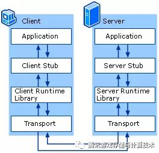

# RPC（Remote Procedure Call Protocol）远程过程调用协议

* 允许运行于一台计算机的程序调用另一台计算机的子程序，而程序员无须额外地为这个交互作用编程
* 服务端实现了一个函数，客户端使用 RPC 框架提供的接口，调用这个函数的实现，并获取返回值
* RPC 屏蔽了底层的网络通信细节，使得开发人员无须关注网络编程的细节，而将更多的时间和精力放在业务逻辑本身的实现上，从而提高开发效率
* 一种通过网络从远程计算机程序上请求服务，而不需要了解底层网络协议的协议
* RPC协议假定某些传输协议的存在，如TCP或UDP，为通信程序之间携带信息数据
* 在OSI网络通信模型中，RPC跨越了传输层和应用层
* RPC使得开发包括网络分布式多程序在内的应用程序更加容易

## 原理

* Client 通过本地调用，调用 Client Stub
* Client Stub 将参数打包（也叫 Marshalling）成一个消息，然后发送这个消息
* Client 所在的 OS 将消息发送给 Server
* Server 端接收到消息后，将消息传递给 Server Stub
* Server Stub 将消息解包（也叫 Unmarshalling）得到参数
* Server Stub 调用服务端的子程序（函数），处理完后，将最终结果按照相反的步骤返回给 Client
* Stub 负责调用参数和返回值的流化（serialization）、参数的打包解包，以及负责网络层的通信。Client 端一般叫 Stub，Server 端一般叫 Skeleton。



## HTTP vs RPC

* 传输协议：
    - HTTP 基于 HTTP 协议。
    - RPC 即可以 HTTP 协议，也可以 TCP 协议。
    - HTTP 也是 RPC 实现的一种方式。
* 性能消耗：
    - HTTP 大部分基于 JSON 实现的，序列化需要时间和性能。
    - RPC 可以基于二进制进行传输，消耗性能少一点。
    - 推荐一个像 JSON ，但比 JSON 传输更快占用更少的新型序列化类库 [MessagePack](https://msgpack.org/)
    - 还有一些服务治理、负载均衡配置的区别。
* 使用场景：
    - 比如浏览器接口、APP接口、第三方接口，推荐使用 HTTP。
    - 比如集团内部的服务调用，推荐使用 RPC。
    - RPC 比 HTTP 性能消耗低，传输效率高，服务治理也方便

## RPC vs REST

* RPC 相比 REST 的优点：
    - RPC+Protobuf 采用的是 TCP 做传输协议，REST 直接使用 HTTP 做应用层协议，这种区别导致 REST 在调用性能上会比 RPC+Protobuf 低
    - RPC 不像 REST 那样，每一个操作都要抽象成对资源的增删改查，在实际开发中，有很多操作很难抽象成资源，比如登录操作。所以在实际开发中并不能严格按照 REST 规范来写 API，RPC 就不存在这个问题
    - 相比 gRPC，OpenAPI 的定义更难懂，也更啰嗦，结构也更复杂
    - 流式传输:在有第一批结果时就开始传输。而 REST 只返回一个单独的 JSON 数组，在服务器端收集到所有结果之前是不会向客户端发送任何数据的
        + REST:要求客户端轮询搜索结果，先是发送一个 POST 请求发起搜索，然后再不断发送 GET 请求获取搜索结果。响应消息中包含了一个用于表示搜索是否已完成的字段
        + 需要在.proto 文件中加入 stream 关键字。下面是我们的 Search 函数定义：`rpc Search (SearchRequest) returns (stream Trip) {}`
    - RPC 屏蔽网络细节、易用，和本地调用类似
        + 这里的易用指的是调用方式上的易用性。在做 RPC 开发时，开发过程很烦琐，需要先写一个 DSL 描述文件，然后用代码生成器生成各种语言代码，当描述文件有更改时，必须重新定义和编译，维护性差。
* REST 相较 RPC 也有很多优势：
    - 轻量级，简单易用，维护性和扩展性都比较好
    - REST 相对更规范，更标准，更通用，无论哪种语言都支持 HTTP 协议，可以对接外部很多系统，只要满足 HTTP 调用即可，更适合对外，RPC 会有语言限制，不同语言的 RPC 调用起来很麻烦
    - JSON 格式可读性更强，开发调试都很方便
    - 在开发过程中，如果严格按照 REST 规范来写 API，API 看起来更清晰，更容易被大家理解
    - 在实际开发中，严格按照 REST 规范来写很难，只能尽可能 RESTful 化。
* 业界普遍采用的做法:内部系统之间调用用 RPC，对外用 REST
    - 内部系统之间可能调用很频繁，需要 RPC 的高性能支撑
    - 对外用 REST 更易理解，更通用些
    - 当然以现有的服务器性能，如果两个系统间调用不是特别频繁，对性能要求不是非常高，REST 的性能完全可以满足。

```php
<?php

const RPC_EOL = "\r\n\r\n";

function request($host, $class, $method, $param, $version = '1.0', $ext = []) {
    $fp = stream_socket_client($host, $errno, $errstr);
    if (!$fp) {
        throw new Exception("stream_socket_client fail errno={$errno} errstr={$errstr}");
    }

    $req = [
        "jsonrpc" => '2.0',
        "method" => sprintf("%s::%s::%s", $version, $class, $method),
        'params' => $param,
        'id' => '',
        'ext' => $ext,
    ];
    $data = json_encode($req) . RPC_EOL;
    fwrite($fp, $data);

    $result = '';
    while (!feof($fp)) {
        $tmp = stream_socket_recvfrom($fp, 1024);
        if (strpos($tmp, RPC_EOL)) {
            break;
        } else {
            $result .= $tmp;
        }
    }

    fclose($fp);
    return json_decode($result, true);
}

var_dump(request('tcp://127.0.0.1:18307', \App\Rpc\Lib\UserInterface::class, 'getList',  [1, 2], "1.0"));
```

##  [brpc/brpc](https://github.com/brpc/brpc)

Brpc 是百度开源的一个基于 protobuf 接口的 RPC 框架，它囊括了百度内部所有 RPC 协议，并支持多种第三方协议，到现在为止，brpc 在 GitHub 上已经拥有 6000 多个关注、17 个代码贡献者。

### [braft](link)

braft 是基于 brpc 的 Raft 协议工业级 C++ 实现，设计之初就考虑高性能和低延迟。由百度云分布式存储团队打造，在百度内部大概有十几个应用场景，部署了 3000 多个服务器，有做 Master 模块 HA 的，也有用作存储节点复制修复的。其中百度云的块存储、NewSQL 存储以及即将推出的 NAS 存储、强一致性 MySQL 都是原生基于 braft 构建的。

对于 braft 和 brpc 之间的关系，braft 是解决复制状态机的问题，而 brpc 是解决模块间 RPC 通信的问题。braft 中 Raft 协议的互通直接使用 brpc 实现，runtime 使用了 bthread，因此 braft 编译需要依赖 brpc，从这点来看 braft 和 brpc 有一定的绑定关系。

## 框架

* [grpc/grpc](https://github.com/grpc/grpc)The C based gRPC (C++, Node.js, Python, Ruby, Objective-C, PHP, C#)
* [apache/thrift](https://github.com/apache/thrift)a lightweight, language-independent software stack with an associated code generation mechanism for RPC
* [alibaba/dubbo](https://github.com/alibaba/dubbo)Dubbo is a high-performance, java based, open source RPC framework
* [weibocom/motan](https://github.com/weibocom/motan)A remote procedure call(RPC) framework for rapid development of high performance distributed services.
* [dangdangdotcom/dubbox](https://github.com/dangdangdotcom/dubbox)Dubbox now means Dubbo eXtensions, and it adds features like RESTful remoting, Kyro/FST serialization, etc to the Dubbo service framework.
* phprpc
* yar
* hprose

## 工具

* [uber/prototool](https://github.com/uber/prototool):Your Swiss Army Knife for Protocol Buffers
* [grpc/grpc-web](https://github.com/grpc/grpc-web):gRPC for Web Clients https://grpc.io
* [improbable-eng/grpc-web](https://github.com/improbable-eng/grpc-web):gRPC Web implementation for Golang and TypeScript
* [Tencent/Tars](https://github.com/Tencent/Tars):Tars is a highly performance rpc framework based on naming service using tars protocol and provides a semi-automatic operation platform.
* [smallnest / rpcx](https://github.com/smallnest/rpcx):A zero cost, faster multi-language bidirectional microservices framework in Go, like alibaba Dubbo, but with more features, Scale easily. Try it. Test it. If you feel it's better, use it! 𝐉𝐚𝐯𝐚有𝐝𝐮𝐛𝐛𝐨, 𝐆𝐨𝐥𝐚𝐧𝐠有𝐫𝐩𝐜𝐱! https://rpcx.io
