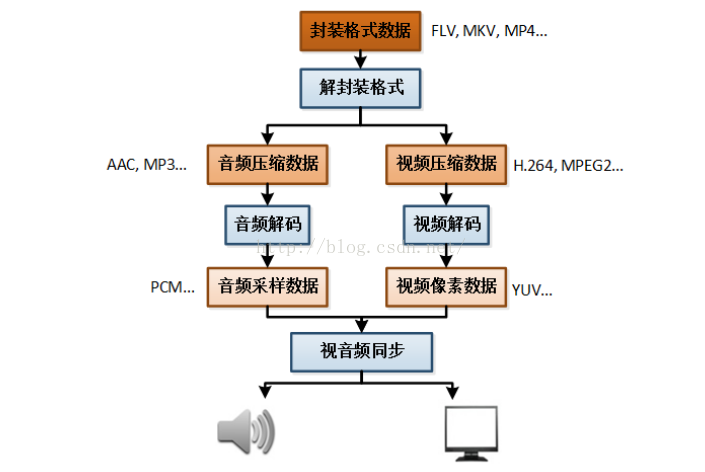

## Video

## 概念

* 流媒体（streaming media）是指采用流式传输技术在网络上连续实时播放的媒体格式，如音频、视频或多媒体文件，采用流媒体技术使得数据包得以像流水一样发送
  - HTTP 视频协议：通用的 HTTP 文件渐进式下载，支持范围请求（Range Request）
    + 范围请求：指的是请求文件的部分数据，可以在 HTTP 请求头中通过 Range 字段设置偏移量来实现
  - RTMP(Real Time Messaging Protocol)实时消息传送协议是Adobe Systems公司为Flash播放器和服务器之间音频、视频和数据传输 开发的开放协议,有以下三种变种：
    + 工作在 TCP 之上的明文协议，使用端口 1935,建立单独的 RTMP 连接，是因为客户端与服务器需要商量一些事情，以保证后续的传输能正常进行
      * RTMP 协议的版本号，如果客户端、服务器的版本号不一致，则不能工作
      * 时间戳，视频播放中，时间是很重要的，后面的数据流互通的时候，经常要带上时间戳的差值，因而一开始双方就要知道对方的时间戳
    + RTMPT 封装在 HTTP 请求之中，可穿越防火墙
    + RTMPS 类似 RTMPT，但使用的是 HTTPS 连接
    + 市面上绝大多数部分PC秀场使用的技术栈, 有低延迟(2秒左后), 稳定性高, 技术完善, 高支持度, 编码兼容性高等特点
    + 视频-》视频编码器-〉流媒体服务器
    + 采用实时的流式传输，所以不会缓存文件到客户端，因此用户想下载 RTMP 协议下的视频是比较难的，该协议下的视频流可以随便拖动，可以从任意时间点向服务器发送请求进行播放，并不需要视频有关键帧
  - FLV (Flash Video) 是 Adobe 公司推出的另一种视频格式，是一种在网络上传输的流媒体数据存储容器格式
    + HTTP-FLV 即将流媒体数据封装成 FLV 格式，然后通过 HTTP 协议传输给客户端
    + HTTP-FLV这种方式较RTMP协议好的就是它采用公共的HTTP80端口, 有效避免被防火墙拦截, 可以通过 HTTP 302 跳转灵活调度/负载均衡，支持使用 HTTPS 加密传输
    + 缺点
      * 视频的内容会缓存到用户本地, 保密性不好
      * IOS不支持
    + HTTP-FLV的整体流程和RTMP协议一致, 但在客户端播放有些差异, 在MSE出现以前市场上一般都是用flash播放器去播放, MSE出现以后以及推广HTML5播放器的原因, 市场上开始使用JS软解FLV的方式, 通过HTMLVideoElement去播放
  - HTTP Live Streaming（缩写是HLS）是一个由苹果公司提出的基于HTTP的流媒体网络传输协议，用于在 iOS 系统中实现流媒体的直播和点播
    + 支持MPEG-2 TS标准(WWDC16 苹果宣布支持 Fragmented MP4), 移动端支持良好, 现在已经成为移动端H5直播的主要技术
    + 工作原理是把整个流分成一个个小的基于HTTP的文件来下载，每次只下载一些
    + 当媒体流正在播放时，客户端可以选择从许多不同的备用源中以不同的速率下载同样的资源，允许流媒体会话适应不同的数据速率
    + 在开始一个流媒体会话时，客户端会下载一个包含元数据的extended M3U (m3u8)playlist文件，用于寻找可用的媒体流
    + 主要是为了解决RTMP协议存在的一些问题, 比如RTMP协议不使用标准的HTTP接口传输数据(TCP、UDP端口：1935)，所以在一些特殊的网络环境下可能被防火墙屏蔽掉。但是HLS由于使用的HTTP协议传输数据(80端口)，不会遇到被防火墙屏蔽的情况
    + 需软解吗（延时大），PC端不支持
    + HLS 直播最大的不同在于，直播客户端获取到的并不是一个完整的数据流，HLS协议在服务器端将直播数据流存储为连续的、很短时长的媒体文件（MPEG-TS格式），而客户端则不断下载并播放这些小文件。因为服务器总是会将最新的直播数据生成新的小文件，这样客户端只要不停地按顺序播放从服务器获取到的文件，就实现了直播
  - Http Dynamic Streaming（HDS）是一个由Adobe公司模仿HLS协议提出的另一个基于Http的流媒体传输协议。其模式跟HLS类似，但是又要比HLS协议复杂一些，也是索引文件和媒体切片文件结合的下载方式。
    + 在服务器端降一个视频文件分割成segment节，segment节表示的是这个视频的几种不同的分辨率模式
    + 针对某种分辨率的segment节，可以再划分成fragmen片段，每个片段都是视频的一小段时间，分段后每个片段会有segment+fragment的索引，客户端会根据索引请求视频片段
    + 索引文件可以是.f4m的manifest文件，也可以是.bootstrap文件，视频文件是使用附加的基于标准的MP4片段格式（ISO / IEC 14496-12：2008）扩展F4V格式，扩展名为.f4f
  - RTP 与 RTCP
    + RTP（Real-time Transport Protocol，实时传输协议）是互联网上针对多媒体数据流的一种实时传输协议。RTP 由紧密连接的两个部分组成：
      * RTP 协议：传送具有实时属性的数据；
      * RTP 控制协议（简称 RTCP）：监控服务质量并传送正在进行的会话参与者的相关信息
  - RTSP（Real Time Streaming Protocol，实时流协议）协议
    + 最早的视频传输协议，定义了一对多应用程序如何有效通过 IP 网络传输多媒体数据。RTSP 在体系结构上位于 RTP 和 RTCP 之上，是一种双向实时数据传输协议，它允许客户端向服务器端发送请求，如回放、快进、倒退等操作。RTSP 可基于 RTP 来传送数据，还可以选择 TCP、UDP、组播 UDP 等通道来发送数据，具有很好的扩展性
      +RTSP 协议的优势在于可以控制到视频帧，因此可以承载实时性很高的应用，这个优点也是相对于 HTTP 传输方式的最大优点。不过 iOS 系统不支持该协议，Andriod 系统原生支持
  - DASH（MPEG-DASH）是 Dynamic Adaptive Streaming over HTTP的缩写，是国际标准组 MPEG 2014年推出的技术标准
    + 主要目标是形成IP网络承载单一格式的流媒体并提供高效与高质量服务的统一方案, 解决多制式传输方案(HTTP Live Streaming, Microsoft Smooth Streaming, HTTP Dynamic Streaming)并存格局下的存储与服务能力浪费、运营高成本与复杂度、系统间互操作弱等问题
    + 基于HTTP的动态自适应的比特率流技术，使用的传输协议是TCP(有些老的客户端直播会采用UDP协议直播, 例如YY, 齐齐视频等). 和HLS, HDS技术类似， 都是把视频分割成一小段一小段， 通过HTTP协议进行传输，客户端得到之后进行播放
    + 支持MPEG-2 TS、MP4等多种格式, 可以将视频按照多种编码切割, 下载下来的媒体格式既可以是ts文件也可以是mp4文件, 所以当客户端加载视频时, 按照当前的网速和支持的编码加载相应的视频片段进行播放
    + 客户端加载mpd文件，解析MPD文件, 组成文件下载链接，当前的网速和支持的编码加载相应的视频片段进行播放。
    + MPD：字段说明
      * profiles: 不同的profile对应不同的MPD要求和Segment格式要求
      * mediaPresentationDuration:整个节目的时长
      * minBufferTime: 至少需要缓冲的时间
      * type:点播对应static，直播对应dynamic
      * availabilityStartTime=2019-05-22T22:16:57Z:如果是直播流的话,则必须提供,代表MPD中所有Seg从该时间开始可以request了
      * minimumUpdatePeriod=PT10H:至少每隔这么长时间,MPD就有可能更新一次,只用于直播流
      * Period 区段：一条完整的mpeg dash码流可能由一个或多个Period构成，每个Period代表某一个时间段
      * AdaptationSet 自适应子集：一个Period由一个或者多个Adaptationset组成。Adaptationset由一组可供切换的不同码率的码流（Representation)组成，这些码流中可能包含一个（ISO profile)或者多个(TS profile)media content components，因为ISO profile的mp4或者fmp4 segment中通常只含有一个视频或者音频内容，而TS profile中的TS segment同时含有视频和音频内容. 当同时含有多个media component content时，每个被复用的media content component将被单独描述。
        - segmentAlignment: 如果为true,则代表该AS中的segment互不重叠
        - startWithSAP: 每个Segment的第一帧都是关键帧
        - mimeType AdaptationSet 的媒体类型
        - minWidth 最小宽度
        - par 宽高比
        - contentType: 内容类型
      * media content component 媒体内容：一个media content component表示表示一个不同的音视频内容，比如不同语言的音轨属于不同的media content component,而同一音轨的不同码率（mpeg dash中叫做Representation)属于相同的media content component。如果是TS profile，同一个码率可能包括多个media content components。
      * segment 切片：每个Representation由一个或者多个segment组成，每个segment由一个对应的URL指定，也可能由相同的URL+不同的byte range指定。dash 客户端可以通过HTTP协议来获取URL（+byte range）对应的分片数据
    + fMP4（fragmented MP4）：可以简单理解为分片化的MP4，是DASH采用的媒体文件格式，文件扩展名通常为（.m4s或直接用.mp4）, 或者分别切分成mpa(音频), m4v(视频)
    * 前端工作
      * 加载视频说明mpd文件
      * 识别mpd内容
      * 判断网速加载第一个适合该网速的视频片段, 解析视频数据
      * 视频数据通过 MSE(Media Source Extensions) API 把视频数据传输给Video播放
      * 不断通过加载视频片段大小/下载时间得出网速, 下载相应码率的视频
    + demo
      * http://reference.dashif.org/dash.js/nightly/samples/dash-if-reference-player/index.html
      * http://demo.theoplayer.com/test-your-stream-with-statistics
      * https://bitmovin.com/demos/stream-test
* 分辨率
  - 720P(1280 × 720个像素)
  - 1080P（1920 ×1080个像素）
  - 4K（3840 × 2160 有的人称为2160P）
  - 8K分辨率是7680*4320，这个画面是4块4K屏幕的所有像素加一起才能满足的，换句话说也就是大约16块1080P画面所能承载的画面信息。它对显卡的要求我们暂且不提，仅仅是“实时传输这个画面到电视上”这个需求就已经突破了当今HDMI和DP线缆的带宽极限（通常要四根或者八根叠加使用，或者像苹果一样研制专属线缆），就更不要提主机渲染这些信息时所需要的硬件能力了。
  - VCD的视频影片由于只能采用MPEG1等老式视频编码，分辨率只能达到300*100多，清晰度很差，几乎遭到淘汰
  - DVD采用MPEG2编码，体积较大，一部120分钟的影片需要4-5G.经过Xvid或者DivX重编码后，一部120分钟的影片只有700-1400M，清晰度跟采用MPEG2的一样
  - 蓝光光碟（Blu-ray Disc）是DVD之后的下一代光盘格式，简称蓝光。 在各大电影公司纷纷推出蓝光光碟之后，一部电影的容量最高可以达到40G左右
  - 对蓝光光碟的内容进行重新编码缩小体积，最常见的编码技术是H264，也叫AVC、MPEG-4.压制完成的视频有1080P和720P，这种小体积高质量的视频也同样适合收藏和观看。现在看到的大部分视频都是在蓝光的基础的上进行压制的，各大资源网站提供的最新电影都是搬自国内外这些压制组.例如 Confidential.Assignment.2017.1080p.BluRay.h264-WiKi.mkv就是指H264编码的1080P蓝光电影，一部2个小时的电影一般1080P文件大小15G左右，720P文件大小8G左右。低于这个大小的基本上都是虚标，清晰度远远达不到高清标准
* 码率：单位时间内传输数据的位数，用kbps表示。基本的算法是：码率(kbps)=文件大小(KB) * 8 / 时间(秒)。 如果同一部电影的分辨率相同，码率不一样，也会影响画面的质量。因为码率越高，单位时间内传输的画面信息也就越丰富
* 帧率FPS:图像领域中的定义，是指画面每秒传输帧数，通俗来讲就是指动画或视频的画面数。由于人类眼睛的特殊生理结构，如果所看画面的帧率高于每秒约10至12帧的时候，就会认为是连贯的。FPS是测量用于保存、显示动态视频的信息数量。每秒钟帧数愈多，所显示的动作就会越流畅。通常，要避免动作不流畅的最低是30。某些计算机视频格式，每秒只能提供15帧。FPS”也可以理解为我们常说的“刷新率（单位为Hz）”，例如我们常在CS游戏里说的“FPS值”。我们在装机选购显卡和显示器的时候，都会注意到“刷新率”。一般我们设置缺省刷新率都在75Hz（即75帧/秒）以上。例如：75Hz的刷新率刷也就是指屏幕一秒内只扫描75次，即75帧/秒。而当刷新率太低时我们肉眼都能感觉到屏幕的闪烁，不连贯，对图像显示效果和视觉感观产生不好的影响
  - 电影：24fps
  - 电视（PAL）：25fps
  - 电视（NTSL）：30fps
  - CRT显示器：75Hz以上
  - 液晶显示器：一般为60Hz
  - 没必要追求太高的刷新率：在显示“分辨率”不变的情况下，FPS越高，则对显卡的处理能力要求越高。幕上每个像素的填充都得由显卡来进行计算、输出。当画面的分辨率是1024×768时，画面的刷新率要达到24帧/秒，那么显卡在一秒钟内需要处理的像素量就达到了“1024×768×24=18874368”
  - 刷新频率越低，图像闪烁和抖动的就越厉害，眼睛疲劳得就越快。采用70Hz以上的刷新频率时才能基本消除闪烁，显示器最好稳定工作在允许的最高频率下，一般是85Hz。刷新频率，指的就是振荡电路的频率。刷新频率的计算公式是：水平同步扫描线X帧频=刷新频率
* 蓝光原盘开始支持4K高清内容，新标准称为Ultra HD Blu-ray， 4K蓝光原盘影片的压制采用H.265/HEVC高效率编码格式，能达到H.264两倍的压缩率， 分辨率为3840 x 2160，帧率最高能达到60FPS
* 视频图片平均都是由 1024*768 像素组成,一秒钟视频的容量:`30*1024*768*24 bit = 566,231,040 bit = 70,778,880 Byte = 67.5 MB`



## 编码

* 国际电信联盟电信标准化部门（简称 ITU-T）旗下的 VCEG（Video Coding Experts Group，视频编码专家组），因为是电信联盟，所以最初做视频编码主要侧重传输，这个编码组制定的视频通信协议包括 H.261、 H.262、H.263、H.264、H.265 等；
* 国际标准组织（简称 ISO）旗下的 MPEG（Moving Picture Experts Group，动态图像专家组），本来是做视频存储的，例如将编码后的视频保存在 VCD 和 DVD 中，随着 VCD 和 DVD 的消逝，后来也慢慢侧重视频传输了，制定的视频编码标准包括 MPEG-1、MPEG-2、MPEG-4、MPEG-7 等
* ITU-T VCEG 与 ISO MPEG 联合制定了 H.264/MPEG-4（两者等价，是同一个标准，也被称作 AVC）

## 直播

* 接流：网络协议将编码好的视频流，从主播端推送到服务器，在服务器上有个运行了同样协议的服务端来接收这些网络包，从而得到里面的视频流
* 拉流：服务端接到视频流之后，对视频流进行一定的处理，例如转码，也即从一个编码格式，转成另一种格式。因为观众使用的客户端千差万别，要保证他们都能看到直播。流处理完毕之后，就可以等待观众的客户端来请求这些视频流，观众的客户端请求的过程
* 非常多的观众，同时看一个视频直播，那都从一个服务器上拉流，压力太大了，因而需要一个视频的分发网络（CDN），将视频预先加载到就近的边缘节点，这样大部分观众看的视频，是从边缘节点拉取的，就能降低服务器的压力
  - 流媒体（视频、音频等大文件）数据量大，如果出现回源，压力会比较大，所以往往采取主动推送的模式，将热点数据主动推送到边缘节点.开始直播时，就会将视频推送到就近 CDN 节点缓存
  - 直播往时延:从主播端采集视频到观众端开始播放相应应视频的时间差
  - 提供预处理服务，即文件在分发之前，经过一定的处理
  - 防盗链:
    + 根据 HTTP 头 Referer 字段
    + 时间戳防盗链：客户端取出当前的时间戳，要访问的资源及其路径，连同加密字符串通过签名算法得到一个字符串，然后生成一个下载链接，带上这个签名字符串和截止时间戳去访问 CDN

## 应用

* 视频直接拖可以播放不卡

```
docker run --name video -v /Users/tangqingsong/files:/root/videos -d -i -p 8081:8081 -p 1935:1935 ubuntu:18.04 && docker ps
docker exec -it video bash

wget https://github.com/winshining/nginx-http-flv-module/archive/master.zip ; unzip master.zip
wget http://nginx.org/download/nginx-1.17.6.tar.gz && tar -zxvf nginx-1.17.6.tar.gz
vim objs/Makefile # 删除里面的-Werror删除

./configure --add-module=../nginx-http-flv-module-master

rtmp {                #RTMP服务
   server {
       listen 1935;  #//服务端口
        chunk_size 4096;   #//数据传输块的大小

        application vod {
                play /opt/video/vod; #//视频文件存放位置。
        }
   }
}

# vlc
rtmp://localhost/vod/out.mp4
```

## 资源

* TED
* YouTube
* [Hashem AL-ghaili](https://youtube.com/user/hashemalghaili)
* [Vimeo](https://vimeo.com/)
* [iTunes Movie Trailers ](http://trailers.apple.com/):苹果官网里的一个电影预告片页面
* [Sandwichvideo](https://sandwichvideo.com/):演示短片
* [Arc](http://thisisarc.com/):集合了超多优秀的短片制作公司，绝对是视频从业者的宝库
* [phobal/ivideo](https://github.com/phobal/ivideo):一个可以观看国内主流视频平台所有视频的客户端（Mac、Windows、Linux），包括 VIP 资源
* [Bilibili](https://www.bilibili.com/)
* [BBC-Future](link)
* [twitch](https://www.twitch.tv/)
* [prageru](https://www.prageru.com)
* 美剧
  - [99美剧网](https://www.jjmeiju.com/)
* [Roku](https://www.roku.com/)
* IPTV
  - [iptv-org / iptv](https://github.com/iptv-org/iptv):Collection of 8000+ publicly available IPTV channels from all over the world
  - [iptv-org / awesome-iptv](https://github.com/iptv-org/awesome-iptv):A curated list of resources related to IPTV

## 工具

* [obsproject/obs-studio](https://github.com/obsproject/obs-studio):OBS Studio - Free and open source software for live streaming and screen recording https://obsproject.com/
* [ossrs/srs](https://github.com/ossrs/srs):SRS's a simplest, conceptual integrated, industrial-strength live streaming origin cluster.
* [video-dev/hls.js](https://github.com/video-dev/hls.js):JavaScript HLS client using Media Source Extension http://video-dev.github.io/hls.js/stable/demo
* [xbmc/xbmc](https://github.com/xbmc/xbmc):Kodi is an award-winning free and open source home theater/media center software and entertainment hub for digital media. With its beautiful interface and powerful skinning engine, it's available for Android, BSD, Linux, macOS, iOS and Windows. https://kodi.tv/
* [MoePlayer/DPlayer](https://github.com/MoePlayer/DPlayer):🍭 Wow, such a lovely HTML5 danmaku video player http://dplayer.js.org
* [iina/iina](https://github.com/iina/iina):The modern video player for macOS. https://iina.io
* [kodi](https://kodi.tv/)
* [iawia002 / annie](https://github.com/iawia002/annie):space_invader Fast, simple and clean video downloader
* [mpv](https://mpv.io/):别致轻量的界面和丰富的功能，MPV 拥有对一个好的视频播放器的一切期望。甚至可以在命令行使用它
* [mifi/lossless-cut](https://github.com/mifi/lossless-cut):Save space by quickly and losslessly trimming video and audio files
* [asdjgfr/operationRecord](https://github.com/asdjgfr/operationRecord):记录产品，测试的沙雕操作，方便debugger
* [daniulive/SmarterStreaming](https://github.com/daniulive/SmarterStreaming):国内外为数不多致力于极致体验的超强全自研跨平台(windows/android/iOS)流媒体内核，通过模块化自由组合，支持实时RTMP推流、RTSP推流、RTMP播放器、RTSP播放器、录像、多路流媒体转发、音视频导播、动态视频合成、音频混音、直播互动、内置轻量级RTSP服务等，比快更快，业界真正靠谱的超低延迟直播SDK(1秒内，低延迟模式下200~400ms)。 https://www.daniulive.com
* [CarGuo/GSYVideoPlayer](https://github.com/CarGuo/GSYVideoPlayer):视频播放器（IJKplayer、ExoPlayer、MediaPlayer），HTTPS，支持弹幕，支持滤镜、水印、gif截图，片头广告、中间广告，多个同时播放，支持基本的拖动，声音、亮度调节，支持边播边缓存，支持视频自带rotation的旋转（90,270之类），重力旋转与手动旋转的同步支持，支持列表播放 ，列表全屏动画，视频加载速度，列表小窗口支持拖动，动画效果，调整比例，多分辨率切换，支持切换播放器，进度条小窗口预览，列表切换详情页面无缝播放，rtsp、concat、mpeg。
* 切片
  - FFmpeg
  - MP4Box
* [parse 视频解析网 video](https://pv.vlogdownloader.com/?)
* [WebTorrent Desktop](https://webtorrent.io/):Streaming torrent app
* [cisco / openh264](https://github.com/cisco/openh264):Open Source H.264 Codec
* [potplayercn](http://www.potplayercn.com/)
  - [billy21 / Tvlist-awesome-m3u-m3u8](https://github.com/billy21/Tvlist-awesome-m3u-m3u8):直播源相关资源汇总
* [Tinywan / html5-dash-hls-rtmp](https://github.com/Tinywan/html5-dash-hls-rtmp):🌻 HTML5播放器、M3U8直播/点播、RTMP直播、低延迟、推流/播流地址鉴权 https://github.tinywan.com/html5-dash-hls-rtmp/
* 录屏
  - Ocam:录屏软件
  - Quicktime:切分音视频，可以录屏
* [Hunlongyu / ZY-Player](https://github.com/Hunlongyu/ZY-Player):arrow_forward 跨跨平台桌面端视频资源播放器.简洁无广告.免费高颜值. film_strip
* [real-live](https://github.com/parzulpan/real-live) 跨平台网络直播聚合平台，支持视频直播、高清电视和广播电台等。A cross-platform webcast aggregation platform that supports live video, high-definition TV and radio stations.

## 参考

* [leandromoreira / digital_video_introduction ](https://github.com/leandromoreira/digital_video_introduction):A hands-on introduction to video technology: image, video, codec (av1, vp9, h265) and more (ffmpeg encoding).
* [insecam](https://www.insecam.org/en/):The world biggest directory of online surveillance security cameras
