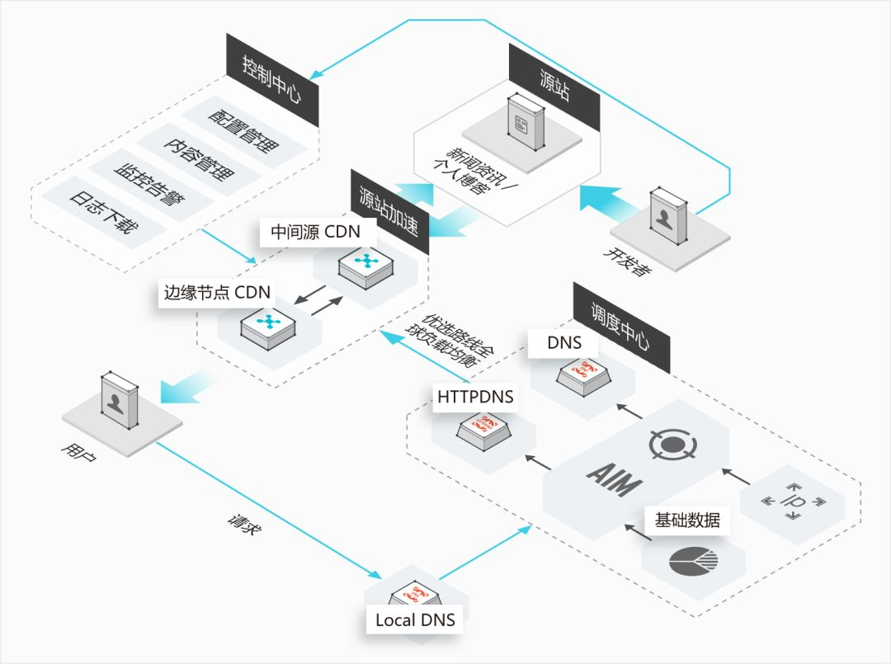

# CDN Content Delivery Network 内容分发网络

构建在网络之上的内容分发网络，依靠部署在各地的边缘服务器，通过中心平台的负载均衡、内容分发、调度等功能模块，使用户就近获取所需内容，降低网络拥塞，提高用户访问响应速度和命中率

* 核心技术
  - 内容存储技术
  - 内容分发技术
  - 负载均衡技术
* 优势
  - 加速：基于 CDN 各节点，就近获取内容
  - 降低负载：基于 CDN 缓存，减少源站的访问
  - 成本低：费用成本、部署成本
  - 可扩展性强：基于边缘计算
* 应用
  - 在 web.com 对应的权威 DNS 服务器上，会设置一个 CNAME 别名,指向 CDN 域名
  - CDN 的全局负载均衡器解析域名，全局负载均衡器会为用户选择一台合适的缓存服务器提供服务，选择的依据包括：
    + 根据用户 IP 地址，判断哪一台服务器距用户最近
    + 用户所处的网络运营商
    + 根据用户所请求的 URL 中携带的内容名称，判断哪一台服务器上有用户所需的内容
    + 查询各个服务器当前的负载情况，判断哪一台服务器尚有服务能力
    + 全局负载均衡器会返回一台缓存服务器的 IP 地址
    + 客户端再根据这个 IP 地址去访问对应的边缘节点，下载资源。如果该边缘节点上并没有用户想要的内容，那么这台服务器就要向它的上一级节点请求内容，直至追溯到网站的源服务器将内容拉取到本地
  - 后端加速（缓存）—— 自定义缓存时间。动态文件（eg：php | jsp | asp），建议设置缓存时间为 0s，即不缓存；若动态文件例如 php 文件内容更新频率较低，推荐设置较短缓存时间
  - 用于缓存变动很小的静态资源
    + 流媒体
      * CDN 支持流媒体协议，例如 RTMP 协议。由于流媒体往往是连续的，因而可以进行预先缓存的策略，也可以预先推送到用户的客户端
      * 流媒体数据量大，如果出现回源，压力会比较大，所以往往采取主动推送的模式，将热点数据主动推送到边缘节点
    + 静态页面而言，内容的分发往往采取拉取的方式，也即当发现未命中的时候，再去上一级进行拉取
  - 边缘计算
    + 在靠近物或数据源头的一侧，采用网络、计算、存储、应用核心能力为一体的开放平台，就近提供最近端服务。
    + 其应用程序在边缘侧发起，产生更快的网络服务响应，满足行业在实时业务、应用智能、安全与隐私保护等方面的基本需求。
    + 边缘计算处于物理实体和工业连接之间，或处于物理实体的顶端。而云端计算，仍然可以访问边缘计算的历史数据。
* 功能
  - 缓存解决了跨运营商和跨地域访问的问题，访问延时大大降低；
  - 大部分请求在 CDN 边缘节点完成，CDN 起到了分流作用，降低了应用所在服务器的负载
  - 自定义缓存过期时间规则：支持配置自定义资源的缓存过期时间规则, 支持指定路径或者文件名后缀方式, 支持 Header 输出缓存过期时间
  - 自定义 header 头：如 Access-Control-Allow-Origin: * 以实现跨域
  - 自定义页面：支持设置404、403、503、504等页面
  - 页面优化：去除HTML页面页面冗余内容如注释以及重复的空白符
  - 智能压缩：对静态文件类型进行压缩, 有效减少用户传输内容大小
  - 访问控制：Refer防盗链、IP 黑/白名单等
  - HTTPS 支持
  - 统计分析、日志管理
  - 人工智能服务：识图、鉴黄等

## 原理

* 流程
  - 浏览器要将域名解析为 IP 地址，所以需要向本地 DNS 发出请求。
  - 本地 DNS 依次向根服务器、顶级域名服务器、权限服务器发出请求，得到全局负载均衡系统（GSLB）的 IP 地址。
  - 本地 DNS 再向 GSLB 发出请求，GSLB 的主要功能是根据本地 DNS 的 IP 地址判断用户的位置，筛选出距离用户较近的本地负载均衡系统（SLB），并将该 SLB 的 IP 地址作为结果返回给本地 DNS。
  - 本地 DNS 将 SLB 的 IP 地址发回给浏览器，浏览器向 SLB 发出请求。
  - SLB 根据浏览器请求的资源和地址，选出最优的缓存服务器发回给浏览器。
  - 浏览器再根据 SLB 发回的地址重定向到缓存服务器。
  - 如果缓存服务器有浏览器需要的资源，就将资源发回给浏览器。如果没有，就向源服务器请求资源，再发给浏览器并缓存在本地。
* 用户接入互联网都是通过网络服务商实现的，不同用户使用的网络服务商（如电信、联通、移动）不尽相同，用户通过自己所在网络服务商的边缘节点、区域节点、中心节点最终接入应用所在的数据中心，才能访问到应用服务端资源，其中边缘节点是离用户最近的运营商服务器节点，应用服务商与网络服务商签约后，就可以将静态资源缓存到这些边缘节点，这样，不同区域的用户就可以就近从边缘节点获取缓存资源，从而极大提高访问速度
* 存储：基于 URL 的维度进行 Hash 运算后生成唯一的字符，基于该字符进行缓存的获取与存储
* 当涉及静态资源的更新操作的时候，更多的除了使用 URL 维度外，还会依靠附加参数的形式，进行 CDN 缓存的“更新”。但这个“更新”实际是静态资源生成新的 CDN 缓存。维度的增加也同样意味着 CDN 缓存命中率的降低
* CDN 服务商会在资源请求的 Response Headers 中输出一些涉及缓存命中、CDN 节点、Hash字符、过期时间等信息
* 刷新预热（即：清理 CDN 缓存） 通过提供文件 URL 或目录的方式，强制CDN节点回源拉取最新的文件。 将指定的内容主动预热到 CDN 的节点上，用户首次访问即可直接命中缓存，降低源站压力。一般大规模迁移的时候，会使用到
* 图片 WEBP 原理
  - 开启 CDN Header - Accept 回源
  - 获取 Request Headers 中 Accept 中包含 image/webp（即为支持webp）
  - 通过边缘计算方式，通过源站获取对应素材转换为 webp 格式，并存储至对应 CDN 节点
  - 用户通过 CDN 输出对应格式

## Tool

* [justjavac/ReplaceGoogleCDN](https://github.com/justjavac/ReplaceGoogleCDN):♋️ 一个 Chrome 插件：将 Google CDN 替换为国内的
* [cdnjs](https://github.com/cdnjs/cdnjs):The #1 free and open source CDN built to make life easier for developers. <https://cdnjs.com>
* [staticdn](https://cdn.con.sh/)
