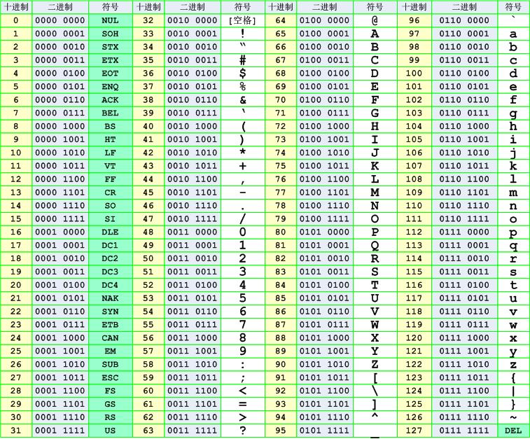

# 字符编码

计算机中都是以二进制形式进行存储和运算。字符集同时定义了一套同名的字符编码规则.Unicode 就只定义了字符集，而对应的字符编码是 UTF-8，UTF-16。本质上是字符到字节的转换过程

## 概念

用8个比特（bit）作为一个字节（byte），所以，一个字节能表示的最大的整数就是255，如果要表示更大的整数，就必须用更多的字节。
字符集是一个系统支持的所有抽象字符的集合。它是各种文字和符号的总称，常见的字符集种类包括 ASCII 字符集、GBK 字符集、Unicode字符集等。不同的字符集规定了有限个字符，比如：ASCII 字符集只含有拉丁文字字母，GBK 包含了汉字，而 Unicode 字符集包含了世界上所有的文字符号。

### ASCII：字符集与字符编码的起源。

一共规定了 128 个字符及对应的二进制转换关系，128 个字符包括了可显示的26个字母（大小写）、10个数字、标点符号以及特殊的控制符，因为一个字节可以表示256个字符，所以当前只利用了字节的7位，最高位用来当作奇偶校验。

ASCII 字符编码是将这128个字符转换为计算机可识别的二进制数据的一套规则（算法）。

### EASCII：扩展的ASCII

把第八位也利用起来，那么可表示的字符个数就是 256.比 ASCII 码扩充出来的符号包括表格符号、计算符号、希腊字母和特殊的拉丁符号。国际标准化组织（ISO）及国际电工委员会（IEC）联合制定的一系列8位元字符集的标准，叫 ISO 8859，全称ISO/IEC 8859，它在 ASCII 基础之上扩展而来，所以完全 ASCII，ISO 8859 字符编码方案所扩展的这128个编码中，只有0xA0~0xFF(十进制为160~255)被使用，其实 ISO 8859是一组字符集的总称，旗下共包含了15个字符集，分别是 ISO 8859-1 ~ ISO 8859-15，ISO 8859-1 又称之为 Latin-1，它是西欧语言，其它的分别代表 中欧、南欧、北欧等字符集。

### GB2312

每个汉字符号由两个字节组成，理论上它可以表示65536个字符，不过它只收录了7445个字符，6763个汉字和682个其他字符，同时它能够兼容 ASCII，ASCII 中定义的字符只占用一个字节的空间。

在 GB2312 的基础上创建了一种叫 GBK 的字符编码，GBK 不仅收录了27484 个汉字，同时还收录了藏文、蒙文、维吾尔文等主要的少数民族文字。GBK 是利用了 GB2312 中未被使用的编码空间上进行扩充，所以它能完全兼容 GB2312和 ASCII。而 GB 18030 是现时最新的字符集，兼容 GB 2312-1980 和 GBK， 共收录汉字70244个，采用多字节编码，每个字符可以有1、2、4个字节组成，某种意义上它能容纳161 万个字符，包含繁体汉字以及日韩汉字，单字节与ASCII兼容，双字节与GBK标准兼容。

### Unicode ：统一江湖的字符集

一个囊括了世界上所有字符的字符集，其中每一个字符都对应有唯一的编码值（code point），注意了！它不是字符编码，仅仅是字符集而已，Unicode 字符如何进行编码，可以是 UTF-8、UTF-16、甚至用 GBK 来编码.真正存储的时候需要多少个字节是由具体的编码格式决定的。比如：字符 「A」用 UTF-8 的格式编码来存储就只占用1个字节，用 UTF-16 就占用2个字节，而用 UTF-32 存储就占用4个字节。

ASCII编码和Unicode编码的区别：ASCII编码是1个字节，而Unicode编码通常是2个字节.乱码问题从此消失了。但是，如果文本基本上全部是英文的话，用Unicode编码比ASCII编码需要多一倍的存储空间，在存储和传输上就十分不划算。

#### UTF-8：Unicode编码

UTF（ Unicode Transformation Format）编码 和 USC（Universal Coded Character Set） 编码分别是 Unicode 、ISO/IEC 10646 编码体系里面两种编码方式，UCS 分为 UCS-2 和 UCS-4，而 UTF 常见的种类有 UTF-8、UTF-16、UTF-32。

UCS-2 使用两个定长的字节来表示一个字符，UTF-16 也是使用两个字节，不过 UTF-16 是变长的，遇到两个字节没法表示时，会用4个字节来表示，因此 UTF-16 可以看作是在 UCS-2 的基础上扩展而来的。而 UTF-32 与 USC-4 是完全等价的，使用4个字节表示，显然，这种方式浪费的空间比较多。

UTF-8 的优势是：它以单字节为单位用 1~4 个字节来表示一个字符，从首字节就可以判断一个字符的UTF-8编码有几个字节。如果首字节以0开头，肯定是单字节编码，如果以110开头，肯定是双字节编码，如果是1110开头，肯定是三字节编码，以此类推。除了单字节外，多字节UTF-8码的后续字节均以10开头。把一个Unicode字符根据不同的数字大小编码成1-6个字节，常用的英文字母被编码成1个字节，汉字通常是3个字节，只有很生僻的字符才会被编码成4-6个字节。

- 单字节可编码的 Unicode 范围：\u0000~\u007F（0~127）
- 双字节可编码的 Unicode 范围：\u0080~\u07FF（128~2047）
- 三字节可编码的 Unicode 范围：\u0800~\uFFFF（2048~65535）
- 四字节可编码的 Unicode 范围：\u10000~\u1FFFFF（65536~2097151）

|   字符   | ASCII | Unicode | UTF-8|
|----------|----------|----------|----------|
| A|  01000001 |   00000000 01000001 |  01000001 |
| 中| x |  01001110 00101101 |  11100100 10111000 10101101 |

UTF-8 兼容了 ASCII，在数据传输和存储过程中节省了空间，其二是UTF-8 不需要考虑大小端问题。这两点都是 UTF-16 的劣势。不过对于中文字符，用 UTF-8 就要用3个字节，而 UTF-16 只需2个字节。而UTF-16 的优点是在计算字符串长度，执行索引操作时速度会很快。Java 内部使用 UTF-16 编码方案。而 Python3 使用 UTF-8：Unicode编码

#### 大端与小端

大小端是数据在存储器中的存放顺序，大端模式，是指数据的高字节在前，保存在内存的低地址中，与人类的读写法一致，数据的低字节在后，保存在内存的高地址中，小端与之相反，小端模式，是指数据的高字节在后，保存在内存的高地址中，而数据的低字节在前，保存在内存的低地址中

为什么会有大端和小端之分呢？

对于 16 位或者 32 位的处理器，由于寄存器宽度大于一个字节，那么必然存在着一个如何将多个字节排放的问题，因为不同操作系统读取多字节的顺序不一样，，x86和一般的OS（如windows，FreeBSD,Linux）使用的是小端模式。但比如Mac OS是大端模式。因此就导致了大端存储模式和小端存储模式的存在，两者并没有孰优孰劣。

UTF-8 的编码单元是1个字节，所以就不用考虑字节序问题。而 UTF-16 是用 2个字节来编码 Unicode 字符，编码单位是两个字节，因此需要考虑字节序问题，因为2个字节哪个存高位哪个存低位需要确定。

### python编码

Python的第一个版本一直延续到Python2.7，Python 的默认编码都是 ASCII。所以在 Python 源代码，要能够正常保存中文字符就必须先指定utf-8 或者 gbk 格式

#### 字符vs字节

- 字符就是一个符号，比如一个汉字、一个字母、一个数字、一个标点都可以称为一个字符
- 字节就是字符就是编码之后转换而成的二进制序列，一个字节是8个比特位。例如字符 “p” 存储到硬盘是一串二进制数据 01110000，占用一个字节。
- 字节方便存储和网络传输，而字符用于显示方便阅读。

Python2 中把字符串分为 unicode 和 str 两种类型。本质上 str 类型是二进制字节序列， unicode 类型的字符串是字符。要把 unicode 字符保存到文件或者传输到网络就需要经过编码处理转换成二进制形式的 str 类型，于是 python 的字符串提供了 encode 方法，从 unicode 转换到 str，反之亦然。

Python3 把系统默认编码设置为 UTF-8，字符和二进制字节序列区分得更清晰，分别用 str 和 bytes 表示。文本字符全部用 str 类型表示，str 能表示 Unicode 字符集中所有字符，而二进制字节数据用一种全新的数据类型，用 bytes 来表示，尽管Python2中也有bytes类型，但那只不过是str的一个别名。
在字符引号前加‘b’，明确表示这是一个 bytes 类型的对象，实际上它就是一组二进制字节序列组成的数据，bytes 类型可以是 ASCII范围内的字符和其它十六进制形式的字符数据，但不能用中文等非ASCII字符表示。

bytes 类型提供的操作和 str 一样，支持分片、索引、基本数值运算等操作。但是 str 与 bytes 类型的数据不能执行 + 操作，尽管在python2中是可行的。

### 计算机中的转换

计算机内存中，统一使用Unicode编码，当需要保存到硬盘或者需要传输的时候，就转换为UTF-8编码。从文件读取的UTF-8字符被转换为Unicode字符到内存里，编辑完成后，保存的时候再把Unicode转换为UTF-8保存到文件。

### 分隔符

* CRLF(\r\n)分隔
* 

## 参考

- [字符编码的前世今生](http://blog.csdn.net/gitchat/article/details/78021539)
