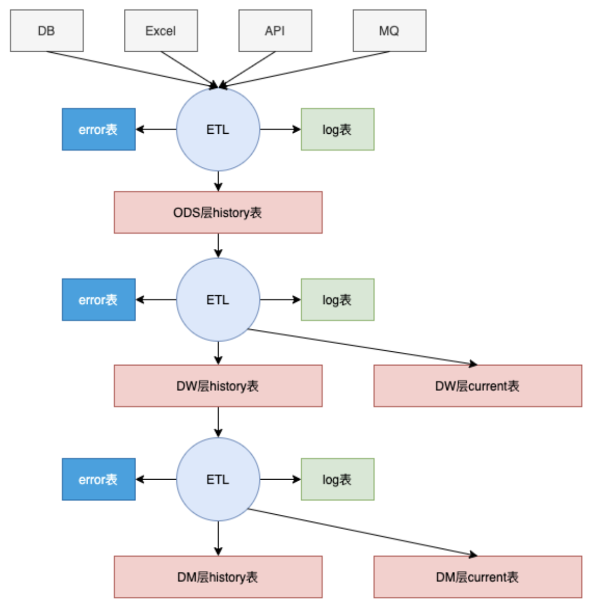

# DW 数据仓库

* 数据仓库是从业务角度出发的一种数据组织形式，它是大数据应用和数据中台的基础

## 数据项目 vs 应用项目

* 前期调研阶段
    - 应用项目聚焦业务本身，需要梳理具体的业务流程
    - 数据项目聚焦于数据流向，需要梳理数据全景图。
* 数据存储
    - 对于建模阶段，应用项目多遵循三范式，多有物理主外键，常使用数据库自身事务保证数据一致性
    - 数据项目建模多采用维度建模，基本不使用物理主外键，数据一致性由ETL保证。
* 开发过程
    - 应用项目的模型相对简单，可以实现快速迭代；数据项目模型复杂，需要构建底层模型后，再进行快速迭代，见效时间会长于应用项目，
    - 通常数据项目需要对底层建模完成，并且对应的数据清洗处理后，才可以进行需求的快速迭代响应。

## 业务确认

* 采用的建模方法是维度建模，按照事实表（fact数据），维度表（dim数据）来构建数据仓库。因此，业务确认需要确认以下几点：
    - 哪些数据为维度数据，哪些数据为事实数据
    - 数据的生产者、使用者以及数据的管理者
    - 业务边界

## 数据收集

* 考虑
    - 数据定义，要确定主数据以及事实数据的具体业务含义，以及对于事实数据的统计口径进行确认。
    - 数据更新频率，实时更新还是每日更新或是按需更新等。
    - 数据更新方式，增量更新还是半全量更新或是全量更新等。
    - 数据逻辑主键，对于数据的逻辑主键需要和业务方进行确认，根据经验在和业务方确认完成粒度后需要拿到部分数据（维度数据最好全量，事实数据为近一个月数据），对数据进行检查，如逻辑主键是否有空，是否有重复等情况。事实证明，我经常会接触到数据的展现形式和业务方提供的逻辑主键有出入，因此这部分工作建议一定要做，避免后续会有返工。
    - 维度数据质量检查，需要确认数据是否包含关键字段，同时，需要对一些通用信息的关联进行检查，如省市信息，需要和业务沟通省市信的来源（国家统计局/百度/…），再和相应的来源进行校验确认数据质量。
    - 事实数据质量检查，事实数据的质量检查主要为和主数据是否可以完全关联，如果有关联不上的主数据，需要确认原因。
    - 数据范围确认，基于所提供的demo数据来确认是否和上述确认的业务边界匹配。
* 重点
    - 需要了解每一个数据的业务含义，需要确保各方使用的数据口径的统一。如对于产品的定义，多方定义可能不同，有的定义一个产品是SKU，有的定义却是SPU。因此数据收集阶段非常重要，会直接影响数据建模的质量

## 数据建模

* 概念建模阶段
    - 自上而下创建数据模型，精确的描述业务组织，构想业务的总体结构，并给出主题领域的信息。
    - 由实体类型和关系组成。在这个过程中，未声明主键，未指定实体属性。
    - 在概念建模阶段，从数据全景出发，而不是局限于现有数据，这样有利于数仓的数据架构扩展。
* 逻辑建模阶段
    - 逻辑模型定义实体的数据结构和实体之间的关系，在此过程需要定义业务主键和逻辑主键，规范化实体属性，以及细化实体之间的关联关系，同时定义数据源。
* 物理建模阶段
    - 通过数据库规则，将逻辑模型实例化为物理数据模型。物理数据模型可能与逻辑数据模型不同，根据数据仓库的存储介质不同，需要对物理模型进行相应的优化。
* 注意
    - 物理表可以存在逻辑主键，但是不要存在物理主键和物理外键，数据完整性和一致性需要通过ETL保证

## 数据处理

### 数据分层

各层的数据表都会采用统一的命名规则进行规范化管理，表名中会携带分层、主题域、业务过程以及分区信息

- ODS层（staging层）数据通常和原始数据保持一致，目的是保持数据的完整性，不做任何数据方面的操作。因此ODS层的表结构会和原始数据保持一致。
- DW层（数据仓库层）模型层，该层的数据通常会通过我们之前对业务的了解，对ODS层的数据进行清洗，转化等操作。同时，DW层的数据类型会跟业务的数据类型保持一致
    + 包含维度表和事实表，通过对源表进行清洗后形成的数据宽表，比如：城市表、商品类目表、后端埋点明细表、前端埋点明细表、用户宽表、商品宽表
- DM层（数据集市层）最贴近业务需求的数据，如会根据业务需求对DW层的数据进行某些指标的计算，或对某个维度的聚合等操作，可供其他系统直接使用或为报表展示提供数据
    + 对数据进行了轻粒度的汇总，由各业务方共建，比如：用户群分析表、交易全链路表
- ADS：数据应用层，根据实际应用需求生成的各种数据表

### ETL流程  Extraction-Transformation-Loading

* 负责将分布的、异构数据源中的数据如关系数据、平面数据(去除了所有特定应用格式，可以迁移到其他应用上进行处理的一类数据，比如逗号分隔数据)文件等抽取到临时中间层后进行清洗、转换、集成，最后加载到数据仓库或数据集市中，成为联机分析处理、数据挖掘的基础，是BI(Business Intelligence)/DW的核心和灵魂，是数据仓库中的非常重要的一环
* 技术上涉及到关联、转换、增量、调度和监控等几个方面
* 数据不要求与联机事务处理系统中数据实时同步，所以可以定时进行
* 在数据仓库建设中最难部分是用户需求分析和模型设计，而ETL规则设计和实施则是工作量最大的，约占整个项目的60%～80%
* 通常数仓项目通过基于日志驱动的机制进行ETL的管理，对于每个数据源，每一层的ETL都会有对应的日志信息，日志表主要目的是记录本次ETL是否执行成功，在下一次执行ETL时，需要根据上一层的ETL日志表中的执行成功的记录和本层ETL 日志表中执行成功的记录取差集，则为本次ETL需要执行的数据。
    - 即每次ETL是否执行，需要处理的数据是什么，都是通过上一层的日志表和本层的日志表计算得来。
    - 对于大批量的数据，可以采用异步处理方式，将待处理的数据编号存储到队列中，由订阅该队列的ETL来处理相应的数据。
* 日志数据可以很清晰的看到数据在每一层的数据处理记录，对于业务复杂的场景，可以对指定层的指定数据进行数据处理。同时，对应的日志表还会有一张error表，用来数据的异常
* 从数据源到ODS层
    - 通常数据源有API、Excel、DB、邮件、消息队列等，在数据源到ODS层的数据，对应的日志表会记录每次ETL读取的数据量，进入到ODS层的数据量，ETL的执行开始时间和结束时间，数据源是什么（对于文件等方式，可以记录文件的版本名称等）以及ETL的执行结果。对于事实数据，通常还会记录该批次数据的业务最大时间和最小时间。
    - 本次ETL对数据处理后的异常数据，会存储在对应的error表中。对于到ODS层的ETL，主要的错误类型有数据长度超过ODS层规定长度和数据源不规范导致的错误（如接口返回数据字段缺失或Excel数据中缺少对应sheet/列名等）。
    - ODS层的业务数据只有历史记录表，记录了每次ETL进来的数据，每次的ETL数据会有对应的etllogid来作为标识，用于下一层ETL来获取数据的查询条件。
* 从ODS层到DW层
    - 维度数据
        + 数据校验:数据错误类型分为两种级别，error和warning。error级别的数据错误不会进入到DW层（具体哪些类型为error通常由业务决定，通常情况下逻辑主键为空和重复为error错误），而warning的数据错误则会进入下一层，但这些类型的错误都会在error表中体现。
        + 数据渐变:更新数据会与current表（维度数据的current表为包含历史渐变信息和当前快照信息的表；而事实数据的current表为当前快照信息表）中的数据根据逻辑主键进行对比，并通过starttime、endtime和isvalid字段来确认数据的有效性并体现渐变，starttime和`end_time`一般采用前闭后开原则.新更新的数据为对历史current表进行更新，则旧数据对应的endtime则会为新数据的starttime，同时代表该条数据有效性的is_valid会被置为0.通常对于相同逻辑主键的数据，starttime和endtime必须连贯且没有交集，否则后续事实数据关联主数据则会出现异常
        + 通常会在维度数据中插入ID为-1的数据，该数据的目的在于和主数据关联不上的事实数据，在进行后续统计时，采用inner join可以把关联不上主数据的事实数据也统计上（inner join比left join的性能好，因此在大数据量情况下采用inner join进行数据分析等操作）。
        + 对于区域和时间等主数据信息，需要进行维护。如区域信息，需要维护不同来源的数据（国家统计局/百度/腾讯…），这样对不同区域来源的数据关联采用相同的区域数据，确保后续关于地区数据的口径统一。时间数据的维护如对于某一天需要记录该日期数据当前年的第几天、当前周的第几天，当前年的第几周等信息，方便后续和事实数据关联后能快速分析。
    - 事实数据
        + 对于和主数据关联。需要根据事实数据的产生时间和主数据的有效时间来进行关联,对于关联不上的主数据，通常事实表中主数据的ID列的值为-1
        + 数据回滚:通常做法是使用一个temp表（一般temp表和current的表结构相同），一般导致ETL异常的情况为更新的数据发生异常导致ETL报错等，因此先将更新数据插入到temp表中，如果成功，则再删除current指定数据，这样可以避免在删除完current表中的数据后，插入current表中数据中途报错导致数据不完整。关于temp并没有完全解决数据数据的回滚，只是能避免上述场景导致的数据问题，通常数据仓库允许ETL批次调度间隔内存在数据异常，下一次成功运行后，数据恢复正常
* 日志监控
    - job错误:通常是指调度工作出现异常，如azkaban的job调度错误，导致ETL执行失败。针对这类错误的监控，azkaban自带了SLA，可以对每个job进行配置，设定告警邮件和触发条件等
    - ETL错误:ETL在执行过程中由于代码或数据的异常导致ETL报错。针对这类错误，需要通过代码来定时监控的ETL是否正常工作
    - 数据错误:数据错误则是数据仓库需要处理的异常数据，该数据为通过质量校验后存入error表中的数据。通常这些数据会导致报表的数据质量，因此需要邮件相关数据的管理者来对数据进行确认处理。

## 数据可视化/分析

* 对于快速变化的业务报表需求，可以快速对DM层（report层）的数据进行进行建模，但DW层的数据模型则不用修改，因此这种分层可以快速响应不断变化的业务需求

## 挑战

* 数据跟随业务在不断变化，分散的存储和管理由于时效性和各系统的侧重点不同，而无法保证数据一致性，系统对接会造成大量的沟通成本。
* 源系统的数据更新频率导致数据问题频发。
* 业务需求不断变化，模型修改时间过长

## 关注

* 数据建模：数据仓库项目中最重要的一环，决定了是否健壮，是否性能优越，是否易扩展，是否易使用，主要分为概念建模、逻辑建模、物理建模三个阶段，一般采用维度建模中的星型模型，在这个阶段需要梳理数据全景图，考虑已存在和未存在的数据，标识数据源，查看数据质量。
* 架构选型：参考数据源，数据量，性能要求等指标，选择适合的数据存储，ETL工具和报表工具。
* 日志运维：数据的事务、ETL的幂等性由数据日志控制。日志分为任务调度、ETL、数据三个级别。任务调度的日志由调度器维护，例如，Azkaban。ETL的日志，需要记录内部每个模块和ETL的整体运行情况。数据日志记录每个批次运行的数据范围，每个批次运行后的数据结果，例如：维度表的错误处理，事实表每次处理的数据量、成功量、失败量、失败的原因等。运维人员一站式查看、处理ETL运行情况，日志驱动数据流向，每个数据层有对应的日志表，生成本层需要处理的数据范围并记录状态，且层与层之间解耦

## 参考

* [健壮的数据仓库项目搭建](https://mp.weixin.qq.com/s/8KnedgjOt6mC44jTUbQ9eA)
