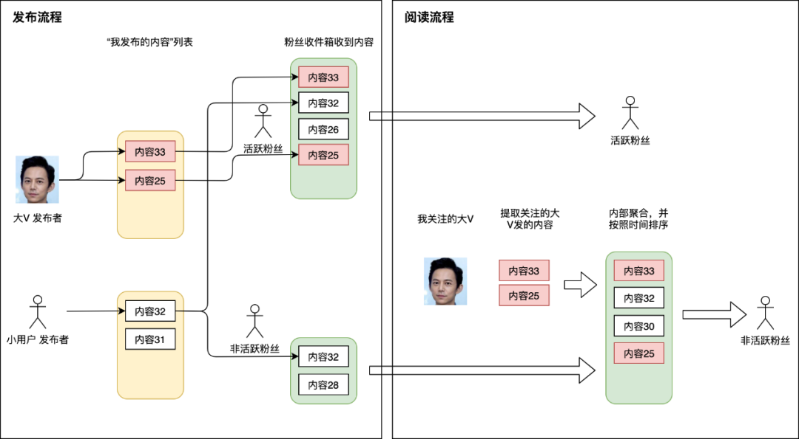

# content

* 现在有了太多的信息，因此更关键的是选择正确的信息。并不是反对社交媒体，但是它太浪费时间了。而且它有点儿非黑即白，生活远比它要复杂得多
* 美国 Verizon 公司宣布，将以前收购的两个网站---- AOL 和 Yahoo ----一起打包卖掉，一共50亿美元.内容渠道的贬值，是一个全世界的普遍现象,一个直接后果就是，内容生产者也在贬值。

## 采访控制

* 流程
    - 内容大纲
* 自由发挥
* 记录

## 消息

* 推送是不是好选择，商业上是，对个人不是
* 根据胡说，当所有App都在推送通知的时候，那么就没有推送这件事。人们开启通知，是因为不想错过所谓“重要的消息”。但是，当每一个“重要消息”都推送到你手机上时，也就没有了重要消息。重要应该是独特而唯一的，家家户户条条都推送，那叫渣男消息；  
* 打断我是一种特权。我家人可以在我说话做事时任意打断我，我朋友可以在凌晨两点打断我的阅读或者睡眠，因为他们是特别的，应该得到区别对待。但是，如果我午饭时接到了办假学历电话，或者是植发广告，我就会大发雷霆，因为这些事情远没有我吃饭重要。绝大部分App没有重要到这个程度，必须要发通知让我知道；  
* 手机屏幕上的App们形成了一个小型丛林，它们在丛林里为了生存而竞争。什么是App的生存？那就是你多长时间点开它一次。你点开的频率越高，它就活得越好，所以淘宝要做签到，要开发小游戏，希望你每天不断打开它，那么你下单的可能就越高，它的收益也就越好。因此，推送通知是各家App的生存手段，并不是为了你及时获得消息，而是为了它们自己活下去。
* 如果他真有什么重要的事情一定要找你，他会再来的。说的其实不是对方，而是在说我，翻译过来是一句很直白但是堪称人生真理的话：你没有重要到那个程度，让别人觉得非你不可。

## Feed 流

* 读扩散|拉模式:粉丝阅读时，系统首先需要拿到粉丝关注的所有人，然后遍历所有发布者的发件箱，取出他们所发布的帖子，然后依据发布时间排序，展示给阅读者
    - 读一次 Feed 流，后台会扩散为 N 次读操作（N 等于关注的人数）以及一次聚合操作
    - 好处是底层存储简单，没有空间浪费
    - 坏处
        + 每次读操作会非常重，操作非常多
        + 分页不方便:只采用实时聚合的方式，下滑到比较靠后的页码时会非常麻烦
    - 适用系统中阅读者关注的人没那么多，并且刷 Feed 流并不频繁的场景
    - 每个阅读者所能关注的人数也要设置上限
* 写扩散|推模式
    - 大多数 Feed 流产品的读写比大概在 100:1，也就是说大部分情况都是刷 Feed 流看别人发的.宁愿让发帖的过程复杂一些，也不愿影响用户读 Feed 流的体验
    - 当发布者发表一篇帖子的时候，除了往自己发件箱记录一下之外，还会遍历发布者的所有粉丝，往这些粉丝的收件箱也投放一份相同内容。这样阅读者来读 Feed 流时，直接从自己的收件箱读取即可
    - 每次发表帖子，另外起一个异步任务扩散为 M 次写操作（M 等于自己的粉丝数)
    - 好处在于通过数据冗余（一篇帖子会被存储 M 份副本），提升了阅读者的用户体验
* 读写混合模式
    - 大 V:将粉丝量作为一个判断指标
        + 粉丝量超大的人发帖时，将帖子写入何炅的发件箱，另外提取出来何炅粉丝当中比较活跃的那一批（这已经可以筛掉大部分了），将帖子写入他们的收件箱
        + 粉丝量很小的路人甲发帖时，采用写扩散方式，遍历他的所有粉丝并将帖子写入粉丝收件箱
    - 活跃粉丝:最近一次登录时间
        + 活跃用户登录刷 Feed 流时，直接从自己的收件箱读取帖子即可，保证了活跃用户的体验。
        + 非活跃的用户突然登录刷 Feed 流时，一方面需要读他的收件箱，另一方面需要遍历他所关注的大 V 用户的发件箱提取帖子，并且做一下聚合展示
* 分页问题
    - 分页入参:使用 last_id 来记录上一页最后一条内容的 id,往后偏移 page_size 条数据，返回
    - last_id 方案有一个重要条件：last_id 本身这条数据不可以被硬删除

## 生活手帖

* 日本国民杂志
	* 最初要做这本杂志的其实是一位女士——大桥镇子。这本杂志诞生的年代在战后，战败的日本处于非常贫困的状态，大桥女士的父亲很早过世，母亲把三个女儿拉扯大，很不容易，她希望为母亲尽孝心，所以她想自己创业，为同一时代的女性做这样一本杂志。
	* 作为《日本读书新闻》的记者，她去找了当时报社的社长，社长说你去找花森安治。花森安治当时也在报社帮忙，画一些插图，他有一些插画上的天赋。
	* 大桥镇子就去找他，说我想办这样的杂志。花森安治的母亲在他读高中的时候就过世了，他没有尽到孝心，所以他觉得我可以帮你，但有一个条件：**我希望这本杂志能够切实地让战争不再发生，如果我们每个人对自己的生活、我们的日常能够真正关照好，就不会再有战争。**
	* 最开始的时候，这个杂志其实是叫_Style Book_，它主要是讲时尚、服装相关的内容，**到1948年才有正式名更名为《美好生活手帖》（后改名为《生活手帖》）*
* 产品测评
	* 17年前的第20号第一次刊登“商品测评”起，就认定测评本身绝不能成为“商品”
	* **不是为了消费者，是为了厂家做的**
		* 人人都想成为“聪明的消费者”。但事实是，我们几乎被这股凶猛的商品洪流淹没。
		* 一件商品的生产和销售，既非一桩慈善事业，也非趣味使然。坦白说，其目的就是为了盈利。
		* 在“商品测评”中，须清楚地标明商品名，公布其优劣。如果测评值得信赖，那么好商品一定能卖，不被推荐的则会滞销。
		* 厂家只会生产好卖的东西。“商品测评”，其实是为生产者而存在的。这是为了让生产者专注于制作好东西的最有效的方法。
	* **任何附带的条件都会扭曲商品测评的本意**
	* **对测评人，同样也不能受到任何外力的干涉，对任何一个品牌必须要做到完全的公正。**
	* 任何时候，“商品测评”都须在“实际使用”的状态下开展
	* 在比较各种商品时，保持“同一条件”比其他任何要求都更重要。
	* 产品测评的基础，是对日常生活的深度着眼，对时代动向的发散思考，因而既是对社会的评判，也是对文化的评判。
	* **做法提升了整个社会商品的质量，商品测评不仅仅是一个杂志的内容，它也是一个社会运动。**

## 信息茧房

* 在信息传播中，公众所接触的信息是有限的，会选择自己愉悦的信息，久而久之，会将自身桎梏于像蚕茧一般的“茧房”中
* 世界之大，信息无穷，考虑到处理信息的成本与风险，人们倾向于待在认知的舒适区。这是一种自我编织的茧房。这种茧房并不可怕，因为自由竞争的压力会迫使人们走出舒适区，懒惰者、安逸者被惩罚、被淘汰
* 真正需要警惕的是他人编织的信息茧房。
    - 将古代村落沦为信息茧房的并非野兽而是君王
    - 随着文字、纸张、印刷、电报电视的问世，知识精英逐渐掌握了信息茧房的控制权。世纪之交，互联网打破信息孤岛，“逆袭”知识精英。如今，技术精英借助算法悄无声息地夺权，给每一个人都量身订做了一个信息茧房。
    - 在算法时代，以为自己拥抱了知识的海洋，其实看到的信息只是你想看到的，技术精英想给你看到的。我们每天都生活在回音壁中反复地收听那悦耳的音符。
    - 这种舒适可能引发灾难性后果——认知黑洞。信息、方法论与智慧存在关联关系。信息是方法论的原材料，方法论很重要，但不是决定性的。在信息茧房中，人们即便可以获得很多想要的信息，经过科学方法加工，也很难输出真正的智慧。
* 所谓真正的智慧，是指自然规律、人的行为规律以及思辨哲学.掌握规律靠抽象逻辑
    - 大多数人都没有能力通过数学方法来建立抽象逻辑
    - 普通人只能使用经验归纳法来认识事物。这是一种成本最低的方法,经验归纳法容易犯错
        + 信息是必要条件，但不是充分条件。不管是定量分析还是定性分析，都不可能获得充分的信息。形式逻辑的错误更多源自信息源被控制，即信息茧房
        + 比如，从小到大看到的天鹅是白天鹅，那么容易将白天鹅等同于天鹅。这就是形式逻辑。如果哪天看到了一只黑天鹅，那么你的思想可能要遭遇一场“黑天鹅”。当黑白天鹅都看过了，才不容易陷入“颜色”的形式逻辑，从更本质的角度认识天鹅。但是，很不幸的是，黑天鹅全被我宰了。这就人为地制造了“幸存者偏差”
    - 只要信息是自然流动的，即使存在信息不对称，人也可以在经验基础上建立抽象逻辑。这就是德国哲学家康德的“先验”认识论。经济学家米塞斯用先验来解释奥派的方法论。先验，其实是在经验基础上的抽象逻辑
    - 无法建立抽象逻辑的关键，不是信息不充分，而是人为设置的信息茧房。在信息茧房中，人即便可以获得特定的丰富的知识，也难以建立抽象逻辑。有些人纵然满腹经纶、博闻强识，也只是个愚不可及的老朽
    - 在信息茧房中，形式逻辑占据统治地位，偏见盛行，盲目自信
    - 帕累托探索的是经济的一般规律，而德国施穆勒领导的历史学派是典型的形式逻辑学说，它建立在德国特殊论之上，最终导向了希特勒领导的纳粹运动。
    - 信息茧房促使逻辑形式化，思维简单化，认知标签化，理论特殊化，导致人愈加封闭、自我、无知、偏执、傲慢、群氓。
* 撕裂与群氓
    - 在信息茧房中，形式逻辑战胜抽象逻辑，标签替代思考，偏执引起群氓。(动物庄园)腿的数量，就是一种形式逻辑。这种形式逻辑成为了好与坏的标准。两腿的就是坏蛋，这就是贴标签、扣帽子。
    - 缺乏抽象逻辑的人容易服从于一种哲学。米塞斯在《人的行为》中揭示了这种哲学的逻辑问题。它认为主观服从于客观，真理源自现实而非逻辑，进而推导出生产力决定论、劳动价值论、身份决定论、立场决定论、动机决定论、历史决定论
        + 服从于这种哲学的人，谈历史，使用的是盖棺定论；谈现实，强调“存在即合理”；谈国家，但不思考何为国家。他们不问是非，用折中主义掩盖错误；不知对错，用屁股决定脑袋。在公正面前，将妥协视为艺术，将守正视为愚蠢，将标签视为标准，将立场视为正义。总之，“大即原罪”，资本家等于罪犯，反对我的人一律是卖国贼、汉奸和资本家的狗腿子。
    - 信息茧房就像一个劫匪，里面的人容易患上斯德哥尔摩症。人在茧房的时间越长，沉没成本就越大。即便哪天三观受到“暴击”，也不愿意承认和醒来。因为醒来的成本太高、代价太大，心理上接受不了。“你永远叫不醒一个装睡的人”就是这个道理。相反，他们会劝你好好配合劫匪才是唯一的生路。
    - 德国大众传媒学家伊丽莎白·诺埃尔·诺伊曼提出一种理论叫“沉默的螺旋理论”。她指出，人们越沉默，特定的看法就会得到强化，越多的人屈于群体压力而加入其中，从而形成一股向下的洪流。
        + 这股股洪流可能引发一场场群氓运动。他们跟风、盲从、焦虑、易怒、狂热、纵欲，拒绝思考及放纵暴力，缺乏独立意识与思辨能力，在追求“集体灵魂”中迷失，在追逐公共利益中窃取私利。群体心理学的创始人古斯塔夫·勒庞在《群氓心理学》中指出：“深谙其道的演说家在面对群氓的演说中常常利用这些特征。
        + 桑斯坦警示：“一些国家就由于这个原因走向灾难。对于生活在信息茧房的领导人和其他人而言，这是一个温暖、友好的地方。但是，重大的错误就是舒适的代价。对于私人和公共机构而言，茧房可能变成公众一种可怕的梦魇。
* 逻辑与生意
    - 主观思想缔造了人类文明，主观价值开启了自由市场。哈耶克说：“经济理论的每一次重大进步，都是主观主义的贯彻运用又向前迈进了一步。”这句话扩大来说就是，人类社会的每一次重大进步，都是主观思想的进步。这与物质、规律的客观性不矛盾。
    - 第一步是用制度打破信息茧房
        + 在约束人的言行上，生意比道德教化更有效。因为代价与利益，我们不得不包容对方，硬着头皮去了解、理解对方。这就打破了自己的信息茧房，增进信息交流与情感融合
        + 英国古典政治经济学最后一位大师约翰·穆勒在其《政治经济学原理》有如下表述：“商业首次教育各个民族满怀善意地看待彼此的富强与繁荣。过去的爱国者，除去其中富有教养的能够将世界视为自己国家的人之外，无不希望本国以外的一切国家都贫弱而且管理不善。现在，他们将其他国家的富裕和进步视为本国富裕和进步的直接源泉。正是商业贸易通过巩固并增加与战争天然对立的个人的利益，使战争迅速遭到废弃。可以毫不夸张地讲，作为世界和平基本安全屏障的国际贸易的全面开拓和迅速发展，已经成为人类种族的思想、制度和素质不断进步的伟大的而且永久的保证。
        + 自由市场，每个人评估自己的成本与收益而行动。固步自封者、歧视者、不合作者逐渐被淘汰，而开放、自由、协作的精神得以保留与弘扬。这并不是说为自己牟利的人、生意人的道德更高尚，而是自由市场的竞争呈现了这样一种结果。
    - 第二步是建立抽象逻辑

## 内容

* [Wikipedia](https://en.wikipedia.org/wiki/Main_Page)
* [Medium](https://medium.com/)
* [Quora](https://www.quora.com/)
* [Reddit](https://www.reddit.com/)
* [BuzzFeed](https://www.buzzfeed.com/)
* [Pinterest](https://www.pinterest.com/)
* [tumblr](https://www.tumblr.com/)
* Imgur
* 掘金
* 开发者头条
* 码农头条
* 伯乐在线
* [网站 任意门](https://gate.ofo.moe/)
* 36氪
* 知乎
* [字里行间](https://zi.com/):中文写作 APP，开发者的设计功力非常强
* [简书](http://www.jianshu.com/)
* [Byword](https://metaclassy.com/):简洁，优美，专注于文字。非常棒的写作工具。

* 得到
* [极客时间](https://github.com/shawjia/geektime-desktop)
	* 选门好课 返现

* [hackernews-daily](https://github.com/headllines/hackernews-daily)
* [weekly](https://github.com/ruanyf/weekly):技术分享周刊，每周五发布
* [zenany](https://github.com/zenany/weekly):汇总平时看到的好文章，技术、产品、管理均有，尽量保证一周汇总一篇
* [thepracticaldev](https://github.com/thepracticaldev/dev.to):Where programmers share ideas and help each other grow <https://dev.to>
* [Trending](https://github.com/trending):See what the GitHub community is most excited about today.
* [HelloGitHub](https://github.com/521xueweihan/HelloGitHub):octocat: Find pearls on open-source seashore 分享 GitHub 上有趣、入门级的开源项目 <https://hellogithub.com/>
* [awesome](https://github.com/sindresorhus/awesome) Curated list of awesome lists
* [Aggregated Awesome](https://aggregatedawesome.com/):There are several awesome lists on GitHub that collect and curate the best resources for a specific programming language, framework, platform, etc.
* [Awesome-Lists](https://github.com/wx-chevalier/Awesome-Lists):📚 Guide to Galaxy, curated, worthy and up-to-date links/reading list for ITCS-Coding/Algorithm/SoftwareArchitecture/AI. 💫 ITCS-编程/算法/软件架构/人工智能等领域的文章/书籍/资料/项目链接精选，岁月沉淀的美好
* [Developer-Zero-To-Mastery](https://github.com/wx-chevalier/Developer-Zero-To-Mastery):📚 To Be Professional Developer From Zero To Mastery, Interactive MindMap, RoadMap(Learning Path/Interview Questions), xCompass, Weekly for Developer, to Learn Everything in ITCS 💫 程序员的技术视野、知识管理与职业规划，提高个人与团队的研发效能
* [goodies](https://github.com/rsapkf/goodies):Collection of GitHub repos, blogs and websites to learn cool things <https://goodies.gitbook.io/goodies/>
* [lists](https://github.com/jnv/lists):The definitive list of lists (of lists) curated on GitHub and elsewhere

## 看理想

* 徐贲 《西方的起源：古希腊经典选读》
    - 第一，幸福是一个难以把握的观念，因为不同时代的人会有不一样的看法，即使是同一个时代的人，对幸福是什么也会有不同的理解。每个人都有追求他认为的幸福的权利，只要不伤害到别人，就不应该被禁止或者阻挠。第二，每个人都需要好好把握自己的幸福，因为，就算是别人出于好心给你安排的幸福，也有可能让你变得不幸。
* 陈迪 《观念辞典：你身边的政治学》
    - 种子是要长大的，污名是会扩散的；激进还是温和，区别只是参照系而已。只要政治正确的污名化帽子越变越大、越变越宽，它早晚会将任何带有多元、包容、性别友好、种族平权价值线索的主张，都给通通包裹进去。
* 周濂 《惊奇之旅：简明西方哲学史》
    - 此外，抽签制看似强调平等，其实却是在伤害平等。就像亚里士多德所说的那样，以不平等的方式对待平等之人是为不平等，以平等的方式对待不平等的人同样也是不平等。
    - 哲学是一个动词而不是一个名词，哲学的本质不在于掌握真理而在于寻找真理。
* 刘瑜 《可能性的艺术：比较政治学30讲》
    - 自由从不降临于人类，人类必须上升至其高度。
    - 政治复杂到让人绝望，却也让思考充满乐趣
        + 虽然人类已经能够上天入地、呼风唤雨，但仍然会为能不能退出一个宗教打得头破血流，为一句刺耳的言论付出沉重代价，为一句口号沦为无法退出的实验品，为一场选举而反目为仇。
        + 没有常识未必是一件坏事。为什么？因为如果知识是确切的，专制就是必要的。
        + 恰恰是知识的不确定性，让我们需要在每一个时代、每一个情境中不断重返基本的道德问题和历史经验，用我们自己的头脑思考，并以这种思考成就人之为人的尊严。
        + 如果说自然科学的知识是在建造一座层层累加的高塔，社会科学的知识则更像是西西弗斯在推石头，推上去，掉下来，再推上去，再掉下来。或许有人认为西西弗斯的努力是一种徒劳，殊不知原地踏步或许正是对自由落体的抵抗。
        + 政治复杂到令人绝望，但也正是这种复杂，让思考充满乐趣，让自由成为必要，让未来涌现无穷无尽的惊奇。
* 鞠白玉 《祛魅：当代艺术入门》
    - 女性主义不是为了消除性别差异，而是在反思被男权界定的女性身份。卢卡斯是在嘲讽，那种男性规定下所想象、所期待的女性美，谁说女性就应该是精巧和美丽的呢？她在告诉人们，“女性”一词无法定义。
* 王瑞芸 《10件作品里的西方艺术史》
    - 当代艺术后来变成了脏乱差，你什么手段都可以拿出来，因为它要紧的不在这，要紧的在一个观念的表达。这也是为什么西方当代艺术这么多样、这么没法归纳。
* 詹青云 《正义与现实：像律师一样思考》
    - 法律不是黑白分明的，而是利益博弈和斗争的结果。我觉得有可能，我们用黑白这两个字去描述法律的时候，本身就会带着一些小小的偏见跟误导。因为，法律没有那么单纯，没有那么分明。很多时候法律不是一套确定无疑的标准答案，它是许许多多的利益博弈和斗争的结果。
* 严飞 《像社会学家一样思考
    - 所谓阶级，就是这样一些集团，由于它们在一定社会经济结构中所处的地位不同，生产资料的关系不同，在社会劳动组织中所起的作用不同，其中一个集团可以占有另一个集团的劳动。
* 杨照 《曾经江湖：重读金庸》
    - 金庸之所以了不起，因为他写了很多的配角，而且这些配角在个性上很多都跟主角同等的精彩。更重要的是你不要忘了金庸不只是写男主角，这是金庸的武侠小说跟整个庞大的武侠小说传统上面最大不同的地方，那就是他擅长写女性，而且他写了好多女性角色，我们不能忘掉他所写的女性角色。
* 白先勇 《白先勇细说红楼梦》
    - 所谓social order，整个社会秩序，是要有理性地来规划，但很多时候，人的感情很复杂，不一定受得了理的约束。像宝玉、黛玉都是很奇特的，他们个人的个性不一定为它所拘，所以当然就产生了很多悲剧，痛苦。
* 廖伟棠 《诗意：关于新诗的三十种注脚》
    - 余秀华的大多数的诗里并不存在这种廉价的安慰，尤其是在她成名之前写的诗，无论是关于爱情，还是物质的生活，她都处于一种贫乏状态。她如何去直面这种现实，和它进行一种近乎残酷的搏斗，这种搏斗不但出现在她人生里，也出现在她的诗歌语言里。
* 梁文道 《一千零一夜》
    - 那既是美国最繁华的年代，也是贫富差距最大的年代。它是整个现代文明的隐喻，是一个铜币的两面，一边看起来非常亮丽，但另一边翻过去，就是人心的虚无与空洞。
* 陶朗歌 《漫画实验室：打开你的思维次元》
    - 谎言的代价是什么？如今当我们回望那段历史时，会发现整个切尔诺贝利事件，从始至终都被包裹在一层层的谎言之中，苏联政府的噤声和欺瞒为整起事件包裹上了更为悲剧的色彩，无数平民被裹挟在谎言的漩涡之中，有的英年早逝，有的终身残疾，有的甚至危及他们的下一代。
* 阿郎 《21世纪伟大电影》
    - 爱情是人类叙事最永恒的母题，迷人之处在于其简单与复杂的一体两面。爱情最简单，这世界上所有爱情的起伏曲线都是一样的。爱情又最复杂，所有人都知晓它大致的轮廓和走向，但没有人可以猜到，每一个爱情会以什么样的方式走到那个最终会走向的尽头。
* 哲学家的10种生活提案：从苏格拉底到萨特的人生哲学

### 《圆桌派》

* 1998～2018，慢慢听别哭啊
* 做了不等于做到
* 洗白自己，干掉坏习惯
- 大学：谁的青春不迷茫
	+ 人这一生如果能有幸进入大学，你的生命里边有这么一段时光，在大学里把一切问题把它讲好它，解决好它，各种疑问解决好它，你回到社会上，你才是一个人格健全的人。
		
### 《艺术折叠》

* 葛宇路：没皮没脸待着也挺好
	* 强行让自己彻底地过气
		* 2013年，在未经批准的情况下，将自己的名字作为路牌悬挂在一条未被命名的街道上。此后，“葛宇路”逐渐被高德、百度等网络地图使用；交警们在该路段开具违章停车罚单时也将“葛宇路”填进地址栏；甚至市政部门也用“葛宇路”为该路段的路灯进行编号。直到后来被报道发现，路牌才于2017年7月被拆除。
		* “网红”的好处是确实人们会更愿意花时间进入你的作品。会感到很危险。因为网络的逻辑是，要维持住流量，就得不断去迎合流量的受众。创作者为了维持他的流量，需要不断地重复类似的创作。维持这种流量带来的好处是巨大的，确实可能会有很多的钱，但也是有代价，或许要建立一个团队，每天想着研究观众的流量曲线。今天流量跌了，调整一下我们的工作，明天流量涨了，证明我们创作方向是可以的。对这种流量导向的创作特别警惕，所以我其实在那个之后，我强行让自己沉寂了一段时间，希望让自己安静下来，彻底地过气。
		* 大概又过了两三年，去年做了新的作品，受到了一些关注，直到现在才回到了一个算是比较平衡的状态。我证明了我可以通过创作来获得大家的认可，而这种认可不是那种被流量绑着走的，我是自由的，这比流量更重要。
		* 躺平对我而言还好，因为我也没办法把目标寄托在大家普遍被灌输的那种目标上，比如买房、买车。许多人朝着这个目标一步步走，希望名校毕业，成为未来的精英，结果越走越发现情况不对，不论自己怎么努力，都无法像上一代人那样到达更高的位置，就不得不接受现实，所以才会非常地绝望。成为“人上人”或者“精英”，总的来说是一种成功导向的灌输，我挺怀疑这样的目标。既然我一开始就没有奔着这种目标去，所以也谈不上失望。如果说对自己有哪些期待，我觉得我生活得开心，能不断填补自己的好奇心，就足够了。
		* 完全没有物质上的压力吗？有压力，但是这个压力主要还是看你需要的物质。就我现在的生活状况，和许多人比，肯定算是很好的——我想吃饭就能吃饭，我可以点外卖，也可以去菜市场买，我房租也不高，之前也能去国外旅游，不会有掏不起钱、捉襟见肘的担忧。然而，那些真正要花钱的事情，我都不太感兴趣，比如买贵的衣服和奢侈品，或者说去很夸张的场所消费。那类地方偶尔有朋友带我去过，我就觉得浑身特难受，自己有些抵触。总的来说，开销和收入能维持一个平衡，我觉得就挺好的。
	* “内卷”，越早跳出来越好
		* 有些以前一起在湖北美院读书的同学，很幸运地留在了学校，一个月工资大概四五千块，但他们的课全部被排满了，因为年纪大的老教授们是不上课的，排了课也是让年轻老师去上。年轻老师们就得一年到头地上课，寒暑假还得帮老师干活，但是就这么点工资，也没有时间做创作。他们每天从市区开车到郊区的学校上课，交通费再加上吃穿的开销，工资基本上就所剩无几了，画画还要买颜料
		* 在系统里上班的同学，其实最后剩下的积蓄和我差不多。可能比我还惨的是，他们越上班越穷。所以我觉得，还是要各种面向都去接触一下，也许就能让人从小的困境之中跳出来。就我自己而言，看了更大的世界之后，会觉得就算在北京某个学校里拿了户口，天天这么打工，确实也挺无聊的。你会见识到更多有趣的生活方式，在国外跟认识的新朋友唱歌，听他们聊南来北往的故事，看着各色的人做着各种各样的事情——有在山里喝茶的，有每天开party的，稀奇古怪的太多了。所以就会觉得，我为什么还要被困在这里，为这么点事情天天把自己的生命一下消耗掉？
		* 另一方面，时间的因素也会发生作用。许多人认为这辈子总要在这里或那里投入时间，所以当他们在系统里投入得越多，他们跳出系统的意愿就会减弱，当初感到的恐惧也会越深入，就越丧失了逃离的能力。
		* 前两天我与两位艺术博士聊，他们都放弃做艺术，去做生意了。我问为什么？其中一位朋友回答说，最开始他们选择做艺术，是因为认为艺术是一种把人展开的方式，他希望能够通过接触和实践艺术，让自己变成一个完整的人。
		* 但是在逐渐接触的过程中，他也被卷入艺术圈的“内卷”之中了。其实我们都知道，艺术本身是个空虚的壳，什么都不是，所以其实在艺术圈里，很多人总把自己想要的东西偷偷地塞到这个壳里去，使艺术掺杂了特别多的欲望、利益、权力等等。
		* 当然，他们也承认一开始还是把艺术想的太“白莲花”了，才使得实际接触时会失望。而他们一开始就把生意想成像臭豆腐，吃一口之后反而还感觉有点香味。
		* 至于我，好像也没有卷在圈子里出不来的感觉，因为于我而言，艺术是一件可有可无的事情。在我最开始做艺术的时候，也没有所谓的艺术圈，谁都不认识我，我也不知道这些人，我只是想做我喜欢做的事情。
		* 即使现在的我，慢慢地与艺术圈有更多更深入的接触，跟各种各样的利益或权力关系打交道，但自己还是觉得没关系。这些都是世界常态的一部分，就是生活的一部分。
		* 其中不乏有意思的东西，它们能够启发我，或者有我好奇的东西，给予我创作的灵感，我还是会觉得很有趣。
	* 以艺术之名重新回归生活**
		*  最近的一件作品是2020年的《假日时光》，你给美术馆的工作人员放了假，并且在他们放假期间替他们完成了美术馆里原本要完成的工作，通过这种方式让他们在工作中有一个短暂的逃脱，以艺术之名重新回到生活。
		*  就填发票、联系外墙维护等等，诸如此类特别琐碎的事情。有时一天干下来也没完成太多事情，就是跑上跑下的对接。比如说外面的墙要维护了，我原本以为只是一个电话就能解决的事情，没想到需要上某层楼找某个人来沟通解决。而且我上楼之后，对方首先要确认我的身份。你是谁？你要干什么？好，那么我们下去看看这面墙，然后要继续联系什么部门来处理......
		*  无数的对接被衍生出来，下班之后，会发现自己，天哪！一天就这么结束了，自己一直在忙活一件事情。原本只是一句话的问题，却在这种科层制中被无限地细化。但在这个世界上，可能很多人每天都在做的，就是这些不断在琐碎中消磨自己体力和精力的事情。
		*  但一个挺无奈的事实是，现在的社会管理还是要依赖科层制，好比我们需要这种方式来维持美术馆的运营，这是观众能看到艺术作品展出的基础。大家去美术馆，总会盯着聚光灯下最闪耀的作品，却忽略了作品背后支持作品展出的巨大的系统。
		*  我原本有个想法，是想通过深入作品中的一种互换，把这个被大家忽略的部分呈现出来。复杂的体系，容易使艺术家与背后搭建、组装、维护作品的工作人员产生矛盾。有些艺术家做派比较像一个领导，过来咔咔勾了一个方案，让工作人员买材料、安装搭建、修改维护。
		*  艺术家在展览开幕时，阐释着作品的人文关怀。背后的工作人员都快吐了：“你把我们当工具使，居然跟我谈你这个作品是某种关怀？”我觉得这也特别有意思，所以后来一部分的工作也聚焦了这个过程——工作人员们对艺术的这种认知，是否会逐渐被异化为一种痛苦的体验？我发现它也不是艺术系统的个案，而是工作本身对劳动力工具化的处理，就是所谓的当一个工具人。
		*  工具人怎么能在这种非常机械的琐碎的工作中获得一些乐趣
			*  主要还是要找到工作的主动性。这听起来有点天真，但也确实是挺难的。你需要去思考怎么把手头上的工作掌握在自己手上，需要去更主动地完成，而不是被动地接受老板给你的一个个任务，并且接过来以后从头到尾都去把握它，按照自己的方式去处理它。每个人的生命和生活应该是有很多层次的，不要只活在某一个层次之中。
		*  在许多人的认知中，艺术家可能带着一种领导的身份介入美术馆，而你现在以一个工作人员的身份介入，是不是在消解消解艺术家的神圣感，包括那种“艺术高于生活”的观念，以及部分艺术家的特权？试图去消解，但最后发现艺术家特权本质上无法消解，这是我不得不接受的现实。很多明星艺术家聚集了过多的资源，变得不太像个人，而像个神，我对这种现象表示怀疑。因为在我看来，艺术本质上应是促成平等交流的，如果说我们都得以仰视去看一个作品的话，这个时候本质上交流是不对等的。
		*  这个时候我觉得违背了我认为的艺术的本质，虽然每个人对艺术认知不一样，但是我认为艺术不该是那样，所以我希望通过这种方式来达成，但我最后发现特权这个东西真的是无处不在，你无法从根本上去消解。比方说我去替班，有很多工作需要跟一位负责财务的员工对接。然而，她对我却特别客气，我要走了，还送我到电梯口，可见她并没有把我当成一名普通的员工。但后来我也意识到，如果我跟她说：“你不要这么对我，你能不能就像对其他人一样对我？”这样其实还是在行使我的特权，而且会对她造成一种更大的压迫感。所以，我什么都不说，就让她按着自己的方式来，于她而言可能还舒服一点。
		*  所以在我看来，彻底的平等可能真的无法从根源上达成，我只能去不断地警惕特权，也希望能通过作品，让大家看到特权作用过程中的一些荒诞，同时也不要太沉溺于仰视与俯视。
		*  艺术家，普遍来说还是一个边缘的职业，而且艺术家群体内部的分化很大。许多年轻的艺术家没有资源、没有钱、没有展览机会，也会很卑微，卑微到愿意倒贴自己的作品和钱去参加一个非常垃圾的展览。而有些大牌的艺术家，地位高到只要动动手指头，就有上百号人围着他前呼后。上百号人确实有些夸张，但掰掰指头算算也不夸张，毕竟他们作品展出需要的物流、布展，他们吃住的宾馆，都是最顶级的。都是艺术家，但能获得的资源，是极大的不成比例。
		*  现在的我也不会这么警惕拥有特权的状态。一旦我变成那样的状态，我会挺恶心我自己的。如果我哪天真的变成了那样，大家请及时提醒我，给我一耳光。我曾经也经历过那种，甚至可以说略带屈辱的参展经历，比如说展览主办方把我的作品搞丢了。丢了以后得讨个说法吧？但主办方一直踢皮球，我们只能等着，等到现在都没个说法，他们也没有表示过任何的歉意。所以我明白，这是一种很真实的不被重视的感觉，也是非常真实的一种痛苦。
	*  艺术家存在的意义，是提示人们可以没皮没脸地活着
		*  我小时候不好好上课，喜欢在书上乱涂乱画。有一次老师“请家长”，把我爸叫来，“来看看你儿子这本书”。我爸一翻开就乐了，书的每一页都被我画满了。最后决定学美术，是因为自己成绩实在是太差了，差到没有救了，怎么补也补不起来，我已经躺平了，压根不想学了。初中毕业的时候根本没考上高中，我爸说，你这个样子，不然如果还想上大学，就去画画吧。所以我才去读美术高中，从中专考上本科。
		*  大学读的是影像媒体专业，带着学门手艺，学好剪片子技术的心态来学校，到了大二，老师说：“我们现在来上我们的专业课”，突然全是当代艺术的时候，我才真正感受到震撼。完全不知道我在哪，我是谁，我要干嘛，这是一种我生命里完全没有接触过的东西。打那之前，在高中的画室里，考试规则是让大家画“完美”的、一样的，梵高、毕加索都被视作异端，你要是画了，就肯定考不上大学，这辈子就完了。
		*  到大二的时候，这东西对我来说简直就跟火星文明一样，特别惊讶、特别好奇：“我的天这些人是怎么来的？”同时我也还去学剪片子，剪片子的技术也算班上数一数二的，因为同学们都不学。大部分同学打一开始既不学剪片子也不学艺术，他们就想赚钱，就想考公务员或者怎么着的。
		*  同学其实都比我成熟，很早就确定了自己的目标。所以当一种新的可能性遇上他们的时候，他们都会选择拒绝。
		*  对班里有个女孩的印象特深，她拍桌子质疑老师说：“你为什么不教我们ps？是不是不会？你不要讲这些乱七八糟的艺术了。”老师问她为什么要学PS，她回答说要开淘宝店，就要学这些技能。女孩的这种观念或许是目标过于清晰导致的，所以我到现在为止，也蛮警惕这种过于清晰的目标带来的一种对可能性的拒绝。
		*  当时自己其实两手都抓，我也在外面实习，去学广告、学剪片子，因为我也很怕没饭吃。另一方面，我也不断地跟老师聊艺术，开始做作品。但是这两条路，走到后面某一个阶段时，我突然发现自己真正想要的是做艺术。因为技术要求的是不断的重复，我很排斥。所以，当我发现艺术是在不断地挑战重复时，我就选择了这条路。
		*  初中读的是当地最好的学校，初中同学许多大概都成了所谓的社会精英。但是我中专的同学，他们也一样掌握了一种知识，或是一种对社会的理解，只是他没有话语权或者不被重视。他们有很多生存的智慧，如果把它们展开，是会非常启发人的。我感觉我们这一代的年轻人没有野性。比起前辈艺术家们，我们的压力更多，但我们反思压力，是在框架内去反思，而过去没有框架，所以完全就是胡来，反而会有一种很强的生命力和创造力。
		* “毕竟原本你以为你只有一个爸，到了社会上，会发现还有很多人想当你的爹。”“艺术家存在的意义，可能是提示人们其实可以用一些更没皮没脸的方式待着。”会有很多人尝试用各种方式去教导你，给你灌输他的人生经历，这些都是限制。有时候也会觉得，没有办法达到一个绝对自由的状态，而是一直处在与不自由抗争的过程中，这种抗争，可能才是一种自由的意志，这是真正能够追逐的一种自由。
		* 艺术精彩的地方，或许并不完全在于结果，反而可能是去根据规则不断调整，去对作品进行一种新的可能性的尝试。所以制约和不自由可能是一个注定的前提，但也能让作品变得更精彩。
		* 艺术家存在的意义，在于维持人的多样性，不是所有人都是那样的，也有像葛宇路这样没皮没脸的。

###  八分

###  没理想俱乐部

###  圆桌派

###  一千零一夜

###  理想青年

* 身处价值剧烈变动的时代，还有必要读书吗？爱情还是必需品吗？我们的理想又是否值得坚持？这一连串的诘问，或许构成了当下青年的微观生活。在巨大的工作和生活压力下，我们常常感到困惑和挣扎，膨胀的欲望和难以达成的目标，一切都可以被工具化的趋势和我们对生活意义的寻求——矛盾看起来似乎不可调和。
* 杨照聊了聊这些看似普通又极具代表性的困惑：我们还需要读书吗？应该如何读书？读书真的可以帮助我们应对危机，找到人生的价值和意义吗？
	* 怎样读书
		* 你有哪一天不洗澡吗？
		* 要怎么念书，可以应付考试。哥哥先跟他说，我的桌子（因为家里很穷，不是每个人都有桌子）——哥哥很慷慨地（哥哥那时候应该在念中学）——借给你，你把所有的课本、参考书堆到这个桌上，坐在这个椅子上，“你就一直读、一直读、一直读……”，没有别的诀窍。
	* 在年轻的时候想过会是现在的生活状态吗？是否有志向的转变？
		* 大概是到我在史语所一年任职结束之前，我已经确定自己要离开，确定我不做什么——确定不进学院，不想在研究单位，也不想在大学教书。至于除了确定自己不走这个路之外，未来应该走什么路当时还尚不知道。
		* 今天回头看，最重要也是最聪明的一个决定，因为这样，我后来有很多的可能性。我知道自己的坚持是什么，**其一，坚持自己不要被一个工作、一个职位、一个头衔限定；其二，坚持我要做的事情都要有一点社会意义；其三，要跟文学有关。**

### 局部

## 蔡康永的情商课

## 刘树勇 老树画画

## 周云鹏

## 新闻

* [the atlantic](https://www.theatlantic.com/world/)
* 
* [translations](https://github.com/oldratlee/translations):🐼 Chinese translations for classic IT resources <https://github.com/oldratlee/translations/blob/master/README.md>

## 翻译

* [gold-miner](https://github.com/xitu/gold-miner):🥇掘金翻译计划，可能是世界最大最好的英译中技术社区，最懂读者和译者的翻译平台： <https://juejin.im/tag/>掘金翻译计划
* [translations](https://github.com/oldratlee/translations):Chinese translations for classic IT resources
