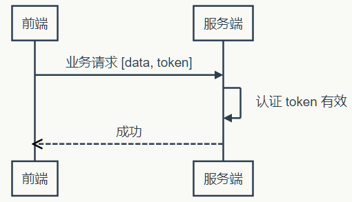

# 客户端

* 使用原生的技术，用户体验毫无疑问是最佳的，然而开发效率却是最低的:移动端的ios/安卓早就式微了，但是并不代表死了。只是所有公司都意识到，没必要上原生开发了。知道养安卓/ios/web三个团队多浪费钱嘛，就那么点的用户量和难度，创业期直接all in小程序就行了；等做大了再上安卓/ios，而且也不用全上，30%的native+70%hybrid用户根本看不出差异，而且成本和效率不知道强了多少。
* 跨平台解决方案：
  - 移动端：apache cordova，react native，weex，flutter 等
  - 桌面端：QT，apache cordova，electron，flutter (alpha) 等
  - 网页端：flutter (beta)

## TOKEN

网站应用一般使用Session进行登录用户信息的存储及验证，而在移动端使用Token则更加普遍.Token比较像是一个更加精简的自定义的Session。Session的主要功能是保持会话信息，而Token则只用于登录用户的身份鉴权

* Token 完全由应用管理,可以避开同源策略
* Token 可以避免 CSRF 攻击
* Token 可以是无状态的，可以在多个服务间共享
* 从安全角度考虑，还是从吊销的角度考虑，Token 都需要设有效期（坚持一周就好）：解决在操作过程不能让用户感到 Token 失效这个问题
  - 在服务器端保存 Token 状态，用户每次操作都会自动刷新（推迟） Token 的过期时间——Session 就是采用这种策略来保持用户登录状态的.每秒种可能发起很多次请求，每次都去刷新过期时间会产生非常大的代价。Token 的过期时保存在缓存或者内存中
  - 使用 Refresh Token，它可以避免频繁的读写操作.一旦 Token 过期，就反馈给前端，前端使用 Refresh Token 申请一个全新 Token 继续使用

### 流程

* 客户端通过登录请求提交用户名和密码，服务端验证通过后生成一个Token与该用户进行关联，并将Token返回给客户端（Token 在服务端持久化比如存入数据库，那它就是一个永久的身份令牌）
* 客户端在接下来的请求中都会携带Token，服务端通过解析Token检查登录状态
* 服务器端采用filter过滤器校验。校验成功则返回请求数据，校验失败则返回错误码
* 当用户退出登录、其他终端登录同一账号（被顶号）、长时间未进行操作时Token会失效，这时用户需要重新登录

## Mobile

在 App 里面显示网页，使用 WebView 控件作为网页引擎解析网页。不同的 App 技术栈要显示网页，区别仅仅在于怎么处理 WebView 这个原生控件。

## app 类型

* Native apps：只能用于特定手机平台的开发技术。比如，安卓平台的 Java 技术栈，iOS 平台的 Object-C 技术栈或 Swift 技术栈。 这种技术栈只能用在一个平台，不能跨平台。指定的编程语言框架，本地apps拥有速度快和可靠的特性。用户界面使用的是本地框架。
  - Xcode
  - Android Studio
* Mobile web apps：移动web app是服务器端应用，使用了服务端技术如PHP,Java，ASP.NET，框架如jQuery Mobile，Sencha Touch等。渲染用户界面模仿本地UI.
* Hybird apps：把 Web 网页放到特定的容器中，然后再打包成各个平台的原生 App.通过web技术编写，如HTML5,CSS,JavaScript。使用移动设备的浏览器引擎渲染HTML,使用webview本地处理js。这使移动web应用程序无法访问本地设备功能,如相机、加速度计、传感器、和本地存储。其实是 Web 技术栈 + 容器技术栈，典型代表是 PhoneGap、Cordova、Ionic 等框架。
  - 技术栈就主要学习容器提供的 API Bridge，网页通过它们去调用底层硬件的 API
  - PhoneGap，诞生于2009年。后来在2011年被 Adobe 公司收购，改名为 Adobe PhoneGap。后来都捐给了 Apache 基金会，作为一个全新的开源项目，名为 Apache Cordova。
  - PhoneGap 和 Cordova 现在是两个独立发展的开源项目，但是彼此有密切的关系，可以简单理解成 Cordova 是 PhoneGap 的内核，PhoneGap 是 Cordova 的发行版。
  - 基于 Cordova 的开源框架，比较著名的有 Ionic、Monaca、Framework7 等。
* cross-platform technology stack:使用一种技术，同时支持多个手机平台。它与混合技术栈的区别是，不使用 Web 技术，即它的页面不是 HTML5 页面，而是使用自己的语法写的 UI 层，然后编译成各平台的原生 App。
  - React Native、Xamarin、Flutter 都属于这一类。学习时，除了学习容器的 API Bridge，还要学习容器提供的 UI 层，即怎么写页面
  - React框架是为网页开发设计的，核心思想是在网页之上，建立一个 UI 的抽象层，所有数据操作都在这个抽象层完成（即在内存里面完成），然后再渲染成网页的 DOM 结构，这样就提升了性能。
    + UI 抽象层本质上是一种数据结构，与底层设备无关，不仅可以渲染成网页，也可以渲染成手机的原生页面。这样的话，只要写一次 React 页面，就能分别编译成 iOS 和安卓的原生 App
  - Flutter：谷歌公司最新的跨平台开发框架。它为了解决 React Native 的平台差异问题，采用了一个完全不同的方案。实现了一套控件。打包的时候，会把这套控件打包进每一个 App，因此不存在调用原生控件的问题。不管什么平台，都调用内嵌的自己那套控件，就能做到 iOS 和安卓体验完全一致。

### App 流程

* 需求分析
* 脚手架工具
* 数据mock
* 架构设计
  - 模块拆分
  - 组件抽象
* 代码编写
* 自测
* 编译打包

## [跨平台解决方案模式](https://mp.weixin.qq.com/s/W-EvvKzmj1A8VsNKFYkuhQ)

* 桥接
  - 要解决的核心问题是两种语言（JS 和原生语言）之间的通讯，或者说 JS thread 和 native thread 之间的通讯。设备（native layer）的很多能力，被 bridge layer 封装起来，然后提供给 JS layer 调用，反过来，JS layer 撰写的功能，也可以由 bridge layer 封装好，供 Native layer 调用
  - React Native 借鉴了客户端服务器交互的模式，其 JS bridge 也来回传递 JSON（这个要命的决定是很多 RN 开发者的梦魇）
  - 大部分时候这样的通讯是在同一个线程中完成，所以是同步的，而 JS bridge 跨线程，异步通讯效率更高
  - 代表
    + 在 Cordova 里 UI 层完全由 WebView 里的 html/css/js 接管，桥接只发生在 JS 和设备服务间
    + React native 为了更好的原生 UI 的体验以及更好的 UI 性能，对 UI 层也做了桥接
  - 由于在 JS bridge 层传递 JSON 作为通讯手段，当大量数据在两端传输时（复杂的动画，大列表的快速滑动），通讯层会来不及处理而 UI 层有卡顿的感觉。
* 进程间通信（IPC）
  - 多进程:在桌面系统上，应用程序有更多的灵活性，可以通过使用多进程来组织自己的应用程序。同样可以通过进程间通信来解决 JS 和原生语言之间的调用问题。其代表方案是：Electron。
    + Electron 使用 IPC 某种程度上说也是迫不得已：因为其依赖的 chromium rengier engine 就是为每一个窗口开启一个进程。对于 chrome 来说，这是一个合理的设计：一个 tab 内部的 crash 不会导致整个 chrome crash。然而，对依赖于 Electron 的桌面应用来说，这样的设计并不合理，但没有办法，只好祭出 IPC 妥协着来呗。
    + 进程间通信可以使用很多方式来进行消息的传递，比如大家熟悉的管道（pipe）。然而，Eletron 使用了 web worker API postMessage 相同的 structured clone algorithm 来做 IPC 数据的序列化和反序列化。这个方法效率和 JSON 差不太多（多数情况略好一些，少数情况差一些），在传输大容量数据时会遇到像 react native 一样的问题。所以 Electron 推荐使用 CSS animation，而非常不建议做 JS anination。
* Canvas 绘制
  - 主流的处理 UI 的思路是：
    + 用 JS 来调用原生 UI。这是 React Native 采用的方式。优点是大部分时候性能足够好；缺点是 JS bridge 需要适配所有支持的平台。想让同一套代码在不同平台跑出符合该平台的 HCI 要求的 UI 很多时候是强人所难。
    + 用其他技术来模拟原生 UI。这是 Cordova / Electron 采用的方式。优点是代码简单，UI 直接在第三方渲染器（webview）中渲染出来；缺点是 UI 性能受 JS 单线程及 webview 本身渲染性能的影响，在复杂交互时往往表现不佳。
      * 大多数选择方案 2) 的技术栈都把目光投向 webview 相关的技术时，人们忽略了其实所有的 UI 渲染，最终都是在 canvas 上一个像素一个像素填充出来的。如果做一套系统，略过 dom/css/js 复杂的渲染逻辑，直接定制好各种各样的控件，将其绘制到 canvas 上，是不是获得了方案 2) 的好处，同时没有它的种种问题？
  - canvas 绘制也有很多技术挑战，它意味着原生平台提供的整个 UI 系统以及消息循环系统都被其略过，因此这里面所有缺失的部分都需要重做一套，比如用户交互时引发的事件冒泡。
  - Canvas 绘制的代表是 flutter。它使用了 chrome 底层的图形渲染引擎 skia，从底向上设计出来一套可以高效工作的控件库。
* 问题
  - 统一 UI 层的代码还有一个致命的问题：业务逻辑代码怎么办？
  - 要维护的代码库不止一套 —— 因为很多业务逻辑用 JS/dart 这样的语言并不适合，到最后可能 iOS 写一部分，android 写一部分，还得做对应的 JS bridge 接口。本来要提升开发效率的，做着做着变成开发团队的梦魇。
  - 如今 app 变得越来越复杂，复杂的不仅仅是 UI，还有业务逻辑。业务逻辑支撑着 UI，如何在所有平台上尽可能小代价地做出统一的业务逻辑，是一个比如何做出统一的 UI 更值得关注的问题。
  - 如何在所有平台上尽可能小代价地做出统一的业务逻辑,为什么没人搞
    + 通用性。不是没人搞，而是各家公司私底下都有自己的解决方案，然而业务逻辑不像 UI 那样，可以做出一套非常标准的东西供别人使用，绝大多数情况下，A 家的代码就算无偿送给 B 家，B 家也顶多能从中得到一些思路，但几乎无法复用里面的代码。
    + 没有合适的工具。
      * 用各个平台的原生语言各自实现一套，要保证所有的实现都是一致的，并且以后升级，每个平台都需要相应更新。
      * 用 C/C++ 实现一次，然后在各个端上用静态链接的方式编译到 app 中。当然，这免不了要做很薄的一层接口：每个平台原生语言到 C/C++ 的桥接。
  - Rust 有不输于任何一门现代语言的依赖管理和生态（各种各样高性能库任君采摘），有非常完备的跨平台编译系统和跨语言FFI 支持，而 Rust 本身的不依赖运行时的内存安全和并发安全性，还有几乎最高质量的 webassembly 支持，使其成为上述解决方案 2 中 C/C++ 的完美替代品

## 前端中的后端

* 把前端中偏 UI 的业务逻辑和偏数据处理的业务逻辑分开。而掌管数据处理的这部分功能叫前端中的后端。
* 模型
  - 和之前的各种关注 UI 的跨平台解决方案模型的最大不同是：让所有的相关方处理自己最擅长的事情，而不要强行适配。和平台相关的代码，比如 UI，平台设备的访问等，用更擅长做这件事情的平台原生语言实现（或者 flutter），而平台无关的业务逻辑代码，算法，网络层代码，使用 Rust 来实现。这样，Rust backend 不用去花大量的精力去包裹平台的东西，而只需干好一个 backend 需要干好的事情。

[模型](../_static/model_be_in_fe.jpg)

## 框架

* [dojo](https://dojo.io/)
* [framework7](https://github.com/framework7io/framework7) Full featured HTML framework for building iOS & Android apps <http://framework7.io>
* [NativeScript](https://github.com/NativeScript/NativeScript) NativeScript is an open source framework for building truly native mobile apps with JavaScript. Use web skills, like Angular and Vue.js, FlexBox and CSS, and get native UI and performance on iOS and Android. <https://www.nativescript.org>

## 图书

* 《深入 React 技术栈》
* 《Vue.js 权威指南》
* 《Angular 权威教程》
* 《深入浅出 Node.js》
* [PWA实战：面向下一代的Progressive Web APP](https://github.com/SangKa/PWA-Book-CN):第一本 PWA 中文书 <https://item.jd.com/12365091.html>

## 工具

* [fastlane](https://github.com/fastlane/fastlane):🚀 The easiest way to automate building and releasing your iOS and Android apps <https://fastlane.tools>
* [expo](https://github.com/expo/expo):Expo iOS/Android Client <https://docs.expo.io/>
* [nativefier](https://github.com/jiahaog/nativefier):Make any web page a desktop application
* [page.js](https://github.com/visionmedia/page.js):Micro client-side router inspired by the Express router <http://visionmedia.github.com/page.js>
* [cli](https://github.com/boxwarehq/cli):Try and use desktop software in your browser without downloading/installing anything. <https://boxware.io>
* [vuera](https://github.com/akxcv/vuera):👀 Vue in React, React in Vue. Seamless integration of the two. 👯
* [rax](https://github.com/alibaba/rax):[ constructionWork In Progress v1.0] The fastest way to build cross-container application. <https://developers.taobao.com/>
* [lottie-web](https://github.com/airbnb/lottie-web):Render After Effects animations natively on Web, Android and iOS, and React Native. <http://airbnb.io/lottie/>
* [DeskGap](https://github.com/patr0nus/DeskGap):A cross-platform desktop app framework based on Node.js and the system webview <https://deskgap.com/>
* [detox](https://github.com/wix/detox):Gray Box End-to-End Testing and Automation Framework for Mobile Apps
* [nativefier](https://github.com/jiahaog/nativefier):Make any web page a desktop application
* [revery](https://github.com/revery-ui/revery)：⚡️ Native, high-performance, cross-platform desktop apps - built with Reason! <https://www.outrunlabs.com/revery/>
* [swiper](https://github.com/nolimits4web/swiper):Most modern mobile touch slider with hardware accelerated transitions <http://idangero.us/swiper/>
* [Mobile-Security-Framework-MobSF](https://github.com/MobSF/Mobile-Security-Framework-MobSF):Mobile Security Framework is an automated, all-in-one mobile application (Android/iOS/Windows) pen-testing framework capable of performing static analysis, dynamic analysis, malware analysis and web API testing. <https://opensecurity.in>
* [iSlider](https://github.com/be-fe/iSlider):Smooth mobile touch slider for Mobile WebApp, HTML5 App, Hybrid App <http://be-fe.github.io/iSlider/>
* 调试
  - [vConsole](https://github.com/Tencent/vConsole):A lightweight, extendable front-end developer tool for mobile web page.
  - [weinre](https://people.apache.org/~pmuellr/weinre/docs/latest/Home.html):weinre is a debugger for web pages, like FireBug (for FireFox) and Web Inspector (for WebKit-based browsers), except it's designed to work remotely, and in particular, to allow you debug web pages on a mobile device such as a phone.

## 参考

* [VasSonic](https://github.com/Tencent/VasSonic)a lightweight and high-performance Hybrid framework developed by tencent VAS team, which is intended to speed up the first screen of websites working on Android and iOS platform.
* [ijkplayer](https://github.com/Bilibili/ijkplayer)Android/iOS video player based on FFmpeg n3.3, with MediaCodec, VideoToolbox support.
* [lottie-android](https://github.com/airbnb/lottie-android):Render After Effects animations natively on Android and iOS, Web, and React Native <http://airbnb.io/lottie/>
* [lottie-ios](https://github.com/airbnb/lottie-ios):An iOS library to natively render After Effects vector animations <http://airbnb.io/lottie/>

* [zwwill/blog](https://github.com/zwwill/blog):✏️ stay hungry stay foolish
* [mobileHack](https://github.com/RubyLouvre/mobileHack):移动端上遇到的各种坑
* :Build smaller, faster, and more secure desktop applications with a web frontend.<https://tauri.studio/>
