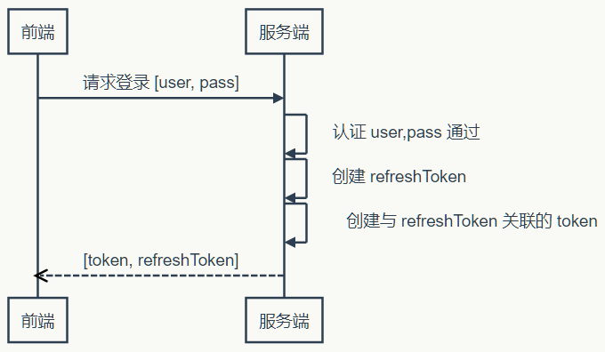

# 客户端

移动端的ios/安卓早就式微了，但是并不代表死了。只是所有公司都意识到，没必要上原生开发了。知道养安卓/ios/web三个团队多浪费钱嘛，就那么点的用户量和难度，创业期直接all in小程序就行了；等做大了再上安卓/ios，而且也不用全上，30%的native+70%hybrid用户根本看不出差异，而且成本和效率不知道强了多少。

## TOKEN

网站应用一般使用Session进行登录用户信息的存储及验证，而在移动端使用Token则更加普遍.Token比较像是一个更加精简的自定义的Session。Session的主要功能是保持会话信息，而Token则只用于登录用户的身份鉴权

* Token 完全由应用管理，所以它可以避开同源策略
* Token 可以避免 CSRF 攻击
* Token 可以是无状态的，可以在多个服务间共享
* 从安全的角度考虑，还是从吊销的角度考虑，Token 都需要设有效期（坚持一周就好）：解决在操作过程不能让用户感到 Token 失效这个问题
  - 在服务器端保存 Token 状态，用户每次操作都会自动刷新（推迟） Token 的过期时间——Session 就是采用这种策略来保持用户登录状态的.每秒种可能发起很多次请求，每次都去刷新过期时间会产生非常大的代价。Token 的过期时保存在缓存或者内存中
  - 使用 Refresh Token，它可以避免频繁的读写操作.一旦 Token 过期，就反馈给前端，前端使用 Refresh Token 申请一个全新 Token 继续使用

### 流程

* 客户端通过登录请求提交用户名和密码，服务端验证通过后生成一个Token与该用户进行关联，并将Token返回给客户端（Token 在服务端持久化比如存入数据库，那它就是一个永久的身份令牌）
* 客户端在接下来的请求中都会携带Token，服务端通过解析Token检查登录状态
* 服务器端采用filter过滤器校验。校验成功则返回请求数据，校验失败则返回错误码
* 当用户退出登录、其他终端登录同一账号（被顶号）、长时间未进行操作时Token会失效，这时用户需要重新登录

## Mobile

在 App 里面显示网页，使用 WebView 控件作为网页引擎解析网页。不同的 App 技术栈要显示网页，区别仅仅在于怎么处理 WebView 这个原生控件。

## app类型

* Native apps：只能用于特定手机平台的开发技术。比如，安卓平台的 Java 技术栈，iOS 平台的 Object-C 技术栈或 Swift 技术栈。 这种技术栈只能用在一个平台，不能跨平台。指定的编程语言框架，本地apps拥有速度快和可靠的特性。用户界面使用的是本地框架。
  - Xcode
  - Android Studio
* Mobile web apps：移动web app是服务器端应用，使用了服务端技术如PHP,Java，ASP.NET，框架如jQuery Mobile，Sencha Touch等。渲染用户界面模仿本地UI.
* Hybird apps：把 Web 网页放到特定的容器中，然后再打包成各个平台的原生 App.通过web技术编写，如HTML5,CSS,JavaScript。使用移动设备的浏览器引擎渲染HTML,使用webview本地处理js。这使移动web应用程序无法访问本地设备功能,如相机、加速度计、传感器、和本地存储。其实是 Web 技术栈 + 容器技术栈，典型代表是 PhoneGap、Cordova、Ionic 等框架。
  - 技术栈就主要学习容器提供的 API Bridge，网页通过它们去调用底层硬件的 API
  - PhoneGap，诞生于2009年。后来在2011年被 Adobe 公司收购，改名为 Adobe PhoneGap。后来都捐给了 Apache 基金会，作为一个全新的开源项目，名为 Apache Cordova。
  - PhoneGap 和 Cordova 现在是两个独立发展的开源项目，但是彼此有密切的关系，可以简单理解成 Cordova 是 PhoneGap 的内核，PhoneGap 是 Cordova 的发行版。
  - 基于 Cordova 的开源框架，比较著名的有 Ionic、Monaca、Framework7 等。
* cross-platform technology stack:使用一种技术，同时支持多个手机平台。它与混合技术栈的区别是，不使用 Web 技术，即它的页面不是 HTML5 页面，而是使用自己的语法写的 UI 层，然后编译成各平台的原生 App。
  - React Native、Xamarin、Flutter 都属于这一类。学习时，除了学习容器的 API Bridge，还要学习容器提供的 UI 层，即怎么写页面
  - React框架是为网页开发设计的，核心思想是在网页之上，建立一个 UI 的抽象层，所有数据操作都在这个抽象层完成（即在内存里面完成），然后再渲染成网页的 DOM 结构，这样就提升了性能。
    + UI 抽象层本质上是一种数据结构，与底层设备无关，不仅可以渲染成网页，也可以渲染成手机的原生页面。这样的话，只要写一次 React 页面，就能分别编译成 iOS 和安卓的原生 App
  - Flutter：谷歌公司最新的跨平台开发框架。它为了解决 React Native 的平台差异问题，采用了一个完全不同的方案。实现了一套控件。打包的时候，会把这套控件打包进每一个 App，因此不存在调用原生控件的问题。不管什么平台，都调用内嵌的自己那套控件，就能做到 iOS 和安卓体验完全一致。

## 框架

* [dojo](https://dojo.io/)
* [framework7io/framework7](https://github.com/framework7io/framework7) Full featured HTML framework for building iOS & Android apps <http://framework7.io>
* [NativeScript/NativeScript](https://github.com/NativeScript/NativeScript) NativeScript is an open source framework for building truly native mobile apps with JavaScript. Use web skills, like Angular and Vue.js, FlexBox and CSS, and get native UI and performance on iOS and Android. <https://www.nativescript.org>

### App 流程

* 需求分析
* 脚手架工具
* 数据mock
* 架构设计
  - 模块拆分
  - 组件抽象
* 代码编写
* 自测
* 编译打包

## 工具

* [fastlane](https://github.com/fastlane/fastlane):🚀 The easiest way to automate building and releasing your iOS and Android apps <https://fastlane.tools>
* [expo](https://github.com/expo/expo):Expo iOS/Android Client <https://docs.expo.io/>
* [nativefier](https://github.com/jiahaog/nativefier):Make any web page a desktop application
* [page.js](https://github.com/visionmedia/page.js):Micro client-side router inspired by the Express router <http://visionmedia.github.com/page.js>
* [cli](https://github.com/boxwarehq/cli):Try and use desktop software in your browser without downloading/installing anything. <https://boxware.io>
* [vuera](https://github.com/akxcv/vuera):👀 Vue in React, React in Vue. Seamless integration of the two. 👯
* [rax](https://github.com/alibaba/rax):[ constructionWork In Progress v1.0] The fastest way to build cross-container application. <https://developers.taobao.com/>
* [lottie-web](https://github.com/airbnb/lottie-web):Render After Effects animations natively on Web, Android and iOS, and React Native. <http://airbnb.io/lottie/>
* [DeskGap](https://github.com/patr0nus/DeskGap):A cross-platform desktop app framework based on Node.js and the system webview <https://deskgap.com/>
* [detox](https://github.com/wix/detox):Gray Box End-to-End Testing and Automation Framework for Mobile Apps
* [nativefier](https://github.com/jiahaog/nativefier):Make any web page a desktop application
* [revery](https://github.com/revery-ui/revery)：⚡️ Native, high-performance, cross-platform desktop apps - built with Reason! <https://www.outrunlabs.com/revery/>
* [swiper](https://github.com/nolimits4web/swiper):Most modern mobile touch slider with hardware accelerated transitions <http://idangero.us/swiper/>
* [Mobile-Security-Framework-MobSF](https://github.com/MobSF/Mobile-Security-Framework-MobSF):Mobile Security Framework is an automated, all-in-one mobile application (Android/iOS/Windows) pen-testing framework capable of performing static analysis, dynamic analysis, malware analysis and web API testing. <https://opensecurity.in>
* [iSlider](https://github.com/be-fe/iSlider):Smooth mobile touch slider for Mobile WebApp, HTML5 App, Hybrid App <http://be-fe.github.io/iSlider/>
* 调试
  - [vConsole](https://github.com/Tencent/vConsole):A lightweight, extendable front-end developer tool for mobile web page.
  - [weinre](https://people.apache.org/~pmuellr/weinre/docs/latest/Home.html):weinre is a debugger for web pages, like FireBug (for FireFox) and Web Inspector (for WebKit-based browsers), except it's designed to work remotely, and in particular, to allow you debug web pages on a mobile device such as a phone.

## 参考

* [VasSonic](https://github.com/Tencent/VasSonic)a lightweight and high-performance Hybrid framework developed by tencent VAS team, which is intended to speed up the first screen of websites working on Android and iOS platform.
* [ijkplayer](https://github.com/Bilibili/ijkplayer)Android/iOS video player based on FFmpeg n3.3, with MediaCodec, VideoToolbox support.
* [lottie-android](https://github.com/airbnb/lottie-android):Render After Effects animations natively on Android and iOS, Web, and React Native <http://airbnb.io/lottie/>
* [lottie-ios](https://github.com/airbnb/lottie-ios):An iOS library to natively render After Effects vector animations <http://airbnb.io/lottie/>

* [zwwill/blog](https://github.com/zwwill/blog):✏️ stay hungry stay foolish
* [mobileHack](https://github.com/RubyLouvre/mobileHack):移动端上遇到的各种坑
* :Build smaller, faster, and more secure desktop applications with a web frontend.<https://tauri.studio/>
