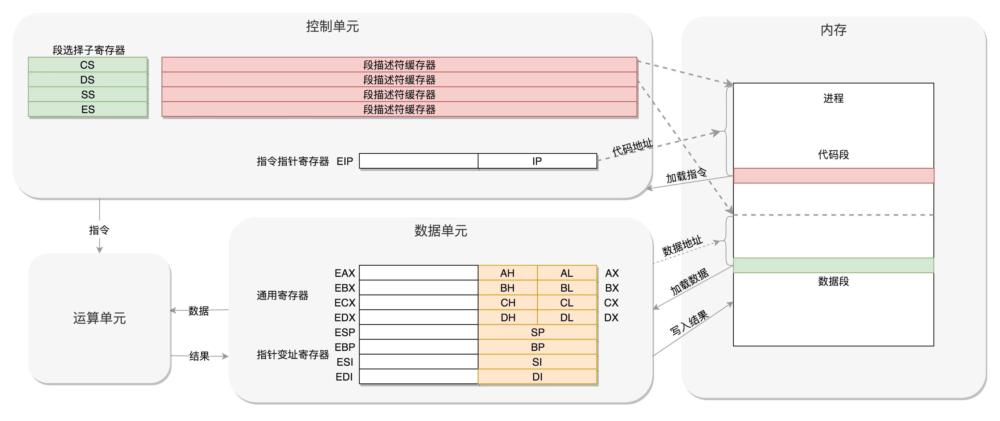

# [趣谈Linux操作系统](https://time.geekbang.org/column/intro/164)

* 核心原理
	* 综述
		*  Linux 内核结构
		* 上手 linux 命令
		* 学习系统调用
	* 系统初始化
* 实战

## 结构发展

### 初创期:x86 体系结->系统的启动->实模式

* 角色切换成软件外包公司的老板，设身处地地去理解操作系统是如何协调各种资源，帮客户做成事情的。“用户”：指操作系统的用户，“客户”：外包公司的客户
* 输入设备驱动|客户对接员
	* 客户发送的需求就被称为中断事件（Interrupt Event）。
* 项目执行计划书：说明这个项目打算怎么做，一步一步如何执行，遇到什么情况应该怎么办等等，都已经作为程序逻辑写在程序里面，并且编译成为二进制
	* 文件管理子系统（File Management Subsystem
	* 程序（Program）二进制文件是静态的
	* 进程（Process）运行起来的 QQ，是不断进行的
	* 打印机的直接操作是放在操作系统内核里面的，进程不能随便操作。但是操作系统也提供一个办事大厅|系统调用（System Call）
		* 任何一个程序要想运行起来，就需要调用系统调用，创建进程。
	* 进程管理子系统（Process Management Subsystem）
		* 进程执行需要分配 CPU 进行执行，也就是按照程序里面的二进制代码一行一行地执行
		* 如果运行进程很多，则一个 CPU 会并发运行多个进程，也就需要 CPU 的调度能力了
	* 内存管理子系统（Memory Management Subsystem）
		* 统一的管理和分配：不同的进程有不同的内存空间
* 交付人员|输出设备驱动：显卡驱动


#### 计算机构成

* 组成
	* CPU Central Processing Unit，中央处理器
		* 运算单元
			* 只管算，例如做加法、做位移等等。但是，它不知道应该算哪些数据，运算结果应该放在哪里。
			* 运算单元计算的数据如果每次都要经过总线，到内存里面现拿，这样就太慢了，所以就有了数据单元。
		* 数据单元包括 CPU 内部的缓存和寄存器组，空间很小，但是速度飞快，可以暂时存放数据和运算结果。有了放数据的地方，也有了算的地方，还需要有个指挥到底做什么运算的地方，这就是控制单元。
		* 控制单元是一个统一的指挥中心，可以获得下一条指令，然后执行这条指令。这个指令会指导运算单元取出数据单元中的某几个数据，计算出个结果，然后放在数据单元的某个地方。
	* 总线（Bus）CPU 和其他设备连接，就是主板上密密麻麻的集成电路，这些东西组成了 CPU 和其他设备的高速通道
		* 地址总线（Address Bus） 地址数据，也就是想拿内存中哪个位置的数据
		* 数据总线（Data Bus）真正的数据
		* 地址总线的位数，决定了能访问的地址范围到底有多广
		* 显卡会连接显示器、磁盘控制器会连接硬盘、USB 控制器会连接键盘和鼠标
	* 内存就相当于办公室，要看看方不方便租到办公室，有没有什么创新科技园之类的。有了共享的、便宜的办公位，公司就有注册地了
* CPU 和内存是完成计算任务的核心组件，重点介绍一下 CPU 和内存是如何配合工作的。
	* 每个进程都有一个程序放在硬盘上，是二进制的，再里面就是一行行的指令，会操作一些数据。
	* 运行进程 A 和 B，会有独立的内存空间，互相隔离，程序会分别加载到进程 A 和进程 B 的内存空间里面，形成各自的代码段。进程的内存虽然隔离但不连续，除了简单的区分代码段和数据段，还会分得更细。
	* 程序运行的过程中要操作的数据和产生的计算结果，都会放在数据段里面.
		* 控制单元里面，有一个指令指针寄存器，里面存放的是下一条指令在内存中的地址。控制单元会不停地将代码段的指令拿进来，先放入指令寄存器。指令分两部分，一部分是做什么操作，例如是加法还是位移；一部分是操作哪些数据。
		* 执行这条指:把第一部分交给运算单元，第二部分交给数据单元。
		* 数据单元根据数据的地址，从数据段里读到数据寄存器里，就可以参与运算了。
		* 运算单元做完运算，产生的结果会暂存在数据单元的数据寄存器里。最终，会有指令将数据写回内存中的数据段。
	* 进程切换（Process Switch）:两个寄存器，专门保存当前处理进程的代码段的起始地址，以及数据段的起始地址。这里面写的都是进程 A，那当前执行的就是进程 A 的指令，等切换成进程 B，就会执行 B 的指令了
	* CPU 和内存来来回回传数据，靠的都是总线

#### x86架构

* IBM 开始做 IBM PC 时，一开始并没有让最牛的华生实验室去研发，而是交给另一个团队。一年时间，软硬件全部自研根本不可能完成，于是他们采用了英特尔的 8088 芯片作为 CPU，使用微软的 MS-DOS 做操作系统。
* IBM PC 卖得超级好，好到因为垄断市场而被起诉。IBM 就在被逼的情况下公开了一些技术，使得后来无数 IBM-PC 兼容机公司的出现，也就有了后来占据市场的惠普、康柏、戴尔等等。
* 开放自己的技术是一件了不起的事。从技术和发展的层面来讲，使得一项技术大面积铺开，形成行业标准。就比如现在常用的 Android 手机，如果没有开放的 Android 系统，也没办法享受到这么多不同类型的手机。
* 英特尔的技术因此成为了行业的开放事实标准。由于这个系列开端于 8086，因此称为 x86 架构。
* 后来英特尔的 CPU 数据总线和地址总线越来越宽，处理能力越来越强。但是一直不能忘记三点，一是标准，二是开放，三是兼容。
* 8086 处理器|实模式（Real Pattern）
	* 8 个 16 位的通用寄存器|数据单元: AX、BX、CX、DX、SP、BP、SI、DI。这些寄存器主要用于在计算过程中暂存数据。
	* IP 寄存器|指令指针寄存器（Instruction Pointer Register):指向代码段中下一条指令的位置。CPU 会根据它来不断地将指令从内存的代码段中，加载到 CPU 的指令队列中，然后交给运算单元去执行。
	* 切换进程:每个进程都分代码段和数据段，为了指向不同进程的地址空间，有四个 16 位的段寄存器
		* CS |代码段寄存器（Code Segment Register），通过它可以找到代码在内存中的位置
		* DS |数据段寄存器，通过它可以找到数据在内存中的位置。
		* SS |栈寄存器（Stack Register）。栈是程序运行中一个特殊的数据结构，数据的存取只能从一端进行，秉承后进先出的原则，push 就是入栈，pop 就是出栈。
			* 凡是与函数调用相关的操作，都与栈紧密相关
		* 加载到通用寄存器:对于一个段，有一个起始的地址，而段内的具体位置，称为偏移量（Offset）
		* 在 CS 和 DS 中都存放着一个段的起始地址。代码段偏移量在 IP 寄存器中，数据段的偏移量会放在通用寄存器中
	* CS 和 DS 都是 16 位的，起始地址都是 16 位的，IP 寄存器和通用寄存器都是 16 位的，偏移量也是 16 位的，但是 8086 的地址总线地址是 20 位
		* 偏移量 16 位的，所以一个段最大的大小是 2^16=64k。
		* 最多只能访问 1M 的内存空间，还要分成多个段，每个段最多 64K。
		* 每次都要左移四位，也就意味着段的起始地址不能是任何一个地方，只是能整除 16 的地方。
* 32 位处理器|保护模式（Protected Pattern）
	* 有 32 根地址总线，可以访问 2^32=4G 的内存
	* 在开放架构的基础上，如何保持兼容
		* 通用寄存器有扩展，可以将 8 个 16 位的扩展到 8 个 32 位的，但是依然可以保留 16 位的和 8 位的使用方式。你可能会问，为什么高 16 位不分成两个 8 位使用呢？因为这样就不兼容了呀！
		* 指令指针寄存器 IP，就会扩展成 32 位的，同样也兼容 16 位的
		* 改动比较大，有点不兼容的就是段寄存器（Segment Register）
			* CS、SS、DS、ES 仍然是 16 位的，但是不再是段的起始地址。
			* 段的起始地址放在内存的某个地方。这个地方是一个表格，表格中的一项一项是段描述符（Segment Descriptor）。这里面才是真正的段的起始地址。而段寄存器里面保存的是在这个表格中的哪一项，称为选择子（Selector）。
			* 将一个从段寄存器直接拿到的段起始地址，就变成了先间接地从段寄存器找到表格中的一项，再从表格中的一项中拿到段起始地址。
			* 为了快速拿到段起始地址，段寄存器会从内存中拿到 CPU 的描述符高速缓存器中。
*  刚开机为实模式, 需要更多内存切换到保护模式
	



#### 汇编语言

* 《汇编从零开始到C语言》

```
move a b :把b值赋给a,使a=b  
add a b : 加法,a=a+b  
inc: 加1  
dec: 减1  
sub a b : a=a-b  
cmp: 减法比较，修改标志位

call和ret :call调用子程序，子程序以ret结尾 
jmp :无条件跳  
int :中断指令  

or :或运算  
xor :异或运算  
shl :算术左移  
ahr :算术右移  

push xxx :压xxx入栈  
pop xxx: xxx出栈  
```

### 发展期：保护模式、多进程->进程管理、内存管理、文件系统、输入输出设备管理

### 壮大期：进程间通信->网络通信

### 集团化：虚拟化->容器化->Linux 集群->从单机操作系统到数据中心操作系统


## 能力发展

### 熟练使用 Linux 命令行 Command Line

* 图书
	* 《鸟哥的Linux私房菜》
	* 《Linux 系统管理技术手册》


### 使用 Linux 进行程序设计

	* 直接使用 Linux 系统调用，也可以使用 glibc 的库
* 图书
	* 补充：优先《Unix/Linux编程实践教程》
	* 《UNIX环境高级编程》

#### Linux命令

* 用户 `/etc/passwd` 
	* 主目录:用户登录进去后默认的路径
	* /bin/bash 位置:配置登录后默认交互命令行
* `passwd [username]`
* `useradd -h`
* 组 `/etc/groups`

### 了解 Linux 内核机制

	* 了解一下 Linux 内核机制，知道基本的原理和流程
* 图书
	* 补充：《庖丁解牛Linux内核分析》
	* 《深入理解Linux内核》


### 阅读 Linux 内核代码，聚焦核心逻辑和场景

	* 一开始阅读代码不要纠结一城一池的得失，不要每一行都一定要搞清楚它是干嘛的，而要聚焦于核心逻辑和使用场景。
* 图书
	* 《Linux内核源代码情景分析》


### 实验定制 Linux 组件

* 一旦代码有一个细微的 bug，都有可能导致实验失败。


### 生产实践

## 组件

### 文件系统

* 属性
	* 第一个字段
		* 第一个字符：类型
			* “-” 表示普通文件
			* d 表示目录
		* 剩下的9 个字符 模式|权限位（access permission bits）
			- 3 个一组，每一组 rwx 表示“读（read）”“写（write）”“执行（execute）”
			- 如果是字母，就说明有这个权限
			- 如果是横线，就是没有这个权限
	- 第二个字段:硬链接（hard link）数目
	- 第三个字段是所属用户
	- 第四个字段是所属组
	- 第五个字段是文件的大小
	- 第六个字段是文件被修改的日期
	- 最后是文件名
* 一切皆文件
	* 二进制文件：启动一个进程，需要一个程序文件
	* 文本文件：启动的时候，要加载一些配置文件，例如 yml、properties 等，这是
	* 启动之后会打印一些日志，如果写到硬盘上，也是文本文件。但是如果想把日志打印到交互控制台上，在命令行上唰唰地打印出来，这其实也是一个文件，是标准输出 stdout 文件。
	* 管道:进程的输出可以作为另一个进程的输入，管道也是一个文件。
	* 进程可以通过网络和其他进程进行通信，建立的 Socket，也是一个文件。
	* 进程需要访问外部设备，设备也是一个文件。
	* 文件都被存储在文件夹里面，其实文件夹也是一个文件。
	* 进程运行起来，要想看到进程运行的情况，会在 /proc 下面有对应的进程号，还是一系列文件
* 每个文件，Linux 都会分配一个文件描述符（File Descriptor），这是一个整数。有了这个文件描述符，可以使用系统调用，查看或者干预进程运行的方方面面。
	* 文件操作是贯穿始终的，这也是“一切皆文件”的优势，就是统一了操作的入口，提供了极大的便利

#### 操作

* cd change directory 切换目录
	- cd .. 表示切换到上一级目录
* dir，可以列出当前目录下的文件
* ls list 列出当前目录下的文件 ``


```sh
# ls -l
drwxr-xr-x 6 root root 4096 Oct 20 2017 apt
-rw-r--r-- 1 root root 211 Oct 20 2017 hosts
```

#### 软件

* 流程
	* 主执行文件会放在 /usr/bin 或者 /usr/sbin 下面
	* 其他的库文件会放在 /var 下面
	* 配置文件会放在 /etc 下面
* 软件包
	* CentOS 体系使用 rpm
	* Ubuntu 体系使用 deb
* 软件管家
	* CentOS  yum
		* `/etc/yum.repos.d/CentOS-Base.repo`
	* Ubuntu  apt-get
		* `/etc/apt/sources.list`
* 下载二进制文件
	* `wget 链接`
	* 通过 tar 解压缩
	* 配置环境变量
		* 可以通过 export 命令来配置:仅在当前命令行的会话中管用，一旦退出重新登录进来，就不管用了
		* 默认工作目录 .bashrc 文件,每次登录的时候，这个文件都会运行，因而把它放在这里
		* 也可以通过 source .bashrc 手动执行
* 执行
	* Linux 不是根据后缀名来执行的。执行条件是这样的：只要文件有 x 执行权限，都能到文件所在的目录下，通过./filename运行这个程序。
	* 如果放在 PATH 里设置的路径下面，就不用./ 了，直接输入文件名就可以运行了，Linux 会帮你找
	* 通过 shell 在交互命令行里面运行
	* 后台运行 nohup no hang up
		* 最后加一个 &，就表示后台运行
	* 以服务方式运行
		* enable 开机启动:在 /lib/systemd/system 目录下会创建一个 XXX.service 的配置文件，里面定义了如何启动、如何关闭
	* 输出
		* “1”表示文件描述符 1，表示标准输出
		* “2”表示文件描述符 2，意思是标准错误输出
* awk '{print $2}'是指第二列的内容，是运行的程序 ID
* 通过 xargs 传递给 kill -9，也就是发给这个运行的程序一个信号，让它关闭

```sh
# centos
rpm -qa
rpm -i jdk-XXX_linux-x64_bin.rpm
rpm -e # erase

yum install java-11-openjdk.x86_64
yum erase java-11-openjdk.x86_64

# ubunut
dpkg -l
dpkg -i jdk-XXX_linux-x64_bin.deb
dpkg -r # remove

apt-get install openjdk-9-jdk
apt-get purge openjdk-9-jdk

# 标准输出和错误输出合并
nohup command >out.file 2>&1 &

# 关闭进程
ps -ef |grep 关键字 |awk '{print $2}'|xargs kill -9

systemctl start|enable mysql

shutdown -h now # 现在关机
reboot # 重启
```

### [系统调用](https://www.kernel.org)

* 系统调用的定义 unistd_64.h
* Glibc 是 Linux 下使用的开源的标准 C 库，它是 GNU 发布的 libc 库。Glibc 为程序员提供丰富的 API，除了例如字符串处理、数学运算等用户态服务之外，最重要的是封装了操作系统提供的系统服务，即系统调用的封装。
	* 每个特定的系统调用对应了至少一个 Glibc 封装的库函数
	* 有时候，Glibc 一个单独的 API 可能调用多个系统调用，比如说，Glibc 提供的 printf 函数就会调用如 sys_open、sys_mmap、sys_write、sys_close 等等系统调用。
	* 也有时候，多个 API 也可能只对应同一个系统调用，如 Glibc 下实现的 malloc、calloc、free 等函数用来分配和释放内存，都利用了内核的 sys_brk 的系统调用。

#### 进程

* fork 创建进程:需要一个老的进程调用 fork 来实现，其中老的进程叫作父进程（Parent Process），新的进程叫作子进程（Child Process）
	* 子进程将各个子系统为父进程创建的数据结构全部拷贝了一份，甚至连程序代码也是拷贝过来的
	* 返回值
		* 如果当前进程是子进程，就返回 0
		* 如果当前进程是父进程，就返回子进程的进程号
		* 通过返回值的区分，使用 if-else 语句判断
			* 如果是父进程，还接着做原来应该做的事情
			* 如果是子进程，需要请求另一个系统调用execve来执行另一个程序，这个时候，子进程和父进程就彻底分道扬镳了，也就产生了一个分支（fork）了。
* waitpid 父进程可以调用它，将子进程的进程号作为参数传给它，这样父进程就知道子进程运行完了没有，成功与否

#### 内存

*  堆里面分配内存的系统调用
* brk：当分配的内存数量比较小的时候使用，会和原来的堆的数据连在一起，这就像多分配两三个工位，在原来的区域旁边搬两把椅子就行了
* mmap：当分配的内存数量比较大的时候使用，会重新划分一块区域，也就是说，当办公空间需要太多的时候，索性来个一整块。

#### 文件操作

* 不存在文件，使用creat创建
* 已存在文件，使用open 打开，close关闭
* 打开文件后，使用lseek跳到文件的某个位置
* 读写内容，读的系统调用是read，写是write

### 内存管理

#### 进程内存空间

*  每个进程都有自己的内存，互相之间不干扰，有独立的进程内存空间
*  代码段 Code Segment 程序代码
*  数据段 Data Segment 进程运行中产生数据
	*  局部变量：在当前函数执行的时候起作用，当进入另一个函数时，变量就释放
	*  动态分配：会较长时间保存，指明才销毁的，这部分称为堆（Heap）
*  进程的内存空间 32 位的是 4G，不可能有这么多物理内存
	*  进程不用部分就不用管，只有进程要去使用部分内存的时候，才会使用内存管理的系统调用来登记，说自己马上就要用了，希望分配一部分内存给它，但是这还不代表真的就对应到了物理内存。
	*  只有真的写入数据的时候，发现没有对应物理内存，才会触发一个中断，现分配物理内存

### 进程管理

####  信号 Signal

* 对于一些不严重的信号，可以忽略，该干啥干啥，但是像 SIGKILL（用于终止一个进程的信号）和 SIGSTOP（用于中止一个进程的信号）是不能忽略的，可以执行对于该信号的默认动作。
* 每种信号都定义了默认的动作，例如硬件故障，默认终止；也可以提供信号处理函数，可以通过sigaction系统调用，注册一个信号处理函数。

#### 进程间通信

* 消息队列（Message Queue） 在内核里
	* 通过msgget创建一个新的队列
	* msgsnd将消息发送到消息队列
	* 消息接收方可以使用msgrcv从队列中取消息
* 共享内存
	* shmget 创建一个共享内存块
	* shmat 将共享内存映射到自己的内存空间，然后就可以读写
	* 存在“竞争”问题：如果大家同时修改同一块数据咋办？
	* 信号量机制 Semaphore：让不同的人能够排他地访问
		* 对于只允许一个人访问的需求，将信号量设为 1
		* 当一个人要访问的时候，先调用sem_wait。如果这时候没有人访问，则占用这个信号量，就可以开始访问了。
		* 如果这个时候另一个人要访问，也会调用 sem_wait。由于前一个人已经在访问了，所以后面这个人就必须等待上一个人访问完之后才能访问。
		* 当上一个人访问完毕后，会调用sem_post将信号量释放，于是下一个人等待结束，可以访问这个资源了。

### 网络服务

* 不同机器的通过网络相互通信，要遵循相同的网络协议，也即 TCP/IP 网络协议栈。Linux 内核里有对于网络协议栈的实现
* 网络服务是通过套接字 Socket 来提供服务的
	* Socket “插口”|“插槽
* 在通信之前，双方都要建立一个 Socket。


## 资料

* OSTEP(Operating System Three Easy Picies)