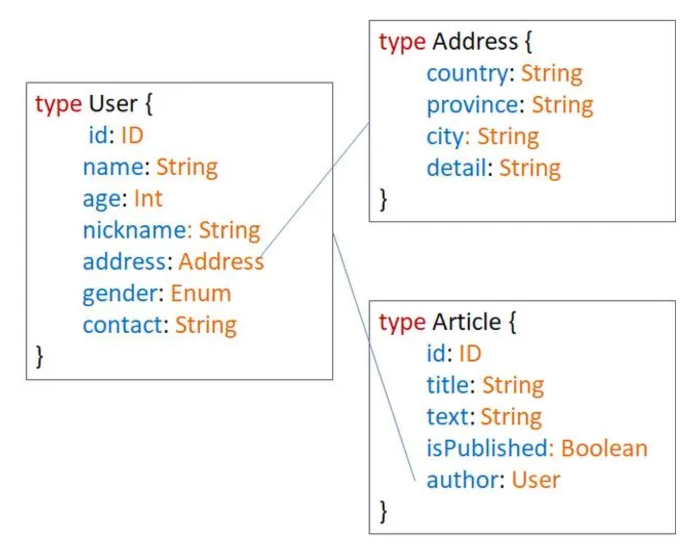

# [graphiql](https://github.com/graphql/graphiql)

GraphiQL & the GraphQL LSP Reference Ecosystem for building browser & IDE tools.

* 由 Facebook 在 2012 年创立的一门开源查询语言，作为通用REST架构的替代方案而被开发出来,旨在让 API 变得快速、灵活并且为开发人员提供便利
* 一个用于 API 的查询语言，使用基于类型系统来执行查询的服务端运行时（类型系统由数据定义）,灵活地添加或弃用字段，而不会影响现有查询
* 没有和任何特定数据库或者存储引擎绑定，依靠现有的代码和数据支撑
* 针对 Graph（图状数据）进行查询特别有优势的 Query Language
* 允许客户端只向服务端发送一次描述信息，允许开发人员构建相应的请求，从而通过单个 API 调用从多个数据源中提取数据，获得客户端所需所有数据
* 数据控制甚至可以精细到字段，达到一次请求获取所有所需数据目的
* 提供了极佳的关注点分离方式：客户端知道它需要什么数据，服务端知道数据的结构，以及如何从一些数据源（比如数据库、微服务、第三方 API）中拉取数据
* 特点
  - 声明式数据获取（可以对API进行查询）:声明式的数据查询带来了接口的精确返回，服务器会按数据查询的格式返回同样结构的JSON数据、真正照顾了客户端的灵活性。
  - 一个微服务仅暴露一个GraphQL层：一个微服务只需暴露一个GraphQL endpoint，客户端请求相应数据只通过该端点按需获取，不需要再额外定义其他接口。
  - 传输层无关、数据库技术无关：带来了更灵活的技术栈选择，比如我们可以选择对移动设备友好的协议，将网络传输数据量最小化，实现在网络协议层面优化应用。
* 优点
  - 设置单一事实来源 Single Source of Truth，提供了一种整合其整个 API 的方法
  - GraphQL Schema Definition Language SDL 严格定义数据类型减少客户端与服务器之间的通信错误
  - 声明式地数据获取：客户端根据其 UI 来决定在一个查询请求中需要的字段，选择需要的数据和相关的字段实体
  - 没有过度获取：按客户端需求选择数据，减少了传输数据的大小
  - Introspection 自检：允许通过 GraphQL API 检索 GraphQL schema，包含了 GraphQL API 可以获得的所有数据信息，本身就是一份完美的自动生成的 API 文档
  - 允许应用 API 进行更新优化，而无需破坏现有查询
  - 不指定特定的应用架构。能够以现有的 REST API 为基础，并与现有的 API 管理工具配合使用
* 缺点
  - 即便是熟悉 REST API 的开发人员，也需要一定时间才能掌握 GraphQL
  - 查询复杂性：一个客户端需要一次查询很多嵌套字段时，前端开发通常不能很清楚他正在通过服务端访问不同的数据库获取过多的数据
  - 根据不同的实施方式，GraphQL 可能需要不同于 REST API 的 API 管理策略，尤其是在考虑速率限制和定价的情况下
  - 缓存机制复杂
  - API 维护人员还会面临编写可维护 GraphQL 模式的额外任务
* 适用
  - 前提是数据已经以图的数据结构进行保存
* 通过 schema 拼接的方式引入一个 GraphQL 网关（gateway）

## 服务

* GraphQL 服务通过定义类型和类型字段来创建，然后给每个类型上每个字段提供解析函数
* Schema Schema Definition Language：描述客户端可通过该服务查询的所有可能数据
  - 类型的定义以及查询本身都是通过 Schema 去定义
  - 本身并不代表数据库中真实的数据结构，它的定义决定了这整个端点能干些什么事情，能向端点要什么，操作什么
  - API 查询定义和验证语法
  - 由对象类型组成，表示可以请求哪种对象以及它有哪些字段
  - 将模式中的每个字段附加到名为解析器的函数中。执行期间，系统将调用解析器来生成相应的值
  - 查询时，GraphQL 会根据模式对查询进行验证。随后，GraphQL 将执行经过验证的查询
* type
  - Schema 中最基本的一个概念，表示一个 GraphQL 对象类型，可以简单地将其理解为 JavaScript 中的一个对象
  - 可以包含各种字段（field）,而且字段类型不仅仅可以是标量类型，还可以是 Schema 中定义的其他 type
  - type Query:Query 类型是 Schema 中所有 query 查询的入口
    + 某个字段返回不止一个标量类型的数据而是一组，需要使用List类型声明，在该标量类型两边使用中括号[]包围
    + [Movie]! 始终返回不可为空但Movie元素可以为空
    + [Movie!] 返回的 Movie 元素不能为空，但返回可以为空的
  - Mutation 和 Subscription，都作为对应操作的入口点
* 传入复杂结构参数（Input）
* introspection:Type System->AST->Validation->Execution->Response
  - 类型名称自省(__typename)
  - schema自省(__schema和__type)
* Resolver:对应着 Schema 上的字段，当请求体查询某个字段时，对应的 Resolver 函数会被执行，由 Resolver 函数负责到数据库中取得数据并返回，最终将请求体中指定的字段返回
* 配置
  - 直连数据
  - 集成现有服务的GraphQL层

```graphql
<!-- schema -->
type Query {
  me: User
}

type User {
  id: ID
  name: String
}

type Query {
  movies(genre:MovieTypes):[Movie]!
}

enum MovieTypes {
  COMEDY
  DOCUMENTARY
  SERIES
}

type Query {
    moviesdata:Search):[Movie]!
}

input Search {
  term:String!
}

<!-- query -->
{
  me {
    name
  }
}
```

## 数据类型

* Field 从服务器获取的对象的基本组成部分
  - 如果是一个 Object，还必须选择至少其中的一个字段
* 选择集：所需要字段合在一起
* Scalar Type
  - Int：带符号的32位整数，对应 JavaScript 的 Number
  - Float：带符号的双精度浮点数，对应 JavaScript 的 Number
  - String：UTF-8字符串，对应 JavaScript 的 String
  - Boolean：布尔值，对应 JavaScript 的 Boolean
  - ID：ID 值，是一个序列化后值唯一的字符串，可以视作对应 ES 2015 新增的 Symbol
  - Enums 一种特殊的标量类型，可以限制值为一组特殊的值
* 对象类型（Object Type）
  - 通过对象模型来构建GraphQL中关于一个数据模型的形状，同时还可以声明各个模型之间的内在关联（一对多、一对一或多对多）
* 类型修饰符（Type Modifier）
  - 列表 List：[Type]
  - 非空：Type! 使用!来表示非空 Non-Null 强制类型的值不能为null，并且在请求出错时一定会报错。可以用于必须保证值不能为null的字段
  - 列表非空：[Type]!
  - 非空列表，列表内容类型非空：[Type!]!
* Interface 包含一组确定字段的集合的抽象类型，实现该接口的类型必须包含interface定义的所有字段
  - 对于interface的返回需要你使用inline fragments来实现
  - 其他对象类型实现接口必须包含接口所有的字段，并具有相同的类型修饰符，才算实现接口。
* Union
  - 非常类似于interface，但是类型之间不需要指定任何共同的字段
  - 通常用于描述某个字段能够支持的所有返回类型以及具体请求真正的返回类型
  - 几个对象类型共用一个联合类型
* input
  - 对mutations来说非常重要，在 GraphQL schema 语言中，看起来和常规的对象类型非常类似，但是使用关键字input而非type
  - 更新数据时有用，与常规对象只有关键字修饰不一样，常规对象时type修饰，输入类型是input修饰。
* 内联片段（Inline Fragment）:概念和用法与普通片段基本相同，不同的是内联片段直接声明在选择集内，并且不需要fragment声明



```graphql
interface Basic {
    name: String!
    year: Number!
}

type Song implements Basic {
    name: String!
    year: Number!
    artist: [String]!
}

type Video implements Basic {
    name: String!
    year: Number!
    performers: [String]!
}

union SearchResult = Song | Video
Query {

    search(term: String!):{
      name
      year

      ...on Song {
          artist
      }

      ...on Video {
          performers
      }
    }

    search(term: String!): [SearchResult]!
}
```

## 请求

* 请求体|文档：一次操作请求被称为一份文档（document），即GraphQL服务能够解析验证并执行的一串请求字符串(Source Text)
* 请求格式根据 GraphQL 标准构造，请求体的结构确定了最终返回数据的结构
  - 注释以#开头
  - 可以包含多个操作和片段。只有包含操作请求才会被GraphQL服务执行
  - 操作（Operation）
    + 为了保证数据的完整性mutations是串形执行，而queries可以并行执行
  - 片段（Fragments）：在queries中可复用的fields
    + 支持多层级地继承
* 一个 GraphQL 操作从前端应用到达后端应用，首先会在后端解释整个 GraphQL schema，然后再为前端解析相关的数据
* 类型：指定请求体对数据做什么操作
  - query 查询（默认）
    + alias 别名:为返回字段使用另一个名字
  - mutation 对数据进行操作，例如增删改操作
  - subscription 订阅，服务器在某个事件发生时将数据本身推送给感兴趣的客户端的一种方式
* 操作名称：可选参数，对整个请求并不产生影响，只是赋予请求体一个名字，可以作为调试的依据
  - 只包含一个操作的请求可以不带，都是query的话，可以全部省略掉
  - **约定：Query和与之对应的Resolver是同名**
* 变量:让参数可动态变化
  - 声明一个变量使用$符号开头，冒号后面紧跟着变量的传入类型
  - 使用变量，直接引用即可
* 字段请求的是一个数据单元。标量字段是粒度最细的一个数据单元了，同时作为返回 JSON 响应数据中的最后一个字段。如果是一个 Object，还必须选择至少其中的一个字段
* Directives提供了一种动态使用变量改变 queries的方法
  - @include: 当if中参数为true时，才会包含对应fragment或field；
  - @skip:当if中的参数为true时,会跳过对应fragment或field

```graphql
<!-- query -->
query myQry ($name: String!) {
  movie(name: $name) {
    name
    desc
    ratings
  }
}

query {
  movieQueryA:movie(name:"Deepwater"){
    ... movieInfo
  }

  movieQueryB:movie(name:"Spotlight"){
    ... movieInfo
  }
}

fragment movieInfo on Movie {
   name
   desc
}

query {
    search {
        actors @include(if: $queryActor) {
            name
        }
        comments @skip(if: $noComments) {
            from
        }
    }
}

{
  author(id: "7") {
    id
    name
    avatarUrl
    articles(limit: 2) {
      name
      urlSlug
    }
  }
}

<!-- response -->
{
  "data": {
    "author": {
      "id": "7",
      "name": "Robin Wieruch",
      "avatarUrl": "https://domain.com/authors/7",
      "articles": [
        {
          "name": "The Road to learn React",
          "urlSlug": "the-road-to-learn-react"
        },
        {
          "name": "React Testing Tutorial",
          "urlSlug": "react-testing-tutorial"
        }
      ]
    }
  }
}
```

## 项目

* [GitHub GraphQL API](https://developer.github.com/v4/explorer/) <https://developer.github.com/v4/>
* [vue-graphql-demo](https://github.com/JscramblerBlog/vue-graphql-demo)

## 工具

* [graphql-tools](https://github.com/apollographql/graphql-tools)  Build and mock your GraphQL.js schema using the schema language <http://dev.apollodata.com/tools/graph>…
* [graphql-js](https://github.com/graphql/graphql-js):A reference implementation of GraphQL for JavaScript <http://graphql.org/graphql-js/>
* [framework](https://github.com/graphcool/framework):Framework to develop & deploy serverless GraphQL backends <https://www.graph.cool>
* [graphql-engine](https://github.com/hasura/graphql-engine):Blazing fast, instant GraphQL APIs on Postgres with fine grained access control <https://hasura.io>
* [graphcool-framework](https://github.com/prisma/graphcool-framework)
* [graphql-editor](https://github.com/slothking-online/graphql-editor):GraphQL Visual Node Editor
* [apollo-server](https://github.com/apollographql/apollo-server)GraphQL server for Express, Connect, Hapi and Koa
* client
  - [apollo-client](https://github.com/apollographql/apollo-client)A fully-featured, production ready caching GraphQL client for every server or UI framework
  - [react-apollo](https://github.com/apollographql/react-apollo)♻️ React integration for Apollo Client
  - [apollo-ios](https://github.com/apollographql/apollo-ios):📱 A strongly-typed, caching GraphQL client for iOS, written in Swift <https://www.apollographql.com/docs/ios/>
* [graphql-playground](https://github.com/prisma/graphql-playground):🎮 GraphQL IDE for better development workflows (GraphQL Subscriptions, interactive docs & collaboration)
* [karate](https://github.com/intuit/karate):Web-Services Testing Made Simple
* [Vue Apollo](https://vue-apollo.netlify.com)
* 插件
  - Apollo GraphQL VS Code

## 参考

* [GraphQL 学习之道 The Road to GraphQL](https://github.com/the-road-to-graphql/the-road-to-graphql-chinese):📓The Road to GraphQL: Your journey to master pragmatic GraphQL in JavaScript https://roadtoreact.com/
* [awesome-graphql](https://github.com/chentsulin/awesome-graphql):Awesome list of GraphQL & Relay## 实例
* [express-graphql](https://github.com/graphql/express-graphql):Create a GraphQL HTTP server with Express.

* [教程](https://www.howtographql.com/)
* [graphql-spec](https://github.com/graphql/graphql-spec)GraphQL is a query language and execution engine tied to any backend service. <https://spec.graphql.org>
* [learnapollo](https://github.com/learnapollo/learnapollo)
* [learning-graphql](https://github.com/mugli/learning-graphql):An attempt to learn GraphQL
* [graphQL PHP 中文文档](https://laravel-china.org/docs/graphql-php)
