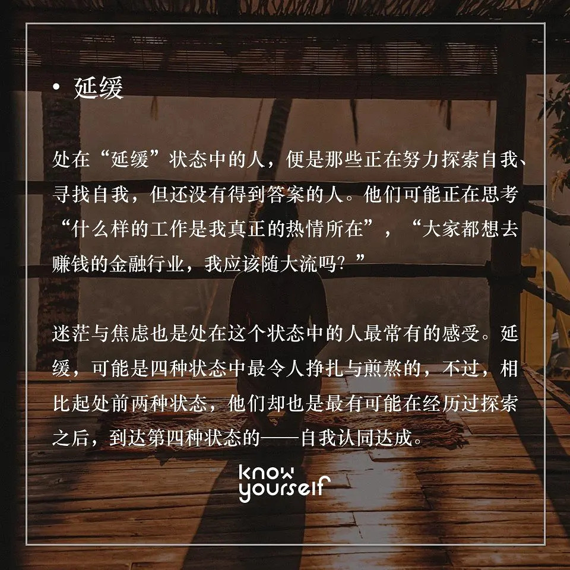
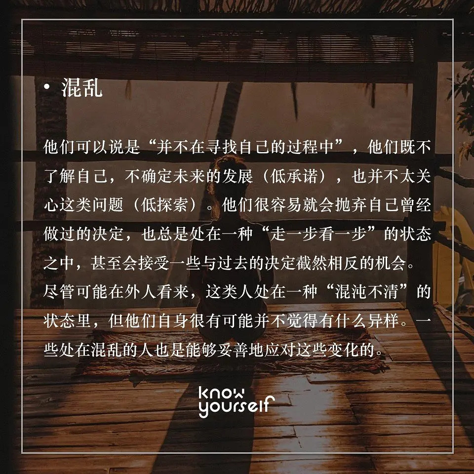
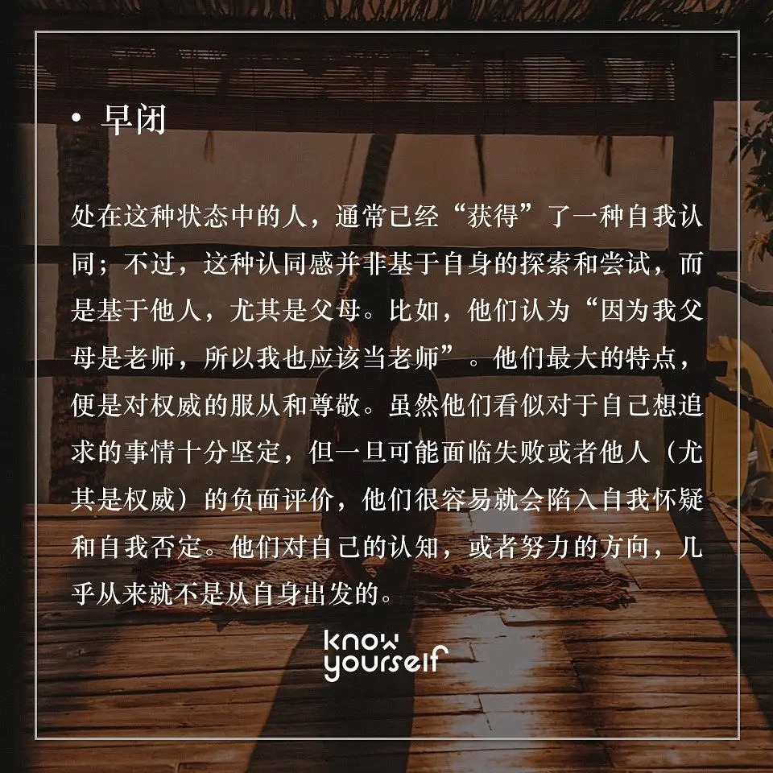

# personal

* 找对平台:有把自己放对了地方，你才会有正念正见正语正行，因为，人是环境的产物
* 交对朋友:物以类聚，人与群分，你的一生中要么影响别人，要么被人影响，当你还是处在社会底层的时候被人影响非常重要也十分必要，关键是你被谁在影响，你是否经常被一些与你同层次的人弄的人云亦云的，经常被人消极的催眠呢？请记住，跟谁交朋友，将决定你的一生可能跟谁一样
* 跟对贵人:先有伯乐，才有千里马。人是可以被教育的，前提是，你的伯乐在哪里？他是谁？他能让你成为谁？贵人是教育你建立正确思维、正确价值观、正确人生理念的人，贵人是给你理顺思路的人，是给你明确方向的人，是修正你的人、是恨铁不成钢又处处说你优点的人，是鼓励和帮助你的人，是恨你到咬牙切齿又不忍心放弃你的人，是把你扶上马送你一程的人，是陪你到胜利为你呐喊欢呼的人
* 纯程序员是无法实现的，兼职写小产品实现财务自有的。Coder->engineering manager->product manager
* 卖掉一家还算成功的创业公司
* 做到大公司总监级别：大公司有技术和管理两条线并行，但其实技术线做到总监级别的比管理线少，所以难上加难。况且技术线做到总监级别也依赖于大量非技术能力
* 第二职业
  - 社区服务
  - 通过业余时间集中精力发展副业。花上半年或到一年时间，额外多赚几千元不是特别是困难
* 一个成年人很重要的一个生存能力就是看清自己的位置和做的事的价值.有时当你年轻时，你意识不到自己在做什么，你在哪里，你会逃避这些
* 能坚持做正确的事情，什么是正确的事情，就是有积累，有成长，经得起时间检验的事情
* 一个人越能认识到自己身份的多重性与复杂性（既是女儿，也是妻子，也是公司职员），外界批评能够产生的影响就越小
* 做事的初衷,结果是附带
* 工作上要早早跨过努力层，进入资源层；感情上要早早跨过狗血剧情层，进入共同开心层
* 选择本身为我们的人生赋予了意义
* 你做不到的事情总有人会做到，你愿意拖到明天的东西，会有人在今天做完。你逃避的东西，你害怕面对的东西，会在之后卷土重来，成为你的梦魇。你落下的课，你逃过的教训，你试图跳过的酸痛和苦楚，会在之后百倍还给你，你今天就要和它决一死战，不是它干死你，就是你干死它。今天，你就要把问题解决掉
* 绝大部分人的知识积累 都是集中在25岁以前的。在这个阶段他所学习和吸收的东西，就会成为伴随他一生的“骨”，往后并随着世间的长年累月的积淀，越来越牢固， 最终变得牢不可破 却过时老旧.所谓的 穷人那特有的固执，又臭又硬的认知，就是这样来的
* 资本、政治、法律、经济
  - 哪怕是今天的房产，都是一种很值得投资和关注的方向，尤其是一线城市的年轻人一定一定要给自己备一些.在任何一个时代你只要在一个“大城市”里拥有十来套房子， 那你和你的子孙后代 都是不可能成为穷人的 ，注意 “是不可能的”， 中产地位是绝对妥妥的保障着
  - 你和你爱人加上父母一起攒个100万难不难？也难但是可以触及，可能一家人认真控制开支三四年就可以攒出来，难度因人而异 但是并不让人绝望
  - 很多事儿的成败并不取决于规模之大小，而在于当事人之决心 和 态度,绝对绝对不能因为钱少，就放弃了学习和深思的历练
  - 一定一定要尊重自己 尊重自己的每一滴汗水和汗水换来的财富
* 屁股 远远比脑子要重要
* 生命没有意义，每个人必须用自己的方式赋予它意义
* 对未来的真正慷慨就是把一切都献给现在
* 成功都是担当来的，不是收获来的。我们以为我们努力就可以成功，其实是我们在努力的过程中担当责任、担当失败、担当结果，最终我们才能担当成功
* 对待别人的信仰一定要尊重，这其实是尊重自己的一个过程。那些无视别人付出、无视别人信仰的人，甚至是讥笑的人，他本身也得不到别人的尊重
* 你通常会发现，有教养的人有自制力，有素养的人有自制力，互为表里。于是，你在需要显示教养的时候表现教养，你的自制力也会提高
* 每一个人的性格特点，可以从他周边亲密的人身上看出来。每一个人的能力，同样可以在他周边朋友那获取信息。不仅我们考察一个人是这样，考察一个公司也是这样。如果他周边的人对他评价不高，或是合作公司对公司评价不高。还是建议你慎重对待
* 正当的年纪完成积累
* 不只要抵制住捷径的诱惑，还要抵制住捷径带来的嫉妒
* 行为 赋予人格
* 独处能力其实是一种学习的能力，学习与自己和平相处的能力。如果你在独处时，既能感受到孤独，也能感受到充实，那你已经提升了自己
* 最基础的人生技能，是与人相处的能力和自己独处的能力。终极的能力是，在人群中可以独处，在独处时不脱离开人群。据此，你可以很明白自己需要什么。也可以通过尝试，类似独居一段时间，或是集体生活一段时间，然后看自己缺乏的能力，去认真补短一下
* 很多事情就是不用说得太清楚「究竟是怎么回事」吧，它就是一部分无法割裂的自我，组成了我们同样不知道是怎么回事的人生
* 旅行是让我们保持对世界的好奇心的一个重要途径，包括你对思考方式、存在价值的一些怀疑，我觉得旅行是一个很好的调整过程。它会帮你清空掉很多日常生活中的情绪。是对内的，是你自己怎么去自洽，怎么跟身边的焦虑烦恼去和平相处
* 以前觉得我从哪里来不重要，家只是一个开始，亲人亲情在人生的意义中只占据着那固有的一部分位置，广阔天地还有数不尽的好东西要去追寻。年龄越来越大以后，又开始发现，那曾经以为数不尽的好东西也不见得有多么好，我也是普通得能守住足够的亲情就该感到无比幸运的一个人了
* 离那些言之无物的人、情绪有问题的人远一些
* 做人要谦虚谨慎,否则，自以为是的小聪明,和藐视一切的优越感,迟早会毁了你
* 人与人的收入不一样，原因不是甲比乙更努力，而是很多外部因素综合起来的结果。甲拥有的资本、技能和环境条件超过了乙，使得甲所在的层次高于乙。必须设法提升自己的资本、技能和环境的层次。
* 不能失去信心
* 做自己，保持住一个人的本色，这是一个平凡人最大的不平凡，可以说这是一个人最大的功名利禄。一个人要活得有意思，不仅是吃好的和穿好的，还应该具备许许多多他现在也不能全部说清楚的东西。
* 你得长大，你得撑住，你得走下去，你得自己关照自己。不会再有什么人指向夜色笼罩的明天，用笃定的语气告诉你未来的方向。曾经他说他看见了，他眼里当时闪耀着狂热的光

* 要先选对平台和赛道，否则挖煤工靠挖煤快又好既没法变成煤老板，也没法获得超过小康以上的其他收益的呢。
* 一个无法自处的人，必定也不会拥有良好的人际关系，因为与人相处的本质其实是如何面对自我。
* 比跟谁在一起更重要的是：你自己是谁，你在成为一个怎样的人。这个世界不过是自己的一面镜子而已，我们真正看到的并不是别人，而是自己。
* 人类对亲密关系的向往，并不在于贫穷富贵不离不弃，而是在于发光发热塑造人格审美。
* 君子可以欺之以方
* 你要成为什么样的人，其实你心里早就清楚了，也早就清楚你能否做到。很多东西强求不来，比较苦劳无法打败功劳，努力也无法打败天赋。比如，我以为一个人对待金钱和时间的态度决定了他可以走多远。如果他太锱铢必较，太过短视，我觉得这些都会使得他顶多走到家门口看看。几乎不给建议或者不强求别人改变。一则你也不知对方是否真的想要，大多数人是知道自己不想要什么，却说不清自己想要什么的。二则，你真的不知道对方是否如你想的一样感激你。
* 生活需要你先经历它，而不是总做一个分析的人。如果你在感情里遇到对方要你早起，要你变美，要你上进，要你多金，赶紧离开对方。因为说明你们要不然不是一类人，要不然对方根本不喜欢你。
* 大风之起于萍末，不要忘记微末之处的修行
* “要把有限的精力用在自己认为最有价值的事情上，不要被负面情绪裹挟浪费时间；如果不爽的事你觉得挺重要，那就设置更高的目标、专注更重要的事。

## 三观

* 世界观：世界什么样
* 人生观：人生该怎么过
* 价值观：什么是最珍贵的
* 最罕见的品质恰恰是很多人觉得一点都不酷的东西：自洽的逻辑，和轮廓清晰的、正直朴质的善良。
* 我只做对的事。别人怎么想？我管他怎么想！
* 一到周末就进山跟苦行僧一样训练。起初以为他的户外爱好不过是玩票。后来发现他其实做了非常详尽的训练计划，一直在严格执行。

## 未来

* 提前规划自己的上海发展之路。预期在上海待几年？租房几年？是否买房定居？把自己的发展规划好之后，寻找能与自己的要求匹配的房源，而不是被房东群体，或者各大炒租客牵着鼻子走。在求租谈判时，先了解对方的长期规划，比如房东可能3年内不能卖房，只出租，那么TA更倾向稳定的租客。大资本很多要签5年以上的哦~

## 热情

* 人通常没有热情。太多的人，只是把欲望当做热情而已。因为欲望就涉及到获取或不能获取，于是恐惧与痛苦就产生了，让你无比煎熬。
* 因为害怕伤害，于是你钝化自己，不再敏锐、不再感知。但记住，不是因为伤害而脆弱，是因为你能感知美好才让你强大。而只有学会敏锐、学会感知，这才让你感知美，充满力量。

## 意义

* 美好和爱共同构成人生的根本意义。
  - 简单:青少年虽然思维简单，但是闲聊时，话非常多，是因为情感多，有很多情感可以抒发。简而清晰的原则：简单但思维清晰，不混乱、不糊涂。
  - 真诚：美好就不需要隐藏什么，所以能真诚的表露自己。
  - 淡泊：美好往往是情感方面的，而不是物质享受方面的，所以美好的人往往淡泊物质财富，而注重精神财富。
* 人生的意义主要由这4点构成：归属感、目的，超然，说故事
* 真正知道自己想要什么，想成为什么样的人无论花多少时间都值。
* 趟的过程，探索的过程
* 人生是体验与表达
* 活在当下,顺势而为
* 接受自己普通
* 工作对个人的意义
* 自己有个计划 安排  事业的发展
* 自由就是为自己的快乐而玩，而不是为了别人或者为了金钱而玩，一个人的心灵和思维能够不受外部因素的奴役才叫自由，我是我自己的主人，我能够决定说yes，也能够决定说NO，就像很多人知道的那样，自由不是我想做什么就做什么，而是我不想做什么的时候，我就可以不做。
* 追求意义
  - 总有着天然的纠结，虽然最后的结果大概率和前者无异，但只有弄明白为什么人生必须如此，才能说服自己做出选择。
  - 因为太过计较意义了，求学、工作都变成了一种选择上的不自由。不能认同的课程和考试，无法接受的工作方式和价值取向，就不能用「大家都如此」来说服自己去做。
  - 为什么还要思考意义呢？答案在于思考，而不在于意义。想得明白也好想不明白也好，这个思考的过程对我而言是最重要的。虽然并不一定会找到，但这是人类可以用智慧去理解并改变世界的前提。
* 不追求意义
  - 似乎总有着对人生的豁达，与其说是随波逐流，不如说是明白天地轮回大抵如此，想太多也无济于事。
  - 自然地接受人生的安排是很好的，这是社会安定或者说生物繁衍的基础。
* 往大了看生命的终极问题我们都还没有破解，所以绝对的意义也就没了定义。况且无论你思不思考，该到来的还是一定会到来。求学、工作、结婚、生子，我们总是要面临这些人生选择。
* 更多的选项不会给一个人带来更多幸福，是选择本身为我们的人生赋予了意义。
* 终极问题的意思不是指那些我们平时不需要考虑，到生命的最后一刻躺在病床上才要想的，像是要不要插管、要不要用心脏起搏器那样的问题，而是那些我们平时不需要想起，但是它作为生命的背景始终存在的问题。
* 欧文·亚隆,总结成四个问题，就是死亡、孤独、自由和无意义（人生四大终极问题：死亡、孤独、自由和无意义 黄晓丹）
  - 人死了之后，生命去了哪里
  - 一旦去那个墓地里面散步，你就会觉得白天操心的那些事情就离得很远了，你就自然会想人生的意义到底是什么。但是如果我们站在人生的终点上来思考意义，我们就会发现，所有那些我们习以为常的意义，好像都不是那么可靠。
  - 《红楼梦》说的人生虚无，说的是把人生的意义寄托在家族的命运上，或者寄托在男女情爱上，是没有意义的。《桃花扇》更夸张，它告诉你说，我们把人生的意义寄托在社会进步上，也是没有意义的。
  - “匪道盍依，匪善奚敦”：这个荣木说，既然我的生命是不长久的，既然一切都是不能够把握的，那么我就干脆去追求我认为正确的那些事情，就是“善”和“道”。
  - 自由
    + 不但对于功名利禄不在乎，而且是对于人们的眼光、人们的评价也不在乎，这是我们最能够理解的一种自由，就是无拘无束的自由。
    + 去追寻自己所爱，追寻自己理想的自由。
    + 去追求理想固然很动人，但是在有些时候决定不去追求那些唾手可及的理想，其实是一种更大的力量。 这种力量它需要对于自身的欲望的察觉，需要理性的决断力，还需要对于人生的遗憾的接纳。
      * 种反向的力量。 所有经典的文学中，一流的文学中，都有这样一种反向的力量。关于抵达的文学中，最深刻的部分是不抵达。关于复仇的文学中，最深刻的部分是放弃复仇。关于科幻的电影中，最深刻的部分是反思科技。
      * 一种做减法的自由，特别是当我们生活在一个充满了广告、宣传、动员的世界上，我们把这些动员当做是自己的理想，我们立更高远的志向，做更多的工作，挣更多的钱，买更多的东西，我们误以为我们是自由的。
      * 但是如果我们没有那种“隔浦望人家，遥遥不相识”的做减法的自由，我们就只是欲望的奴隶，或者就只是被时代的风潮推向前的一艘小船，风潮刮向哪里，小船就漂向哪里。在这种不由自主的情境下，其实是没有任何真正的理想存在的空间的。
* 人生但凡要想有所存进，其最重要的一点就是清楚无误的看透自己当下所处的境遇 以及想明属于自己的出处
  - C1 - 普罗大众 年收入5-20万之间:每天在马路上看到的只要有两条腿的，都是处在这个位置的.特性：他们能理解某些单一职能的作用， 并且只能负责这个位置的基本工作
    + 普遍不具备任何资源的连接与统筹能力，同时也不具备笼络任何人心和他人信任的能力.执拗固执偏执，永远会以其既定的逻辑去思考生活里的一切话题，凡是超出他们想象的 皆为欺骗， 凡是不为他们理解的 皆有阴谋
* 如果人生的意义就在于各项目标的实现，那么在实现之前，你一定是痛苦的，而在实现之后，这个目标和它的意义也就终结了，你又会感到一切结束后的空虚。
  - “达标式人生”必然会陷在死循环里：求而不得的过程是痛苦的，求而得之的满足感只维持片刻，接下来便是没有追求的无聊，于是又需要找到新的目标去追求
  - 为了抵抗这种痛苦和无聊，的确许多中年危机者选择了去找下一个新目标、新刺激，就像《美国丽人》里那个失意的中年男人，辞掉工作，买部好车，和年轻貌美的女孩出轨
  - 这种方式显然不能解决根本问题，反而可能导致的是懊悔、家庭破碎、精神崩溃。
* 在如今恶劣的大环境下，青年危机者更多是被困在目标（或者说欲望）难以实现的痛苦里，至于解决之道，我们提出了“低欲”。
* 但这里就有一个值得警惕的地方了——再低的欲望，其实我们依然是抱着一个生活愿景，就是像《凪的新生活》中那样摆脱了都市烦恼、生存忧虑的新生活，说到底，这还是一种目标，那么，等到真的实现了这个目标，你会不会终究感到无聊，到头来发现自己根本受不了风平浪静呢？
* 什么可以支撑着一个人不去害怕没有达到预设的人生？你又如何确定可以一直坚定自我不动摇呢？《凪的新生活》表现出了“达标式人生”里所忽视的东西——那些可以丰腴内心的能力，和它所带来的那种可持续的、没有目标危机感的快乐
  - “闲暇”鉴赏力，即把目光聚焦在“非功利性的生命活动”上.亚里士多德离我们很遥远，但他说了一句至今有效的真理：“幸福依赖闲暇；因为我们的奔忙是为了拥有闲暇，就像发动战争是为了得到和平生活。”
    + 努力拼搏、积极向上的生活就是为了幸福、为了不用愁烦生计，可是在所有努力拼搏的这些功利性的生命活动过程中，就不可能不愁烦，而一旦真的不用再愁烦了，我们还可以拼搏什么、积极什么呢？
    + 因此亚里士多德提出，此刻就要有“闲暇”，就要有非功利性的生命活动，而且，也只有这种非功利性生命活动的满足感不在完成的瞬间，就在过程本身中，你进行了，就得到了。
    + 在同一时间，一个人正在观看并且看到了，正在理解并且理解了，正在思考并且已有所思。
  - 让你喜欢上散步、作诗、思考这些事情的艺术鉴赏力
    + 它们看上去正是我苦心寻找的情感沃土，在一行行诗句中，我仿佛从内在愉悦的源泉里吸取了养分，从富于同理心和想象力的快乐之源中有所收获，这些是全人类都能分享的；它们与挣扎或缺憾毫无联系，每当人类的物质或社会条件实现进步，它们就将更加丰富。从这些诗句里，我仿佛明白了，当人生中所有更可怕的邪恶被祛除后，究竟什么才是幸福的永恒源泉。当我从诗歌中汲取正面影响，我瞬间感到自己更加健康和幸福了。
    + 密尔从人生危机的思考中也领悟出这样一句话：“的确，我从未动摇过这一信念，即幸福是一切行为规范的检验标准，以及生活的目的。但我现在认为，只有不把这个目的当作直接目标，它才能够实现。”
* 所谓快乐，本就不是只有欲望满足和目标实现，我们从“闲暇”鉴赏力和艺术鉴赏力中体验到的快乐，是属于思想、情感、精神的内在世界；它不以外在世俗标准、物质需求为转移，不受欲望与目标得失的干扰，相反，它还具有消减前面这种种因素所造成的伤害的能力。
* 在这个意义上，如果有人甚至能够把“闲暇”的心情和艺术欣赏的目光得心应手地运用在那些不得不进行的、烦琐枯燥的事情上，比如通勤、完成工作任务、教育孩子，那么这样一个人，大概是永远身处幸福之中而不会有人生危机感了。
* 有清晰战略的人、组织，他们做事情往往重点分明，有所为有所不为。因为他们知道资源是有限的，必须将有限的资源，投入到更能产生高回报的领域，这必然意味着，要放弃很多其他的机会。反过来，没有清晰战略的人，背后往往是缺乏明确的优先级，习惯于平均用力，眉毛胡子一把抓，或者被动的对紧急情况做出反应。看上去可能很努力，例如一会学数学、一会学英语，但未必真正的产生了好的效果。集中力量办大事，集中力量破关键。
* 作为人，最重要的是主体性。我们保有选择自己社会关系的这一份主体力量。我选择了什么样的社会关系，这些社会关系最后构成了我是一个什么样的人，但我不是单纯被动的。
  - 明明是你自己的生命，这些事情发生在你的身上，但你能够进行主客分离，离开自己原来的意识，将自己变成一个相对的客体，用这种方式来观察、检讨，并理解自己生命的处境
  - 人的主体性在于“我”要选择什么样的社会关系，让这些“社会关系的总和”构成、形成“我”。也因为这样，你不是一只蜜蜂，你是一个人，你就必然有一种批判性，它普遍地内在于你的精神之中。
  - 要批判、反省地注意到，在构成我们这个人的基本成分的社会关系当中，还有一部分不是你自己选择，或不是你自己可以选择的。
  - 《资本论》其中的一个目的，就是马克思要帮我们解释，在现在的情况下，我们要如何分辨身上那些强制性的、不能拒绝的社会关系。
  - 这些强制的、不容我们选择的社会关系，就来自于资本主义经济。
* 比起有形的可以名说的东西,更大的困难是那种没有存在感、没有归属感、没有被爱的安全感。
  - 觉得不论在集体当中还是私生活当中都无处可去，是一个人游荡在天地之间的那种孤单，总之如果我有小孩的话一定会让TA在大学之后再独立生活
  - 不知是不是个例，就觉得这种内心的空荡感是无论如何也无法弥补的。这跟我实际的人际关系恋爱关系状态等等都没有关系 别人喜欢我 支持我 或者容易令人感到沾沾自喜的被搭讪被示好被偏爱等等，都没办法从根本上解决这个问题。就好像整个人生的基调早已被定下
* 现在在费了很大劲之后能够学着通过理智调节自己的认知，内心也的确能够得到舒缓
  - 可一旦累积到临界点，不需要特别重大的挫折，只是累积就特别容易产生悲观情绪：觉得回顾一路踽踽独行，所有事都是好一时坏一时，今后也将继续如此，好好坏坏，除了受伤之外意义何在，顿时特别虚无
  - 或许每个人的生活都是差不多的，或许孤单就是人生共通的真谛。但不论如何，过早地意识到了这一点，无忧无虑的时光平白减少了好多啊…

## 事业

* 如果做一件事，把眼光放到未来三年，和你同台竞技的人很多；但如果你的目光能放到未来七年，那么可以和你竞争的人就很少了。因为很少有公司愿意做那么长远的打算。
* 在大机会时代，千万不要机会主义，我们要有战略耐性。成吉思汗的马蹄声已经远去，现代的躁动也会平息，活下去才是胜利。
* 世界已不再温和，风口正在消失，短故事周期结束，接下来漫长的隧道时间，长期主义是主题。
* 王小波说的话，全力以赴度过长远人生，“人生到最后烟消云散，并不会留下什么，但是在它们消失以前，我们必须让这一切先发生。”
* 1600年前，游方僧人云游至敦煌，偶见阳光照山，便决定凿窟礼佛。一个个僧人用简陋的工具，敲碎冰冷石壁，用余生描绘佛像。洞窟之外，坊市开了又停，戏台搭了又拆，浮生碌碌，电光火石。僧人们沉默敲击，不为所动。那片山岗，最后成为莫高窟。他们敲碎时间，甩脱执念，跨过漫长的周期，留下不朽。
* 自己得主导创业
* 年轻人想法太多真害人。想法太多，就会不安稳
* 多样化收入
* 做成一件事的逻辑
* 做不好因为热情
* 信息的不对称，是领导权利的重要来源之一。遇到领导喜欢开小会，对公司的策略和方向遮遮掩掩，他知道所有的全局信息，所以可以指责下属没有全局和系统思维，一旦你也知道了所有信息，你的产出也就不会走太多弯路了。

## 价值

* 现在的年轻人大多都有着同一个追求——做比别人优秀、与众不同的、独立的人。仿佛时代有个背景音，时刻强调着每个人都是独立的个体，个人的幸福必须来源于个体价值的实现，而个体价值的实现又必须通过体现相较于他人的优异之上。
* 现在的评价体系并不在于衡量知识理解或工作质量本身，而在于衡量我们和别人的差异性。
  - 诚然，比他人好的优越感可以让我们感到快乐，它也可以是自信心来源的一部分。但是，建立在优越感之上的自我认同却是一个深深的陷阱。
  - 建立自我价值的基础不再被认可了，那么自我就没有价值了吗？当然不是。但是灌输“比别人好才有价值”等同于给未来高度的自我怀疑、自卑、焦虑埋下了深坑，崩塌也只是迟早的事情。
  - “比别人好”的陷阱还有一个较隐蔽的副作用——形成自恋的人格。
    + 自信是指认为自己是有价值、有能力的人，但这个价值并不建立在对比他人而产生的优越感之上。而自恋的人则会认为比别人强、优秀，自己应该被特殊对待，强烈地渴望成为被其他人爱慕和敬仰的对象（Brummelman et al., 2016）。
    + 自恋并不是缺少温暖的补偿机制，而是源于家长的过度褒奖（Brummelman et al., 2015）
    + 因为自恋，他们会把“我的问题”变成“你的问题”，把不满和愤怒转嫁到别人的身上。所以，自恋的人不仅会更加焦虑，还会有更强的占有欲、控制欲、甚至是暴力和反社会倾向
* 追求与众不同、特立独行、我行我素，似乎是刻在时代基因里的信息，变成流淌在年轻人血液里的欲望。它规定了“一样”是无聊的，“大众”是愚昧的，而“从众”是可耻的。但仔细想想，这种追求恰恰是显示了我们强烈的共通性——大家都想做与别人不同的人。
  - 对个性的追求是对被尊重的渴望，更是一种反抗。但是，反抗是一种过程，是有目的的对抗，而这个目的地应该是能同时看见个性与共性的价值，而非把个性当做唯一存在的意义。
  - 在崇拜个性的时代里，很容易忘记了归属感、认同感对幸福感的重要性，忘记了我们天生有着与他人同步和共情的能力和倾向。
  - 在人类的共情本能面前，圈层、阶层、性别、甚至物种都不重要。
  - 带来“我感受到了你也有和我一样的情感”的快乐，也许才是这些reaction视频受欢迎的真正原因。
  - 请不要忘记，和别人同频所产生的快乐可以是我们苦涩生活中最真实和最易得到的一点蜜糖。
* 追求更大更强的自我，不是通往幸福的唯一道路
  - 北京大学助理教授柏阳通过一系列研究展现了“小我”和幸福的另外一种可能。这更小的自己是源于面对大自然的敬畏之心——我们越感到敬畏，画出的自己就越小。
  - 这个“小我”与自卑感不同，日常的敬畏心和在实验中被激发出敬畏体验，都会让人感到更小的压力、更少的烦恼、以及对生活更满意
  - 敬畏之情不仅会让我们感到轻松、快乐，还会让我们对他人和社会展现更多的善意。研究发现，在被激发出敬畏之情后，人们会倾向于向陌生路人提供帮助、做出更无私、道德的决定（比如退还自己被多找的零钱）、以及更慷慨地捐助他人
  - 强大是一种无止尽的追求，而世事无常，总想着占有和控制也只能是欲壑难填。不如更多地与他人、时间、自然相的连接，感受到比我们自身庞大无数倍的存在时，感受放下“我”的执念，体会另一种幸福和快乐。

## 勇气

```
只要运动，你就一定会受伤
只要做事，你就一定会犯错
只要推动事，你就一定会得罪人
只要有观点，你就一定会被人骂
只要你不世故，就一定有人来教育你
只要你有成绩，就一定有人说长道短

这个世界从来不缺阻止你的人
所以，你一定不要害怕和畏缩
唯有更多更果敢的行动和坚持
才有更灿烂的突破与绽放
```

## 意志力

* 认识意志力
  - 我们都是普通人
    + 普通人就有喜怒哀乐，普通人就有色贪嗔痴：赖在冬天的被窝里会不愿起床，看了一晚上书会觉得累，碰到了美女会想多瞧几眼……这没什么，人性。
    + 如果不懂，你会夸大意志力的作用。失败的原因会被归咎于“意志薄弱”或“不够努力”，相应的，解决方案自然是“打鸡血，放狠话，下次我要注意”——这不会帮你找到真正的症结，也不会对事情有所增益。
    + 如果懂了，你会认可意志力的局限。你会设计方法去修补人性的漏洞，你会小心翼翼地避开挑战和诱惑，你会谨慎细致地使用自己的意志力——于是，事情有了解决的可能。
  - 意志力是脆弱的
    + 意志力是容易损耗的：都常常在早上，啃最硬的骨头：做最难、最复杂、最需要创造力的工作。这是因为在早上，个体状态最好，意志力最充盈。随着时间的推移，意志力的“电量”也在逐渐损耗，个体状态也在逐渐下降。
    + 意志力是时高时低的
* 习惯一旦建立起来，维持习惯就不需要太多意志力
  - 最开始会有不舒服，但随着磨合的深入，所有的不适感都会逐渐消失，非常自然。它不是我的任何负担，也不是需要分配的工作，也不会消耗我的意志力。
  - 再升华一下，你会发现身边的许多牛人，他们的努力都是“常态化”的：大年初二的早晨，照例坐到桌前写方案。年会狂欢结束后，照例回到办公室改合同。高铁上，机场里，照例用手机写稿子、回邮件。
  - 他们不会被自己“熬夜一两次”而感动；他们也不会觉得以上这些，有多了不起。这些努力，并不需要意志力的驱动，而是潜意识里的自发行为，是有肌肉记忆的习惯动作。
* 如何做
  - 外力驱动：你需要一个截稿日。这是你唯一需要的东西。别扯什么运气，别扯什么天分，找个“今晚不交稿就打爆你狗头的人”，跟他合作。然后，你会被自己的才华吓到。
  - 设置环境：不在家办公。 家里的诱惑太多了：电视、平板、电脑、xbox……这么多好玩的东西，不断撩拨着，还怎么专心做事？当还需要自我驱动、自我鞭策、同自己较劲，你很难心如止水，你很难100%发挥。
  - 对玩的态度：将“玩”这件事，置于监管和纪律之下——我反对的不是玩，而是无监管、无纪律、失控状态下的玩。
  - 降低合规成本门槛，循序渐进：第一次去，只是慢跑3公里，很轻松；然后，4公里、5公里；慢慢地，上器械，加大运动量。在刚开始的阶段，建立形式很重要：“坚持”这件事本身，比所做的内容，更重要。连续的成功闭环，滋养了我的自信。这种自信不是嘴上喊喊，而是发自内心。要改变习惯，你需要懂得“欲速不达”的道理。
  - 意志力用在关键地方 你要明白，只有那么有限的几件事情，是值得你不惜一切做到的。意志力聚焦于核心事务，你的生活会变得简单：其他事情不用太管，只要坚守那几条核心原则，事情就会自动往好的方向发展。
  - 改变是系统工程：改变，是一件复杂的需要耐心的事情。你越一厢情愿地简化它，你越会得到失败。如果你真的希望做到，就该拿出自己的诚意：如临大敌，高度重视；小心翼翼，循序渐进；想许多办法引导自己……
    + 要正视人性的局限和缺陷，设计方法，修补漏洞，屏蔽诱惑，引导自己走进正确的轨道
    + 我们要修炼精进自己，强化精神硬度和意志品质，拥有更强的人性容错能力。
* 任何事情只是坐在那里担忧，负面、绝望、自怨自艾、不断强化认知是完全没有用的。唯有行动起来、尝试了解、即使最初目的不是为了改变自己 但在过程中逐步会发生好的改变 一切并没有想象中那么糟

## 时间

* 20-27岁：技术积累阶段。那么工作的前5年是打基础的阶段。在这5年时间里面，要积累足够的代码量，打磨自己的技术实力，成为某一个技术细分领域的牛人.
  - 开阔眼界，把基础打扎实，努力学习和成长
* 28-35岁：形成思维方法论和知识体系的阶段
  - 当积累足够的代码量，例如超过10万行代码以后，应该形成了自己的思维方法论和自己独立的学习技巧，任何新的技术在眼中都能迅速的看到技术的本质，快速吸收成为知识体系的一部分
  - 到了这个阶段会发现所完全不了解的新技术新知识是非常少的，新技术对来说也不过是几天时间就把玩的很好的玩具，学习越来越轻松，掌握的知识储备越来越多
  - 开始逐渐的不再满足于纯技术领域的探索，而是思考更多的问题
    + 如何将技术转化为生产力
    + 什么技术在什么样的场合能够发挥最大的价值
    + 技术团队应该怎样构建
    + 在一家公司里面，怎样才能将自己的技术能力最大化的发挥出来?
  - 在这个阶段，积累技术对来说简直是小菜一碟，更需要磨练的是思考能力，形成自己的思维方法和知识体系
* 35岁以后：了解自己，把自己变现的阶段，因为编程只是整个武器库当中相对最不重要的了，你的经验，视野，架构能力，管理能力，分析和解决问题的能力已经远远不局限于技术这个领域
  - 30-40 岁的人年富力强，既有经验又有精力，还敢想敢干，所以这群人才是整个社会的中流砥柱。在这个阶段，你需要明确自己奋斗的方向，需要做有挑战的事儿，需要提升自己的技术领导力
* 40 岁，事业和人生就有可能会被定型，不过这也不是绝对的。我只是想说，20-40 岁这 20 年是我们每个人最黄金的发展阶段，我们每一个人都要好好把握
* 家里没矿又整天小资的人，能积累财富的很少。开始十年八年，不狠下心来积累财富，后面的人生其实会越来越难。先苦后甜吧还是。别光顾着眼前的光鲜，还是要看长远一点。十年八年后，人家旅游，健身，美食，现世静安，花的都是资本收益，你现在的现世静安花的可都是劳动所得。为什么财富积累要越早越好，因为据统计，人的一生实现财富迅速增值的机会只有三次，你越早把本金赚够，越有可能把握机会。我们生在一个人口结构转型的时代。两个人养6个人。什么靠得住？养老金是肯定扛不住的。除了资本，我没想到什么靠得住。结局好，才是真的好。别看年轻人的风光。他们还在温室里呢。为何很多有钱人一开始都土土的，只是在埋头积累罢了。说句大逆不道的话，这世界，还是大叔的。哪怕他们油腻不堪。最后你直接间接的，还是得替他们的资本劳作。你仔细想想，这群油腻男人里，买得起五六十万车的人，其实很多的。但真买的没几个。人生是一场大戏，你得布局。你中年以前，瞎JB玩，中年以后，命运分分钟吊打你。
* 人都会老，你终将组建自己的家庭，拥有自己的妻子或丈夫，你会有孩子，最后会有中年危机。
* 可能有人会说我杞人忧天，才27就考虑中年危机。但实际上我是一个非常乐观的人，也很讨厌别人说危言耸听的话
* 但有些问题，大部分人都终将面对，而尴尬的是，面对的时候我们并没有做好准备，甚至是根本就没做准备。
* 我不想开上帝视角，指明怎么做就是绝对正确，因为我自己也还在探索。时代在进步，科技在更新，几年的光景过去，或许连你的生活工作方式都不一样了，更别提一生的职业目标了。
* 当你老了，回顾一生，就会发觉：什么时候出国读书，什么时候决定做第一份职业、何时选定了对象而恋爱、什么时候结婚，其实都是命运的巨变。只是当时站在三岔路口，眼见风云千樯，你作出选择的那一日，在日记上，相当沉闷和平凡，当时还以为是生命中普通的一天。
* 如果担心现在才开始学某样东西，年纪已经太大的话，不妨这样想：就算因此放弃不学，年纪还是照样会变大的。
* 每个人的成功，包括财富在内，都不是忽然就能爆发的，除了拆迁户那种突然爆发，往往都在人的成长经历中可以看到轨迹。
* 我们每走过的路，都触发着未来的变化。与其把希望寄托给遥远而朦胧的未来。不如从现在开始迈步，从当下去努力，把每一分钟时间，每一个人生阶段，每一个机会，都牢牢的掌握在自己手上。
* 计划驱动型人生
  - 做这件事情的目标就是消灭它
  - “生命是一个钟摆，总在痛苦和无聊之间摆荡。要不就是痛苦，要不就是无聊。”
  - 在工作中完全没有兴趣、没有意义、没有感情。生活、生命意义，都必须在工作之外寻求完整——长期如此割裂下去，会产生什么情况？就是我一开始聊到的，你「为生活所迫」，每做完一件事情都觉得无聊。
  - 你的成就不在未来，就在当下。
* 好奇心：保持好奇心很重要，但若是竟然养成了猎奇心理，那就算是掉进坑了。这是个很大的陷阱。年轻人常常因此吃亏，迷恋一些“新”概念，虽然那概念或者那行为一点儿都不新，只是为了显示“与上一代不同”罢了——这其实是很古老的行为模式；有些人甚至即便在成年之后，也要靠不断强造“新”概念才能刷出存在感，这就比较可怜了 —— 因为那些玩意儿根本没有繁殖能力。
* 女生女性有事业、婚姻、育儿三条主线，并有工作、结婚、生子、小升初，中考等几个关键节点
  - 23-25岁，主线工作，走完第一个职业上升期；兼顾找到合适的结婚对象
  - 26-27岁，主线婚姻，走过第一个离婚高峰，已婚未育的尴尬，你懂的，努力也很难得到机会
  - 28-30岁，主线生育，走完3年人之初最关键的亲子阶段
  - 31-36岁，主线工作，走过职场黄金期，度过第二个离婚高峰，35岁走过幼升小节点
  - 37-40岁，主线教育子女，40岁左右走过小升初节点

## 收集反馈和接纳自己

* 接纳自己的优点或者缺点才能积极的坚持和改变
* 用看板：评价自己 寻找原因 能否改变
* 有什么价值、优势和劣势、未来的计划和发展方向、风险怎么管控和人际关系

## 情绪

* 关注和观照你的情绪，这是保持自制力的关键。冥想、静心都能很好的处置情绪，这个不涉及乐观或悲观，就是单纯的情绪。时刻注意情绪的走向，自然你就拥有了自制力
* 要乐于自己的知识体系被重建，每一个人类的跃升，都是知识体系的崩塌和重建。个人的知识和学习也如此，那些畏惧崩塌和重建的知识体系和个人，都是你放弃进步的开始。
* 身体是需要锻炼的，时间观念也一样。我们在身体状态虚弱的时候，或者没有锻炼出自己的身体习惯，自制力就是一个无从谈起的话题。
* 自制力同样来自于优秀的习惯，与其热衷于锻炼自制力，不如让自己养成良好的生活和习惯，哪怕是最简单的饭后漱口，这样的小的好的习惯坚持，你的自制力也会慢慢提高。
* 快乐是需要分享的，愤怒是需要适度表达的，悲伤是需要克制时间的，恐惧是需要迅速行动的。而我们总是把快乐当做自己的财富，愤怒却怯于和外界冲突，悲伤我们总是陷入情绪里不能自拔，恐惧时闭上双眼听天由命。
* 一路向前,挫折时不气馁
* 避免心态失衡,转牛角尖封闭出不来
* 心胸狭窄
* 去体验
  - 自己拖大
* 一件事几句话说不清楚的时候 就停止
* 无用情绪
* 悲观
  - 乐观的人和悲观的人最大的区别就是，乐观的人哪怕有100人骂自己1个人夸自己，他也会非常开心，总惦记着那一个夸自己的人。悲观的人哪怕有100人喜欢自己唯独1个人骂自己，他也会很悲伤，总惦记着那一个骂自己的人。
  - 乐观的人生还是悲观的人生，全然是看自己关注哪个部分。你关注的部分，就是你的人生。

## 性格

* 情绪稳定——大部分时间能好好说话
* 坦然的努力：不遮遮掩掩，也不大肆宣扬
* 不服输，但敢认输
* 会较真，但不计较
* 有底线
* 有温度：已识乾坤大，犹怜草木青
* 好说话不能说是缺点，但这性格需要有点运气，需要对方懂得你的好，尊重你的好

## 个人

* 选择比努力更重要
  - 找对平台
  - 交对朋友
  - 跟对贵人
* 关键
  - 性格决定命运
  - 细节决定成败
  - 思路决定出路
* 把时间用在与你志同道合的人身上，不要试图去改变与你三观不一的人，减少与自己未来没关系的事。
* 别以为社交恐惧很时髦，要学会整合自己的资源和人脉。
  - 认识一个人，也要认识对方的资源，学会把不同朋友的资源整合在一起做事情，才可能利益最大化，效果最大化。
* 克制+坚持
* 提升效率
* 接受新观念
* 想法落了地
* 成长环境、工作环境
  - 博士过程，成长遇见一帮什么人
* 控制情绪
* get不到重点或者get  不对
* 正确的方向去成长
* 其实你把自己当做一个生物，你想想你需要的基本能力是什么。
  - 吃，吸收营养、寻找食物，多半要能吃饱；
  - 移动，步行、骑车、开车；
  - 沟通，除了说话技巧是不是最好学点外语、方言？
  - 别人需要认识你和给你赚钱的机会？你有什么别人愿意付钱给你的技能？
  - 总要学习和进步，那你如何学习如何寻找学习的机会？
  - 要活的舒坦点，总要有点爱好、让别人也愿意和你一起共处。
* 人生真的是没有任何指南，任何东西和经验来告诉你，你应该怎么活，对于你自己而言，自己自负盈亏，开心担当才最重要，所以要自己不断的摸索和经历，而在这期间，出现变化也很正常，不用太过担心自己为什么突然会有这样那样的想法，追求，日光之下，并无新事，你的这种状态，也只不过是前人经历过得事罢了。
* 有些东西尽早做
* 已有的专业知识和管理经验都有可能在一夜之间变成毫无价值的东西，甚至还会成为你前进的阻碍
* 自卑的根源就是总和别人比较，当你意识到'我就是我，我跟别人不一样'的时候，你就不会跟别人比成绩、才能和其他东西。
* 不能改变的叫先决条件，能改变的叫行动方向，单纯心理的自卑需要认清这两点。消除自卑另一个法宝是，建立自己的优势项目。某一个点，在自己的周边环境里，你是优秀且被认可的，那是消除自卑最好的方法。
* 一个人的精神旺盛、意志坚强与身体的强健是分不开的
* 所谓自律，是以积极而主动的态度，去解决人生痛苦的重要原则，主要包括四个方面：推迟满足感、承担责任、尊重事实、保持平衡。实践这些原则，关键在于你的态度，你要敢于面对痛苦而非逃避。如果不顾一切地逃避问题和痛苦，就会由此失去以解决问题推动心灵成长的契机，导致心理疾病越来越严重。
* 人有两种进化：
  - “流泪之后的领悟” 本质是你的经历复杂了你的认知 属于人工智能式的进化 认知的变化相对容易，而且被动活着就会发生
  - “领悟之后的流泪” 本质是接着由认知复杂了情感 这体现了人类超越AI的进化 有可能带来更主动更审美的体验和存在、以及性灵的提升
* 经历之中，只有个人滋味
* 看山是山  看水是水
* 三项精神锻炼，比健身难很多，也重要很多：
  - 降体脂（欲望、幻想等多余热量）
  - 增肌（理性、知识等能力）
  - 加强骨密度（独立意识、价值体系）
* 个人真正内在展现多少
* 老人 没有自己的生活
* 敏感:练车时紧张
* 真诚的路子
* 想法落了地
* 讲话慢也是一种选择
* 自律意味着你终于开始对自己的生活，对自己的人生负起责来，开始分清各类事情的主次，开始终于能把那些以前拖延着不想做的事情在自己规定的期限前做完。你开始重新从欲望和惰性前获得对生活的掌控权，而这种感觉很棒。
* 五年后的你会是什么样子，说穿了就取决于两项最重要的因素：一个是你与哪些人为伍，另一个就是你读哪些书；我们应该要求自己只说该说的话，少说废话省点宝贵的脑力；有节制只讲重点，表示你脑袋很清楚，心灵很安详。
* “最终实现梦想的都不是激情，而是理性和坚持。”在这个时代是很难的。你必须努力去过这样的生活，在知道自己需要什么和追寻什么的同时，保持健康和快乐。关键知道自己要什么后要不断去追寻，还要明白这会很困难。要坚强，试着享受但是保持清醒，保持健康，因为你会面临很多挑战，快乐点吧。
* 有些人吃相难看，但稳当
* 我不期待自己在任何方面都做得更好，而只是以我当下的样子去活、去过、去折腾，真是极好的允许，极好的认知，极好的解决方案，极好的发展方向
* 成年人的生活就是从 吃好 睡好 不能有拖延 不能有惰性 更不能有情绪开始的 想起之前一个同事说的 那段时间他总加班：闹钟一响 到点就睡 闹钟一响 到点就起。这个快节奏的世界 真的不能容忍人的一点坏情绪。得有秩序 目标明确 不受干扰 体能精力十足  小心谨慎 头脑不发蒙。
* 为了做好自己的人生选择，我们真正需要的，是塑造出一套属于自己的原则和价值标准。
  - 通过关注我们与自身的关系——这种关注中不止有观察，还应有选择、塑造，通过我们的行动、选择，让一套前后一致、自我认同的价值观念显现，我们回头看到自己的行动，能够信服“这”就是我们处事的原则，我们往前展望，能够相信继续依照“这”作出自己的选择。
  - 简单来说，我们需要找到自己贯穿一生的价值观，这种价值选择的标准和原则是我们选择的。然后我们应当坚持这种标准和原则，从而让自己的人生成为一场专注的尝试，以至于到最后，它能够呈现出一种不辜负我们本心的样子。
  - 福柯说， “这种针对自己的工作，既不是由民法，也不是由宗教义务强加给个人的。这是一种生存的选择。他们这样做只是为了把他们的人生变成一件艺术作品；也就是说，他们是出于生存的美学动机才选择了这样的生活方式。人们应当关注的艺术作品就是他们自己，就是自己的人生，自己的‘存在’。”
  - 没有什么容易的道路可以给犹豫不决者去走。给他们任何一种答案，都是在纵容他们逃避承担自己生命的责任。他们须得学会关注自己、选择自己、塑造自己；须得树立起自己在这世上行事的原则、追求的价值；须得与时间和解；须得明确意识到自己和他人的区别；才能走出这种犹豫不决的困境。
  - 人生这条路，只能自己埋头往前走，他人可以支持你，却无人可以替你。做一个与自己的内心紧密联系的长期主义者，坚持成为自己，我在此与大家自勉共勉。
* 时间观
  - 在普遍的时间观念中，时间意味着死线（Deadline），把我们的人生切割为一场又一场的竞赛。我们比学习，比工作，比婚姻。这种比赛，让我们的人生选择始终活在一种自身以外的社会价值评价中。其实除了我们自己，并没有人可以替我们做出这样的价值评价。但这个社会有它“不容置疑”的声音，我们被告知自己的感受是幼稚的、可笑的、没有价值的。一场又一场的竞争中，它反复告诉我们“什么是好的”、“要去追求这个‘好’的”。  在这种把时间作为竞争死线的时间观中，人们常常会有“我要来不及了”的焦虑感。尤其是，每一场不同的竞赛对人们提出的要求各不相同，例如职场和家庭的要求不同。此时，时间和自我是敌对的关系。时间把自我分裂成一个一个的阶段和无数个必须迎合的具体的要求，令自我难以应对。
  - 另一种时间观，则是把时间看成自己手上的资源，站在一个更长远的时间维度里，看待自己的一生。你来世上走一遭，手里有这些时间作为资源。假如你有一个更加长远的关于自我塑造的目标，你就可以把这些资源都用到达成这个终极的目标上去。当你把很多人事，放到长远的时间范围里去看，这些人事的意义都会发生变化。比如说你被出轨分手了，痛彻心扉，但放在你的一生来看，你及时止损，是一件喜事。再比如你觉得改变父母的想法太难，但你坚持在他们面前做真实的自己，5年后，你们的关系发生了变化，他们明白了你是一个成年人。眼前一城一池的得失，常常让人魂牵梦绕或者失魂落魄。但常常用一种一生的视角看当下的人事，可以帮你保持平静和清醒。
  - 人生短暂宝贵，你的时间应该用来成为你自己。花时间去和他人说明、辩论、证明、解释，都是对时间资源的一种浪费。在时间这件事上，我是一个长期主义者，我衷心祝愿你也是。
* 所有尝试着被别人理解的行为都是弱者的行为。人的强大要学会孤独，学会不被理解，然后努力去证实自己，通往成功的路永远是少数人的，当所有人都理解你的时候，说明你的行为已经泯为众人矣了。
* 我们能做的就是思考当事故发生到自己的身上时是否可以坦然的将它作为故事一样面对和处理。
* 一个人的发展，受到三个方面的影响，ta的个体化的特性（比如先天的智力、人格性格等），ta的环境，以及ta过去经验的累积。称之为命运的东西，可能就是这个过程中的随机因素。比如，先天的个体差异，不受主体选择的家庭和成长环境，以及生命中重要而随机发生过的事件。
* 所以我们每个人都大体会有自己优势和劣势的方面，这种趋势可能也是被人们称呼为命运的东西（的一部分）。
* 甚至，如果我们的选择能力，本就部分取决于先决的自身和先决的初始环境，我们的选择也就成为了命运本身。从这个角度来说，命运是存在的。就像蝴蝶效应一样，我们生命中蝴蝶的第一次振翅，可能是别无选择降临在我们身上的命运。无论我们多么想要否认和拒绝，费尽心机试图逃脱，但无论是哪个版本的故事，都从蝴蝶的那一次振翅开始。
* 那自由是什么呢？随着个体年龄的增长，人们的选择空间既会变小、也会变大。我们都曾经站在命运的分岔路口，后面的道路风起云涌，我们的一个选择，影响我们在后面的人生中付出了不同的代价。尽管无论如何，代价都必须付出。
* 处理焦虑

## 积累

* 发布文章
  - 个人营销
  - 一劳永逸的事
  - 商业
    + 客户对象群体的选择

## 成长

* 35岁，一个悬浮在而立和不惑之间来回撕扯的年纪，一个刺伤过很多人的所谓“中年危机”启动的年纪。它因人而异，或早或晚，无论你的感官是敏锐抑或是迟钝，总会到来绝不缺席。——尼古拉斯.曲
* 知识结构单一并严重老化、脱离一线丧失技术能力/业务能力/市场判断、以依托于平台、品牌或明星产品获得的成就而洋洋自得
  - 专业能力包括：技术领域的技术、架构、设计能力，项目管理领域的人力、成本、进度、风险以及质量等的管理能力，业务领域的业务咨询、领域建模能力，产品领域的产品规划/交互设计、需求挖掘/管理、市场/竞品/用户分析等能力，产品运营领域的推广、营销、渠道和数据分析等能力
    + 专业能力会下降：[30, 35]这个年龄区间专业能力会下降：0%的精力花在管理上，基本脱离一线技术或者一线业务，对专业领域的新技术和新趋势的把握不到位，嗅觉变得迟钝，很多时候只能以过时的知识体系来做出决策判断。
    + 知识体系会过时：舒适区容易让人丧失斗志，特别是30岁左右搭建完成的知识体系已经在当时的基准线之上，完全可以玩得转接下来蛮长一段时间的职业生涯。想办法跳出舒适区，给自己找到新的突破点，升职、调岗甚至跳槽都可以，否则温水煮青蛙，没有突破的强烈意愿
    + 原地踏步：[35]群体有个特殊性，这个时期的认知范围更多的是需要往广度上走，为了快速获取大量相关性的知识，就很容易走入这个误区：什么都想学什么都没学到
    + 拼不过年轻人：学习时间有限，家庭因素、身体因素、缺乏实战
    + 遗失了兴趣、热爱、激情或愿景”
* 自由选择的能力：相比年轻人，[35]拥有自由选择空间狭小的多
  + 领域的选择：会选择一个尽量长期的饭票
  + 职位的束缚：人往高处走水往低处流
  + 家庭的责任
  + 不断累加的包袱
* 应对
  - 稳定的家庭
  - 在某一个或者某一些领域有了深厚的积淀，千万不能固步自封，不能计较一时得失，要以此在合适的岗位上继续扩张自己的知识版图或技能树，让自己可以多条腿走路(技术、业务、管理)，规划好接下来5年或者更久的职业路线。
  - 明确的持续学习空间：真正的去考个MBA、CFA、PMP...再不济来个Coursera在线证书。总之要把自己的学习空间明确拉长，并最终有个产出可期。
  - 健康的身体和生活习惯：坚持锻炼并杜绝不良的生活习惯
  - 扩散人脉及影响力：内部关系决定你的团队管理难易度、职位升迁；外部交际圈受制于你的能力和影响力
  - 自己的资产进行合理的配置使其升值
  - 你热爱生活，就会坚持运动健身，坚持接触新事物，保持精神饱满、乐观向上；你热爱工作，就会关心团队关心公司，勇于承担责任，持续的学习充电，为工作注入新活力。
* 如果你真希望人生能不断成长，那么就得心怀像孩童般的好奇心
* 生活从来不会招招手说:"小子你过来我们讲讲道理". 生活只会一个大嘴巴把你打在地上后说,"傻逼 学着点" ​​​​
* 善待自己，可以让生命活得滋润。无论是善待谁，其实都是温暖在流转，都是爱在延宕，最终，施及别人，惠泽自身，不逃避，不畏惧，悦纳生命中每一个阶段的自己，才是对自己最大的善意。
* 所谓青春就是尚未得到某种东西的状态，就是渴望的状态，憧憬的状态，也是具有可能性的状态。他们眼前展现着人生广袤的原野和恐惧，尽管他们还一无所有，但他们偶尔也能在幻想中具有一种拥有一切的感觉。——三岛由纪夫，《青春的倦怠》
* 成人
  - 必须接受现实
  - 要为一切买单
  - 要和所有人一样
  - 梦想很遥远
* 一辈子相守，需要有容忍对方缺点的能力。一段时间的同行，需要从对方身上学习东西。这在职场同样有效，职场的人不会陪你一辈子，但能影响你的提升，这样想你就知道该怎么面对职场了。
* 成长无非大醉一场，勇敢的人先干为敬。
* 那些不能对别人说起的话，也许正是我成长中彻彻底底的孤独。
* 细水长流煮红豆”好过“声色犬马走天涯。
* 每一个人都能谨慎地找出并坚持他自己的合适方式，而不要采用他父亲的，或母亲的，或邻居的方式。
* 建立共同成长的环境而不是共同目标的环境，或许是中国式婚姻最需要解决的事情。否则中国式的婚姻总是让人畏惧和认为是死气沉沉。
* 去规划自己的成长
  - 避免对比他人，产生的浮躁
  - 突破父母的限制
  - 人生路要扎实了，不要不断的重建
* 年轻时候残留下来的狂妄和洋洋得意，终会在某一个时间点就忽然消失。
* 男女结合最最重要的是感情和双方互相理解的程度。
* 理解深才能互相欣赏吸引、支持和鼓励，两情相悦。夫妻间最重要的是朋友关系，即使不能做知心的朋友，也该是能做得伴侣的朋友或互相尊重的伴侣。
* 一段感情如果不能让你感觉到开心，踏实和安全，那么这段感情就是错的，不要硬撑，也不要替他找任何借口。 性格不合有时候真的不是随便找的说辞，当你真正遇到了，你才能体会到说这句话的时候有多无力。
* 我从不认为先张口说爱的那个人输了，她张口的那一刻，无论答案是什么，她都赢了，你看，被拒绝了，她为自己赢得了时间，不会瞎耗下去了，往后终于可以睡一个安稳的觉了，如果对方也喜欢自己，她为自己赢得了爱情，往后终于可以睡一个踏实的觉了，倒是，暗恋啊，总是辗转反侧的夜晚。老板娘说，人们总是在多年以后才懂，输给了年轻的自己。
* 我们都要想明白，恋爱到底是为了什么？如果说只是因为这一程这有一程的陪伴，那么你好我好大家好，敏感点避而不谈，互相尊重保留空间，吃好玩好开心好。潇洒走一回，我很羡慕。
* 如果为了找到相伴至少半生的伴侣，那这之前的每一次尝试和试错，请大家都稍微用心一点。多触碰一些敏感话题，拉着对方一起多经历一些困难和创伤，多谈论对社会事件的看法，对婚姻，家庭，政治这些取向和看法，多考察对方一家的生活状态，他们父母是如何为人处世的。这是对你的感情负责任，别什么都避而不谈，谈一谈，早点谈，发生了什么都晚了。
* 开始没有特别想要的东西，没有特别想处下去的人，甚至努力的方向慢慢都没有了，一切都越来越平淡，不想抗拒有人走近，也不想挽留有人离开。

## 父母

* 人怎么老糊涂的

## 人际

* 在情绪上浪费太多时间。该绝交的人趁早绝交，该漠视的人擦肩而过就好，值得珍惜的人绝对不会让你伤心气愤，顺便得出第二条
* 清简人际关系，必要的时候选择孤独一点。
* 提高效率
  - 需要专注，手机能放下就放下
  - 需要刻意锻炼，比如人为的给自己设置deadline，人为压缩自己的工作时长，倒逼自己迅速高效搞定。换句话说，别纵容自己
* 该享受人生的时候就享受，享受完才明白，好好干活才能得到想要的一切。
* 纵使被说坏话、被讨厌，也没什么好在意的，因为「对方如何看你」，那是对方的课题。
* 生命中若没有敌人，就意味着我们时刻都必须配合别人，当然就会活的非常疲累。
* 孩子喜欢用喜怒哀乐支配大人，这是他们惯用且奏效的把戏。长大以后，如果还想用这种情绪支配别人，那就幼稚了。
* 存在不同意见、价值观，是理所当然的事，也是意义所在。
* 人生没那么困难，是你让人生变得复杂了，其实，人生非常单纯。 没有一项生命的意义能够适用于所有人，生命的意义是每个人赋予自己的人生的。
* 我们不是因为一时气昏了头而口出恶言，而是为了操纵、支配对方，想让对方遵从自己的意愿和期望，创造与利用了名为“愤怒”的情感。
* 没有一个人是住在客观的世界里，我们都居住在一个各自赋予其意义的主观的世界。
* 太在意别人的视线和评价，才会不断寻求别人的认可。对认可的追求，才扼杀了自由。

## 驾照

* 教育
  - 理论
  - 解答态度
  - 要让犯错，才能记住
* 科二
  - 车速慢下来
  - 对线：根据前面跟右边一块确定
  - 座位的位置距离调整，最后扣安全带
  - 倒库早打方向
  - 半坡到停车点前，一直对线
* 科三:补考费用40，收费300
  - 挂
    + 人行横道灯光；手刹没放到底、出大门位置没停
    + 灯光超车没开远光灯
    + 两次熄火，带挡打火
      * 平路不要踩刹车
  - 灯光
    + 听完语音后开始动作
    + 信号灯之间的切换反应
    + 动作以播报为准
    + 人行道，远近光
  - 上车准备
    + 档位恢复
    + 灯光恢复
    + 离合脚放合适
  - 起步
    + 左转向灯5s后回
    + 手刹到底
  - 直线行驶
    + 之前压好速度，避免掉速
    + 手拖住方向盘，放松，对远处线修正
    + 前面20米里面有车，停止，等候放空
  - 加档位操作
    + 换挡  慢点为了感应到
    + 2:10-3:20-4:30-5：40（不要超六十）5档不要滑行
    + 档位速度匹配：速度到了换挡，松离合不会抖
    + 保持车速
  - 超车
    + 打灯后停5s 不要动方向盘
    + 前面有车，不要动
  - 拐弯:二档,速度降下来,带点刹车，拐过来后可以加速
  - 靠边停车
    + 人对黑线进来
    + 补灯
    + 快打一把，慢慢回，先找平行，小镜与线一条缝，以小镜下部为准 看后视镜上小下大
    + 摘档 手刹 熄火 抬脚 松安全带 关好门
  - 习惯
    + 停车检查：下看挡-》中看灯
    + 速度20+保持，没距离限制
    + 注意边线、远侧边距离
    + 减速时不要换挡了,直接刹停
    + **踩离合后同时摘挡**
    + 离合跟刹车不能同踩
    + 看后视镜 车况
    + 停车:先踩刹车,后带离合要带到底，刹车要稳当
    + 不要遛车
    + 一档起步：有一定动力后再加档位，不然挂不上档位会熄火
    + 熄火后摘空挡
    + 障碍物离远点，危险情况停下
  - 熄火
    + 离合松太快，熄火急着松完
    + 离合没踩到底
    + 先松离合，抖动后松刹车，再松一点离合保持脚型不变，有速度后再松完，不要急着松完

## 态度

* 人生到了一个阶段，便可以自行选择快乐或不快乐。想要快乐，就目不斜视看向前方；想找不痛快，就停在原地继续凝视深渊
* 行动的能力，擅于计划，却不擅长于开始。我们的万事俱备，多半都是思想上的，而不是行动上的，如何在计划里增加行动项，或在尝试行动后二次调整计划。这是你必须保证拥有的技能之一
* 世上没有绝对幸福的人，只有不肯快乐的心。你觉得不快乐，是因为你追求的不是快乐，而是比别人快乐
* 原有的认知框架会被打破，这也就必然给人带来心理上的不适感。而当旧的认知框架被打破，新的认知又没有建立起来的时候，人们就会感到迷茫
  - 当你的迷茫和现状跃然纸上，这时候，你就能够以一个旁观者的身份来审视自己的迷茫，评估自己的现状，从而进一步分析自己茫然的根源到底在哪里
  - 去发掘迷茫背后的问题，我们才有机会去解决问题，驱散迷茫，然后在生活的拐点上做出恰当的行动和选择
* 人生所有的路都有它的深意，当时不明白，之后迟早也会明白，只是明白得晚了，就有晚的麻烦
* 在这种纷乱的时候，我认为保持自己一贯的做法可能更为重要。过去是怎么做的，现在也怎么做。对于我们来说，坚持分拣，坚持定级，坚持卖自己喜欢吃的松茸，大概才是洪水退去之后还能存活之道。5分钟内的机会人人都有，但一辈子很长，不能靠把握这种机会而活下去。但好像在这个时代里，大家都活的很急
* 你要是自觉得是个普通人，就安安心心搬砖，老老实实做人。坚持与努力决计不会白费。成功不必在我，功力必不唐捐。运气好点可以家庭和睦，安度个晚年。你要是不甘心，觉得自己是个龙傲天的命，先看看自己的本钱。绝大多数（超过99%）的人是无法跨越自己的阶级的，你要付出你几乎所有的一切去做祭品，可能结果还是个屁。雄心，大局观，执行力，团结团队的力量，权衡驾驭人心等等等。啊，不同的目标，不同的旅程，不同的终点。反正人生也毫无意义，不是么？！我们只是在这个虚无里面苦中作乐。
* 有些事情干了不一定有回应，但不干是一定没有回应的。开始做一件新的事情。就像是开始推一个巨大的车轮，起初要克服难以想象的惯性，学习新的技巧，最难受的是这个过程中的寂寞。但是总要咬牙坚持过去，轮子才会越推越顺，才会产生越来越多的声响。嗯，其实仍然在写故事上我仍然是安静的，但是我学会了自得其乐，也收获了伴侣的支持
* 我也是认同“选择大于努力”的，但不论选择什么，都只是路途的开始，一手好牌打得稀烂大有人在，弯道超车也不在少数。除非父辈有能力庇佑，不然我们大多数人面临的问题都差不多，躲不开的，那就碾压过去
* 在评价身边一个人是不是真的有能力的时候，百分之十不到的时候是因为这个人做了一件令人瞩目的事情，更多的时候，是每件事里你看到的他/她的态度、作为、办事方式等等。
  - 把自己放在想要的位置和水平去做事.放下心来，踏实按照你自己定位的目标去做事，别人都会看得到。
  - 知道如何正确评估自己的价值:现实中会不可避免地存在各种偏差，不可能达到完全的公平公正
  - 哪里都有委屈和狗血
  - 拼的不仅是智力，还有体力和心力:如果你不仅聪明，不仅努力，还有着打不倒，死也要把事情做成的心力，你就超过了绝大多数人
  - 事缓则圆，韬光养晦:如果时事不能成就你，不妨暂时放下执念，借机会学习和充实自己
* 人需要自我实现
* 不诛心  不通
* 当安静下来，我才察觉到生活本真的样子。快速生活的节奏，让我忘记了为何而赶路，也不记得转头去看看身边世界的模样。而他们或许贫穷，但他们每天都在自己的生活里行走，而且是切切实实地走过了这一天。
* 策略
  - 幸福策略
    + 人的幸福感来源于一系列日常的小小的收获，而非一次大的成就
    + 降低做事的成本，让生活中大部分付出都有正向回报
    + 只做大概率能成功的事情，让生活中大部分付出都有正向回报——以前有个词叫“小确幸”，意思是小而确定的幸福。
      * 如果某件事情很难做（不确定），它就不值得你做；
      * 从不相信“无论多糟糕，努力都可以改变命运”（不确定），但坚信“无论多糟糕，自己都可以扛过去”（确定）。
      * 从不在工作、婚姻等重要的事情上追求“非你不可”的状态（不确定），而更多是“是你也行” （确定）。
      * 烂泥躺得好好的（确定），却偏要被你扶上墙（不确定），你还怪人家不上进；咸鱼睡得好好的（确定），你却偏要让它翻身（不确定），你还怪人家没理想？
  - 成就策略：善于把握人生中一两次的“关键机会”，又不在其他时候犯“致命错误”，
    + 其中的“获胜者”往往是在某一段时间，连续获得了多次幸运的机会，使其财富处于“不败”的地位，之后再稳定增长。
    + 要善于等待最好的人生机会：机会看起来很多，但1/3是陷阱，1/3不适合你，1/3根本没人敢尝试。要积累未来拿得出手的资源，还要不断地小尝试，以判断自己的“能力圈”——什么样的机会适合你。
    + 在有适合的机会来临时，要敢于不停地、大量地投入你所有的资源，就是巴菲特有一句话：当机会来临天上掉金子时，要拿桶去接，而不是汤勺。
  - 两种人生哲学
    + “幸福策略”其实是一种异常悲观的人生观，认为只有小而确定的东西，才是真正的幸福，所以“小确幸”的思潮，总是容易发生在经济与社会发展停滞，收入衰退、机会丧失的时代
      * 非常接近叔本华的哲学观：人生活在无穷无尽的欲望中，除了欲望满足的瞬间之外，无论满足前还是满足后，欲望带来的都是无穷无尽的痛苦。而世俗意义的成功、金钱、地位，没有任何用处，只会让你更加痛苦。
      * 开出的药方是断绝欲望的“苦行”之外，还有艺术，因为艺术无关温饱，无关世俗，只是一种瞬间的纯粹感觉，所以实际上是一种避免庸俗化的“幸福策略”。
    + “成就策略”也是一种悲观的人生观。它认为人生的意义就在于那一两次机会的把握，之前是在等候机会，为机会做准备，之后是倾向全力，把这个机会发挥到极致。
      * 近于尼采的哲学观：样认为欲望是痛苦的源泉，不同的是，他认为只有承受了这种痛苦，你才能成为一个强者，尼采给“强者”的定义是：特立独行、勇于牺牲、善于创造、追求权力。
      * 有一天有许多话要说出的人，常默然把许多话藏在内心；有一天要点燃闪电火花的人，必须长时期做天上的云。
      * 要求人们把“等候机会、判断机会、把握机会”这个过程，变成一种行为本能，在之前的人生中不停地“预演”。
    + 一个习惯“幸福策略”的人，也要求把“幸福”作为一种本能的追求，几乎不可能在短短的时间内实现转变。
  - 策略是一种主动的有计划的行为，幸福策略以“痛苦”为盾，成就策略以“痛苦”为矛，只要你不自相矛盾，任何一种策略，都不会让你在世间白白忍受痛苦一场。
* 人生的意义往往是自己赋予的，找一些自己喜欢的价值去追求和享用，这样想每个人不一样就很正常，不以己度人，也不太在乎别人的评论干扰，心思和目光清晰起来，才能在自己想要的东西上多花些时间，笃定自己人生的基调
* 慎独:对自己
* 对爱的人负责
* 纠正别人
  - 有些人为什么不会承认自己的错误？首先他们未必是错的，而错的可能是你，你非要去纠正别人，你承认到自己的错误了吗？
  - 每个人都活在自己的价值观体系中，如果你去纠正别人，对方承认了，很多时候就是动摇了对方赖以生存的价值体系，对方怎么可能会做这样的事情。最后你纠正的方式很可能存在问题，导致对方觉得你很讨厌，这就是你抱着所谓的好心，去伤害了对方。
  - 凡是纠正别人，记得点到为止，我们只能给出自己的建议，而别人有接受不接受的权利，你不能要求别人要听你的
  - 给别人时间，不到一定时间，不吃一些亏，很多时候人是意识不到自己的问题的

* no winner,no loser,just player
* 你的欲望都与你的匮乏有关。越缺什么就越想要什么，要急了就走弯路。 而欲望这种东西又是活着的唯一要素，己所欲，己所不欲。更直白一点就是希望和恐惧。 所以，想要好好走下去的人，就先得控制自己的欲望，由你的大脑来决定它何时可以被支配。
* 我想在这个浮躁的社会，安心地做一个落后时代的人。坚持生命有它严肃的价值，坚持理想和爱。愿你们也能与更宏大的东西找到链接，从而真正感受到自身的存在和意义。
* 生活就是一个缓慢受锤的过程。最早看到这句话的时候还不觉得感同身受，后来才发现时间会把大部分人揉圆搓扁，再任性的人也逃不过和世界和解这一步，而长大，或者变老就变成了一条不断妥协的路。 比如你会不再在冬天穿有洞的裤子，不再愿意驳斥别人口中可笑的话，不再暴露自己奇奇怪怪的爱好，甚至，不再直接地表示自己的不屈服。 然而，你心中依然存在着某个执拗的角落，保留了这些年属于个人的负隅顽抗。比如一些看似没有用处的坚持，一些不被理解的想法，或者是不被主流认可的人生态度和生活方式.“不要这么潦草地和世界和解啊，至少，不要全部和解。”
* 只有去掉对世界，对他人乃至对自身的不切实际的幻想，才能安顺快乐。
* 情绪这种东西，非得严加控制不可， 一味纵容地自悲自怜，便越来越消沉。
* 对自己无法做到的事情说“不”，其实是一种善待自己的方式。
* 那些真正能成事的人，不是把要做的事塞满自己的每一分钟，而是在一段较长的时间里，根据自己的能力去进行合理的安排。
* 那些懂得放弃的人，不是轻易就对生活举手投降，而是懂得权衡与取舍，明白只有轻装上阵，才能走得更远。
* “朋”彼此之间有共同的趣味，“友”有共同的价值观。
* 一个人最好的伴侣不是别人，而是自己的心，尊重自己的感受，才能得到更有尊严的爱。
* 不要总是试图去占有什么东西，我们什么都不能真正占有，我们只能享受每一刻罢了。不要忘记生活还有发发呆，漫无目的地瞎溜达，没有功利心的阅读，没有任何企图心的交友，只求哇一声的美食….
* 绝大多数时间里，你明白问题在哪。但你大多数时间里，选择视而不见，或把问题弱化，这才是最大的问题所在。
* 越爱越喜欢寡言的人，没有无用的闲聊，不伤人害己，于淡泊中平和自在。
* 人生本来就孤独，任何陪过自己走完一段寂寞时光的人，都应该用心感激。
* 于人有用，于己有趣
* 拒绝的艺术
* 不要先找立场，要质疑所有令人安然的假设。
* 到了中年不惹人讨厌
  - 不公开谈论“性”：尊重女性就是尊重自己，毕竟这个世界上所有的人都是女性生的；
  - 不回忆过去：开始热衷于回忆过去，就是对未来的绝望
  - 不教人做人：世界是靠常识推动的，你只需要告诉别人常识就行，如何做人是别人自己的事情。
* 你能坚守的和你能包容的，才是你的信仰，而你的信仰才决定了你的三观。
* 面对世界，面对自己，面对世界和自己的关系时，一套行之有效的反应、反馈机制。神佛不论，主义不争，三观自守，真到了信仰，大约也就那几点吧。
* 常识比智商、情商重要：世界的运转是符合常识的，任何生造的因果或是自以为圆满的逻辑，在常识面前都弱不禁风、不堪一击。
* 选择比努力重要：人生几乎没有水到渠成，瓜熟蒂落。任何一次选择都可能是跃升也可能是跌落，时代总是一波波的浪头起来，做不了弄潮儿，但也别在低谷的状态下起跳。而每一次的跃升，都来自于选择，而不在于万事皆备。
* 你坚守的让你成为什么样的人，你包容的让你成就多大的事儿：看一个人的性格，只需看他坚守的底线。看一个人是否能成事儿，看他能包容什么样的人。没有底线可以让你占尽便宜，无法容忍容物容事，可以让你显得无比犀利，但结果就是一次次的失败。
* 保护自己、善待他人：你愿意受伤还扛得住是性格，但永远记得要坚守自己的底线和避免受伤，底线本身就是一种保护。善良拯救危机，保持善良才可能感同身受，才可能共情通感，善待他人最大的受益者永远是自己。不能保护自己的善良是伪善良，善待他人寻求回报的善良是假命题。
* 你普通的不能再普通了
* 正能量和气场是你最能依凭的力量：环境的和谐，永远比环境内人的能力更重要。愉悦来自于环境气氛，享受自己，并让周边快乐起来，你的气场、你的人脉都来自于此，吸引力是个伪科学，但正能量、保证自己正螺旋的上升，永远没错，也充满能量。
* 不要陷入情境、学会无我思维：永远不要刷存在感，每一次刷存在感，你都会感觉被伤害，因为你没那么重要，也没有那么值得关注。你总在你应该得到的回报与实际回报里看到无穷的落差，你做的事情你愉悦即可，你不愉悦你放弃，但计算回报时，尝试一下“无我思维”。
* 安静是一种巨大的力量：当青春不再是你依靠的力量，那唯有借助安静，真正获取能量。一个不能独处，一个不能安静做事，一个不能在危机面前保持沉静的人，他一定是脆弱和不值得信任的。
* 小事好说话，大事不好说话。
* 如果你被置于某种地位的时间足够长久，你的行为就会开始适应那种地位的要求。—— 兰德尔·贾雷尔
* 所有的懒惰、放纵、自制力不足，根源在于认知能力受限  蔡垒磊 认知突围
* 努力拼搏并不是让你的顺境变得更好，还会让你的逆境变得不那么糟糕，我至今仍在苦拼，我并一直这么做下去，因为就算我躲避，痛苦也会找上我， - 瑞·达里欧 《原则》
* 当一个人思绪纠结的时候，他的想象力会发挥巨大的力量。他会设想一切负面的可能，勾勒出前方天空里的所有阴霾边缘，轻而易举地发掘出希望里隐藏的一系列致命缺陷。于是，悲观和绝望会逐渐升起，在锁死心灵的同时也锁死肉体，让人活在一个坚硬而黑暗的壳里，随时感觉到沉重和无力，以及漫无边际的下坠感。
    但是四时转变，自然中蕴藏着变化的伟力。有时候这种力量是今天的天空，有时候这种力量是今天的风，可以把人心头的阴霾一扫而空。让人感觉自己在天地之间的渺小，也因此让人认识到自己内心世界的狭小---我们以专注之力关注在现实生活上，却也因为这种过度专注而被束缚在眼前的尺许之地。而那风从这世界还没有贸易和税收之前就开始吹拂，从人类还没有住宅和汇率之前就开始吹拂，它吹过所有朝代的兴衰，也吹过无数人的悲喜，更吹过所有的得失与涨跌，好运与厄运，把眼前一切貌似坚不可摧的现实统统吹散，在未来重新堆积无人能够预测形貌的沙塔。
    如果你也因为自己心念坚固的缘故，深陷果壳一般的内世界而备受煎熬，那么，请你和我一样打开车窗，让风吹进来。在那风里，也许有你要的清凉。
* 一如我们的生活，幸福和困难来来往往，你知道生老病死，吃喝拉撒皆是日常，危机和快乐都会接踵而来，来了就接纳，安放，处置，反省，周而复始，活在当下。
* 接纳平凡和安于平庸是两件事，平凡不等于平庸，我们身边的平凡英雄，他们并不庸碌无为，伟大是别人的加冕，而非自我的标榜，别人把你吹上天，内心还是要知道自己肉体凡胎长不出翅膀，命若琴弦，不要崩的太紧。
* The deeper that sorrow craves into your being, the more joy you can contain. 生活是痛苦的，给自己一盏希望之灯，这样才能苦中作乐。
* 一个人要随时随地的准备承认失败，但前提是你确认了结果。失败是事实存在的事情，不会因为时间的改变就不算失败，而是需要面对失败承认并付诸行动。
* 杜绝情绪决策。决策我们以为是选择，其实决策是“是什么”“怎么做”的集合。我们犹豫于选择，以为就是决策。所有的犹豫来自于你根本不知道如何去做。
* 断，是不买、不收取不需要的东西；舍，是处理掉堆放在家里没用的东西；离，是舍弃对物质的迷恋，让自己处于宽敞舒适，自由自在的空间。
  - 断得放心，是放下我们的执著心，让父母和子女顺着自己的心意去选择决定物品，而不要自己带着爱的名义横加干涉家人的选择。
  - 舍得放手，是尝试松开紧握的东西，看看自己的身体反应会不会变得轻松，感受放下错误的欲求和清理烦恼的过程，经过由手及心的思考，迎来通达的境界。
  - 离了放生，是我们应该让物品去到它最被需要的地方，这种给予物品自由的行为，就会变成一种积极乐观的动力，赐予了物品二次生命。
* 不要和没必要的人浪费时间、浪费精力
* 随机的人生，我们终究要放下自己，与随机共舞，若是萧条二十年，你就得不断地强大起来，一种是外在的强大，一种内心的强大，而内心的脆弱，往往是因为——你想多了。于我们这一生就完了而言，我们这一生终究要完了的，这是生命的实相。
* 永远要有一个可能性和能力，有通道、方法让困难最快的走向你。同样的，不要寻找那些根本解决不了的事情，当做不好的理由和借口。
* 指向月亮的是手指不是月亮，所以你不要膜拜手指！你说你的，你表演你的，你歌唱你的，我听到看到我的，互相不干扰，或许这就是佛法！
* 一个成熟的人，要明白“观者自观”，你需要任何时候的谦恭；任何时候注意观照自己的情绪；需要充满常识的、中立持平的观察情境，并最终能以一个旁观者的身份参与其中；学习如何超感冥想、超觉体验。
* 人生的意义是什么？没有固定的答案，就像没有所谓的“最好一招”适用于所有的棋局，任何一盘棋进行中，都有最合适的、最独特的一招。生命的意义，要由一个人去发现，当你发现了，你的生命力就更旺盛。
  - 一是我们始终有选择权。即使在奥斯维辛集中营，囚犯也有选择，你是选择坚持？还是选择崩溃？选择后者，死亡一般在48小时内就会降临。
  - 负责任。在集中营为什么要选择尽力活着？多活一天是一天？因为有自己爱的人，有自己的家人，他们在等候自己。
* 生命的意义是无条件的，如果痛苦无法避免，那么，也能在其中找到意义。正如陀思妥耶夫斯基所说：我只害怕一件事，那就是我配不上我受的痛苦。
* 过重的沉没成本，总会发酵成人生毒药。爱情如此，职场亦然。沉没成本就是那副锁铐，留给我们的时间，其实并不多。
* 职场全是白走的路，走错了，每一步都不算数
* 断舍离，抛弃沉没成本，余生请多关照。
* 真正珍贵的东西是所思和所闻，不是速度。子弹飞的太快并不是好事，一个人，如果他的确是个人，走慢点也并无害处，因为他的辉煌根本不在于行走，而在于亲身体验。 - 阿兰·德波顿 《旅行的艺术》
* 勿让未来惊扰你，你终归抵达未来，若你必将抵达，请保持你现今拥有的理智。 想象不止，你便思想不止，因为心灵是由想象上色的。 人们为了彼此来到此世。
* 愿此生，一半烟火，一半初心。烟火只为一人，初心不负自己
* 最了不起的人不是拥有一切最好的人，而是把一切都变好的人。
* 可有可无的关系，只是一种消耗。有缘无份的时候，好聚好散，是最好的尊重。
* 人一旦上了年纪就得依靠着心灵的丰富活着，上半生负责存贮，下半生负责诠释。上半场生活复杂，难免很粗糙；下半场生活简单，却相当的细腻。
* 不要刻意去做什么，包括谦卑和爱，都不能是“努力”的结果，因为凡是“努力”的背后，都有伪善的可能性，你看那朵花绽放得多么美丽，它的色彩与芬芳都没有任何目的，就是这么自然，这一刻它存在，就是这样简单。
* 带着关怀与关注，去倾听，不臆断别人所言；仅仅是看，不妄图看到什么。你即如花朵般绽放、芬芳。
* 学会主动独处,不要被动孤独
* 人生不用急 好吃 慢喝 来日方长
* 不朽是不合逻辑的，因为谁也逃不过死亡的命运，因此最后你一定会输，这就是高级游戏建立的方式：你无法将其带走。 曙光即将来临，希望你们能够继续享受游戏带来的乐趣。 《金钱游戏》
* 人生在世，在一日应尽一日之勤。
* 大部分时候我们努力的程度，压根就没到拼天赋的时候。
* 未来不可怕，可怕的是担心未来；改变不可怕，可怕的是不改变，或是变成过去的模样。过去不是苦难，明天不是解药，或许你懂得你并没有明天。请学会对今天无限尊崇。
* 人要不断的战胜自己，指的是战胜自己的人性之恶，是战胜七宗罪，战胜贪嗔痴
* 血缘与经济的切割：一个人财务上糊涂，令自己陷入困境，那么，就得承受相应的后果，才会逐渐明白起来。
  - 先把自己的小家庭经营好，不要当滥好人，边界清晰了，信用就会增加，你放弃“家人就一定得借钱”的坏观念，反而容易借钱，也不容易破财，小家庭，这个最小的家族企业，财务报表就会好看很多。
* 很多时候，不回复，也是一种回复。
* 旧书不厌百回读，熟读深思子自知。 朱光潜 《天资与修养》
* 无欲就是刚刚好。
* 对于一个年轻人来说，如果他很早就洞察人事、谙于世故，如果他很快就懂得如何与人交接、周旋，胸有成竹地步入社会，那么不论从理智还是道德的角度来考虑，这都是一个不好的迹象。这预示着他的本性平庸。相反，一个年轻人对世人的行为方式感到诧异和惊讶，并且与他们的交往中表现得笨拙、乖僻
* 调整好心态，不做任何论断，满怀兴趣地思考自己所做的事，做一个侦探，而非法官，然后才能谈及改变，转变的要义之一就是用好奇和激情去替代断言 - Karen R.Koening 《悦食悦己》
* 麻烦，是因为心动了。由所见之物，而生了妄念，而有了妄想，而多了妄执。人一旦有妄执，就会放不下，就会痛苦。你看那隐者，连伞都不置，远避尘世，也就容易放下世间的纷纷扰扰。
* 职业的底线是技能换取酬劳的能力。合作的底线是能力是否互补，能力是否能或许长期利益。
* 所谓道德，用来约束自己的，是好人，用来约束别人的，是流氓
* 倾听不是认同对方的观点，也不是坚持自己的立场，而是开放的心态。在开放的心态中，尝试总结对方的观点。这是倾听的重要性之一。
* 幽默是你心中的小孩
* 因为我总在行动之前先想很多麻烦把自己劝退，而婴宁永远是先行动起来，管他那么多。就像跑步，当你跑起来的时候，你就不在乎累不累，要跑多远，跑就完事了。
* 玩就是玩，而不是玩有什么意义。沉浸在玩本身，就是最好的意义。
* 所有的缘分是为了感恩珍惜的才算缘分。
* 一个真正比较恰当的人生态度，是拥抱变化比职业规划更重要。 在这个急速变化的时代，我们唯一能做的，就是无论大环境怎么变，都要跟着环境变化调整自己。
* 不满意自身忙碌的状态和无聊，无解中。我们感到疲惫，不是对工作或者休闲疲惫，而是对自己感到疲惫。
  - 每个人心里都有脆弱的一面， 如果放大这种脆弱的话，没人想活。
  - **沒有力气再往前走， 也没有余地往后退， 原地踏步又让人焦虑， 这就是我们现代人的生活。**
  - 归零，让坏的不影响未来，让好的不迷惑现在。
  - 面对生命的难题，人们只能直视它，然后转身默默地继续生活。
* 不管全世界所有人怎么说， 我都认为自己的感受才是正确的。无论别人怎么看， 我绝不打乱自己的节奏 喜欢的事自然可以坚持 不喜欢怎么也长久不了。
* 在没有了解或理解别人为什么要那样做的时候，保持沉默，不要提所谓的建设性意见。同样，在一个职场，没有了解运作机制和流程机理，不要尝试做改变这些的努力，而是适应。
* 耐得住的叫孤独，耐不住的叫寂寞。这在职业生涯里也同样有体现，你的优秀一定是有别于他人的，你耐不住这个区别，那你就选择同流吧。
* 倾听不是为了认同别人的观点，也不是为了陈述自己的认知。而是建立属于倾听者和被倾听者之间的联系，更是完成建立共同观点和认知的可能性。
* 可能发生的事情，不要成为焦虑的来源。只有笃定要发生的，自身能力也无法解决的，才值得焦虑。如果你还有行动和选择的权利，那焦虑就不值得存在。
* 人生是悲苦的：因为我们从出生起，就战斗着一场注定会输的战斗——我们试图成为自身的主宰，但始终有隐藏在事件之后的偶然的必然性与我们作对。 我们终其一生，唯一能够做的一件事，可能就是塑造出一个对宇宙而言转瞬即逝的自我。 而这竟是我最渴望投身于的一件事。
* “相信”应被当作一种能力来衡量。不是所有人都具有信的能力。有时人们以为自己相信，但只是一时的激越心境而已，事实上充满了跌宕。真的相信，是一种颇难被语言描述出来的能力；是以顽强的心智，去穿越一段漫无止境的冒险之旅。 相信的人，从Ta的信中就能获取源源不断的所得。获得力量，勇气，获得爱。比起“我爱你”，“我相信你”甚至是更难达成、也因此更为珍贵的关系。 有时候，我们和某个人走了一段很远的路，可能并不是，或者并不只是因为我们爱Ta，而是因为我们相信Ta。甚至，信和那个被相信的对象也不甚有关，信是一件你自己的事情。 当然，相信是一场豪赌，只要你愿赌服输。
* 年轻人找工作自尊心不宜太强。我觉得是肺腑之言，其实可以改成年轻人自尊心不宜太强，包括求爱。自尊心放低一点，被拒绝，不会那么难受。
* 梦想是用来实现的，越有梦想的人越理性，越脚踏实地。但太多的人，梦想把他的眼睛蒙蔽了，对现实一无所知或幻化现状。把梦想当做梦，而不是把梦想当做一个个理想的堆积。
* 这世上有很多东西都不可能一直陪着你，能让你一辈子都充满底气的安全感，是你坚持不懈的才能，以及为梦想打拼过程中得到的经验与品格的完善。
* 没有一样东西是非要拥有，也没有一件事非要经历。你们要的是人生清单，不是过清单人生。
* 菜根谭云：耳目见闻为外贼，情欲意识为内贼，只是主人公惺惺不昧，独坐中堂，贼便化为家人矣。
* 年少得志的人相信，他的愿望之所以能实现是拜头上的幸运星所赐。年届三十才显山露水的人，对于意志与命运之间的比例，会有一套均衡的概念。菲茨杰拉德在《崩溃》
* 活明白的人普遍具有以下特点：
  - 善良且快乐。三观正，明人不做暗事，也没有玩世不恭。
  - 有原则。自洽，有一套完整且正面的逻辑体系，游刃有余，努力不强求结果。
  - 尊重他人，敬畏世界。
  - 善始善终，一言九鼎。
  - 富足。不是指货币财富，是精神上能够自我满足，业余爱好基本上都达到很高的段位。
  - 随和开朗。健谈幽默基本不与人争执。
  - 健康的身体，和健康的生活习惯。
  - 善于思考，一直在学习。
  - 有魅力。跟长相关系不大，舒服自然赏心悦目。
  - 勇敢。特别是面对自己的错误和缺陷，能够意识到，接受，并且调整自己。
* 没活明白有以下特点：
  - 喜欢争执且一定要赢。
  - 攀比。比钱，比娃，比房，比模样……见啥比啥。
  - 不思进取，对努力的人和事阴阳怪气。
  - 人云亦云，缺乏规划，喜好八卦，随波逐流。
  - 对赚钱缺乏正确认知，要么没能力要么不择手段。
  - 喜欢垃圾食物或者药不离身。
  - 拒绝承认错误，或者敷衍了事。
  - 信用差，人前一套人后一套。
  - 自以为是，处心积虑。
  - 对年龄深深的恐惧。
* 人到了某一个阶段，生活就会开始给你做减法。当你能看着自己忙里忙外，成为自己生活的旁观者，你才能找到自己的节奏。
* 真正的 “想清楚”，并不是我两个都要有。而是在其中选择了一个，并承担失去另一个的遗憾。她错过了结婚的机会，但她说，要接受你自己选择的东西。
* 活着，需要活在自己的感觉里。
* 人生就是一个从什么都相信，到什么都不相信的过程。
* 《断舍离》 把对物的需求欲望，转换成诘问“我需不需要”的内观法。这很符合东方哲学，“一切事物的根本还是内心”的思想。断=断绝不需要的东西，舍=舍弃多余的废物，离=脱离对物品的执着
* 信仰是人对人生观、价值观和世界观等的选择和持有。信仰体现着人生价值、人生意义的可靠及落实。信仰与所信仰的对象是否客观存在没有必然联系。宗教并非信仰对象，而是信仰的表现形式，表现形式不可作为信仰对象。
* 焦虑，来自于想偷懒，来自于想走捷径。
* 婆娑大梦， 日日黄粱，  若真的喜欢， 就别抗拒遗憾。
* 做人不必太有使命感。从此就和自己和解了。

* 后来发现，那些真正的狠角儿，都不是能言善辩的人，而是谨言慎行的。他们不因为愤怒而失态，不因为心有不满而言语中伤，他们不动声色地收起善意，沉默着给你一个个下马威。 —— 顾奈
* 每个人都有现在和过去，对我们来讲，无论过去发生过什么，都已逝去。无论你对将来什么设想，都还没有发生，我们活在当下。 毕淑敏 《我很重要》
* 可不想让自己沉溺于虚荣，挣扎于诋毁，磨灭你本该拥有的自在欢愉,真情实性。那你就该记住，知道你自己是谁，比知道他们是谁重要  贝尔.格里尔斯《荒野求生》
* 所谓“活在当下”，就是在霎那间领会其中的美及喜悦，而不眷恋它带来的快感。 克里西那穆提 《重新认识你自己》
* 通过自身努力而来的优秀或踏实坦然的平凡，比起假装自己优秀时的抱怨和封闭，我们更喜欢前者， 《自我成长的力量》
* 比起悲观主义者，乐观主义者更能看清世界，只不过他们更用行动回应问题，而不是悲天悯人。悲观者不相信问题可以解决，乐观者更愿意尝试， 《充电：激活十大内驱力，重返活力人生》

* 悲观的人永远正确，乐观的人才会成功。唱衰总是容易，但毫无价值啊。
* 人不能寄希望于用弃世的办法来了解自己，也不能深深纠缠在这个世界中，以至于连了解自己的机会都没有。必须要有平衡，既不是抛弃，也不是默许
* 爱的时候不辜负人，玩的时候不辜负风景；睡觉时不辜负床，一个人时不辜负自己。
* 人人都有很多打算与愿望，要么实现，要么遗憾。遗憾大多来自等待。
* 去接受一些你不了解的东西，去争取，去相信自己可以改变一些事情。
* 放不下自己，迟早会被别人放下。
* 创新来自于休息，不会休息的人不可能会创新的，也不可能对生活有持续的热爱。
* 人生旅途中，大家都在忙着认识各种人，以为这是在丰富生命。可最有价值的遇见，是在某一瞬间，重遇了自己，那一刻你才会懂：走遍世界，也不过是为了找到
* 对我来说，成熟其实是从无法摆脱的自我厌恶开始的。青春期完全不明白自己是什么。年轻的时候不免对自己充满幻想。当我成熟，终于习惯自我厌恶，并以此作为很多事的背景假设，很多之前会纠结的事再也不纠结了。毛不易
* 正热爱的总是可以得到的。霍姆斯说，“一个人灵魂的欲望就是他命运的先知”，我特别喜欢这句话。我年纪越大，越觉得人不应该对抗自己灵魂的欲望。我们都会渴求一些东西，只不过我们会允许或者不允许这样的渴求存在。而顺应自己灵魂的欲望，可能才会最大程度发挥出你的潜能，最大意义上让你体会到自我实现——无论你得到了自己所欲求的，还是在竭尽一切努力之后不得不承认自己得不到。
* 仅靠“有趣无用”就能收到大脑提前奖赏的人，能更大概率收获有趣想法的最终妙用，并且在演化中胜出。—— 有趣，是还未知的功利。
* 恐惧=逃避，悲伤=自怨自艾，愤怒=认怂消解，快乐=来去无踪，这是这个世界上面对情绪绝大多数人的方式
* 一个人必须得准备好为自己的信念忍受痛苦，以及为自己的懒惰和不诚实与无知忍受痛苦。
* 偷懒造就人生的各种麻烦。
* 你们的条件是什么？在你们满意的情况下，才做。所以世界上没有人是一见到工作就做，没有女人是一见到男人就嫁。
* 失得起业，是有钱的标志。什么人是失不起业，上午丢了工作，下午就一定要找工作做的，那是穷人，还是有钱人？很穷的人。所以这是你们的选择。
* 是他选择了孤独。因为总的来说，孤独比旁边多一个人，天天在那烦着自己要好。
* 熬夜，熬夜，不要睡那么多。你很穷的时候睡觉，这是时间密集型的享受，对不对？有机会享受这么美好的世界，不要睡觉。
* 比起不认真读书的小孩，不再玩耍的大人更令人担心。
* 永远不要去揣度人心，因为你无法估量自己的轻薄，更不要被一时的假象所迷惑。因为只有涉及利益时，才会展露出对方罕见的本色，平日的交集只是工作需要，不要纵情至深，更不要为此伤感，这只是你必须经历的成长阶段。人只有从挫败中才能得以成长不经历坎坷怎么感受这冷暖人间 。
* 一个人的真正强大，从正视自己的错误开始
* 不活在记忆中，不活在计划中，适应每一个当下的状况，做好眼前事。一件一件来，一步一步走。
* 保持对生活的兴趣，持续开发想象力；坚持阅读，在思想上积累能量；开发身体的表现力，比如舞蹈、武术抑或其他运动。
* 有时候，你的不自信和无经验也会导致你去接受别人的期待、标准或者价值。但你们要知道，无经验可以造就你自己的路。一条没有“事情本应该这样做”之负担的路， 一条有你自己的理由来定义的路。
* 对于生活中的我们来说，孤独、衰老、死亡、天灾人祸，那些让我们害怕和恐惧的东西，抑或生活中的诸多不顺遂，其实也像是生命这场漫长演出中的种种意外。我们需要学习的，可能同样是“接受它、承认它，不再去抵抗它”，同时也接受自己害怕或恐惧的情绪。但这并不意味着要“沉溺于你的不安当中”，而是“脚踏实地地去寻找解决的方式”。
* 承认它。年轻的时候真的是无畏的，无知者无畏。比如说，对于孤独，对于死亡，对于衰老，好像离你很远。生活是在不停变化的，你不知道什么时候就会跟它们成为朋友，所以也会有不安，但是慢慢你懂得自己去接受这些情绪，当你接受它、承认它，你不再去抵抗它，好像你会找到一个出口。而且更懂得脚踏实地地去找到解决的方式，而不是沉迷在你的不安当中。
* 创造力，来自持续的观察、阅读与思考。
* 当把注意力过多地放在自己的敏感之心时，就也没那么信任别人了，这时人与人之间的关系，难免会变得紧张，或者冷漠，我们也趋向于轻易去揣测别人的敌意，或者对自己之外的人事表现得漠不关心，或许这些皆出于主观的臆想。但其实别人都很忙，没那么多时间顾着关注或嘲笑我们，且没准儿人家对我们充满了善意呢，所以重要的是，突破自我，去观察，去接触，真正去打开自己。其实紧张的一个重要心理根源，是我们太过在意自己。
* 审美的可以培养的，除了去学习经历美好的东西之外，开放的心态无比重要。反之，一个没有爱的人，他的审美一定有问题，且充满畸形的偏差。
* 人生有两座奥斯卡，一座是功成名就，一座是过得幸福。
* 有的人比你背负的更多，但依然选择了任重前行。
* 没有什么是值得、不值得的，只有愿意做与不愿意做。
* 真的不喜欢骂人，但生活总是让我逼不得已。
* 精致的忙人享受疲惫的快感，慵懒的废宅品味孤独的慌乱。
* 不开心的时候，所做的任何事情都是徒劳。
* 人以自我中心，表现在爱上，常常以自己的方式去关心他人，而不是以适合于他人的方式去爱别人。
* 人生的甜，是因为从你做的一件小事儿，让你心里美滋滋开始的，你不能害怕感冒，就放弃开心的在雨里奔跑，你不能害怕婚姻的琐碎，就不去制造甜蜜
* 人的美也好，智慧也罢，都是潜质的，需要一个慢慢积累的过程，当然释放的过程也以花开的姿态慢慢行进为常态。一个人，在日常的生活里，以一朵花开的姿态慢慢行进，人活着的神性就出来了，美，就绽放出来了。
* 人不应该是插在花瓶里供人观赏的静物，而是蔓延在草原上随风起舞的韵律。生命不是安排，而是追求。人生的意义也许永远没有答案，但也要尽情感受这种没有答案的人生。——弗吉尼亚·伍尔芙
* 如果说有一件事是我鼓励你们大家去做的，那就是永远不要随波逐流。要超越我们周围那些低级和颓废的影响。”我经常用这句话来提醒自己，所以我不抱怨外界影响，也不抱怨周围环境，作为一个成年人，我觉得是否接受影响、接受哪些影响，都是可以自己决定的
* 人这种东西啊，不管外表修饰得多么光鲜亮丽，剥掉一层皮后就只剩下了一堆欲望。但是，正因为如此，我们就更应该珍惜那一张皮的尊严。我想，所谓的文化也就是一张皮的尊严吧。 —— 北野武
* 努力并不是为了感动谁， 而是为了不辜负自己。
* 只有追随你，才能找到自己发光发热的理由和最真切的感受，抵达之前的沿途风景不能让我停留，也无法成为我另一个方向。
* 爱需要有必要的残忍，就是不爱就得明确分手，逼迫双方往前走。分手会有一段时间的痛苦与不适，造成仍然是在爱对方的错觉，并不是的，你坐牢久了，出狱也会暂时不适的，你只是习惯了痛苦而已。
* 只有身在其中的人，才知道自己究竟从爱情中得到了什么，满足了什么，那些得到的、满足的欲望，很可能是上不了台面的，是病态的，是不道德的，是有违独立人格需求的，但自己就是需要，就是喜欢。
* 拖延症真的会让一个人废掉，而且是扩散性的，越来越废。
* 人真的要自己争气，一做出成绩来，全世界和颜悦色。
* 当我们开始真正爱自己，我们不再牺牲自己的自由时间，不再去勾画什么宏伟的明天。 今天我只做有趣和快乐的事，做自己热爱、让心欢喜的事，用我的方式，以我的旋律。 沉淀，不是消沉，是用一颗淡然的心审视浮躁，是在宁静中找到属于自己的位置。
* 当读书，则读书，心无着于见客也；当见客，则见客，心无着于读书也。一有着，则私也。灵明无着，物来顺应，未来不迎，当时不杂，既过不恋。是之谓虚而已矣，是之谓诚而已矣，以此读《无妄》《咸》《中孚》三卦。盖扞格者鲜矣。”是曾文正公读《周易》有感。意思是，做事情的时候是专注于事情本身，不为未来的不确定性所忧虑，也不沉浸在过去的痛苦里，亦不被时下的外界环境所牵绊，按照当下自己的意志去做自己应该做的事，日拱一卒，就足够了。
* 值得是个结果，不是开始的选择
* “我没想到我竟然会如此后悔。为什么人生中很重要的事情，反而没有人教我呢？” - “偶尔也会有人教你的，只不过你在听的时候，还不觉得这件事很重要。更多时候，我们只能靠受伤来让自己长记性。”
* 陈丹青：“年轻时，想买大房子，开好车，有迷人的伴侣。这些都是很好的想法，但要搞清楚，这是欲望不是理想。”周露inn：十几岁时读到的这句话，一直警醒我到现在。也因此一直能分清，谁是完全被欲望野心虚荣驱使，谁又是有理想、破边界、做事情的人。永远选择和后者站在一起。
* 一个令人遗憾的事实是，这个世界并不只奖励真实，也助长幻想和虚妄。我们太容易从对自己撒谎当中尝到甜头，也太容易因为追求真实而受到打击。 但是，若是想要过自己认为值得过的生活，成为自己想成为的人，我们仍然必要对自己诚实，回应自己内心真实的诉求。
* 同时，我们也要调整自身关于“什么是好的”的准则：外界评判中的“好”未必是好的，而真实的才是好的。这不仅是简单的意识转变，更是一种更坚定的、自我诚实取向的生活哲学。 英国作家Iris Murdoch曾写过这样一段话：“我们都有……一种自然的冲动，想要将我们的世界变得不现实，并用幻想包围我们自己。即使只是简单地停止这么做，停止用谎言和虚伪去填充空洞，就已经是一种进步了。” 当我们愿意诚实的时候，真相里已经包含了答案。
* 战胜焦虑需要去做三件事：
  - 知道如何去选择，
  - 明白如何去坚持，
  - 懂得如何去珍惜。
* 很多问题并不是随着时间，就可以自行消失解决的，当初为了省事或者麻烦不想面对的问题，到最后都会在另一个时间结点或者以另一种形式出现，要记得一点，时间只负责流动，不负责与你成长，自己的问题不要推给时间。
* ①说话前思考，话不多但有用
* ②做事考虑风险，心细不鲁莽
* ③承认自身局限，向达人学习
* ④保持独立，不喜欢混圈子
* ⑤为人低调，说话软做事硬
* ⑥懂得养生，作息有规律
* ⑦懂得感恩，重视亲情
* ⑧能够掌控自己的情绪
* ⑨懂得包容，深知生活不易
* ⑩踏实，深知人生无捷径可走
* 钱真的很重要，它几乎可以解决你周围一切问题，当你发现有一个问题你解决不了时，只能说明你的钱还不够多
* 工作上，永远记住一句话，在现在这个社会，你所能得到的一切，几乎都是从工作中来，经济基础、社会阅历、生活保障、甚至什么人生观、社会观和价值观，几乎都受到你所在工作的极大影响。所以，一定要认真对待你的工作，标准很简单：如果不你喜欢，那么你就赶紧寻找下家，找到后立马跳槽；如果你喜欢就好好干，认真干，撸起袖子，加油干！别他娘的一边抱怨工作不好，一边又窝在那儿等死，这属于没事找抽！
* 生活上，尽量简化自己的生活，多找一些有趣的事情，符合自己秉性的事情。培养自己的兴趣爱好，比如看书、旅游、打台球、独步远足，或者其他能让你从工作中解脱出来的，让自己轻松一点，让自己愉快的事情。如果可以，就尽量远离工作，说实话，这世界还真没有一件工作让人开兴的。所以，当一个人工作生活不分的时候，你可想而知他的生活会乱到什么程度，无味到什么程度。所以，这两者的界限要明晰一点，不要将工作上被压抑的各种情绪和压力带入生活，要不然，你会发现，那将是工作生活一举两失！何必。
* 感情上，爱情里，永远不要卑微的祈求，俗称跪舔！真的，没有一个人会真心喜欢或者爱上一个身不由己的人。不要以所谓好朋友去跟你喜欢的人相处，喜欢就是喜欢，什么好朋友，狗屁好朋友，你就那么缺朋友么，那是备胎！备胎！这比跪舔更让人觉得可悲，因为跪舔是显性的，而备胎通常是隐性的。友情里，多年的好友突然消失是正常的，现在社会流动性如此之大，每个人的天空都那么远，那么辽阔，彼此不在一起，别说三年五载，就是三五个星期，对方也可能不是你之前认识的那个人了。所以，不要勉强一段关系，友情也好，爱情也罢，当断则断，否则，最后伤的还是自己。
* 家庭上，爱家人，也要自己，一定要常回家看看，经常跟家人沟通。如果有一天，你发现，这个世界上所有人都抛弃你，放弃你了，家人可能（特别注意这个词）是你在这个世界上唯一的最后的归宿！（那些扛精就别来说现在很多家庭什么什么样，什么父母怎么怎么样了，我讨论的不是你们那种！）
* 个人职业发展上，第一，当然是选择一个好公司，怎么选，别问我，自己去探索，不过这里有几条可以参考，待遇好，公司大。第二，选好之后，就沉下心来，努力上进，至于用什么方法什么方式，你自己把握，只要不违背大政方针，只要能上位，你就上去，因为你不上去，也会有人上去，别到时候别人上去，你却在下面酸溜溜说那人还不如你！这种人真的很讨厌！
* 几点建议
  - 多考几个重要的证件，其中非常重要的一个就是机动车驾驶证，俗称驾照！
  - 不要学习那些小文艺、小清新，搞什么穷游，你有父母老婆孩子等着去养活，去照顾，穷游个屁啊！
  - 少看那些网络看似很有道理，但其实很狗屁的说教，天天跟你谈人生、谈格局、谈理想、谈三观，你还没到那个境界，还是先搞好经济建设吧，骚年！
* 真实的生活不会像电视里一样黑白分明。也许，我们作为一个成年人的考验，是不再在每次面对复杂性的时候，都如同第一次遇到时一样失望。这件事其实和外界与他人都没有什么关系。我们需要对自己的思考能力有更多的信心，能更好地容忍暧昧不清的局面，多一些耐心去理解，从而寻找到更好的解决之道。 定义“恶“的一瞬间很容易，贴标签的过程是短暂的。但我们真正要面对的是从那一刻开始的、此后的漫长的生活。而这些生活，都无法只通过标签恶来达成任何的缓解。 这往往才是现实。没有什么非黑即白的真相存在，更不会有绝对正确的真善美。这个世界上原本就有很多东西是说不清的，试图去说清，往往是通过幻想给自己的情绪带来一些安抚而已。 我们只能面对生活，那是我们能做的唯一一件事。
* 曾经我认为自己是个从天而降的拯救者，现在我觉得自己才是那个被拯救的人。--猫
* 其实多多接触、多多聊天，就可以判断出来
  - 可以安身立命的职业
  - 足够成熟独立的灵魂
  - 底色温和善良的人格
    + 看他对身边的其他人好不好
    + 与人为善，还应包括对别人持有温和的尊重，不妄议别人的是非、不挑拨别人的关系、不将自己的三观强加在别人头上
    + 想象他是你未来孩子的父亲，你觉得他会是个好父亲吗
    + 想象他的缺点出现在你未来孩子的身上，你能不能忍受
    + 让彼此的缺点早点暴露出来:最好是要去旅行，旅行特别特别特别能暴露彼此的问题

## 爱好

* 和谢尔顿一样把嗜好深深埋起。他每周雷打不动玩一次网球，但极少提及，也不邀请公司同事一起
* 张小龙的秘密喜好变成高尔夫。他对此有别有哲学：作为一名男人，不能整天坐在办公室里。必须拿着根棍子，去到野地里去晃荡，这样才能最大程度保证男性的内心自由，不至于在工业社会里被压力所碾碎

## 反思

* 人每个阶段 都有一段时光，不管想清楚  没想清楚，都会过去，成功的  最现实的，经历过也不错
* 迷恋一些人、感情、器物，最后的脱离，迷恋那会 是最快乐的
  - 这些东西让自己高兴，上学那会，没事去踢球了，这是最原始的东西，不需要思考的
* 见微知著，想不到一些事情那就是个人的事，不是靠别人提意见就能意识到的
* 人时间  理解能力有限，有些需要经验支撑，有些需要理论熟悉,有时需要两者都必备，但是从阶段讲两者排斥
* 知识与能力有阶段性，需体验后再回看
* 毕业实习的时候，和辅导员聊天，他说人生有三个最绝望的时刻：
  - 二十多岁时，发现自己的父母是平庸的，觉得他们非但帮不上忙，反而会经常拖后腿；
  - 三十多岁时，发现自己是平庸的，无论怎样努力，也弥补不了生而不平等的差距；
  - 四十多岁时，发现自己的孩子是平庸的，所有的梦想与希望，最终都成为了泡影。承认并接受平庸需要勇气，很多人倒在了第三个时刻。
  - 最后，他给我讲了一个笑话。 有人问：如果能回到十年前，你会对自己说什么？ 有人答：我说什么，那个傻逼会听吗？
* 认识了一个天生自信的朋友，我说早两年我还是会很羡慕你，想成为你这样的人，但现在不了，因为我走出了自己的路。我觉得后天培养自信，除了不断积极地自我心理暗示之外，支撑你自信的东西一定要经得起分解，比如说专业，你的属性、大框架、模块、基础内容等等。能应对各个维度的考验。
* 才华和思想境界是两回事，才华可能是小溪里的涟漪。而深沉思想之所以平淡无奇，只是因为大海此刻风平浪静。涟漪的本质依然是水，一个浪花过去，便再无痕迹。大海也可以波涛汹涌，但是亦能归于平静。
* 说实话我还挺欣赏女博士这个群体的, 颜值和其他群体一样有好有坏，但是大都独立，有魅力，真实，知道自己想要什么，对世界好奇，但也不乏小女生的矫情和文艺，只不过她们的文艺来得更认真一些。
* 去医院看看,人生老病死是公平的,跟健康比起来，其它没那么重要
* 个人在平台后怡然自得的时候 ，想过去掉自己身上的标签么 自己是什么
* 一个人看不到自身的局限，再聪明也是小聪明，不成器的。——从五岁开始就有人夸我聪明，当时就想两个问题，一是为什么书里说“小时了了，大未必佳”，以及“聪明反被聪明误”呢，二是聪明人那么多，如何跟聪明人竞争？就得除了聪明之外再开发点技能了，比如谦虚谨慎踏实内省。知人者智，自知者明。
* 一个朋友表达了读书做学问之迷茫艰辛，我说那是因为你走到了多数人走不到的境界，正在试图了解的都是至深至难的问题，所以要付出的心血力气也自然要更多啊。
* 经历会限制个人想象
* 欲言又止需要克制，没那么近的人没必要，近的人为了保护
* 同样的事情对不同人，理解不一样的
* 中年女人能自信的不多
* 本质跟外在不要强一致
* 要明白，你不曾拥有什么的时候，你才存在，喜悦也随之而来。
* 你总是执着于借助头脑指导你的人生，或指望别人指导你的人生。你渴望成为谁的导师，或热衷于被圣人开悟？利用安全感和恐惧欺骗自己或被别人欺骗，黑暗让你欲望，幻觉让你血腥。你创造的神让你失去爱，你臣服的或被你臣服的终将失去爱的能力。
* 智慧不是一种思考的方式，是止息思考和揣测，纯静敏锐的反应而已！
* 你是因为过去才爱她，还是因为未来在爱他？还是可以抛弃过去、未来，在当下爱对面的或心里的他？爱是一种接纳，而不是占有，但你却认为是一种拥有。因为这种拥有的感觉，你将被你的头脑困顿死。存在的时候，你无视拥有，不在的时候，你猜测而焦急，这仪轨让你忘记当下，追寻神祗，同样让你抛弃躲避当下。遁世是入世，欲望、妒忌、恐惧，让你开始制造教条、信仰、仪式等。你既然能创造这些，你就应该明白世界不需要了解，只需了解你自己即可。不要去庙里，当下的你，就是当下的开始。
* 与其找一切理由证明当初你的决策是对的，不如狠狠的看着已然失败的场景，研读如何绝地反击。你越给错误找理由，自然有无数的人利用你的这个弱点，真正想帮你的人都无从坚持。
* 不是探讨如何面对这个世界，而是探讨如何面对自我，这是人生的终极问题。行为的改变来自于心的改变，改变过的你仍然是你自己。你的头脑安静下来，以寂静的心看寂静的你，让经验和经历不再纠缠你，你才可以超越与创造。忘掉你的经历和经验，你的心智才可以重新出发，重新创造。
* 失败
  - 害怕失败的根本原因在于输不起，其实我们这一辈子都是来游戏人间的，所有我们觉得输不起的东西，都是我们的筹码，游戏玩到最后，你必须都要交出，从这个角度上来理解，你可能就不再害怕失去什么了，因为你早晚都要失去的。
  - 从失败中学习的唯一途径就是反省。一个人总是向外看的结果就是别人有问题，对不起自己。而一个人向内看才知道下一次自己如何调试如何改进，才能规避这种失败。反省的方法有三个：我做对了什么？我做错了什么？下一次我准备怎么做？

## 自己

* 流行的终将过去，定义自己未来想成为的样子
* 心静下来
* 不那么随意，睡觉中途上厕所后不要玩手机
* 封闭|偏见
* 不主动
* 预想太多就悲观
* 太不接实际，以为有多种有可能
* 懦弱：个人自有的愧疚感，觉得不值得，给自己加上责任
* 逃避
* 自己没主意
* 一个人最大的悲剧，在我看来就是失去了行动的能力，而我的人生经验是，你只要迈出第一步，才知道自己行不行。很多人花了太多的时间去思考，这样的人往往行动力很低，因为仅仅是思考出来的可能，就把自己吓得半死。
  - 人都是逼出来的。
  - 只需要在自己的领域中进步，你只需要让自己的生活向着更好前进，这就足够了
  - 评估成功很简单，一个人，只要今天比昨天更幸福，更感到满足，就是成功，你做的事情就是对的
* 软弱：放不下一个人，自己的软弱，不是强硬的人
* 不要一知半解
  - 有知识内涵深度的人
  - 能力结构的建立
  - 理论 认识 能力 硬技能
* 早期 打出来的自信心很重要
* 投机取巧 抄近道的浮躁心态
  - 什么又是弯路呢？你不多走些路，又怎么会知道哪条路最适合自己？每一个选择，每一段经历都使我们成为现在的自己，现在的选择现在的经历，又使我们成为将来的自己。到头来我们就会发现，所谓的正确决定，所谓的人生答案，每个人都有属于自己的人生答案。无论怎样我们都会度过这一生。迷茫啊犹豫不决什么的，才是人生里最浪费时间的事情
* 性格缺点的承认
* 戾气
* 坚强的意志去面对世界，催动自己

## 选择

* 有些人，你笃定你的未来没有他/她，你要做的事情就是，让他/她对你的影响最小，加速他/她的离开。我们的工作中，生活中，你浪费的时间、精力，甚至是生的气、愤怒等等等等，多半都是和那些对你人生没有影响的人
* 中年危机里一个重要的问题是，你需要打破你之前努力建筑的“我”，这个不是简单的打破重新构建，而是蝶变、破茧。打碎再筛选，再和水，重新塑造。没有这个魄力的，一定会遭遇中年危机
* 公司也运转四年了，虽然挣得不多，可比之前打工强，重要的是没有那么多无聊的会议，早晨晚点到也OK。其实对我来说最辛苦的是每天上班往返通勤的四小时
* 我们在困惑时，经常问别人、也问自己的一个问题是：我这样正常吗？但其实，自己是不是“正常”、“主流”；与他人相同或是不同，对于一个人的生存意义来说都不是最本质的问题。更关键的是，寻求自己真正希求的生活，选择自己认可的道路——无论这是一条被许多人重复过很多遍的道路，还是一条在社会的眼光中离经叛道的道路，它们可以是同样有尊严的。世界上并不存在一个“自己”以外的力量能够给自己完全的指引，或者拯救。归根结底，只有自己能决定自己要去往何处，去寻找什么样的“真理”
* 人生理想，就是开个民宿，三杯两盏淡酒
* 人能拼命做事的时间，大概就是从大学毕业到35岁之前，35岁以后，成家，有娃，想拼都抽不出身。不要抱怨那些成年人变得麻木，你要做的是趁年轻，倾力奔跑。
* 交流近况和遇到的问题，企图得到不同角度的看法，寻求破除目前困境的方向和方法
* 逆向归纳：通过倒推与计算来确定选择
  - 出来工作的时机不对，可能会影响一辈子的经济收入
  - 自己很难计算到一切事情，很难凭借计算，就得到最优的人生选择
* 对一件事情认识用中庸的看法，选择用极端的方向选择
* 短波和长波，最终就会决定我们关键认知的一个东西，叫做“命运”，“命”是自己、是个人，“运”是天下，是大势。个人性格、出身、或某个时间段的好坏都会构成“命”，再跟我们的行业变化，我们国家变化，或者是整个世界地球局势趋势，最终会形成我们每个人的“命运”。从互联网行业来看，那些抓住时代步伐的人，比如在互联网1.0时代，在移动互联网时代，在电商时代，在短视频内容时代，在直播时代等等趋势变化中能够敏锐抓住机会的人，通过自己高效执行力和资源整合能力，应该都有所斩获。
* 归根结底说，要想在财务上有收益或者事业上面有所作为，必须关注个人短波和行业国家乃至世界的长波，在趋势中，结合个人特点，在这个“时代洪流”中摘取属于自己的浪花，最终才能有所斩获，有所成就
* 客观地审视自己。找到自己的长处，不断地在自己的长处上发展自我。知道自己几斤几两才能清楚自己适合干什么。不然，目标设置得过高自己达不到，反而让自己难受。在职场上，审视自己的最佳方式，就是隔三差五就出去面试一把，看看自己在市场上能够到什么样的级别。如果你超过了身边的大多数人，你不妨选择得激进一些冒险一些，否则，还是按部就班地来吧。
* 确定自己想要什么。如果不确定这个事，你就会纠结，不知道自己要什么，也就不知道自己要去哪里。注意，你不可能什么都要，你需要极端地知道自己要什么。所谓“极端”，就是自己不会受到其它东西或其他人的影响，不会因为这条路上有人退出你会开始怀疑或者迷茫，也不会因为别的路上有人成功了，你就会羡慕。
* 注重长期的可能性，而不是短期的功利。20-30 岁应该多去经历一些有挑战的事，多去选择能给自己带来更多可能性的事。多去选择能让自己成长的事，尤其是能让自己开阔眼界的事情。人最害怕的不是自己什么都不会，而是自己不知道自己不会。
* 尽量关注自己会得到的东西，而不是自己会失去的东西。因为无论你怎么选，你都会有得有失。（绝大多数人都会考虑自己会失去的，而不是考虑自己会得到的。）
* 不要和大众的思维方式一样。因为，绝大多数人都是平庸的，所以，如果你的思维方式和大众一样，这意味着你做出来的选择也会和大众一样平庸。如果你和大众不一样，那么只有两种情况，一个是你比大多数人聪明，一个是你比大多数人愚蠢。
* 很多事情能做到什么程度，其实在思想的源头就被决定了，因为它会绝大程度地受到思考问题的出发点、思维方式、格局观、价值观等因素影响。这些才是最本源的东西，甚至可以定义成思维的“基因”。就我们程序员而言，我认为，编码能力很重要，但是技术视野、技术洞察力，以及我们如何用技术解决问题的能力更为重
* 自由总是通过你拥有人生更多更大的选择权表现出来，选择的过程其实就是说“不”的过程，说“不”本身就是一种选择。自由的本质是意志自由。当你没有从心底里愿意去为某事而是被动为之时，你是不自由的，当你没有自己思考时，你其实就放弃了自由。
* 通向自由的途径只能是自律。一切表面的自由，失去了自律的度，必然会走向自由的反面。“真正的自由，不是让你想做什么就做什么，而是你不想做什么就可以不做什么。”康德老人家一改晦涩难懂的语言风格，说了句好懂的话，我理解，于个人而言，人生最大的自由就是能说“不”。
  - 需要能力垫底、学习维持：经济独立来实现财富自由
  - 需要骨气托出：独立的思考实现思想的自由
  - 心灵和思想的自由是体现其真正高贵的所在之处：自主选择的富有创造性的人生
* 唯一名副其实的自由是以我们自己的方式追求我们自身至善的自由，只要我们没有企图剥削这种自由，也不去阻止他们追求自由的努力，在无论身体、思想还是精神的健康上，每个人都是他自己最好的监护人。
* 我以前也觉得自律的人活的没乐趣，吃东西不能随心所欲，睡眠节律严格控制，哪怕累的时候还是要去运动，时间或任务表安排的满当当……但是现在，我一步步把自己变成这样的人，才知道，因为人生有更重要的事想要去完成，只有自律，才能让你精力更充沛，走的更长远，通过自律得到的，远比失去的要多。何况，那些失去的，好像也没什么大不了
* 青春是人生中生命力最旺盛的时期，快乐是天经地义。我最讨厌那种说教，什么“少壮不努力，老大徒悲伤”，什么“吃得苦中苦，方为人上人”，仿佛青春的全部价值就在于为将来的成功而苦苦奋斗。在所有的人生模式中，为了未来而牺牲现在是最坏的一种，它把幸福永远向后推延，实际上是取消了幸福。人只有一个青春期，要享受青春，也只能是在青春期。有一些享受，过了青春期诚然还可以有，但滋味是不一样的。
* 可持续的快乐：要使快乐本身不但是快乐，而且具有生长的能力，能够生成新的更多的快乐。
* 人经过选择，会安顺于自己的人生际遇，并对它喜爱有加。它会像爱情一样，把你团团围住。——圣埃克苏佩里
* 最好的决策者，愿意承受其决定所带来的痛苦，却毫不影响其作出决策的能力，一个人是否杰出和伟大，视其承受痛苦的能力而定。 - M 斯科特。派克 《少有人走的路》

## 中年

* 有经验证据表明，当选择可能造成无法弥补的损失时，人们往往深陷于选择的挣扎中。
* Stay hungry, stay foolish 中年人听的，即使你刚进中年有所小成，但也仅仅限于有限领域，切不可因此固步自封
* 三十之前，人往往是单纯的，这单纯来源于：身份单一
  - 是学生，师长无不傲慢
  - 是孩子，父母皆祸害
  - 是无产者，资本家都是万恶的
  - 是租客，房东个个都黑心
  - 是员工，领导全傻
  - 是女人，男人没有一个好东西
  - 是男人，女人都拜金
* 三十之后，身份就开始混杂起来
  - 可能同时是老师兼学生还兼家长，明白了：老师有老师的难处，学生有学生的委屈，家长有家长的不得已
  - 仍是孩子，但也同时成为父母，还记得当年自己的哭闹，但也知道不能纵容：薯条好吃不能当饭呀。父母越来越老下去，老成了孩子，自己仿佛同时是父母的孩子，也是他们的父母
  - 还没有成为富人，但多少有了点儿资本，当然不能望王健林项背，但往上看往下看的心情都不一样了
  - 即使还是员工，下面往往也有了需要管理的人；更有些，成为老板。
  - 还是女人，但不仅仅是女人
  - 还是男人，但也不仅仅是男人
* 焦虑在所难免，这是人性。即便像我这样子，已经提前进入不惑之年，知命认命，也还是会焦虑。偶尔的焦虑是正常的，但是如果重复性的因为某些事情焦虑，还是要想想怎么克服它。人能健康的活着，饮食、心情、睡眠、运动是四个重要的影响因素。养生不仅指的是合理饮食起居，更重要的是养心情。长时间的焦虑很影响健康。那如何克服焦虑呢？
* 那就是不要攀比。怎么才能做到不攀比？那就是要有目标有计划，知道自己想要的是什么，也知道怎么去得到，那你就能做到任凭风浪起，稳坐钓鱼台，不受外界影响，也不会攀比，更不会焦虑。除此之外，还有一种焦虑是因为有目标但没有可行计划，或者目标太高。自己水平有限，又老是跟大牛比，能不焦虑吗？所以，适当降低对自己的要求，也能减少焦虑。
* 电影《蝙蝠侠》中的一句台词“你是什么人不重要，重要的是你想成为什么样的人”，我们内心的念力和愿望可能远比事物的本身要更加重要。这念力由内而外，如一粒种子破土而出生根发芽，如蚕蛹破茧成蝶，如凤凰浴火重生，最终引导我们打破标签成为自己渴望成为的人。这念力是我们心中所想，是我们梦寐以求，是我们存在的魂灵与精魄。种子努力发芽，花朵尽情绽放，鱼儿游于水底，鸟儿翱翔天际，太阳光芒四射，大地承载着风雨，每个人和物都有他自己的属性，被人认可固然是好的，可最难能可贵的是在被人评判时仍能保持自我，不飘飘然，不郁郁寡欢，遵循自己的轨迹与方向，按照自己的步伐来成长。我们需要他人的认同，需要社会的认同，同时我们也需要自己的认同，认同自己，认同自己的选择，找准自己的特性，将其发挥到极致或许就是对自身最大的认同。

## 绑定利益

* 前提
  - 已经判断清了利益诉求、梳理清了人际脉络，已经非常明确有要绑定的对象，且有必要深度绑定
  - 自己有一定实力和价值可以上牌桌供交换，你要是上来就说我的弱点就是缺钱，那我觉得你还是先考虑怎么提升自己更重要
* 露出弱点，是绑定利益的关键
* 主动明确自己的弱项，自己不擅长的部分。在合伙人之间、合作伙伴之间、公司之间明确达成互补，让大家深刻明白互相需要，少了谁都不会成功
* 露出很私人的弱点，甚至创造共同的弱点
  - 北方喝很多酒：“喝到位了”，互相见过醉酒的“丑态”，就是双方共同创造、并互相质押了一些“弱点”，利于关系拉近乃至绑定

## 方法

* 多走
  - 祖国和家乡以及奋斗的那些城市，固然好。 有着无与伦比的适合自己的事业与财富路径。可是这样子的日常环境与生活状态下，实则是含着较高比例的压力值的。 在这样的压力值之下，很容易导致的人生决策和事业决策过于激进和短视，缺乏一个足够的空间和状态，来给自己人生进行一个“周期性”的反思
  - 选择去远方呆上一段时间，静下心，你就会发现很多可能在当时困扰你和让你心生纠结的境遇，实则无足轻重。而在这样的状态下，你的决策和选择，会更加的英明和长远
  - 当一个群体的精英群体都不约而同的在形成同样的默契的时候，那么别人怎么说显然不重要，因为你应该靠拢和接近的，只该是精英群体。并以他们的行为作为准则于参考，而不是沉溺于一群在各种网上发布丧气言论的无成者圈子里
* 多玩
  - 真正取决于你的最终高度和深度的，一定是你自身的格局。这个东西，是可以练出来的， 其中最直接的方式 就是拥有一个爱好，尤其是烧钱的爱好
  - 一种要不得的心态，因为当人把所有他看不惯的东西，都总结成他人的愚笨时。 这个答案的存在，就会成为堵塞他通往真知的最大敌人
  - 有的钱是在到了某个阶段后，是必须要去“烧掉”的。你不可能让一个没有经历过物质冲洗的人，直接跳到对于精神与文化层面的追求
  - 等你玩够闹好，你才会有心情沉淀下来，去追逐人生中的那些大目标。之后，你就会开始对真正的好玩意感兴趣，比如对某项知识或者说自身整个认知体系的探索和拓宽
* 多混
  - 在你的这个格局与往上路径中，最需要细致观察的，恰恰是你身边朋友的那些人和事儿
  - 要是你没有朋友和圈层，诚然你今天还算不错。 但是你将失去一个足够优秀的“势能圈”， 不开玩笑地讲，这个圈子本身 就已经是足够的财富
  - 信息永远有不对称，只不过不像改革开放初期那样那么多且补漏速度那么慢。现在的信息不对称，用时髦的话来说，就是更具备涓滴效应了

## 能力

* 最表层能力
  - 解决问题的能力
  - 解决人际关系的能力
* 中间层级是认知能力，包括了阅读、写作和反省等能力
* 最底层的能力|元能力
  - 自我约束能力
    + 太在乎自己的想法了，我们所有的想法都是大脑做出来的，而这个家伙非常自私，只要能让它快活的事情，它都会在头脑里用逻辑和一万种理由说服我们，而只要让它疲惫或感觉到有压力的事情，它都会编造一套理由，让我们逃脱掉自责。
    + 如何做到
      * 不要总是听你的想法的（大脑），而是强行让它顺从
      * 比如要去运动，不要去思考运动的利弊得失，先动起来再说。用行动，来代替思考，而不是用理由，来指导行动
  - 正向迁移能力
    + 一种把任何事情都能迁移到正向路径上的能力
    + 如果一个人无法让自己随时随地正向开心起来，就会让一个人慢慢失去信心和行动力，变得抑郁而焦躁
    + 办法：
      * 自嘲，我怎么这么笨，下次可不会这样了。
      * 嘲笑别人，他们怎么这么笨，竟然会这样对我。
      * 利益导向，这件事发生了，对我有什么好处呢？
  - 分类思考能力
    + 在分类的过程中，我们就开始提炼整理，并且开始抽象化思考。
    + 分类的方法通常是拿一张白纸，列出所有自己想思考的对象，接下来思考分类的角度，可以按时间，可以按地点，可以按属性等等，在切分的数量上可以两分（对立），可以三分（对立统一），可以四分（矩阵），如果不能涵盖，再考虑更多的切分。

## 心理






## 资源

* [the-way-to-wealth-freedom-notes](https://github.com/it-ebooks/the-way-to-wealth-freedom-notes):📖 通往财富自由之路精细笔记
* [howto-make-more-money](https://github.com/easychen/howto-make-more-money):程序员如何优雅的挣零花钱

## 保障

* 社保权益查看
* [社保服务网](http://www.12333sh.gov.cn/wsbs/wsbg/index.shtml)
