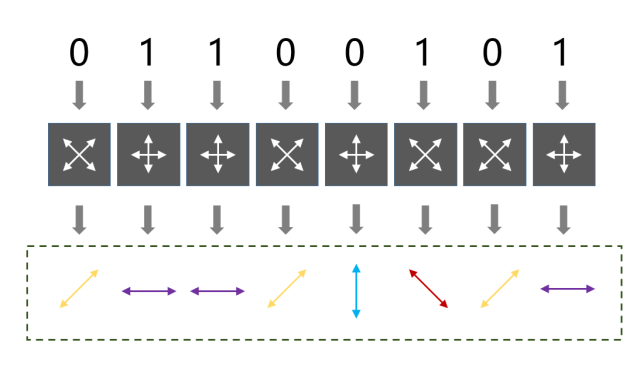

# 量子

* 能量是由确定数目的、彼此相等的、有限的能量包构成。
* 一个物理量存在最小的不可分割的基本单位，则这个物理量是量子化的，并把最小单位称为量子。
* “量子化”，指其物理量的数值是离散的，而不是连续地任意取值。
* 所谓量子通信是指利用量子纠缠效应进行信息传递的一种新型的通讯方式，是近二十年发展起来的新型交叉学科，是量子论和信息论相结合的新的研究领域。量子通信具有高效率和绝对安全等特点，是目前国际量子物理和信息科学的研究热点。
* 量子通信就是单模光纤两端加上能代替常用光模块功能的、光量子态的发送和接收设备，实现基于物理加密的保密通信。
* 量子纠缠证实了爱因斯坦的幽灵——超距作用的存在，它证实了任何两种物质之间，不管距离多远，都有可能相互影响，不受四维时空的约束，是非局域的，宇宙在冥冥之中存在深层次的内在联系。
* 1993年，美国科学家C.H.Bennett提出了量子通信(Quantum Teleportation)的概念。量子通信是由量子态携带信息的通信方式，它利用光子等基本粒子的量子纠缠原理实现保密通信过程。量子通信概念的提出，使爱因斯坦的“幽灵” ——量子纠缠效益开始真正发挥其真正的威力。
* 基于量子纠缠理论，提出了利用经典与量子相结合的方法实现量子隐形传送的方案，量子隐形传态不仅在物理学领域对人们认识与揭示自然界的神秘规律具有重要意义，而且可以用量子态作为信息载体，通过量子态的传送完成大容量信息的传输，实现原则上不可破译的量子保密通信。

## 量子通信Quantum Teleportation

* 量子密钥分发:利用量子的不可克隆性，对信息进行加密，属于解决密钥问题
    - 有了计算机、超级计算机，算力越来越强大，破解算法的速度也越来越快:RSA512算法在1999年就被破解；RSA768在2009年被破解；MD5和SHA-1两大密算也已告破
    - 无条件安全”的条件：
        + 密钥真随机且“只使用一次” 
        + 与明文等长且按位进行二进制异或操作
    - 原理：把密码以密钥的形式分配给信息的收发双方
        + 光子有两个偏振方向，而且相互垂直。单光子源每次生成的单个光子，可以生成水平垂直方向、对角方向
        + 测量基：选取“水平垂直”或“对角”的测量方式，对单光子源产生的单光子进行测量
        + 测量基（垂直的偏正对）和光子偏振方向（一个方向）一致，就可以得出结果。要么是1，要么是0。测量基和光子偏振方向偏45°，就不能得出准确的结果
        + 光子就会变化，偏振方向改变45°，那么就是1或0的概率各50%
        + 生成过程
            * 发送方（称为A），首先随机生成一组二进制比特（所谓的经典比特，0或1这种），对每1个比特，随机选择测量基，生成偏振光
            * 接收方（称为B），收到这些光子之后，随机选择测量基进行测量
            * 传统方式：对比双方的测量基。测量基相同的，该数据保留为最终的密钥。测量基不同的，该数据抛弃
            * 存在一个窃取者（称为C）。因为量子的不可克隆性，C没有办法复制光子，只能去抢在B之前进行测量（劫听）
            * C测量也要随机选择自己的测量基（对单个比特）
                - 有一半的概率和A选择一样的测量基（光子偏振方向无影响）
                - 有一半的概率，会导致光子改变偏振方向（偏45°），B的测量准确率肯定受影响
            * 有C的情况下，A和C之间采用相同测量基的概率是50%。B和C之间采用相同测量基的概率是50%。 所以，A和B之间拿出一小部分测量结果出来对比，有25%相同，可以判定一定有人在窃听。通信停止，当前信息作废
* 量子隐形传态”（quantumteleportation）:利用量子的纠缠态，来传输量子比特，利用量子纠缠态的量子通讯
    - 经典比特：在特定时刻只有特定的状态，要么0，要么1，所有的计算都按照经典的物理学规律进行。
    - 量子比特（qubit）：就是0和1的叠加态，值有无限个，可以是0和1这两个向量的所有可能的组合。 含有零个经典比特的信息
    - 量子纠缠：多粒子的一种叠加态，一对具有量子纠缠态的粒子，即使相隔极远，当其中一个状态改变时，另一个状态也会即刻发生相应改变。
        + 纠缠态中有一种，无论两个粒子相隔多远，只要没有外界干扰，当A粒子处于0态时，B粒子一定处于1态；反之，当A粒子处于1态时，B粒子一定处于0态。
        + 跨越空间的、瞬间影响双方的“量子纠缠”，曾经被爱因斯坦称为“鬼魅的超距作用”(spooky actionat a distance)。
        + EPR佯谬：任何空间上相互影响的速度都不能超过光速。2015年，荷兰物理学家做的最新的无漏洞贝尔不等式测量实验，基本宣告了爱因斯坦定域性原理的死刑。
    - 过程：通过量子纠缠把一个量子比特无损地从一个地点传到另一个地点
        + 制备一个纠缠粒子对。将粒子1发射到A点，粒子2发送至B点。
        + 在A点，另一个粒子3携带一个想要传输的量子比特Q。于是A点的粒子1和B点的粒子2对于粒子3一起会形成一个总的态。在A点同时测量粒子1和粒子3，得到一个测量结果。这个测量会使粒子1和粒子2的纠缠态坍缩掉，但同时粒子1和和粒子3却纠缠到了一起。
        + A点的一方利用经典信道（就是经典通讯方式，如电话或短信等）把自己的测量结果告诉B点一方。
        + B点的一方收到A点的测量结果后，就知道了B点的粒子2处于哪个态。只要对粒子2稍做一个简单的操作，它就会变成粒子3在测量前的状态。也就是粒子3携带的量子比特无损地从A点传输到了B点，而粒子3本身只留在A点，并没有到B点。
        + 由于第三步是经典信息传输而且不可忽略，因此它限制了整个量子隐形传态的速度，使得量子隐形传态的信息传输速度无法超过光速。
 * 量子比特传输将成为未来量子计算之间的量子通信方式，未来量子隐形传态和量子计算机终端可以构成纯粹的量子信息传输和处理系统，即量子互联网。

## 图书

* 量子力学的数学基础

## 人物

* 潘建伟
    - 长期从事量子光学、量子信息和量子力学基础问题检验等方面的研究，对量子通信等研究有创新性贡献，是该领域的国际著名学者。
     - 有关实现量子隐形传态的研究成果入选美国《科学》杂志“年度十大科技进展”，并同伦琴发现X射线、爱因斯坦建立相对论等影响世界的重大研究成果一起被《自然》杂志选为“百年物理学21篇经典论文”。
    - 正因为他，中国量子通信研究处于世界领先的地位。他个人和团队也因此收获了大量的荣誉。

## 参考

* [leap](https://cloud.dwavesys.com/leap)
