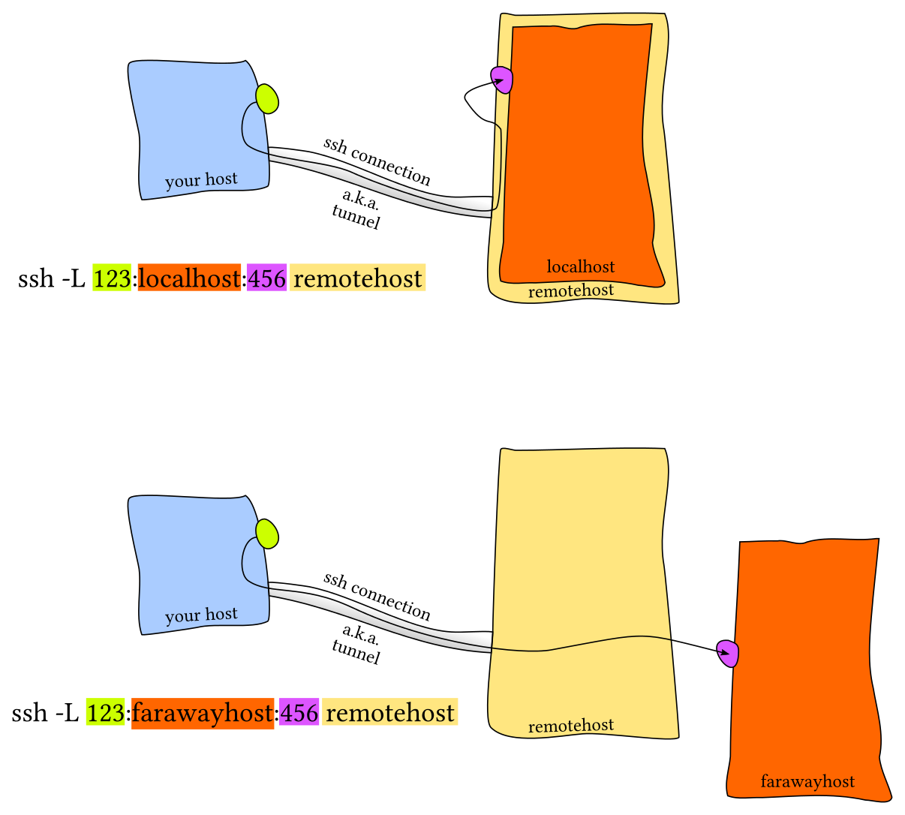

## [SSH](https://www.ssh.com/ssh/command/)

* 基于密钥验证是最安全的几个身份验证模式 使用OpenSSH,如普通密码和Kerberos票据。基于密钥的验证密码身份验证有几个优点,例如键值更难以蛮力,比普通密码或者猜测,提供充足的密钥长度。其他身份验证方法仅在非常特殊的情况下使用。
* SSH可以使用RSA(Rivest-Shamir-Adleman)或“DSA(数字签名算法)的钥匙。这两个被认为是最先进的算法,当SSH发明,但DSA已经被视为近年来更不安全。RSA是唯一推荐选择新钥匙,所以本指南使用RSA密钥”和“SSH密钥”可以互换使用。
* 基于密钥的验证使用两个密钥,一个“公共”键,任何人都可以看到,和另一个“私人”键,只有老板是允许的。安全通信使用的基于密钥的认证,需要创建一个密钥对,安全地存储私钥在电脑人想从登录,并存储公钥在电脑上一个想登录。
* 使用基于密钥登录使用ssh通常被认为是比使用普通安全密码登录。导的这个部分将解释的过程中生成的一组公共/私有RSA密钥,并将它们用于登录到你的Ubuntu电脑通过OpenSSH(s)。如果只有服务器也是不能实现一个完整的桌面环境的，当然还需要一个客户端
* 系统会试图通过DNS反查相对应的域名，如果DNS中没有这个IP的域名解析，则会等到DNS查询超时才会进行下一步
* SKM(SSH Key Manager):一个在命令行下帮助管理和切换多个SSH key的工具
* `ls -l /etc/init.d/sshd`
* ssh-keygen
  - -t rsa：指定密钥算法 RSA。
  - -b 4096：指定密钥的位数是4096位。安全性要求不高的场合，这个值可以小一点，但是不应小于1024。
  - -f ~/.ssh/user_ca：指定生成密钥的位置和文件名。
  - -C user_ca：指定密钥的识别字符串，相当于注释
  - -I：身份字符串，可以随便设置，相当于注释，方便区分证书，将来可以使用这个字符串撤销证书。
  - -h：指定该证书是服务器证书，而不是用户证书。
  - -n host.example.com：指定服务器的域名，表示证书仅对该域名有效。如果有多个域名，则使用逗号分隔。用户登录该域名服务器时，SSH 通过证书的这个值，分辨应该使用哪张证书发给用户，用来证明服务器的可信性。
    + user：指定用户名，表示证书仅对该用户名有效。如果有多个用户名，使用逗号分隔。用户以该用户名登录服务器时，SSH 通过这个值，分辨应该使用哪张证书，证明自己的身份，发给服务器
  - -V +52w：指定证书的有效期，这里为52周（一年）。默认情况下，证书是永远有效的。建议使用该参数指定有效期，并且有效期最好短一点，最长不超过52周。
  - ssh_host_rsa_key.pub：服务器公钥
  - -s：指定 CA 签发证书的密钥

## 安装

```sh
sudo apt install sshd
yum install openssh
service sshd restart
```

## 配置

* 客户端 `~/.ssh/config`
* 服务器侧 `/etc/ssh/sshd_config`
  - 修改PasswordAuthentication的值来禁用密码验证
  - 修改PermitRootLogin的值来禁用 root 登陆

```sh
# SSH配置文件 uncomment
authorizedKeyFile

service sshd restart

### 密钥生成
ssh-keygen -t rsa -b 4096
ssh-keygen -o -a 100 -t ed25519

ssh-copy-id <username>@<host> # install your public key to any user that you have login credentials for.
ssh-copy-id -i .ssh/id_ed25519.pub foobar@remote

chmod 700 ~/.ssh
chmod 600 ~/.ssh/authorized_keys

scp ~/.ssh/id_rsa.pub hadoop@192.168.1.134:~/
scp ~/.ssh/id_rsa.pub deploy@your_server_ip_address:

cat ~/id_rsa.pub >> ~/.ssh/authorized_keys
cat ~/.ssh/id_rsa.pub | ssh demo@198.51.100.0 "mkdir -p ~/.ssh && chmod 700 ~/.ssh && cat >>  ~/.ssh/authorized_keys"
cat .ssh/id_ed25519.pub | ssh foobar@remote 'cat >> ~/.ssh/authorized_keys'

# 传输文件
scp id_rsa.pub git@172.26.186.117:/home/git/
scp -P 1101 username@servername:/remote_path/filename  ~/local_destination   # 源文件  目标文件

## 服务器登陆
ssh -p 2222 user@host   # 登陆服务器
ssh username@remote_host ls /var/www
ssh -i ~/.ssh/my_key root@$YOU_SERVER_IP
# 查看连接过程
ssh -v root@192.168.75.136

# 服务端 /etc/ssh/sshd_config
PasswordAuthentication no  # Disable Password Authentication
PubkeyAuthentication yes
ChallengeResponseAuthentication no
# mux_client_request_session: read from master failed: Broken pipe
UseDNS no
service sshd restart

PermitRootLogin no|yes|without-password  ## restrict the root login to only be permitted via SSH keys, no:禁止root通过ssh登录

sudo systemctl reload sshd.service

# 客户端 ~/.ssh/config  复用  SSH 连接
Host *
    ControlMaster auto
    ControlPath /tmp/ssh_mux_%h_%p_%r
    ControlPersist 86400
    TCPKeepAlive=yes
    ServerAliveInterval=15
    ServerAliveCountMax=6
    StrictHostKeyChecking=no
    Compression=yes
    ForwardAgent=yes
```

## 证书登录

* 非证书登录缺点
  - 密码登录:需要输入服务器密码，非常麻烦，也不安全，存在被暴力破解的风险
  - 密钥登录:需要服务器保存用户的公钥，也需要用户保存服务器公钥的指纹。对于多用户、多服务器的大型机构很不方便，如果有员工离职，需要将他的公钥从每台服务器删除
* 证书登录
  - 引入了一个证书颁发机构（Certificate1 authority，简称 CA），对信任的服务器颁发服务器证书，对信任的用户颁发用户证书.登录时，用户和服务器不需要提前知道彼此的公钥，只需要交换各自的证书，验证是否可信即可。
  - 优点
    + 用户和服务器不用交换公钥，这更容易管理，也具有更好的可扩展性
    + 证书可以设置到期时间，而公钥没有到期时间
  - 流程
    + 没有证书，需要生成证书
      * 用户和服务器都将自己的公钥，发给 CA
      * CA 使用服务器公钥，生成服务器证书，发给服务器
      * CA 使用用户的公钥，生成用户证书，发给用户
    + 用户登录服务器时，SSH 自动将用户证书发给服务器。
    + 服务器检查用户证书是否有效，以及是否由可信的 CA 颁发。
    + SSH 自动将服务器证书发给用户。
    + 用户检查服务器证书是否有效，以及是否由信任的 CA 颁发。
    + 双方建立连接，服务器允许用户登录。
  - CA 至少需要两对密钥
    + 一对是签发用户证书的密钥，假设叫做user_ca
    + 另一对是签发服务器证书的密钥，假设叫做host_ca

```sh
# 生成 CA 签发用户证书的密钥
ssh-keygen -t rsa -b 4096 -f ~/.ssh/user_ca -C user_ca
sudo ssh-keygen -f /etc/ssh/ssh_host_rsa_key -b 4096 -t rsa
# 使用密钥host_ca为服务器的公钥ssh_host_rsa_key.pub签发服务器证书 会生成服务器证书ssh_host_rsa_key-cert.pub
ssh-keygen -s host_ca -I host.example.com -h -n host.example.com -V +52w ssh_host_rsa_key.pub
# 查看证书的细节
 ssh-keygen -L -f ssh_host_rsa_key-cert.pub
 chmod 600 ssh_host_rsa_key-cert.pub

# CA 签发用户证书
ssh-keygen -f ~/.ssh/user_key -b 4096 -t rsa
# 将用户公钥user_key.pub，上传或复制到 CA 服务器。使用 CA 的密钥user_ca为用户公钥user_key.pub签发用户证书
ssh-keygen -s user_ca -I user@example.com -n user -V +1d user_key.pub
# 查看证书的细节。
ssh-keygen -L -f user_key-cert.pub
chmod 600 user_key-cert.pub

# 服务器安装证书
scp ~/.ssh/ssh_host_rsa_key-cert.pub root@host.example.com:/etc/ssh/
# 添加到服务器配置文件/etc/ssh/sshd_config。
HostCertificate /etc/ssh/ssh_host_rsa_key-cert.pub
sudo systemctl restart sshd
sudo service sshd restart

# 将 CA 签发用户证书的公钥user_ca.pub，拷贝到服务器
scp ~/.ssh/user_ca.pub root@host.example.com:/etc/ssh/
# 添加到服务器配置文件/etc/ssh/sshd_config。
TrustedUserCAKeys /etc/ssh/user_ca.pub

# 客户端安装 CA 公钥
# ssh_known_hosts或known_hosts
@cert-authority *.example.com ssh-rsa AAAAB3Nz...XNRM1EX2gQ==

ssh -i ~/.ssh/user_key user@host.example.com

# 用户证书的废除，需要在服务器新建一个/etc/ssh/revoked_keys文件，然后在配置文件sshd_config添加
RevokedKeys /etc/ssh/revoked_keys
ssh-keygen -kf /etc/ssh/revoked_keys -z 1 ~/.ssh/user1_key.pub # -z参数用来指定用户公钥保存在revoked_keys文件的哪一行
```

## Git commit with gpg

```sh
gpg --full-generate-key  # 邮箱需要验证
gpg --list-secret-keys --keyid-format LONG

/Users/hubot/.gnupg/secring.gpg
------------------------------------
sec   4096R/3AA5C34371567BD2 2016-03-10 [expires: 2017-03-10]
uid                          Hubot
ssb   4096R/42B317FD4BA89E7A 2016-03-10

gpg --armor --export 42B317FD4BA89E7A # add github setting gpg


git config --global user.signingkey 3AA5C34371567BD2
git config --global commit.gpgsign true
git commit -S -m your commit message
```

## 免密码登录 Passwordless Authentication Using SSH

* `~/.ssh/authorized_keys` 存放远程免密登录的公钥,主要通过这个文件记录多台机器的公钥
* `~/.ssh/id_rsa` 生成的私钥文件
* `~/.ssh/id_rsa.pub` 生成的公钥文件
* `~/.ssh/know_hosts` 已知的主机公钥清单
* 如果希望ssh公钥生效需满足至少下面两个条件
  - `.ssh`目录的权限必须是700
  - `.ssh/authorized_keys`文件权限必须是600

```sh
ssh-keygen -t rsa # 生成.ssh文件目录

ssh-copy-id test_host@40.343.45.77
ssh-copy-id -i ~/.ssh/id_rsa.pub <romte_ip>
scp -p ~/.ssh/id_rsa.pub root@<remote_ip>:/root/.ssh/authorized_keys
# 将文件拷贝至远程服务器
scp ~/.ssh/id_rsa.pub root@<remote_ip>:pub_key

cat ~/.ssh/id_rsa.pub >> ~/.ssh/authorized_keys
chmod 600 ~/.ssh/authorized_keys

# 将内容追加到authorized_keys文件中， 不过要登录远程服务器来执行这条命令
cat ~/pub_key >>~/.ssh/authorized_keys

# 通过ansible,将需要做免密操作的机器hosts添加到/etc/ansible/hosts下：
[Avoid close]
192.168.91.132
192.168.91.133
192.168.91.134

ansible <groupname> -m authorized_key -a "user=root key='{{ lookup('file','/root/.ssh/id_rsa.pub') }}'" -k

# have SSH host keys for those IPs in your ~/.ssh/known_hosts
ssh-keygen -R <IP_ADDRESS>

ssh \<user>@\<hostname/hostip> \<command>
```

```sh
openssl aes-256-cbc -salt -in {源文件名} -out {加密文件名}
openssl aes-256-cbc -d -in {加密文件名} -out {解密文件名}
```

## [ssh-agent](https://www.ssh.com/ssh/agent)

## 命令行代理

```sh
sudo apt install proxychains

#/etc/proxychains.conf add
socks5 127.0.0.1 7891

proxychains curl google.com
```

## 端口转发 port forwarding

* -L Specifies that the given port on the local (client) host is to be forwarded to the given host and port on the remote side `ssh -L sourcePort:forwardToHost:onPort connectToHost`
  - connect with ssh to connectToHost
  - forward all connection attempts to the local sourcePort to port onPort on the machine called forwardToHost, which can be reached from the connectToHost machine.
* -R Specifies that the given port on the remote (server) host is to be forwarded to the given host and port on the local side `ssh -R sourcePort:forwardToHost:onPort connectToHost`
  - connect with ssh to connectToHost, and forward all connection attempts to the remote sourcePort to port onPort on the machine called forwardToHost, which can be reached from your local machine.
* 实验
  - 使用 ssh-copy-id vm 将您的 ssh 密钥拷贝到服务器。
  - 使用python -m http.server 8888 在您的虚拟机中启动一个 Web 服务器并通过本机的http://localhost:9999 访问虚拟机上的 Web 服务器
  - 使用sudo vim /etc/ssh/sshd_config 编辑 SSH 服务器配置，通过修改PasswordAuthentication的值来禁用密码验证。通过修改PermitRootLogin的值来禁用 root 登陆。然后使用sudo service sshd restart重启 ssh 服务器，然后重新尝试。

```sh
ssh -L 123:localhost:456 remotehost
ssh -L 123:farawayhost:456 remotehost
# connects to your computer with a webbrowser, he gets the response of the webserver running on SUPERSERVER. You, on your local machine, have no webserver running.
ssh -L 80:localhost:80 SUPERSERVER

# connects to the small and slow server with a webbrowser, he gets the response of the webserver running on your local machine. The tinyserver, which has not enough diskspace for the big website, has no webserver running. But people connecting to tinyserver think so.
ssh -R 80:localhost:80 tinyserver

alias my_server="ssh -i ~/.id_ed25519 --port 2222 -L 9999:localhost:8888 foobar@remote_server"

# ~/.ssh/config
Host vm
    User foobar
    HostName 172.16.174.141
    Port 2222
    IdentityFile ~/.ssh/id_ed25519
    LocalForward 9999 localhost:8888

# 在配置文件中也可以使用通配符
Host *.mit.edu
    User foobaz

# 方法一
ssh 目标机器登录用户@目标机器IP -p 目标机器端口 -o ProxyCommand='ssh -p 跳板机端口 跳板机登录用户@跳板机IP -W %h:%p'

# 在 $HOME/.ssh 目录下建立/修改文件 config
Host tiaoban   #任意名字，随便使用
    HostName 192.168.1.1   #这个是跳板机的IP，支持域名
    Port 22      #跳板机端口
    User username_tiaoban       #跳板机用户

Host nginx      #同样，任意名字，随便起
    HostName 192.168.1.2  #真正登陆的服务器，不支持域名必须IP地址
    Port 22   #服务器的端口
    User username   #服务器的用户
    ProxyCommand ssh username_tiaoban@tiaoban -W %h:%p

Host 10.10.0.*      #可以用*通配符
    Port 22   #服务器的端口
    User username   #服务器的用户
    ProxyCommand ssh username_tiaoban@tiaoban -W %h:%p
```




