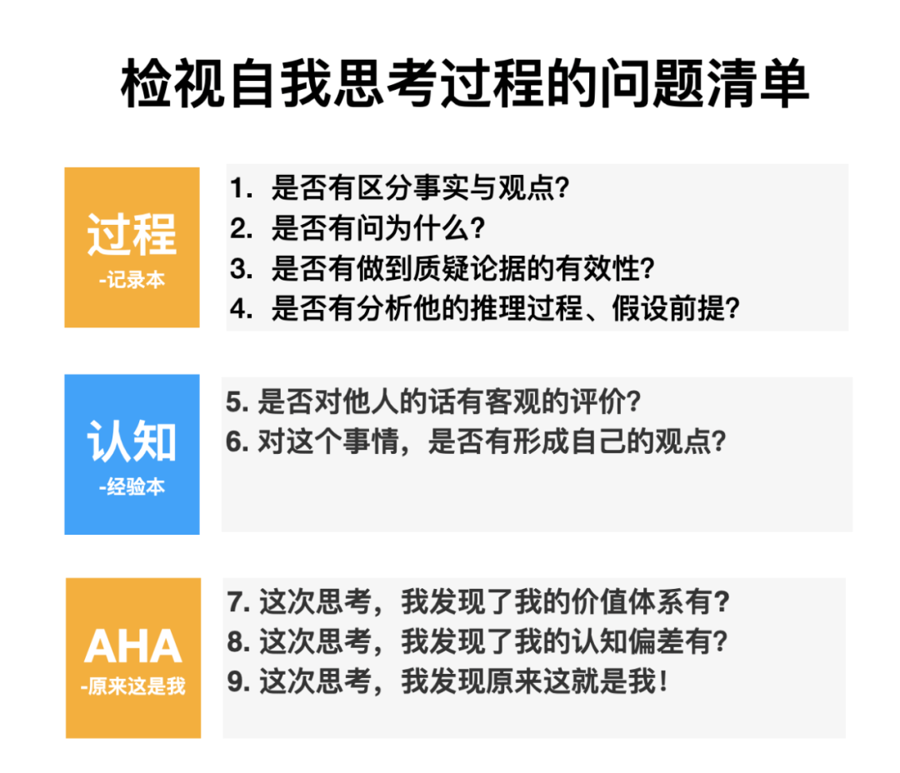

# 学会提问

## 批判性思维

* 对思考的再思考，它关注的是对方提出某些观点背后的思考过程，找出哪些是合理的，哪些是不合理。
    - 一套相互关联、环环相扣的关键问题意识
    - 一种恰如其分提出和回答关键问题的能力
    - 一个积极主动利用关键问题的愿望

## 方法

* 改变思维方式
    - 海绵式思维：像海绵一样尽可能多的吸收所有知识，并且保证滴水不漏，它强调获取信息，重点在于记忆和理解内容
        + 好处是吸收的越多，海绵中的知识就越多，就越能体会到世界的千头万绪，为日后进行复杂的思考积累基础。它的心理加工是大脑的注意和记忆。
        + 问题就在于它是块海绵，工作模式是被动的。海绵式思维在学习和思考的时候并不需要自己本身的发力去冥思苦想，因为它的一切宗旨是先吸收了再说，多了总是好的。
        + 要发挥作用则是需要外部动力去挤压的，一旦没有外部力量，海绵自身吸收的会越来越大，就导致只有搜集信息的能力却没有处理、判断、识别信息的能力。如果长时间依赖海绵式思维，那么就会形成像小明这样读到什么接收到什么，进而相信什么的习惯。各种认知税就这么交了出去，并且越交会越觉得有问题，又会拼命的寻找新的知识，陷入恶性循环。
    - 淘金式思维：像矿工在淘金，筛掉泥沙，把金子找出来变为己有。它强调在获取知识的过程中要仔细琢磨，提出自己的质疑，然后对接收的信息和观点做出取舍和判别，找出真正有用的。TA总是爱问为什么，总会问各种的问题，提出自己的思考。
        + 主动的，需要打造自己的工具，主动去判断和评价所见所闻的真相，找到合适的为你所用。
    - 两种思维并非互相排斥，因为得先有了一些知识才开始淘金。但是，很明显这两种思维模式中淘金式思维更主动的调动大脑，展开互动，提出问题，质疑评价，不断内化和积累自己的飞轮，是一个更有效的方式。这种思维模式也就是批判性思维。**激发批判性思考的第一步就是要改变思维方式，从海绵式思维切换到淘金式思维。**
* 使用检视问题清单
    - 训练思维的最好方式就是有目的的不断思考。苏格拉底的问答法是激发批判性思考的最有效方式，在不断提问和回答的过程获得对大脑的强化训练和灵感
    - 从论题、推理逻辑、证据效力、结论四个角度向对方提问TA的思考过程
    - 复盘自己的思考过程，向你自己提问在刚才的过程中是否有遵循淘金式思维的思考和质疑、询问和评价、为自己淘到金子和舍弃泥沙的过程。同时，对这些问题清单不断迭代，积累错题本经验本，持续升级固化。
* 寻找良师益友
    - 思维之所以难以训练是因为它改变的是对思考结构的再思考。要了解你对于思考的思考，至少需要在你的认知或心智中建构两个角色：执行者和检查者
    - 寻找一些可以探讨此类问题的老师或同行中人，借用外脑的作用，激发我的思考，避免长期陷入思维的死胡同。与此同时，这种社交式的对话还会促进对问题思考的深度和广度，进入新一轮淘金的开始，颇为”养脑“。
* 培养匹配的价值观倾向
    - 《学会提问》中明确的指出批判性思维的最大障碍在于你的价值观倾向。**任何人之间的互动到底怎么样起作用，取决于你的价值观，以及你从那些互动人士身上体会到的价值观。**
    - 修炼批判性思维的目的是能客观看待信息，理智的去工作和决策
    - 实际上作为一个社会人，我们又如何阻拦得住行为的诚实表达：只愿与我们有相同价值观的人相处和交流。这也就导致了最大的挑战是如何去理解那些和我们的价值观背道而驰的人的分析推理方式。反过来，在与思维对话的路上，我们又只愿听取那些和我们价值观取向相似的人的观点，这就给批判性思维的训练带来了双层的阻力
    - 从底层逻辑去修正上层建筑以达到更好的效果。这些价值观倾向会提醒我们去关注生活在对角线的他们的思考。这些价值观包括：
        + 自主性：主动形成自己的结论，还要主动从更加广阔的范围内听取意见，包括那些与我们价值观取向不一样的人和观点，从而做出更加好的选择。
        + 好奇心：兼听博观。要想成为一个批判性思考的人，你需要对自己遇到的一切不断地提问，只要他们的观点符合批判性思维的检查列表，就需要去接纳和吸收，从而可以将你从当前偏听偏信的状态中彻底解放，做到真正意义上兼听和博观。
        + 谦恭有礼：“我唯一所知的就是我一无所知。-苏格拉底”。随着时间的延伸，就会越感知到自己的无知。对世界、对生命、对系统规则的认怂与臣服是早晚的事，你只不过是按照规则在系统中运行的一个粒子，他也是。谦恭的意识会让我们刻意的避免批判性思维最大的障碍：相信凡与自己意见相左的人都是立场狭隘，而自己则立场公正。
        + 以理服人：观点和结论不同，我们需要倾听他人的声音，我们也需要理性决策。论据可靠有效、论证过程逻辑严谨。不论怎样，都要有理有据。这是批判性思维的核心。
* 学习批判性思维的目的不在于批判对方，而在于对双方思考过程的审视。通过改变思维方式、问对问题、与良师益友的促膝交谈、以及培养价值观倾向，可以促进有效的沟通和理智的决策，让你的思考越来越有洞见。当我们有能力去拒绝一个观点的时候，才是真正理解它的开始。

