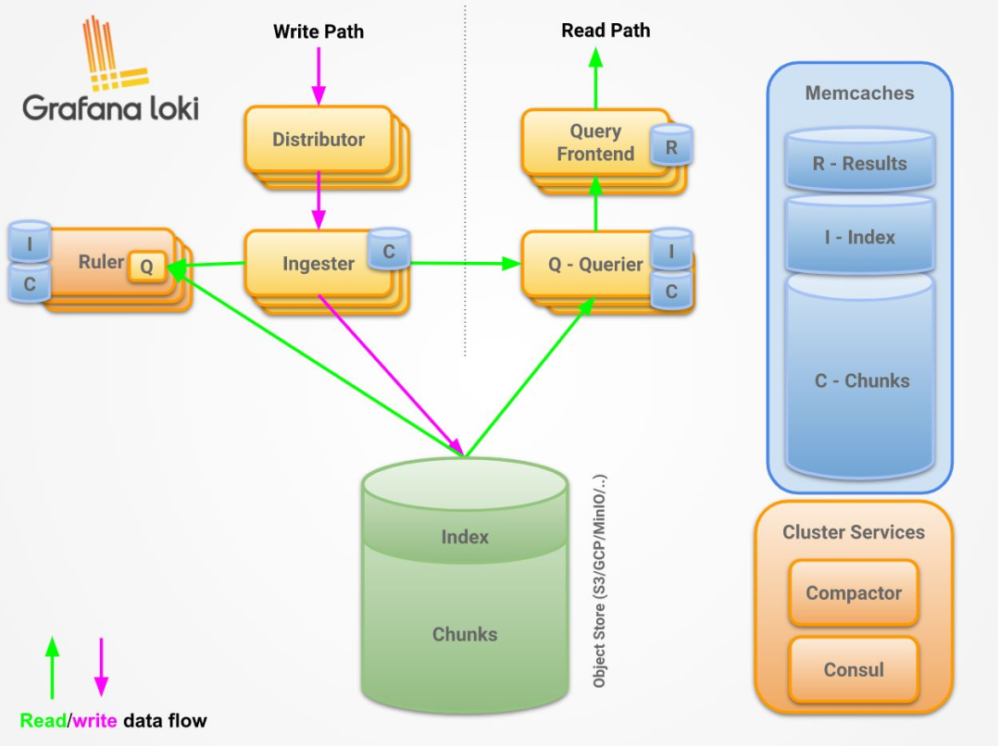

# [Loki](https://github.com/grafana/loki)

* Like Prometheus, but for logs. https://grafana.com/loki
* Grafana Loki is a set of components that can be composed into a fully featured logging stack.
* Unlike other logging systems, Loki is built around the idea of only indexing metadata about your logs: labels (just like Prometheus labels). Log data itself is then compressed and stored in chunks in object stores such as S3 or GCS, or even locally on the filesystem. A small index and highly compressed chunks simplifies the operation and significantly lowers the cost of Loki.
* 特性：
  - 不对日志进行全文索引。通过存储压缩非结构化日志和仅索引元数据，Loki 操作起来会更简单，更省成本。
  - 通过使用与 Prometheus 相同的标签记录流对日志进行索引和分组，这使得日志的扩展和操作效率更高。
  - 特别适合储存 Kubernetes Pod 日志; 诸如 Pod 标签之类的元数据会被自动删除和编入索引。
  - 受 Grafana 原生支持。
* 使用与prometheus相同的服务发现和标签重新标记库,编写pormtail,在k8s中promtail以daemonset方式运行在每个节点中，通过kubernetes api等到日志的正确元数据，并将它们发送到Loki
* vs es
  - loki 只对标签进行索引而不对内容索引,大幅降低索引资源开销

## 架构

* promtail 作为采集器，类比 filebeat,负责收集日志并将其发送给 Loki
* loki 相当于服务端，类比 es，负责存储日志和处理查询
  - loki 进程包含四种角色,可以通过 loki 二进制的 -target 参数指定运行角色
    + querier 查询器
    + ingester 日志存储器
    + query-frontend 前置查询器
    + distributor 写入分发器
* Grafana 用于 UI 展示



## 原理

* read path
  - 查询器接收 HTTP / 1 数据请求。
  - 查询器将查询传递给所有 ingesters 请求内存中的数据。
  - 接收器接收读取的请求，并返回与查询匹配的数据（如果有）。
  - 如果没有接收者返回数据，则查询器会从后备存储中延迟加载数据并对其执行查询。
  - 查询器将迭代所有接收到的数据并进行重复数据删除，从而通过 HTTP / 1 连接返回最终数据集。
* write path
  - 分发服务器收到一个 HTTP / 1 请求，以存储流数据。
  - 每个流都使用散列环散列。
  - 分发程序将每个流发送到适当的 inester 和其副本（基于配置的复制因子）。
  - 每个实例将为流的数据创建一个块或将其追加到现有块中。每个租户和每个标签集的块都是唯一的。
  - 分发服务器通过 HTTP / 1 连接以成功代码作为响应。

* Distributor 接收日志组件
  - 由于日志的写入量可能很大，所以不能在它们传入时将它们写入数据库,需要批处理和压缩数据
  - 通过一致性哈希分配　logstream to an ingester
* ingester接收到日志并开始构建chunk
  - 将日志进行压缩并附加到chunk上面。一旦chunk“填满”（数据达到一定数量或者过了一定期限），ingester将其刷新到数据库。对块和索引使用单独的数据库，因为存储的数据类型不同
  - 通过构建压缩数据块来实现这一点，方法是在日志进入时对其进行gzip操作，组件ingester是一个有状态的组件，负责构建和刷新chunck，当chunk达到一定的数量或者时间后，刷新到存储中去。每个流的日志对应一个ingester,当日志到达Distributor后，根据元数据和hash算法计算出应该到哪个ingester上面
  - 为了冗余和弹性，将其复制n（默认情况下为3）次
  - 刷新一个chunk之后，ingester然后创建一个新的空chunk并将新条目添加到该chunk中
  
  - 索引存储
    + 可以是cassandra/bigtable/dynamodb，而chuncks可以是各种对象存储，Querier和Distributor都是无状态的组件。
    + 对于ingester虽然是有状态的但是，当新的节点加入或者减少，整节点间的chunk会重新分配，已适应新的散列环。
    + Loki底层存储的实现Cortex已经在实际的生产中投入使用多年了

## 安装

* 安装 promtail 和 loki 
* 在 grafana explore 上配置查看日志
  - 查看日志 `rate({job="message"} |="kubelet"`
  - 算 qps `rate({job="message"} |="kubelet" [1m])`

```sh
# 下载 promtail 和 loki 二进制
wget  https://github.com/grafana/loki/releases/download/v2.2.1/loki-linux-amd64.zip
wget https://github.com/grafana/loki/releases/download/v2.2.1/promtail-linux-amd64.zi
```

```sh
# 安装 promtail
mkdir /opt/app/{promtail,loki} -pv

# promtail配置文件
cat <<EOF> /opt/app/promtail/promtail.yaml
server:
  http_listen_port: 9080
  grpc_listen_port: 0

positions:
  filename: /var/log/positions.yaml # This location needs to be writeable by promtail.

client:
  url: http://localhost:3100/loki/api/v1/push

scrape_configs:
 - job_name: system
   pipeline_stages:
   static_configs:
   - targets:
      - localhost
     labels:
      job: varlogs  # A `job` label is fairly standard in prometheus and useful for linking metrics and logs.
      host: yourhost # A `host` label will help identify logs from this machine vs others
      __path__: /var/log/*.log  # The path matching uses a third party library: https://github.com/bmatcuk/doublestar
EOF

# service文件
cat <<EOF >/etc/systemd/system/promtail.service
[Unit]
Description=promtail server
Wants=network-online.target
After=network-online.target

[Service]
ExecStart=/opt/app/promtail/promtail -config.file=/opt/app/promtail/promtail.yaml
StandardOutput=syslog
StandardError=syslog
SyslogIdentifier=promtail
[Install]
WantedBy=default.target
EOF

systemctl daemon-reload
systemctl restart promtail
systemctl status promtail
```

```sh
## 安装 loki
mkdir /opt/app/{promtail,loki} -pv

# promtail配置文件
cat <<EOF> /opt/app/loki/loki.yaml
auth_enabled: false

server:
  http_listen_port: 3100
  grpc_listen_port: 9096

ingester:
  wal:
    enabled: true
    dir: /opt/app/loki/wal
  lifecycler:
    address: 127.0.0.1
    ring:
      kvstore:
        store: inmemory
      replication_factor: 1
    final_sleep: 0s
  chunk_idle_period: 1h       # Any chunk not receiving new logs in this time will be flushed
  max_chunk_age: 1h           # All chunks will be flushed when they hit this age, default is 1h
  chunk_target_size: 1048576  # Loki will attempt to build chunks up to 1.5MB, flushing first if chunk_idle_period or max_chunk_age is reached first
  chunk_retain_period: 30s    # Must be greater than index read cache TTL if using an index cache (Default index read cache TTL is 5m)
  max_transfer_retries: 0     # Chunk transfers disabled

schema_config:
  configs:
    - from: 2020-10-24
      store: boltdb-shipper
      object_store: filesystem
      schema: v11
      index:
        prefix: index_
        period: 24h

storage_config:
  boltdb_shipper:
    active_index_directory: /opt/app/loki/boltdb-shipper-active
    cache_location: /opt/app/loki/boltdb-shipper-cache
    cache_ttl: 24h         # Can be increased for faster performance over longer query periods, uses more disk space
    shared_store: filesystem
  filesystem:
    directory: /opt/app/loki/chunks

compactor:
  working_directory: /opt/app/loki/boltdb-shipper-compactor
  shared_store: filesystem

limits_config:
  reject_old_samples: true
  reject_old_samples_max_age: 168h

chunk_store_config:
  max_look_back_period: 0s

table_manager:
  retention_deletes_enabled: false
  retention_period: 0s

ruler:
  storage:
    type: local
    local:
      directory: /opt/app/loki/rules
  rule_path: /opt/app/loki/rules-temp
  alertmanager_url: http://localhost:9093
  ring:
    kvstore:
      store: inmemory
  enable_api: true
EOF

# service文件

cat <<EOF >/etc/systemd/system/loki.service
[Unit]
Description=loki server
Wants=network-online.target
After=network-online.target

[Service]
ExecStart=/opt/app/loki/loki -config.file=/opt/app/loki/loki.yaml
StandardOutput=syslog
StandardError=syslog
SyslogIdentifier=loki
[Install]
WantedBy=default.target
EOF

systemctl daemon-reload
systemctl restart loki
systemctl status loki
```

## 采集配置

* 标签匹配模式
  - 和 prometheus 一致，相同标签对应一个流 prometheus 处理 series 的模式
  - prometheus 中标签一致对应的同一个 hash 值和 refid(正整数递增的 id)，也就是同一个 series
  - 时序数据不断的 append 追加到这个 memseries 中
  - 当有任意标签发生变化时会产生新的 hash 值和 refid，对应新的 series
* loki 处理日志的模式和 prometheus 一致
  - loki 一组标签值会生成一个 stream
  - 日志随着时间的递增会追加到这个 stream 中，最后压缩为 chunk 
  - 当有任意标签发生变化时会产生新的 hash 值，对应新的 stream
* 静态标签匹配模式
  - 先根据标签算出 hash 值在倒排索引中找到对应的 chunk,根据标签算哈希在倒排中查找 id，对应找到存储的块在 prometheus 中已经被验证过了
  - 再根据查询语句中的关键词等进行过滤，这样能大大的提速
  - 开销低,速度快
  - 查询的时候可以使用和 prometheus 一样的标签匹配语句进行查询
    + 如果配置了两个 job，则可以使用{job=~”apache|syslog”} 进行多 job 匹配
    + 同时也支持正则和正则非匹配

```yaml
# 静态标签匹配模式
scrape_configs:
 - job_name: system
   pipeline_stages:
   static_configs:
   - targets:
      - localhost
     labels:
      job: syslog
      __path__: /var/log/syslog

 - job_name: system
   pipeline_stages:
   static_configs:
   - targets:
      - localhost
     labels:
      job: apache
      __path__: /var/log/apache.log
```

* 动态标签：标签 value 不固定
  - promtail 支持在 pipline_stages 中用正则匹配动态标签
  - 使用 regex 想要匹配 action和status_code两个标签
  - 对应 action=get/post 和 status_code=200/400 则对应 4 个流
  - 那四个日志行将变成四个单独的流，并开始填充四个单独的块。
  - 如果出现另一个独特的标签组合（例如 status_code =“500”），则会创建另一个新流
  
```yaml
1.11.11.11 - frank [25/Jan/2000:14:00:01 -0500] "GET /1986.js HTTP/1.1" 200 932 "-" "Mozilla/5.0 (Windows; U; Windows NT 5.1; de; rv:1.9.1.7) Gecko/20091221 Firefox/3.5.7 GTB6"

- job_name: system
   pipeline_stages:
      - regex:
        expression: "^(?P<ip>\\S+) (?P<identd>\\S+) (?P<user>\\S+) \\[(?P<timestamp>[\\w:/]+\\s[+\\-]\\d{4})\\] \"(?P<action>\\S+)\\s?(?P<path>\\S+)?\\s?(?P<protocol>\\S+)?\" (?P<status_code>\\d{3}|-) (?P<size>\\d+|-)\\s?\"?(?P<referer>[^\"]*)\"?\\s?\"?(?P<useragent>[^\"]*)?\"?$"
    - labels:
        action:
        status_code:
   static_configs:
   - targets:
      - localhost
     labels:
      job: apache
      env: dev
      __path__: /var/log/apache.log
```

* 高基数标签：标签的 value 可能性太多了，达到 10 万，100 万甚至更多
  - 设置了标签 ip，来自用户的每个不同的 ip 请求不仅成为唯一的流，快速生成成千上万的流，这是高基数，这可以杀死 Loki
  - 为了避免高基数则应该避免使用这种取值分位太大的标签

## 查询

* 加速查询没有标签的字段 `{job="apache"} |= "11.11.11.11"`
* Querier:负责给定一个时间范围和标签选择器，Querier查看索引以确定哪些块匹配，并通过greps将结果显示出来
  - 还从Ingester获取尚未刷新的最新数据
  - 对于每个查询，一个查询器将显示所有相关日志
  - 为弥补没有全文索引带来的查询降速使用，Loki 将把查询分解成较小的分片，实现查询并行化，提供分布式grep，使即使是大型查询也是足够的
* 查询时的分片 (按时间范围分段 grep)
  - Loki 将把查询分解成较小的分片，并为与标签匹配的流打开每个区块，并开始寻找该 IP 地址。
  - 这些分片的大小和并行化的数量是可配置的，并取决于您提供的资源
  - 如果需要，可以将分片间隔配置为 5m，部署 20 个查询器，并在几秒钟内处理千兆字节的日志
  - 或者，可以发疯并设置 200 个查询器并处理 TB 的日志！
* 在日志量少的时候少加标签
  - 因为每多加载一个 chunk 就有额外的开销
  - 举例 如果该查询是 {app="loki",level!="debug"}
  - 在没加 level 标签的情况下只需加载一个 chunk 即 app="loki" 的标签
  - 如果加了 level 的情况，则需要把 level=info,warn,error,critical 5 个 chunk 都加载再查询
* 在需要标签时再去添加
  - 当 chunk_target_size=1MB 时代表 以 1MB 的压缩大小来切割块
  - 对应的原始日志大小在 5MB-10MB，如果日志在 max_chunk_age 时间内能达到 10MB，考虑添加标签
* 日志应当按时间递增
  - 这个问题和 tsdb 中处理旧数据是一样的道理
  - 目前 loki 为了性能考虑直接拒绝掉旧数据
