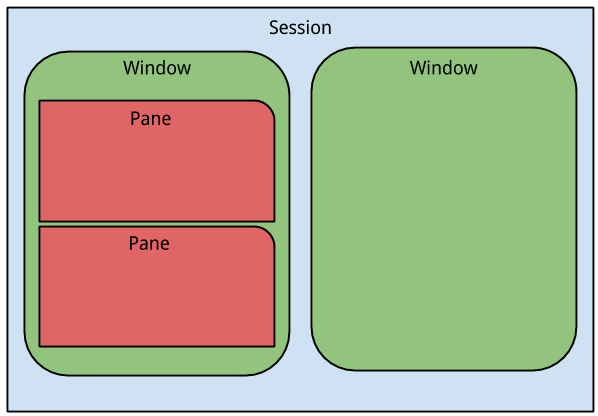

# [tmux](https://github.com/tmux/tmux)

* a terminal multiplexer: it enables a number of terminals to be created, accessed, and controlled from a single screen. tmux may be detached from a screen and continue running in the background, then later reattached.
* 终端多路复用器,可以将多个终端连接到单个终端会话，使它们保持同步
* 可以在一个终端中进行程序之间的切换，添加分屏窗格
* 基于面板和标签分割出多个终端窗口，可以同时与多个 shell 会话进行交互
* 在远程服务器上工作时，Tmux 特别有用，可以创建新的选项卡，然后在选项卡之间切换
* 通过一个终端登录远程主机并运行tmux后，在其中可以开启多个控制台而无需再“浪费”多余的终端来连接这台远程主机
* 基于session概念的多终端窗口管理功能:用户随时可以通过命令行恢复上次会话
  - 分离当前终端会话并在将来重新连接

## 安装

```sh
sudo apt-get|yum|brew install tmux

tmux # into 底部有一个状态栏。状态栏的左侧是窗口信息（编号和名称），右侧是系统信息
```

## 配置

* [.tmux](https://github.com/gpakosz/.tmux)  🇫🇷 Oh My Tmux! Pretty & versatile tmux configuration made with ❤️

```sh
touch ~/.tmux.conf # 新建用户配置文件

set -g mode-mouse on # 开启鼠标模式
set -g mouse-select-pane on # 允许鼠标选择窗格
set-option -g allow-rename off # 如果喜欢给窗口自定义命名，那么需要关闭窗口的自动命名
set-window-option -g mode-keys vi  # 如果对 vim 比较熟悉，可以将 copy mode 的快捷键换成 vi 模式
tmux kill-server

tmux source ~/.tmux.conf

cd
git clone https://github.com/gpakosz/.tmux.git
ln -s -f .tmux/.tmux.conf
cp .tmux/.tmux.conf.local .
```

## 使用

* 快捷键:类似 <C-b> x 这样的组合，即需要先按下Ctrl+b，松开后再按下 x,下面快捷键省略<C-b>
* 通过`tmux`进入界面，在开启tmux服务器后， 新建一个 tmux 的会话（session），而这个会话会首先创建一个窗口，其中仅包含一个面板.退出exit
* session->windows->panel
  - 命令行典型方式:打开一个终端窗口（terminal window，以下简称"窗口"），在里面输入命令。用户与计算机的这种临时的交互，称为一次"会话"（session）
    + 开启一个默认Window（窗口）。Tmux中可以拥有多个会话，多个会话之间可以来回无缝切换
    + 窗口与其中启动的进程是连在一起的。打开窗口，会话开始；关闭窗口，会话结束
    + 会话与窗口可以"解绑"：窗口关闭时，会话并不终止，而是继续运行，等到以后需要的时候，再让会话"绑定"其他窗口
  - 终端复用器（terminal multiplexer）在需要经常登录远程服务器工作的时候会很有用，可以保持远程登录的会话，还可以在一个窗口中查看多个 shell 的状态，替代screen、nohup
    + 允许在单个窗口中，同时访问多个会话。这对于同时运行多个命令行程序很有用
    + 可以让新窗口"接入"已经存在的会话
    + 允许每个会话有多个连接窗口，因此可以多人实时共享会话
    + 支持窗口任意的垂直和水平拆分
    + 在服务端运行Tmux，方便保存窗口和各种会话
    + 在本地终端运行，方便日常程序开发
  - Sessions are for an overall theme, such as work, or experimentation, or sysadmin.
  - Windows are for projects within that theme. So perhaps within your experimentation session you have a window titled noderestapi, and one titled lua sample.
  - Panes are for views within your current project. So within your sysadmin session, which has a logs window, you may have a few panes for access logs, error logs, and system logs.
    + 对window进行任意分割，由window分割出来的单位就叫做panel了
* 状态
  - [0] 是 tmux 服务器创建的第一个会话。编号从 0 开始。tmux 服务器会跟踪所有的会话确认其是否存活。
  - 0:testuser@scarlett:~ – 有关该会话的第一个窗口的信息。编号从 0 开始。这表示窗口的活动窗格中的终端归主机名 scarlett 中 testuser 用户所有。当前目录是 ~ (家目录)
  - – 显示目前在此窗口中
  - “scarlett.internal.fri” – 正在使用的 tmux 服务器的主机名
  - session-name:windowid
* 快捷键都要通过前缀键唤起激活控制台。默认前缀键 <prefix> 是 Ctrl+b(⌃b <C-b>)
  - 列出所有快捷键 tmux list-keys
  - 列出所有命令及其参数:tmux list-commands
  - 列出当前所有会话信息 tmux info
  - 重新加载配置 tmux source-file ~/.tmux.conf
* 系统操作
  - <C-b> ? 列出所有快捷键；按q返回
  - <C-b> D 选择要脱离会话；在同时开启了多个会话时使用
  - Ctrl+z 挂起当前会话
  - <C-b> r 强制重绘未脱离会话
  - <C-b> s 选择并切换会话；在同时开启了多个会话时使用
  - ::进入命令行模式；此时可以输入支持的命令，例如kill-server可以关闭服务器
  - <C-b> [ 进入复制模式；此时的操作与vi/emacs相同，按q/Esc退出
  - <C-b> ~ 列出提示信息缓存；包含之前tmux返回的各种提示信息



## 会话 session

* 每个会话都是一个独立的工作区，其中包含一个或多个窗口
* 新建
  - tmux 开始一个新会话
  - tmux new -s <session-name> 以指定名称开始一个新的会话
  - :new
* tmux ls|<C-b> s 列出所有会话 show existing sessions
* tmux detach|<C-b> d 将当前会话分离，退出 tmux 进程，返回至 shell 主进程 detaching from a session, tmux attach 能够重新进入之前的会话
* tmux attach -t <session-name>|id 重新连接指定会话 attaching to an existing session
* tmux a 重新连接最后一个会话
* tmux kill-session -t <session-name>
* tmux switch -t <session-name>
* tmux rename-session -t 0 <new-name>|<C-b> $

## 窗口 window

* 相当于编辑器或是浏览器中的标签页，从视觉上将一个会话分割为多个部分
* 第一个启动 Tmux 窗口，编号是0，第二个窗口的编号是1，以此类推
* 新建
  - `tmux new-window -n <window-name>`
  - <C-b> c
* `<C-d> &` 关闭
* <C-b> N  0 to 9 select windows 0 through 9 跳转到第 N 个窗口
* `<C-b> p` 切换到前一个窗口
* `<C-b> n` 切换到下一个窗口
* `<C-b> ,` 重命名当前窗口
* `<C-b> w` 列出当前所有窗口
* `<C-b> .` 修改当前窗口编号(只能变为没有使用的编号):
* 在前后两个窗口间互相切换:l
* u 新建窗口并切换到新窗口
* f 查找窗口
* t 显示时钟
* split
  - tmux split-window
  - tmux split-window -h
* 移动光标 tmux select-pane -U|D|L|R
* 交换窗格 tmux swap-pane -U|D
* 切换 tmux select-window -t <window-number>|<window-name>
* 重命名窗口  tmux rename-window <new-name>|q|,

```
(0)  - workspace: 4 windows (attached)
(1)  ├─> 1: zsh (1 panes) "~/Container/Ubuntu"
(2)  ├─> 2: zsh# (1 panes) "~/Container/Ubuntu"
(3)  ├─> 3: zsh- (1 panes) "~/Container/Ubuntu"
(4)  └─> 4: zsh* (1 panes) "~/Container/Ubuntu"
```

## pane

* 像 vim 中的分屏一样，面板可以在一个屏幕里显示多个
* <C-b> " 水平分割 create a vertical pane
  - `-`
* <C-b> % 垂直分割 create a horizontal pane
* <C-b> z 切换当前面板的缩放
* <C-b> [ 开始往回卷动屏幕。可以按下空格键来开始选择，回车键复制选中的部分
* <C-b> <空格> 在不同的面板排布间切换
* <C-b> <方向> 切换到指定方向的面板
* h|← 选择左边窗格
* j|↓ 选择下面窗格
* k|↑ 选择上面窗格
* l|→ 选择右边窗格
* <C-b> o 交换窗格
* Ctrl+o 当前窗格上移
* <C-b> x 关闭当前面板
* <C-b> { 向前置换当前面板
* <C-b> } 向后置换当前面板  swap with next pane
* <C-b> ; 选择上次使用的窗格
* <C-b> ! 将当前窗格拆分为一个独立窗口 break the pane out of the window
* Space 在预置的面板布局中循环切换；依次包括even-horizontal、even-vertical、main-horizontal、main-vertical、tiled
* <C-b> q 显示所有窗格序号，在序号出现期间按下对应的数字，即可跳转至对应的窗格
* <C-b> z 最大化当前窗格，再次执行可恢复原来大小
* H|Ctrl+← 以1个单元格为单位移动边缘以调整当前面板大小 左
* J|Ctrl+↓ 以1个单元格为单位移动边缘以调整当前面板大小 下
* K|Ctrl+↑ 以1个单元格为单位移动边缘以调整当前面板大小 上
* L|Ctrl+→ 以1个单元格为单位移动边缘以调整当前面板大小 右

```sh
tmux new -s foo # 新建名称为 foo 的会话
tmux ls # 列出所有 tmux 会话
tmux a # 恢复至上一次的会话
tmux a -t foo # 恢复名称为 foo 的会话，会话默认名称为数字
tmux kill-session -t foo # 删除名称为 foo 的会话
tmux kill-server # 删除所有的会话
```

## [插件](https://github.com/tmux-plugins)

* <prefix> I 安装插件，并更新Tmux
* <prefix> U 更新所有已安装插件
* <prefix> Alt U 移除所有插件列表中不存在的插件
* Resurrect 一个非常好用的保存当前Tmux窗口和Panel布局的插件
* urlview 在终端界面中自动搜寻所有的URL链接地址，合并为一个可以选择的列表

## 工具

* [tmuxinator](https://github.com/tmuxinator/tmuxinator):Manage complex tmux sessions easily

## 参考

* [awesome-tmux](https://github.com/rothgar/awesome-tmux)
* [](https://www.hamvocke.com/blog/a-quick-and-easy-guide-to-tmux/)
* [](http://linuxcommand.org/lc3_adv_termmux.php)
