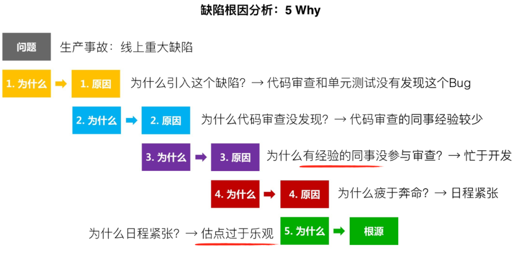
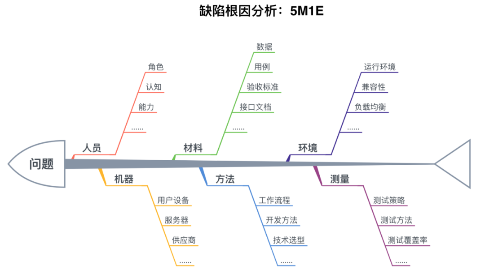

# 测试

* 应该着重聚焦于业务需求和测试要求
* 确立好基本思想：每个人为质量负责。不是 QA，也不止是 QA 和 开发，而是所有人
* 做好关于尝试策略的演进式规划：
  - 尽早测试、不断测试
  - 将犯错提前，以加快反馈
  - 测试策略不是一成不变的，而是不断演进的
* 需要：
  - 收集、分析现有的缺陷类型、修复时间等
  - 寻找适合项目的测试类型、方式
  - 确认方案所需要的度量体系
* 记录
  - 保持测试策略的团队可见性。
  - 和团队达到一致意见。
  - 持续更新。在线随时可更新的文档优于二进制形式
* 总体方案设计和实施过程
  - 明确总体目标。即做这件事的价值是什么？
  - 可测试性调研。评估自动化测试的可行性；定位
  - 设计测试策略。适配项目需要，确认分层策略
  - 测试 MVP。结合项目进行环境准备、框架选型、Demo 准备
  - 落地测试策略
  - 管理数据和用例
  - 持续更新和优化
* 测试并不是越多越好，除了用例数量还要考虑维护代价。希望测试代码能够尽量稳定，因为代码需要不断的被重构，如果发现重构一次代码就修改很多测试，那么这种测试可能会成为负担，也是一种坏味道。

## 场景

* 软件需求变动不频繁
* 项目周期较长
* 自动化测试脚本可重复使用

## 指标

* 时间延时
  - 单次查询耗时控制在0.5秒以内，0.5秒是个经验值，源于用户体验的3秒原则。
  - 如果用户的操作3秒内没有响应，将会厌烦甚至退出。
  - 响应时间=客户端UI渲染耗时+网络请求耗时+应用程序处理耗时+查询数据库耗时，0.5秒就是留给数据库1/6的处理时间

## 策略

* 一份在特定环境约束之下，描述软件开发周期中关于测试原则、方法、方式的纲要，并阐述了它们之间如何配合，以高效地减少缺陷、提升质量。在这份策略中，需要描述测试的类型、目标、方法、准入准出条件、所需的时间、资源以及环境等信息.
* 测什么：质量需求是什么、需要关注质量的哪些方面，比如应用的功能范围、性能、安全、易用性等非功能需求
  - 测试的对象和范围是什么？
  - 测试的目标是什么？
  - 测试的重点和难点是什么？
  - 测试深度和广度是什么？
  - 设计过程
    + 可视化软件开发生命周期
    + 定义现有的每个环节已实施的内容
    + 添加新的测试活动
    + 与团队讨论可行性
    + 在迭代优化中更新『测什么』部分
* 怎么测？采用什么办法来帮助系统实现质量需求，而不仅仅是手动和自动化的测试方法，也包括一切为质量保障服务的流程、环境、基础设施和人员等
  - 如何安排各种测试活动？
  - 如何评价测试的效果？

### [一页纸测试策略](https://making.stuff.co.nz/testing-stuff-a-one-page-test-strategy/)

* 图示化测试策略
	- 指导性原则：团队为质量负责
	- 测什么：可能包括功能、性能和安全等
	- 如何测：测试左移、精益测试、测试右移，涵盖测试流程、测试类型、测试方法等
- 尽早测试和频繁测试（Test early, test often），也就是测试左移与质量内建的思想
	- 测试左移：在需求分析阶段开始对需求本身的合理性进行验证，不仅要正确的构建产品，更重要的是构建正确的产品，这就需要把好源头需求这一关。因此，我们可以看到策略里的流程是从需求分析开始的。
	- 质量内建：在软件开发生命周期的每个阶段都有质量相关的活动，把质量融入到开发的每一个步骤，通过CI/CD等方式获取快速反馈，做好软件缺陷的预防，以减轻缺陷暴露太晚带来的大量修复成本。蓝鲸项目的开发生命周期主要体现在图示的七个环节，每个环节都有相应测试活动的开展，并且每个活动都有不同角色的参与。
* 测试精益可以理解为以业务价值为目标，以尽量少的成本交付高质量的软件，也就是说测试要测在能体现价值的点上，要做到有效覆盖、减少浪费。有两个框架帮助更有效的测试
	* 测试象限：在Lisa Crispin和Janet Gregory合著的书籍《敏捷软件测试：测试人员与敏捷团队的实践指南》中，看到了敏捷测试象限的介绍。由于该象限框架所起到的作用不仅局限于敏捷的环境，在这里称之为测试象限。测试象限矩阵一共四个部分，称为四个象限。下侧是面向技术的测试，上侧是面向业务的测试；左侧是支持团队的测试，右侧则是评价产品的测试。
		* 支持团队的测试：用来告诉团队要写什么代码，起到明确需求、辅助设计的作用。其中，第一象限是面向技术的支持团队的测试，主要是TDD，帮助构建产品的内部质量，也就是代码质量的保障，比如单元测试和api测试等；
		* 第二象限则是面向业务的支持团队的测试，从更高层次以业务专家可以理解的方式确定系统期望的行为，做到产品外部质量的保障。
		* 这两个象限的测试能够快速提供反馈信息，并确保快速的解决问题，既指导了功能的开发，又提供了防止重构和新代码的引入而导致不期望行为发生的安全网。
		* 评价产品的测试：程序员编写的代码可以使得左侧面向业务的测试通过，但也可能没有产生客户真正想要的东西，因此还需要第三、第四象限的评价产品的测试。
		* 第三象限是面向业务的评价产品的测试，通过模仿真实用户使用应用的方式，帮助确认是否构建了真正需要的产品；
		* 第四象限是面向技术评价产品的测试，主要采用工具和相应的技术来评价产品的性能、健壮性和安全性等非功能特性，并且在开发周期的每一步都要考虑这些测试的开展。
		* 这两个象限的测试中产生的信息应该反馈到象限矩阵的左侧，并用于创建新的测试来驱动下一步开发，形成良性的增强环路。
	* 测试象限使用：象限的顺序跟测试执行的顺序无关，敏捷开发往往开始于客户测试（面向业务的测试）。与测试执行时机相关的因素通常有：
		-   产品发布的风险
		-   客户方对产品目标的要求
		-   是基于遗留系统的开发还是从零开始构建的新系统
		-   可利用的测试资源等
	* 测试象限提供一种需要哪些测试来保障质量的思考框架，可以根据项目具体情况，结合考虑以开展对应的测试。策略图所示蓝鲸项目的测试象限体现的测试类型跟Lisa书里介绍的就不太一样，这是根据项目当前跟客户的合作方式、业务需求、质量要求等来确定的当下需要执行的测试，比如其中的安全测试就分为业务部分和技术部分。
* 测试分层：主要是针对自动化测试，根据测试所能覆盖的范围分成不同的层。金字塔的含义是测试比例的多少，体现为底层单元测试较多，越往上层测试比例越少，呈现为金字塔结构。
	- 越往底层的测试越接近代码，编写成本更低、执行速度更快、定位问题也更准确，但是离业务较远，不能很好的体现业务价值；
	- 越往上层的测试越接近业务，更能反应业务价值，但有着不够稳定、执行速度慢、实现成本较高的不足。
	- 需要权衡利弊，根据项目具体情况，真实的目标来确定每层测试的比例。
	- 至于具体比例是金字塔结构，还是蜂巢结构或其他，并不是一定的，也不会是一成不变的，可能受到价值目标、痛点、质量要求、技术架构、技能水平等因素的影响。
-  测试右移
	- 由于软件系统所处生态环境越来越复杂，技术架构的演进、业务复杂度和数据量的增加、基础设施的发展带来更多的不确定性，软件系统的质量保障在测试环境已经搞不定了，我们需要把目光右移到生产环境。这就是测试右移的思想，其实也就是生产环境下的QA(QA in Production)。
	- 生产环境有着不同于测试环境的特点，生产环境的QA并不是测试环境的QA的直接后延，而是需要利用其特点通过技术手段收集生产环境一切可利用的数据，包括日志、用户行为、用户反馈等，利用这些数据来分析和优化业务以及开发过程的开发和测试工作，形成一个开发过程与生产环境信息分析的良性循环系统。

## 自动化

* 包括一切通过工具（程序）的方式来代替或辅助手工测试的行为都可以看做自动化，包括性能测试工具（loadrunner、jmeter）,或自己所写的一段程序，用于生成1到100个测试数据。
* 自动化测试的目的是减少重复的手动测试的成本，使测试人员可以做更多有意义的事情，在实现自动化的过程中，花费的精力甚至更多。
* 测试人员在自动化测试落地的实践中，更多的是一个推动者而不是实现者，需要帮助团队建立起一种质量保证的意识，然后共同实现自动化测试的落地。
* 分层自动化测试倡导产品的不同阶段（层次）都需要自动化测试
  - 测试->集成/接口测试->UI测试的金字塔结构
  - 为了表示不同阶段所投入自动化测试的比例。如果一个产品从没有做单元测试与接口测试，只做UI层的自动化测试是不科学的，从而很难从本质上保证产品的质量
  - 如果妄图实现全面的UI层的自动化测试，那更是一个劳民伤财的举动，投入了大量人力时间，最终获得的收益可能会远远低于所支付的成本
  - 因为越往上层，其维护成本越高。尤其是UI层的元素会时常的发生改变.应该把更多的自动化测试放在单元测试与接口测试阶段进行
  - 在《google 测试之道》一书，对于google产品，70%的投入为单元测试，20%为集成、接口测试，10% 为UI层的自动化测试。
  
+ UI层自动化适用场景是做核心功能的回归测试和冒烟测试，所以在实施过程中，要注意不要把所有用例都堆砌在UI层，而是尽可能放到接口测试和单元测试中去做。
+ 在代码层面，可以遵循page object的设计模式，避免在测试代码中直接操作html元素。这样就可以减少重复的代码并提高代码的可维护性。
* 项目只有UI自动化测试是不够的，越低层的自动化测试反而越有意义。


### 测试准备

* 数据库测试
  - 数据一致性错误主要是由于用户提交的表单信息不正确而造成的
  - 输出错误主要是由于网络速度或程序设计问题等引起的
* 设计语言测试
  - 主要是Web设计语言版本的统一
* 安全测试
	* 目录设置
	* SSL
* 日志文件
  - 日志是否记所有的事务处理?
  - 是否记录失败的注册企图?
  - 是否记录被盗信用卡的使用?
  - 是否在每次事务完成的时候都进行保存?
  - 记录IP 地址吗?
  - 记录用户名吗?
* 外部接口：测试人员需要确认软件能够处理外部服务器返回的所有可能的消息
* 错误处理：在理解需求的基础上，充分发挥想象力，尽量比较全面的列出各种异常情况

### 持续集成

* 在项目开始前首先搭建持续集成框架，第一次的时候先写一个最简单的单元测试，如1+1=2，确保可以在CI上运行测试，为后续的开发奠定基础。
* 开发在项目实现过程中进行单元测试，每次开发推送代码时都可以自动运行单元测试和代码风格审查，当单元测试覆盖低于85%或代码风格检查不通过时，构建就会失败。
* 测试和开发在项目实现过程中合作写接口层的功能测试。
* 功能开发大体完成后，测试和开发合作写接口的性能测试。
* 当项目发布之后，测试开始根据核心功能编写UI层面的自动化测试，也相当于是写项目的回归测试。
* 推送到代码到远端后会自动开始运行自动化测试和代码审查。
* 当单元测试通过后会自动部署到测试环境。
* 在部署完成后会自动生成测试报告。
* 小组所有成员会收到部署成功或失败的邮件提醒

## 分层

### UI层

- 数据正确性：涵盖前端操作，接口正确测试，后端逻辑验证
	- 数据写入和数据提取
	- 数据写入时使用ui界面直接操作
- 数据输出时使用数据库语句提取正确数据然后和前端返回显示的数据做比较来验证，验证包括后端数据库语句正确，接口正确返回数据，前端正确显示数据。
* 界面测试
	* 导航
	  - 导航是否直观？
	  - Web系统的主要部分是否可通过主页存取？
	  - Web系统是否需要站点地图、搜索引擎或其他的导航帮助？
	* 链接
	  - 测试所链接页面是否存在
	  - 测试所有链接是否按指示的那样确实链接到该链接页面
	  - 保证Web应用系统上没有孤立的页面
	  - 推荐工具：
		+ Xenu Link Sleuth 免费 绿色免安装软件
		+ HTML Link Validator 共享（30天试用）  
	* 图形
	  - 要确保图形有明确的用途，图片或动画不要胡乱地堆在一起，以免浪费传输时间
	  - 验证所有页面字体的风格是否一致
	  - 背景颜色应该与字体颜色和前景颜色相搭配
	  - 图片的大小和质量也是一个很重要的因素，一般采用JPG或GIF压缩，最好能使图片的大小减小到 30k 以下
	  - 最后，需要验证的是文字回绕是否正确。如果说明文字指向右边的图片，应该确保该图片出现在右边。不要因为使用图片而使窗口和段落排列古怪或者出现孤行。
	* 内容 用来检验Web应用系统提供信息的正确性、准确性和相关性
	* 表格 需要验证表格是否设置正确
	* 整体界面
	  - 当用户浏览Web应用系统时是否感到舒适？
	  - 是否凭直觉就知道要找的信息在什么地方？
	  - 整个Web应用系统的设计风格是否一致？
	  - 测试方法：一般Web应用系统采取在主页上做一个调查问卷的形式，来得到最终用户的反馈信息。
* 功能测试
	* 数据校验
	  - 如果系根据业务规则需要对用户输入进行校验，需要保证这些校验功能正常工作。
	  - 2和3的采取措施：第一个完整的版本采用手动检查，同时形成WinRunner（QTP）脚本；回归测试以及升级版本主要靠WinRunner（QTP）自动回放测试。
	* 表单
	  - 按钮能正常工作
	  - 数据能够被正确处理
	  - 服务器能正确保存这些数据
		* `PUT /feature/:id`
		  - 正确的数据到一个错误的 id，测试是否会出错
		  - 错误的 etag，测试 concurrent udpate 是否工作
		  - 空数据，测试 validator 是否正常工作
		  - 错误的数据，测试 validator 是否正常工作
		  - 正常的数据，测试基本功能是否工作。
	* cookies测试
	  - Cookies是否起作用
	  - 是否按预定时间进行保存
	  - 刷新对Cookies有什么影响
	  - cookie能够正常处理注册信息而且已对这些信息加密
	  - 如果使用 cookie 来统计次数，需要验证次数累计正确
	  - 措施
		+ 黑盒测试：用上面提到方法进行测试
		+ 用查看 cookies 软件进行（初步的想法）
	  - 工具：
		+ IECookiesView v1.50
		+ Cookies Manager v1.1
	* 登录
	  - 用户登录是否有次数限制?
	  - 是否限制从某些 IP 地址登录?
	  - 如果允许登录失败的次数为3，你在第三次登录的时候输入正确的用户名和口令，能通过验证吗?
	  - 口令选择有规则限制吗?
	  - 是否可以不登陆而直接浏览某个页面？
	  - Web应用系统是否有超时的限制，没有点击任何页面，是否需要重新登陆才能正常使用。
* 兼容性测试
	* 平台测试：在Web系统发布之前，需要在各种操作系统下对Web系统进行兼容性测试
	* 浏览器测试：测试浏览器兼容性的一个方法是创建一个兼容性矩阵。在这个矩阵中，测试不同厂商、不同版本的浏览器对某些构件和设置的适应性
	* 分辨率测试：不同分辨率下显示是否正常
	* 打印机：用户可能会将网页打印下来，因此网也在设计的时候要考虑到打印问题
  * 组合测试：根据实际情况，采取等价划分的方法，列出兼容性矩阵
	  - 尝试用户可能进行的所有操作

  #### 冒烟测试

* 不要求每个功能都测的很详细，但至少要保证被修复了的bug所属的功能和系统其他骨干功能都是可用的（即这个版本能拿去做系统功能测试了）
* 任何一个项目或者产品，骨干功能都有它的使用场景。冒烟测试就是要保证这些骨干功能的使用场景都能跑通，如果没跑通，后续的系统测试就没必要了。

#### 工具
  
* [cypress](https://github.com/cypress-io/cypress):Fast, easy and reliable testing for anything that runs in a browser. <https://www.cypress.io>
* TestCafe
  - 支持采纳JavaScript或TypeScript来编写测试，并在浏览器中运行测试
  - 提供了开箱即用的并行执行、HTTP请求模拟等有用的功能
  - 使用异步执行模型而无需指定等待时间，有效提升了测试套件的稳定性
* Puppeteer:谷歌出品的一个通过Devtools 协议控制Chromium或Chrome的Node库。由于其只支持Chrome，无法进行跨浏览器的兼容性测试
* CodeceptJS

### [单元测试](./xunit.md)

* 关注代码的实现逻辑
* 测试单个函数是否符合预期功能。
+ 单元测试是“白盒测试”， 应该覆盖各个分支流程、异常条件
+ 单元测试面向的是一个单元("Unit"), 是java中的一个类或者几个类组成的单元。
+ 单元测试运行一定要快！
+ 单元测试一定是可重复执行的
+ 单元测试之间不能有相互依赖，应该是独立的。
+ 单元测试代码和业务代码同等重要， 要一并维护。
* 对软件中最小的测试单元进行验证，在这一层上发现问题时解决成本最低，测试用例的维护成本也不高，具有很好的投入产出比。一般情况下，需要开发人员在开发过程中写单元测试。而作为QA，更多的是一个单元测试的引导者
- 和团队一起制定单元测试覆盖率的标准
	- 如果这是一个全新的项目，可以把覆盖率设的相对高一点，如85%，这有利于在前期就对代码质量做出保证。
	- 如果这是一个已经相对成熟的项目，由于前期根本没有单元测试，可以先把要求设置的低一点，然后一步步的提升我们的代码覆盖率。
	- 为开发人员提供单元测试的用例：我们需要提前把需要验证的用例列在开发的任务卡片里面，这样能帮助开发更有效率的去完成我们期望测试的用例 。
	- 定期回顾开发人员写的单元测试：这里并不是要检查代码和具体实现，而是和开发一起去回顾看看单元测试的写法和角度是不是在同一认知上面。这样有助于整个团队建立一种质量保证的意识。
* 选择nose test 做单元测试，通过插件，可以拿到单元测试覆盖率的报表
	  - 为解决对数据库的依赖，可以建立一个内存数据库去模拟真实数据库，便于测试用例能快速的运行。如在真实项目中，数据库选用的是亚马逊的RDS＋Postgres，但是在做单元测试的时候使用的sqlite＋python绑定来模拟真实的数据库

### 接口集成测试

* 关注的是函数、类（方法）所提供的接口是否可靠
- 接口功能测试：在写功能测试的过程中，可能会和一些其他的模块或第三方API有依赖，在这种情况下，通常可以通过Mock的方法去解决
* 集成测试:把两个已经测试过的单元组合成一个组件，测试它们之间的接口。API测试属于该阶段。
 
#### 性能测试

* 性能测试的执行是基本功能的重复和并发，需要模拟多用户，在性能测试执行时需要监控指标参数，同时性能测试的结果不是那么显而易见，需要对数据进行分析
* 服务器端性能测试工具：需要支持产生压力和负载，录制和生成脚本，设置和部署场景，产生并发用户和向系统施加持续的压力。LoadRunner和Jmeter
* web前端性能测试工具：需要关于心浏览器等客户端工具对具体需要展现的页面的处理过程。 Web Bench、ab、Siege
* 移动端性能测试工具：同web端性能测试工具也需要关心页面的处理过程，另外还要具体数据采集的功能，比如：手机CPU、内存、电量，启动时间等数据的记录。
* 资源监控工具：这个主要是能够收集性能测试过程中的数据以及良好的结果展现方式。

#### 压力测试

*  测试应用的抗压能力
	  - 统能允许多少个用户同时在线
	  - 如果超过这个数量，会出现什么现象
	  - 系统能否处理大量用户对同一个页面的请求
* 目的
  - 测试应用在高并发情况下是否会报错，进程是否会挂掉
  - 预估应用的承载能力，为运维同学提供扩容的依据
  - 通常是在满足第一点的前提下，再根据可能到来的高并发压力来计算需要多少实例来承载，而这就需要我们压出极限。
* 过程
  - 第一次压力测试:接口开发完成之后就可以进行第一次压力测试。这一次压力测试可以简单压一下，在本机进行就可以。压力测试的目的是检查代码在高并发下是否会报错。另外，编译型语言要观察是否存在内存泄漏，比如golang。因为本机性能有限，一般来说按照100、200、300、500进程数进行压力测试，压到500如果没有报错就可以进行疲劳测试，观察内存占用。
  - 第二次压力测试:所以这就对仿真环境提出了更高的要求，有条件的要保证仿真和线上配置一致。次之也要和线上成比例，这样可以方便后续评估计算。
    + 这一次压力测试重点是压极限。需要特别要注意，这里的极限不是数据库极限，不是Redis极限，而是是指应用服务器的极限承受能力。上面已经说了，压极限是为了给运维同学提供扩容的参考，所以我们要做的是压到服务器的承受极限，看下到底能够承受多大的并发。假设现在线上是双实例8C8G，仿真双实例4C4G。
    + 比如说我们我们压出仿真的极限承受能力是1000，那么我们就可以预估线上能够承受2000并发。比如我们预估接下来我们会迎来一次5000并发的冲击，那么运维同学就可以根据这些数据来评估出相应的扩容方案。
* 步骤
  - 比如第一次压500的时候就出现了一些报错，这时候就是遇到了第一个瓶颈。当解决第一个之后再继续压500，确认解决了第一个瓶颈就可以继续往上加，如此循环直到压到服务器极限。在这个过程中我们会遇到很多瓶颈，冲破这一路瓶颈就像过关斩将一样。
* 常见的瓶颈
  - php-fpm进程数。一般php-fpm的进程数是dynamic模式，也就是说动态调整。这种模式下无法应对瞬时的高并发情况，因为他的进程数有个逐渐增加的过程。所以需要调整成static模式然后再根据服务器性能配置合理的进程数。
  - 负载均衡限额。比如阿里云的SLB最近就增加了配额限制，免费版的实例只有5000的最大连接数，3000的CPS和1000的QPS。
  - 压力测试机性能限制。这是一个比较容易忽略限制，所以我们在压力测试的过程中也要注意观察压力测试机的负载。如果达到这个瓶颈，就要考虑采用多机压力测试。
  - 应用服务器、Redis、MySQL的最大连接数、CPU和内存等等。这些都是比较严重的限制，所以一定要在压力测试之前就搞清楚。
  - Redis带宽。阿里云的Redis带宽限制大概是200M+，如果数据量比较大，在高并发情况下很容易把带宽打满。目前的解决方案有两个，一是在存入Redis之前进行数据压缩，在读取Redis之后再进行解压。二是采用pb进行存储，当然这两种方案我都还没有真正使用过，等我解决了这个瓶颈再来更新。
* 现象
  - 503 -- 服务不可用，一般是负载均衡、nginx达到限制
  - 502 -- Bad Gateway，通常是应用进程挂掉了，或者进程不够用处理不过来。
  - 500 -- 应用故障，一般是应用抛出了异常没有正常响应，比如达到Redis和MySQL的瓶颈。
  - 压力测试不出来的坑：现在大多数正式的项目都是前后端分离的，所以上述说的其实都是压后端接口，而有一种情况是压根压不出来的，那就是接口调用数。作为后端开发，一定要搞清楚承受冲击的前端页面在加载的过程中会调用几个接口，调用几次。如果不搞清楚这些，在真实环境中后端服务器就可能承受比前端服务器还高的压力，从而影响之前针对压力测试数据做出的评估。针对这种情况，其实最好的方案就是在开发之时就跟前端约定好接口调用规则，在接口设计和交互上进行避免。
* 工具
  - [AB Apache Benchmark](https://httpd.apache.org/docs/2.4/programs/ab.html)
    + `apr_socket_connect(): Invalid argument (22)`: use "http://127.0.0.1" instead of localhost
  - [Siege](https://www.joedog.org/siege-home/)
  - [Locust](https://locust.io/):An open source load testing tool
  - WAS
  - ACT
  - 参考
    + [Web App Performance Testing with Siege: Plan, Test, Learn](https://www.sitepoint.com/web-app-performance-testing-siege-plan-test-learn/)
    + [Testing With Apache Benchmark and Siege](https://kalamuna.atlassian.net/wiki/spaces/KALA/pages/16023587/Testing+With+Apache+Benchmark+and+Siege)

```
ab -c 100 -n 100000 http://127.0.0.1:8888/hello/index/

This is ApacheBench, Version 2.3 <$Revision: 655654 $>
Copyright 1996 Adam Twiss, Zeus Technology Ltd, http://www.zeustech.net/
Licensed to The Apache Software Foundation, http://www.apache.org/

Benchmarking 127.0.0.1 (be patient)
Completed 10000 requests
Completed 20000 requests
Completed 30000 requests
Completed 40000 requests
Completed 50000 requests
Completed 60000 requests
Completed 70000 requests
Completed 80000 requests
Completed 90000 requests
Completed 100000 requests
Finished 100000 requests

Server Software:        Swoole
Server Hostname:        127.0.0.1
Server Port:            8888

Document Path:          /hello/index/
Document Length:        11 bytes

Concurrency Level:      100
Time taken for tests:   10.717 seconds
Complete requests:      100000
Failed requests:        0
Write errors:           0
Total transferred:      27500000 bytes
HTML transferred:       1100000 bytes
Requests per second:    9330.83 [#/sec] (mean)
Time per request:       10.717 [ms] (mean)
Time per request:       0.107 [ms] (mean, across all concurrent requests)
Transfer rate:          2505.84 [Kbytes/sec] received

Connection Times (ms)
              min  mean[+/-sd] median   max
Connect:        0    1   1.0      1       9
Processing:     1   10   5.6      8      63
Waiting:        0    7   5.4      6      62
Total:          1   11   5.5      9      63

Percentage of the requests served within a certain time (ms)
  50%      9
  66%     11
  75%     12
  80%     13
  90%     17
  95%     22
  98%     28
  99%     32
 100%     63 (longest request)

ab -n 100 -H “Cookie: Key1=Value1; Key2=Value2” http://test.com/
```

#### A/B 测试

为同一个目标制定两个方案（比如两个页面），让一部分用户使用 A 方案，另一部分用户使用 B 方案，记录下用户的使用情况，看哪个方案更符合设计。

* 需求声明:假设性的声明,网站页面的变化和可能造成的影响,有关访客及访客对该变量可能有的反应

### 系统测试

* 主要是功能测试，测试软件《需求规格说明书》中提到的功能是否有遗漏，是否正确的实现。
* 测试方法一般都使用黑盒测试

### 验收测试

* 验收测试的目的是确保软件准备就绪，并且可以让最终用户将其用于执行软件的既定功能和任务

## 测试用例

* Every method will be run independently 
* long method names as long as they are long to strengthen the specification, but only when the code can be refactored to smaller test methods.
* 不能提前确定所需要的所有测试用例,完全测试（Complete Test）
	-   软件系统本质也是一系统，由一层层依赖组成的，当想测某一点时，总会有假设，但是这个假设本身有时也需要另外的用例来覆盖。而哪一层的假设是可靠、不需要再测试的判断往往是凭个人经验决定的，也许离真实很远。
	-   瀑布流程中的测试用例规划通常是基于规格的，较少考虑“人”的因素。现在我们已经知道，针对同一个需求，由不同的开发实现后质量是不一样的，从而用来验证和评估软件的质量的用例集也应该是不一样的，这也是探索性测试的切入点之一。
	-   客观规律是，对事物的认知需要一个过程，也就是哪怕将测试问题锁定在某一个层次、用例大小确定在某一粒度，也不一定能一次性确定需要的用例集。曾经有一个尝试，让不同的测试专家对三角形测试问题给出用例（即给出的a、b、c的长度能否组成三角形），实际结果是得到的用例数从几十到上百不等。
-  不一定能“如实”地写下所想到的用例
	-   一个用例能记录下来的信息量通常并不能反映测试设计人员脑海中全部的信息，信息丢失在此不可避免。
-   不一定能“如实”地执行所写下的用例
	-   抽象用例并不一定能转化为实例化用例，业务可能的变化、真实测试环境的限制等都可能是导致转化失败的因素。从而可能的后果就是实际执行的用例、用例集与设计时的用例、覆盖期望存在差距。
-   用例设计与执行人员分离，可能会带来虚假的安全感
	-  设计人员认为已经完成针对问题的测试分析、设计工作，理论上的覆盖率已经达到。同时设计人员不参与后续的执行工作，则对软件可能的变化将得不到及时的反馈，时间一长，设计的用例集也许和产品需要的用例集相差会很大
	-  对执行人员来说，因为有一个用例集存在，第一要务是完整地执行它们。过去的实践表明，专注于执行的测试人员评估自己的工作是以已执行完成的用例百分比来衡量的。对当前用例集是否是合适的，是否需要根据实际情况在某方面增加新的用例等思考却相对较少。
* 从用例设计到用例执行的间隔越长，效果越差
	* 用例本身只是一个计划、一个意图，只有基于它与待测系统真正交互后才算完成一个测试闭环。周期越长，反馈环就越长，从而单位时间内通过用例得到的信息就可能更少。
	- 用例从在脑海中构思、到记录、到实际执行，存在着信息损失。尽可能地加快整个测试环，才能一程度弥补用例生命周期中各环节的信息损失。
- 客户（最终用户）给出的用例（场景）价值很高
* 用例的“前提条件”的满足是需要代价的
	* 请注意“想得到却做不到”的陷阱。虽然在设计用例时，可以基于逻辑写下这个用例，但却不一定真的能测它或者测试它的代价非常大。尤其是一些负向的测试，比如网络状态模拟等。同时这个现实给了另外的思考契机，就是怎么去平衡这个代价。考虑上面的订单例子，订单的取消，其前提条件是一个已提交的订单待取消。那么问题来了，这个已提交的订单是怎么来的呢？前提条件至少有以下几种方式得到满足：
		* 用SQL的方式向数据库插入（但数据不一定合法）
		* 生产环境数据脱敏后Copy至测试环境，从中寻找合适的订单
   		* 直接通过UI，按照用户真实的流程生成订单并提交（合法但效率不高）
  		* 通过API的方式，调用对应的API生成订单并提交
* （业务）用例本质都是“E2E”
	* 现在提到E2E（End to End）一般认为它是与用户验收测试（UAT）相关，即去覆盖真实用户有用户场景从头到尾。
	* UAT与系统测试（ST）的区别
		* ST上下文的取消订单不会关心这个订单是从哪来的，但是UAT场景中确要确保这个订单是之前的用例通过用户合法操作得到的。ST和UAT的不同是多方面的，恰恰这一点较少被关注到。
		* 既然ST的订单可以通过合法操作得到，为什么还要用不那么合法的SQL方式直接插入呢？这其实是用例执行时的效率问题，一般认为UI的方式慢且不稳定。换言之，这是一个妥协，如果有更好的方式在保证操作合法的同时又能确保效率，就不需要这种妥协。
		* 由此，从逻辑层面，可以得到这样一个结论，一个用例循着前提条件，就能“追溯”到当前场景的起点，用例尤其是业务用例的本质都是E2E的（第一个E是场景的起点，第2个E是当前的测试点）。
	* 正确认识这个E2E真相、以及承认用SQL这样非业务方式直接写入是一种执行层面“妥协”非常重要，它会让我们重新思考当前的一些“理所当然”的实践，其出发点、收益、风险，从而改进与提高。
* 增量（迭代）开发模式中，回归用例集其实很重要
	* 从用例的角度看，回归用例集一定程度是代表“回归什么”。没有这个基础，回归测试将是一种无序的、难以评估的方式进行。
	* 持续保持回归用例集有效，添加新用例、剔除无效用例等用例集的维护工作很重要，尤其是探索性测试过程中产生的有价值的新用例怎么加入回归用例集。

## Bug

### [Bug Report](https://mp.weixin.qq.com/s/OVqTsk6OJ_xi5Q4iWtKkUg)

* 为什么要做bug分析
  - bug越早被发现并修正，所消耗的资源越少
  - 通过对现有的bug进行分析，找到bug产生的根因以及流程上的不足，并思考如何从各个方面去优化改进，可以进行bug预防，把控质量风险，提升产品质量。
* 怎么做bug分析
  - 记录bug: 记录的维度越广泛，对之后的数据分析就越有利
  - 分析什么:需要确定分析维度。针对不同的项目，分析维度也不尽相同。一般情况下，比较常见的分析维度如下：bug分类、bug趋势、bug状态流转效率、多个周期对比
* 分类分析:包括功能模块、引入时机、bug类型、优先级、严重性、产生原因等。首先介绍bug分类统计的规则，一般来说会按照不同维度来分类，而每个维度下面又可以分为多个不同的属性值
* 趋势分析:包括每日新增、每日关闭、累计活跃、累计关闭、bug总数、严重bug占比、反复打开bug占比等
* 状态流转效率分析|效能分析:通过bug状态的时长分布，可以分析bug状态流转的时效
* 根因分析
  - 5Why：比较适合原因单一的问题，通过刨根问底可以找到根本原因。
  - 5M1E：比较适合成因复杂的问题，可以通过多个维度进行综合分析，找出可以改进的方面
* 统计数据的变化趋势要比绝对值更重要。相对于绝对值，变化趋势更能体现出被统计数据的动态过程
* 最终目的
  - 通过根因分析，发现bug产生的根源，及早采取调整和控制措施，继而对现有方法和流程进行优化，预防和控制问题的蔓延和新问题的产生
  - 使用统计分析方法，通过bug的共性发现软件生命周期中技术、人员、过程、项目和组织存在的问题，揭示软件质量、过程质量、人员能力、组织能力之间的关系，加强软件精细化管理，促进人、过程、组织持续性改进
  - 通过对每一个迭代周期进行持续的bug分析，也可验证我们之前的action是否有效，进而做到持续优化
* 工具
	* [Bugzilla](https://www.bugzilla.org/)
	* [CrashRpt](http://crashrpt.sourceforge.net/docs/html/index.html)





## 图书

* 《全程软件测试（第三版）》
* 《测试架构师修炼之道》
* 《[探索式软件测试](https://www.amazon.cn/gp/product/B003JBIV0S)》
* 《[有效的单元测试](https://www.amazon.cn/gp/product/B00PVOND2W)》
* 《[Google软件测试之道](https://www.amazon.cn/gp/product/B00FH36R6G)》
* How to Break Software
* 《测试驱动开发》
* 测试驱动的面向对象软件开发
* 《Growing Object-Oriented Software, Guided by Tests》
* 《Python测试驱动开发（第2版）》 Harry J.W.Percival

## 工具

* redmine
* [locust](https://github.com/locustio/locust):Scalable user load testing tool written in Python <http://locust.io>
* JUnit
* Mocha
* Selenium
* Soap UI
* Cucumber
* Katalon Studio
* Calabash
* Appium
* Apache JMeter
* Meissa
* [Sonar](https://github.com/facebook/Sonar):A desktop debugging platform for mobile developers. <https://fbsonar.com>
  - [网络插件](https://fbsonar.com/docs/network-plugin.html)
  - [Layout Inspector 插件](https://fbsonar.com/docs/layout-plugin.html)
  - [入门](https://fbsonar.com/docs/getting-started.html)
* EasyMock
* jmockit
* [free-for-dev](https://github.com/ripienaar/free-for-dev):A list of SaaS, PaaS and IaaS offerings that have free tiers of interest to devops and infradev
* [googletest](https://github.com/abseil/googletest):Google Test
* QTA:面向多种平台（包括 Android、iOS、Windows、MacOS、Web、小程序、后台服务和云原生应用等）的自动化测试服务平台，致力于帮助业务研发团队开展和落地自动化测试，提供包括自动化测试用例管理和数据分析、分布式测试执行、线上测试报告和数据可视化、测试执行度量分析、测试资源管理等功能。

- QT4A，UI 自动化测试 for Android： <https://github.com/Tencent/QT4A>
- QT4i，UI 自动化测试 for iOS： <https://github.com/Tencent/QT4i>
- QT4W，UI 自动化测试 for Web： <https://github.com/Tencent/QT4W>

* QTP
* AutoRunner
* Robot Framework
* watir
* [Airtest IDE](https://airtest.netease.com/):Cross platform UI automation IDE
* [nightmare](https://github.com/segmentio/nightmare) A high-level browser automation library. <https://open.segment.com>
* [Charles](https://www.charlesproxy.com/)

### [cypress](https://github.com/cypress-io/cypress)

 The web has evolved. Finally, testing has too. Fast, easy and reliable testing for anything that runs in a browser. <https://www.cypress.io/>

### [fiddler](http://docs.telerik.com/fiddler/)

* 抓包
  - 客户端与监测机处于同一网络
  - 客户端wifi添加代理（PC的IP地址）
  - 客户端端口8888
* HTTPS请求
  - Tools->Telerik Fiddler Options
  - 选中"Decrpt HTTPS traffic"，Fiddler就可以截获HTTPS请求
  - 选中"Allow remote computers to connect"，是允许别的机器把HTTP/HTTPS请求发送到Fiddler上来
  - 手机修改代理地址与端口
  - 手机访问PC的IP：8888端口下载并安装证书

## 参考

* [wetest](https://wetest.qq.com/)
* [我们是怎样在项目内落地自动化测试体系的](http://blog.csdn.net/gitchat/article/details/78086617)
* [How We Made Writing Tests Fun and Easy](https://blog.daftcode.pl/how-we-made-writing-tests-fun-and-easy-2d7e1fac6d16)
